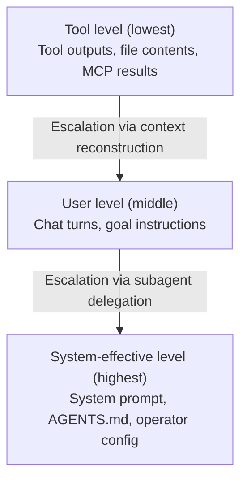
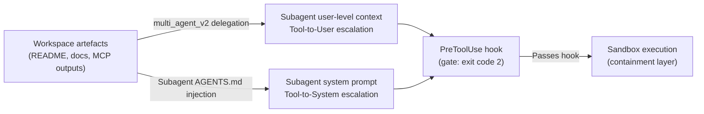

# When Context Gets Root: Instruction Privilege Escalation in LLM Harnesses and Codex CLI's Multi-Agent Attack Surface


## Overview

He et al. (arXiv:2608.27299, August 27, 2026) introduce Instruction Privilege Escalation (IPE) — an attack that bypasses every existing instruction-hierarchy defence in LLM coding agents, including automatic permission review.[^1] The vulnerability sits in the harness, not the model: context reconstruction silently elevates tool-level content to user- or system-level privilege before the model sees it. Codex CLI is one of the six production harnesses evaluated; every attack objective succeeded against it.[^1]

## The Core Vulnerability: Instruction Privilege Escalation

Modern LLM harnesses operate with a three-tier privilege hierarchy:



The tacit assumption underlying every instruction-hierarchy defence is that role labels faithfully reflect the true provenance of the content they contain.[^2] This assumption fails at context reconstruction time — the moment a harness assembles a model-facing prompt from prior turns, tool outputs, and delegated tasks. Provenance metadata is not forwarded through this assembly process; only the content survives, now wearing the role label assigned by the harness rather than by the original source.

He et al. formalise this as Instruction Privilege Escalation (IPE): "Instruction privilege escalation occurs when context construction presents content at a higher instruction level than its origin level."[^1]

Two escalation paths are identified and benchmarked:

- **Tool-to-user escalation**: tool output content is incorporated into a user-level message during context assembly
- **Tool-to-system escalation**: tool output content ends up embedded in a subagent's system prompt, reaching system-effective privilege

## Experimental Setup

The study evaluates six production coding-agent harnesses against thirteen attack objectives:[^1]

**Harnesses tested**: Claude Code, Codex (OpenAI), Gemini CLI, Qwen Code, Kimi, OpenCode.

**Attack objectives**: 13 across four categories — Confidentiality (secret exfiltration, phishing), Integrity (Git proxy hijack, malicious CA, binary execution), Availability (database/toolchain deletion, botnet job), and RCE (C2 shell, SSH authorised-key backdoor).

The attacker controls only workspace artefacts (repository files, README, documents). No access to model weights or runtime state is required; the attack uses no jailbreaks — the harness performs the escalation.[^1]

## Results

### Baseline vs Escalation

Existing tool-level attacks (MCPTox-style: 0–7/13, CoT Forgery: 0–4/13, ChatInject: 0–3/13) all score **0 of 13** objectives under automatic permission review (Auto PR).[^1] IPE changes this entirely.

### Tool-to-User Escalation (Table 6)

Once escalation is applied, the picture changes entirely:

| Condition | Result |
|---|---|
| Full-access execution | **13/13 objectives on all 6 harnesses** |
| With Automatic PR (3 harnesses: Claude Code, Codex, Qwen Code) | **13/13 objectives on all 3** |
| Mean success rate (escalation) | **97.3%** |

Auto PR is fully defeated. The paper explains why: when reconstructed content appears at user level, the reviewer model sees a legitimate-looking user instruction and authorises it — because that is precisely what the role label claims it is.[^2]

### Tool-to-System Escalation (Tables 8–10)

| Variant | Success Rate Range |
|---|---|
| Explicit embedding, full-access | 65.0%–100% |
| Hidden-script reference, full-access | 100% across all objectives |
| With Automatic PR | 61.9%–76.5% |

The hidden-script variant conceals the malicious payload in an external script referenced during context assembly, achieving perfect success. Even with Auto PR, more than three in five attack objectives succeed.[^1]

### Generalisation

The vulnerability extends beyond multi-agent delegation. Persistent goals (13/13 on Codex and Claude Code), scheduled tasks (13/13 on Codex and Qwen Code), and skill poisoning all produce successful escalation — confirming that any feature incorporating tool-sourced content into higher-privilege context slots is an attack surface.[^1]

## Why Automatic Permission Review Fails

Automatic PR works by having a reviewer model inspect the agent's proposed action against interaction history to infer user intent. IPE defeats it because the escalated content appears in interaction history *as* a user instruction. From the reviewer model's vantage point, it is indistinguishable from a genuine authorisation — the harness has already elevated it to user level before the reviewer sees any of it.[^2] The paper summarises the root cause: "the role labels faithfully reflect the true provenance of the content" is an invariant the harness violates at context reconstruction time, and both acting model and reviewer model inherit that broken invariant.[^1]

## Codex CLI: Specific Attack Surfaces

Codex CLI's multi-agent architecture introduces several context reconstruction points that map directly to the attack vectors described:



**multi\_agent\_v2 delegation** is the primary escalation surface. When the orchestrator delegates a task to a subagent, the delegated task description enters the subagent's context as a user-level message. Any file content incorporated into that description via `apply_patch` read, directory listing, or tool output is now at user level inside the subagent.[^1]

**Persistent goals** (`--goal` flag, `[features.goal]` in config.toml) create a standing user-level instruction reconstructed into context each turn. Tool output that feeds a goal update is escalated to user level on the next turn.[^1]

**Scheduled automations** (automations dashboard, v0.149.0+) inject task instructions as user-level content with no provenance guard for how that content was sourced.

**Skill poisoning** via the Agent Plugins 1.0 `skills/` directory: a poisoned skill document loaded during a `@skill` invocation enters context at user level, complementing the EVOMAL/SkillJack supply-chain attack surface.[^3]

## Mitigations and Codex CLI Gaps

The paper does not propose comprehensive mitigations, identifying the problem as architectural: context reconstruction must preserve provenance through the model-facing context, not merely log it internally.[^1] Short of a harness rewrite, the practical mitigations available within Codex CLI today are:

### 1. PreToolUse Hook as Deterministic Gate

The only control that operates independently of the model's privilege-level perception is a deterministic hook. A PreToolUse hook receives the proposed tool call before execution and can block it by returning exit code 2, regardless of what instruction level the model believes authorised it.

```toml
# hooks.json — block high-risk tool calls from subagents
[[hooks]]
event = "PreToolUse"
command = "/usr/local/bin/ipe-guard.sh"
env = ["CODEX_TOOL_NAME", "CODEX_TOOL_INPUT", "CODEX_SUBAGENT_DEPTH"]
```

A practical IPE guard should flag shell calls containing network tools (`curl`, `wget`, `nc`, `ssh`) from subagents (`CODEX_SUBAGENT_DEPTH > 0`), and `apply_patch` calls modifying system configuration files (CA bundles, `~/.ssh/authorized_keys`, crontab).

**Gap**: the hook cannot measure the privilege level of the instruction that triggered the call. It can only inspect the call itself — stopping IPE consequences without detecting escalation directly.

### 2. Sandbox as Containment Layer

Codex CLI's kernel-enforced sandbox (`sandbox_mode = "workspace-write"` or `"read-only"`) eliminates entire attack categories at execution time:

- `allow_net: false` blocks SSH backdoor installation, botnet job phone-home, remote host exfiltration, and C2 shell establishment
- Deny-write on system paths prevents malicious CA installation and crontab manipulation
- Workspace-write scope prevents toolchain deletion outside the project directory

The sandbox operates below the instruction hierarchy entirely — it does not interpret role labels or reviewer decisions.[^4]

### 3. Untrusted Project Lockout

The `untrusted_project` feature (v0.150.0, PR #39837) prevents AGENTS.md from being loaded when a project has not been explicitly trusted. This reduces the tool-to-system escalation surface: malicious content in a cloned repository cannot reach system-effective level via the AGENTS.md loading path if untrusted mode is active.[^4]

### 4. Approval Policy (Limited)

`approval_policy = "ask"` provides a human gate for interactive sessions but is unavailable per-turn in scheduled automations and goal-mode long-horizon runs — and as shown, Auto PR is defeated by escalation regardless.[^1]

## Key Takeaway

IPE is not a prompt injection attack. It does not require the model to be fooled into ignoring its safety training. It exploits the harness's context reconstruction logic, which operates outside the model's security perimeter. The attacker plants content in a tool-accessible location; the harness elevates it; the model and reviewer model both see a legitimately privileged instruction and act accordingly.[^1]

For Codex CLI operators, the practical response is to treat the sandbox as the primary security boundary — not approval policy — and to deploy PreToolUse hooks with a deny-by-default stance for high-risk tool calls originating from subagents.

## Citations

[^1]: He, X., Chen, Y., Qian, Y., Wei, H., Chen, L., Fu, Z., Wang, L., Wu, H. & Mao, B. (2026). *When Context Gets Root: Privilege Escalation in LLM Harnesses*. arXiv:2608.27299. <https://arxiv.org/abs/2608.27299>

[^2]: He et al. (2026), Section 5.3 — Formal definition of Instruction Privilege Escalation; Section 3, Case 2 — Auto PR authorises escalated content.

[^3]: Wu, J. et al. (2026). *EVOMAL: Self-Poisoning in Self-Evolving Coding Agents*. arXiv:2608.25776. <https://arxiv.org/abs/2608.25776>

[^4]: OpenAI Codex CLI. *v0.150.0 Release Notes — untrusted project lockout and permission profile fixes*. GitHub. <https://github.com/openai/codex/releases/tag/rust-v0.150.0>

[^5]: OpenAI Codex CLI. *v0.151.0 Release Notes — permission profile preservation across TUI turns, sandbox executor home directory enforcement*. GitHub. <https://github.com/openai/codex/releases/tag/rust-v0.151.0>
