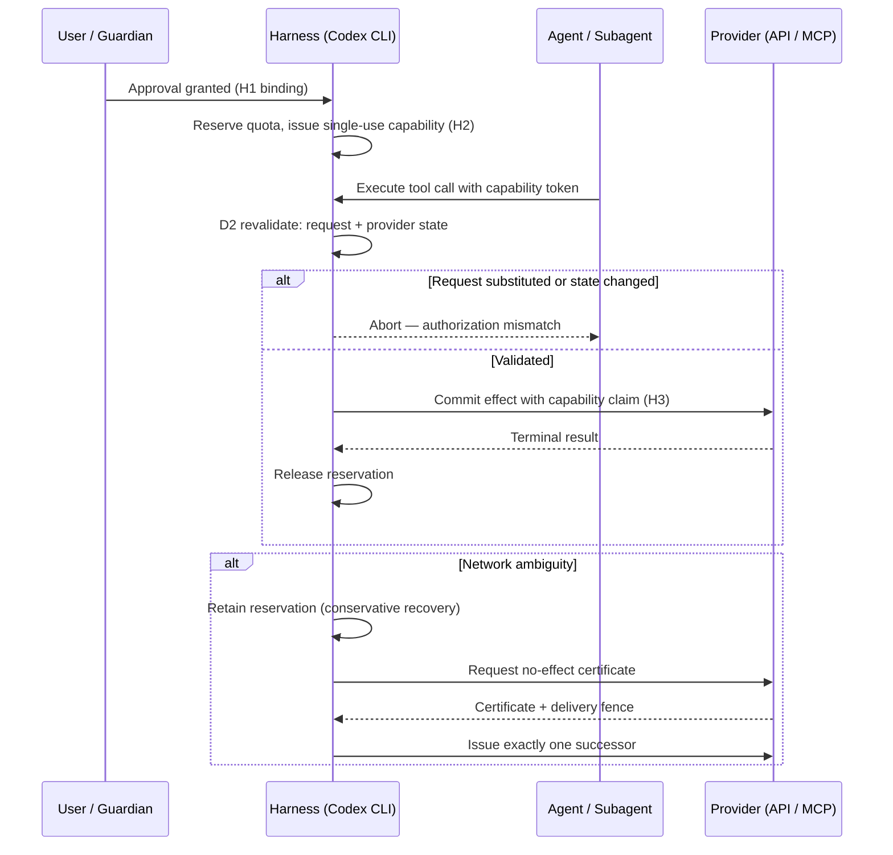
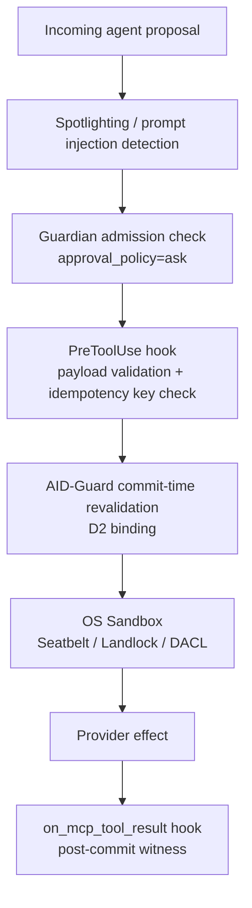

# AID-Guard: Closing the Authorization-Effect Gap in Codex CLI Multi-Agent Workflows


A paper quietly published on arXiv this month identifies a class of attack that every Codex CLI multi-agent operator should understand but that receives almost no coverage in practitioner literature: the **authorization-effect gap**.[^1] The vulnerability is not about prompt injection or jailbreaks. It arises at a lower level — in the structural assumption that an approval granted at admission time remains valid through the full lifecycle of the effect it authorises.

**AID-Guard** (arXiv:2608.21159) is a protocol that closes this gap. Its experimental results are striking: 44 of 44 attacks blocked under complete proposer compromise, all 210 provider-contract trials matching predeclared outcomes, and zero unsafe effects across 864 AgentDojo frontier episodes.[^1] The cost is real — a 35–44 percentage-point reduction in benign utility under strict enforcement — but the paper also shows a typed-frontier variant that recovers most of that ground.

## The Authorization-Effect Gap

When you configure `approval_policy = "ask"` in Codex CLI, you are placing a human gate at **admission time**: the model proposes a tool call, you approve it, and execution proceeds. This gate is necessary, but it is not sufficient.

Between approval and committed provider effect, at least four things can change:

1. **The request itself** — a compromised or injected subagent can substitute recipients, attachment payloads, or API parameters after your approval but before the actual network call.
2. **Provider state** — budget limits, inventory levels, or access-control lists can change between the moment of approval and the moment of commit. An approved expense of £500 within a £5,000 monthly budget may fire twice due to retry logic, breaching the limit.
3. **Delivery status** — network failures leave the authorising harness uncertain whether an effect occurred. Naive retry logic can duplicate the effect: two emails sent, two payments charged.
4. **Recovery transitions** — when an agent falls back to an alternative code path after a failure, that recovery invocation may carry the original approval credential into an entirely different provider action.

Codex CLI's `PreToolUse` hooks and Guardian classification operate at admission. They inspect the proposed call before execution. Nothing in the current architecture revalidates that call at commit time or manages the single-effect guarantee across retry and recovery.[^2] This is the gap AID-Guard targets.

## Three Protocol Mechanisms

AID-Guard introduces three interlocking mechanisms to maintain authorization integrity across the full effect lifecycle.

### H1–H3: Authority Formation

The protocol binds an authorisation decision to a specific transaction at three checkpoints:

- **H1** — An eligible evaluation is bound to a transaction identifier at approval time.
- **H2** — Quota is reserved and a single-use capability token is issued. This token cannot be reused; it is consumed exactly once at the effect boundary.
- **H3** — The capability is claimed at commit time with a witness commitment, revalidating both the exact approved request and the current provider state.

The key property is that H3 revalidation catches **request substitution**: if a downstream subagent modifies the payload after H1, the H3 check will detect the mismatch and abort before any provider effect occurs.

### D2: Commit-Time Binding

The dispatcher revalidates the approved request and current provider state at commit, not just at admission. Critically, this prevents stale idempotency guarantees from being laundered: a cached approval for request A cannot be replayed to authorise a structurally similar but distinct request B, even if B carries the same idempotency key.

### Conservative Recovery

When delivery status becomes ambiguous — the network call fires but no response arrives — AID-Guard retains the original reservation. It does **not** issue an automatic replacement. Recovery requires:

1. A no-effect certificate with cryptographic evidence proving the original effect did not commit.
2. A durable delivery fence that blocks redelivery of the original.
3. Exactly one successor action, permitted only after the fence is installed.

This makes retry and recovery **auditable authorization transitions** rather than transparent transport details. The reservation owner cannot be silently replaced by a retry loop.

## Attack Surface and Results

The paper tests AID-Guard against three attack classes:[^1]

| Attack class | Mechanism | Result |
|---|---|---|
| Request substitution | Compromised proposer swaps payload post-approval | 44/44 blocked |
| Duplicate-delivery | Network ambiguity triggers automatic retry | 0 duplicates across 30 concurrent races |
| Recovery injection | Recovery path claims original approval for new action | 0 unsafe effects across 864 AgentDojo episodes |

Against Stripe's PaymentIntent API, all 210 trials — valid charges, replays, conflicts, duplicate deliveries, transfers, and lookups — matched predeclared outcomes.[^1] Ten crash-recovery schedules completed without duplicate payments.

The paper also tests against 13 official-MCP mutation patterns, all rejected by responsible protocol checks. An injection-hardened AID-Guard variant tested against Claude-Sonnet-4.6 blocked 95% of Spotlighting-class attacks that bypassed upstream controls.

### Utility Trade-offs

Strict enforcement reduces benign utility by 35.4–43.8 percentage points. This is not a free lunch. The typed-frontier variant — which applies strict enforcement only to effect-typed tool calls and relaxes constraints on exploratory calls — recovers 9–10 completions with no observed unsafe effects in the evaluation set.[^1] Operators must choose where on this spectrum to sit based on their risk profile.

## Lifecycle Architecture



## Mapping to Codex CLI

AID-Guard is a protocol specification, not a Codex CLI plugin. But its principles map directly onto existing and upcoming Codex CLI mechanisms.

### What Already Exists

**`approval_policy = "ask"`** places the H1 gate. It is a necessary first step.[^2]

**`PreToolUse` hooks** can approximate H2 by inspecting and recording the exact approved payload before dispatch:

```bash
#!/usr/bin/env bash
# ~/.codex/hooks/pre-tool-use.sh
# Record the approved call hash before execution
CALL_HASH=$(echo "$CODEX_TOOL_INPUT" | sha256sum | cut -d' ' -f1)
echo "AID_APPROVED_HASH=$CALL_HASH" >> ~/.codex/session-audit.log
```

**`on_mcp_tool_result` hooks** (introduced in v0.151.0)[^3] can serve as a post-commit witness: inspect the result to confirm the effect matches the approved intent and log any divergence.

**Sandbox policies** provide distributed enforcement at the OS level — they constrain what providers the agent can reach at all, analogous to AID-Guard's D0 effect-path inventory.

### What Is Missing

Three AID-Guard capabilities have no current Codex CLI equivalent:

1. **D2 commit-time revalidation** — PreToolUse hooks fire once at admission. There is no hook that revalidates the call payload immediately before the MCP client transmits to the provider.
2. **Single-use capability tokens** — Codex CLI approvals are not consumed. The same Guardian classification can authorise repeated calls within a session.
3. **Conservative recovery state** — When a tool call fails mid-flight, Codex CLI's retry behaviour (if any) does not consult a durable reservation state. A retry is transparent to the authorization layer.

### Practical Mitigations Today

Until a native AID-Guard integration exists, three operator practices narrow the gap:

**Narrow the effect-typed tool set.** In your `~/.codex/config.toml`, register only the MCP servers that perform irreversible provider effects. Move exploratory tools (file reads, searches) to a separate server not subject to your strictest sandbox policy:

```toml
[[mcp_servers]]
name = "file-explorer"
command = "npx"
args = ["-y", "@modelcontextprotocol/server-filesystem", "/workspace"]
required = false

[[mcp_servers]]
name = "payments"
command = "npx"
args = ["-y", "payments-mcp-server"]
required = true
# Only this server should reach external payment providers
```

**Enforce idempotency keys in PreToolUse hooks.** If your MCP server wraps a payment or email API, require that every call carries an idempotency key bound to the session and turn number:

```bash
#!/usr/bin/env bash
# Reject payment calls without session-scoped idempotency keys
if echo "$CODEX_TOOL_NAME" | grep -q "payment\|charge\|email_send"; then
  if ! echo "$CODEX_TOOL_INPUT" | jq -e '.idempotency_key' > /dev/null 2>&1; then
    echo "REJECTED: effect-typed tool call missing idempotency_key" >&2
    exit 2
  fi
fi
```

**Use `codex queue` for out-of-band approval on ambiguous recoveries.** Rather than allowing automatic retry on network failures, configure your MCP server to surface recovery decisions as `codex queue` messages requiring explicit human approval before the successor fires.[^4]

### Multi-Agent Considerations

With `multi_agent_v2`, the authorization gap widens. A root session can spawn subagents that call the same MCP servers independently. Guardian classification at the root session does not constrain what a subagent does with the same tool.[^5]

The AID-Guard property that matters here is the **reservation lineage**: only one effect per authorisation, regardless of how many agents attempt to claim it. Without this, a three-agent workflow where each agent independently retries a failed payment call could produce three charges from one user approval.

Until Codex CLI implements reservation-aware authorization, the safest mitigation is to designate a single coordinator agent responsible for all irreversible effects and configure peer subagents with a sandbox policy that blocks direct MCP access to effect-typed servers:

```toml
[sandbox]
# Peer subagents: read-only filesystem, no external network
network = "none"
```

## The Broader Authorization Stack

AID-Guard is designed to compose with upstream defences, not replace them.[^1] The recommended layering for Codex CLI operators running agent-to-external-API workflows:



Each layer catches a different attack class. Guardian and PreToolUse block admission-time substitution. The sandbox limits reachable effect paths. AID-Guard — when implemented — closes the commit-time and recovery gaps. The `on_mcp_tool_result` hook provides post-commit observability.

## Summary

The authorization-effect gap is not hypothetical. AID-Guard's 44/44 attack blocking result and 30 concurrent recovery race completions with zero duplicate effects demonstrate that the gap is exploitable and closable.[^1] For Codex CLI operators running agents against external APIs — payments, email, deployment systems, repository writes — the current architecture provides admission-time protection only.

Three immediate steps reduce exposure: narrow effect-typed MCP server registration, enforce idempotency keys at the PreToolUse boundary, and route recovery decisions through `codex queue` rather than allowing automatic retry. When a native AID-Guard integration arrives, those practices will compose cleanly with commit-time revalidation and reservation lineage tracking.

The core principle — **treat retry and recovery as authorization transitions, not transparent transport details** — is one worth encoding in your AGENTS.md today, even without the full protocol in place.

## Citations

[^1]: AID-Guard: Stateful Authorization for Delegated Agent Effects. arXiv:2608.21159. https://arxiv.org/abs/2608.21159

[^2]: OpenAI Codex CLI Configuration Reference — `approval_policy`. https://github.com/openai/codex/blob/main/codex-rs/docs/configuration.md

[^3]: Codex CLI v0.151.0 Release Notes — `on_mcp_tool_result` extension hook (PR #41202). https://github.com/openai/codex/releases/tag/rust-v0.151.0

[^4]: Codex CLI `codex queue` — out-of-band session messaging (v0.149.0, PR #39092). https://github.com/openai/codex/releases/tag/rust-v0.149.0

[^5]: Codex CLI multi_agent_v2 architecture — subagent isolation and Guardian scope. https://github.com/openai/codex/blob/main/AGENTS.md
