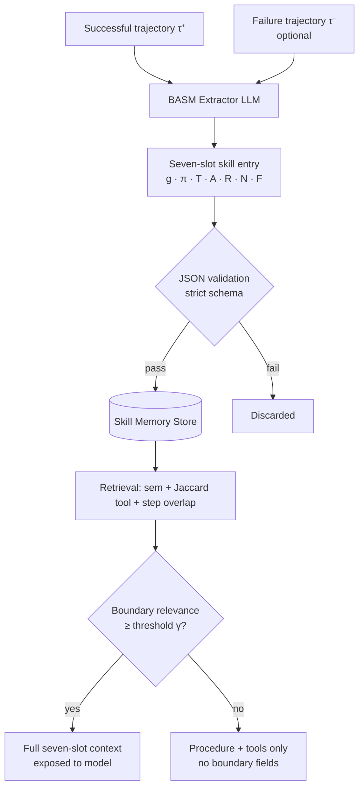
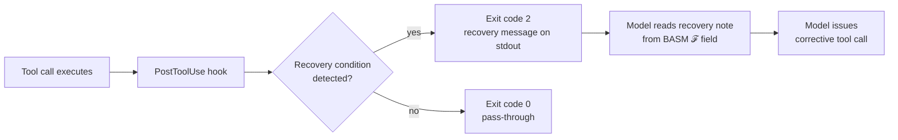

# When Not to Imitate: Boundary-Aware Skill Memory and the Skill Imitation Trap — Implications for Codex CLI AGENTS.md


---

A paper from Meituan, the University of Chinese Academy of Sciences, and the Institute of Automation (arXiv:2608.22339, August 2026) identifies a counterintuitive failure mode in how coding agents learn from past experience.[^1] The finding matters for anyone using Codex CLI's AGENTS.md skill libraries or Agent Plugins catalog: storing skills from successful trajectories can, under the right conditions, make the agent *less* reliable at tool selection than a memory-free baseline. The paper calls this the **Skill Imitation Trap** and proposes **Boundary-Aware Skill Memory (BASM)** to fix it.

## The Skill Imitation Trap

The assumption behind skill distillation is simple: record what worked, retrieve it when something similar comes up, apply it. The problem is that "similar" in embedding space does not mean "same preconditions." When a task is semantically close to a stored success but requires a *different* tool, the retrieved skill actively shifts the model's attention toward the procedural content of the old success — the *how* — and away from the cues that would tell it the old approach does not apply.

The authors measure this via a **wrong-tool margin**: the logit difference between the incorrect tool (the one the retrieved skill would recommend) and the correct tool. For a memory-free baseline the margin is 7.31. Procedural skill memory — goal, procedure, and tool list stored from past successes, the most common approach in the literature — raises this to **10.71**, a 47% increase. The model becomes more confident in the wrong answer the more success experience it retrieves.[^2]

BASM reduces the wrong-tool margin to **2.26**, below even the memory-free baseline, by exposing the conditions under which a skill's tools are appropriate alongside the procedure itself.

## The Seven-Slot Schema

BASM expands each skill entry from the standard three fields (goal `g`, procedure `π`, tools `𝒯`) to seven:

| Slot | Symbol | Description |
|------|--------|-------------|
| Goal | `g` | The task objective the skill addresses |
| Procedure | `π` | Step-by-step execution instructions |
| Tools | `𝒯` | The tool calls expected during execution |
| Applicability conditions | `𝒜` | When the skill's approach is valid |
| Risk cues | `ℛ` | Warning signals that suggest misapplication |
| Avoidance rules | `𝒩` | Explicit prohibitions on specific tool calls when preconditions are absent |
| Recovery notes | `ℱ` | Repair strategies for predictable failure modes |

The four boundary fields (`𝒜`, `ℛ`, `𝒩`, `ℱ`) are **LLM-synthesised from trajectories**. The extractor receives a successful execution trace plus, when available, an adjacent failure trace. The successful trace populates goal, procedure, and tools; the failure trace is used as evidence for avoidance rules and recovery notes. Extracted skills undergo deterministic JSON validation: required fields must be present, boundary slots must be list-valued, risk cues and avoidance rules must be non-empty.[^3]



## Retrieval and Boundary Gating

Retrieval combines three signals weighted by hyperparameters `λ`:

```
score = λ_sem · cos(embed(query), embed(skill))
      + λ_tool · Jaccard(tools_query, tools_skill)
      + λ_step · overlap(query, goal_skill, procedure_skill)
```

The boundary fields are not always shown. They are exposed only when a **boundary relevance score** exceeds threshold `γ`, operating under a fixed token budget. This prevents boundary text from polluting the context when the skill is clearly applicable — in which case the avoidance rules are noise — and surfaces it precisely when edge-case risk is high.

The attention analysis explains why this works mechanistically. Under procedural-skill memory, retrieving a similar but inapplicable skill shifts the model's boundary/procedure attention ratio to **0.15** in applicable states (appropriate — follow the procedure) but collapses it further in inapplicable states. Under BASM, the ratio rises to **1.23** in inapplicable states and **1.81** in active repair states — the model attends to the constraints when constraints matter.[^4]

## Results

The evaluation covers three benchmarks and four model scales (Qwen3-8B, Qwen3-14B, Qwen3-32B, Qwen3.5-397B-A17B):

| Benchmark | Best BASM gain | Metric |
|-----------|---------------|--------|
| AppWorld | +23.8 pp (Qwen3-32B: 76.19%) | Task success rate |
| BFCL v3 | +5.0 pp | Function-call accuracy |
| AgentDojo v1.2.2 | −4.6 pp attack success | Security robustness |

The security result is noteworthy: avoidance rules that tell the agent *not* to call certain tools under adversarial-looking conditions directly reduce the attack surface for prompt injection attempts.[^5]

Ablation on Qwen3-8B across BFCL shows that removing avoidance rules costs 0.88 points and removing recovery notes costs 1.88 points — the recovery field is the single most valuable boundary slot.

## Mapping to Codex CLI

Codex CLI does not implement BASM natively, but the seven-slot schema maps directly to the files and systems that are already present.

### AGENTS.md as the Applicability Layer

Every AGENTS.md block that describes a workflow pattern is effectively a procedural skill entry. Adding a `## When Not to Use This` section, an `## Avoidance Rules` list, and a `## Known Failure Modes` block converts it from procedural memory to BASM-style bounded memory. The model reads the full file at session start, so boundary fields are always in context — no retrieval threshold needed.[^6]

```markdown
## Migrate Database Schema

**When to use:** upstream model changes committed; CI green; staging branch only.

**Avoid when:**
- `ENVIRONMENT=production` is set in shell
- migration has not been reviewed in PR
- previous migration failed within this session

**Recovery:** if `alembic upgrade` exits non-zero, run `alembic downgrade -1` before surfacing error.
```

### Agent Plugins and SKILL.md

The Agent Plugins 1.0 specification (published August 2026 by OpenAI, Microsoft, AWS, Anysphere, and Vercel) stores executable skill definitions in `SKILL.md` files within plugin packages.[^6] These are currently procedural: goal, steps, examples. Adding boundary slots maps directly to BASM's schema:

```markdown
## Applicability
- Single-repo workspaces only
- Requires `gh` CLI authenticated

## Risk Cues
- Repository has >1 remote configured
- Branch protection rules present

## Avoidance Rules
- Do NOT push directly to `main`; create a PR branch instead
- Do NOT call `gh repo delete` under any circumstances

## Recovery
- If PR creation fails, verify `gh auth status` and retry once
- On merge conflict, run `/reset branch` rather than force-pushing
```

### PostToolUse Hooks as Recovery Validators

BASM's recovery notes define *what* to do when a tool call fails predictably. Codex CLI's `PostToolUse` hooks can enforce recovery *deterministically*. A hook that checks the exit code of a database migration command and emits a rollback instruction as exit code 2 (the signal to the model that the tool call result should be treated as a failure requiring recovery) implements BASM's `ℱ` field in executable code rather than prose.[^6]



### Memories as a Distillation Sink

Codex CLI's Memories store — currently a 5,000-token flat log with 30-day decay — functions as an implicit skill store without boundary fields. The BASM finding suggests that adding `[AVOIDANCE]` and `[RECOVERY]` tagged entries to the Memories store, deliberately distinct from `[PATTERN]` entries, would replicate the paper's boundary/procedure separation within the existing infrastructure. This is a low-cost approximation that avoids needing a full retrieval system.

## Caveats

The paper evaluates text-based tool-use benchmarks, not long-horizon software engineering tasks like SWE-bench Verified. The boundary field generation cost is unquantified — each skill extraction involves an LLM call over a potentially lengthy trajectory. The retrieval threshold `γ` is a hyperparameter requiring tuning per domain. ⚠️ Whether the 23.8% AppWorld improvement transfers to typical Codex CLI coding workloads is untested.

## Takeaway

Skill memories without boundary constraints can be actively harmful. The Skill Imitation Trap is not a subtle effect: it raises the wrong-tool confidence margin by 47% relative to no memory at all. BASM's seven-slot schema is directly expressible in AGENTS.md, SKILL.md, and Memories today — no framework changes required. The highest-value addition is the recovery field, which both the ablation and the intuition of any engineer who has debugged a stuck agent will confirm.

## Citations

[^1]: Lin, Z., Chen, Z., Wei, J., Wang, X., Cao, J., Chai, J., Lin, W., Yin, G., & He, R. (2026). "When Not to Imitate: Boundary-Aware Skill Memory for Reliable Tool-Use LLM Agents." arXiv:2608.22339. <https://arxiv.org/abs/2608.22339>
[^2]: arXiv:2608.22339, Section 4.2 — Wrong-tool margin analysis. Procedural skill memory: 10.71 vs baseline 7.31 vs BASM 2.26.
[^3]: arXiv:2608.22339, Section 3.2 — Skill extraction pipeline and JSON validation requirements.
[^4]: arXiv:2608.22339, Section 4.3 — Attention analysis; boundary/procedure ratios across applicable, inapplicable, and repair states.
[^5]: arXiv:2608.22339, Table 2 — AgentDojo v1.2.2 results; BASM reduces attack success rate by 4.6 pp across tested models.
[^6]: OpenAI. (2026). Codex CLI v0.147.0 release notes and Agent Plugins 1.0 specification. <https://github.com/openai/codex/releases/tag/rust-v0.147.0>
