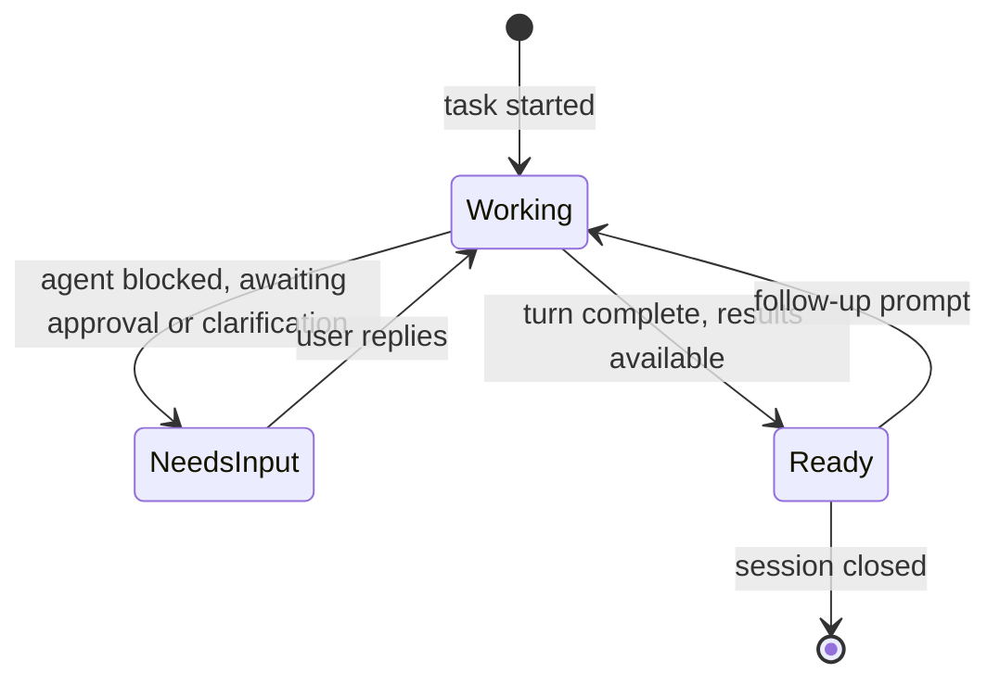
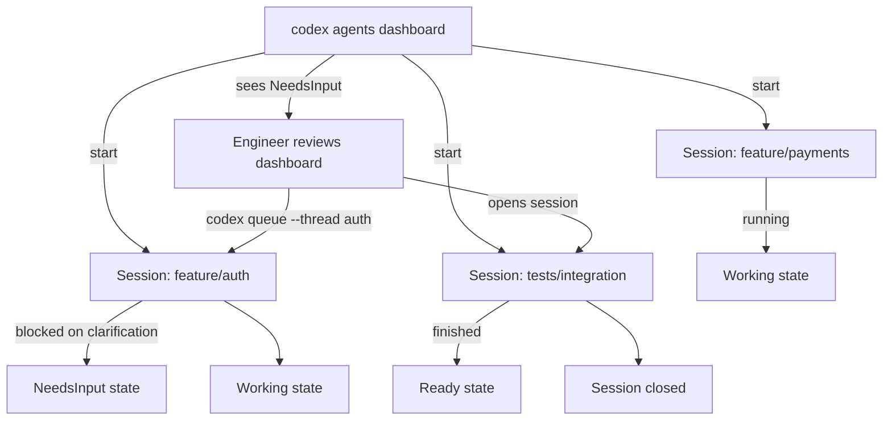

# The `codex agents` Dashboard: Managing Parallel Sessions Without the Terminal-Tab Overhead


---

The moment you start running more than one Codex session at a time, your operating model shifts. You are no longer shepherding a single task through a conversation; you are a dispatch controller watching a fleet. Prior to v0.149.0, that fleet management happened in your head — you tracked which terminal tab held which session, switched manually, sent follow-up prompts by reopening the right window, and lost context every time a background agent silently finished and sat idle.

v0.149.0 (released 20 August 2026) ships three primitives that address this: the `codex agents` TUI dashboard, the `codex queue` command for out-of-band message delivery, and `/cd`/`/pwd`/`/cwd` for mid-session working-directory control.[^1] Together they turn the "terminal-tab shuffle" into something closer to a proper job queue.

## The Core Problem: Attention Routing

Running parallel Codex sessions exposes an attention routing problem. Each session has its own state machine:



Before the dashboard, detecting a state transition required manual polling — opening each tab in turn and scanning for a prompt. `codex agents` makes these state transitions visible in a single view.[^2]

## `codex agents`: The Interactive Dashboard

Invoke the dashboard from any terminal that has the Codex daemon running:

```bash
codex agents
```

This opens a full-screen TUI showing every root session managed by the local app-server daemon.[^3] The interface surfaces:

- **Session list** with session names, working directories, and current state
- **Grouped view** organised by project (sessions opened from the same git repository appear together)
- **Actions**: search, start a new session, open (attach to) an existing session, rename, or stop

From inside an open Codex session you can return to the dashboard without closing the task:

```bash
/agents
```

The default keyboard shortcut to open the dashboard from anywhere is `Alt+A`, though the shortcuts are configurable to resolve conflicts with shell key bindings.[^4]

### Dashboard Keyboard Shortcuts

The dashboard was shipped with configurable shortcuts — the same `/keymap` system used for permission-mode cycling (added in v0.150.0).[^4] ⚠️ Default bindings beyond `Alt+A` are not exhaustively documented in the release notes; check `codex agents --help` or the in-dashboard help overlay for the current mapping on your installed version.

## `codex queue`: Out-of-Band Message Delivery

The second new primitive answers a common frustration: sending a follow-up instruction to a background session without attaching to it and interrupting its state.

```bash
# Target by exact session name
codex queue --thread "auth-service-refactor" --message "also handle the OAuth token expiry case"

# Target by session UUID (unambiguous, preferred in scripts)
codex queue --thread "01a01234-abcd-7890-1234-123456789abc" --message "stop and summarise what you have done so far"

# Attach an image (e.g. a failing screenshot)
codex queue --thread "ui-tests" --message "screenshot of the regression" --image "/tmp/failure.png"
```

Key constraints:[^5]

- The thread argument must resolve to **exactly one** session; ambiguous names (duplicate session names across projects) are rejected with an error.
- Empty messages are rejected.
- The command targets local sessions by default; remote app-server targeting uses the same `--app-server` flag as `codex exec`.
- Messages delivered via `codex queue` are semantically equivalent to pasting a user turn — they queue and fire when the agent's current turn completes.

### Reliability Fix: Idle Session Wake-Up

Earlier alpha builds had a bug where queued messages did not reliably wake sessions that had gone idle between turns. v0.149.0 fixes this: a queued message now activates an idle session and triggers a new turn.[^1] This matters for automation pipelines where `codex queue` is used to chain tasks without a human in the loop.

## Working Directory Commands: `/cd`, `/pwd`, `/cwd`

A smaller but practically important addition — three slash commands for managing the session's working directory mid-turn:[^1]

```bash
# Print current working directory
/pwd
# Equivalent alias
/cwd

# Change to a different directory without restarting the session
/cd ../api-service
```

This closes a workflow gap in monorepo setups. Previously, if you opened a Codex session at the root to handle a cross-cutting task and then wanted to narrow scope to a subdirectory, you had to open a fresh session. `/cd` lets you redirect without losing conversation context or permission profiles.

Note that prior to v0.151.0 there was a regression where `/cd` would drop the active permission profile;[^6] that was patched in v0.151.0 (PR #41192). If you are running v0.149.0 or v0.150.x, be aware that switching directories resets your permission profile to the default.

## Enhanced Diagnostics: `codex doctor` Expansion

v0.149.0 also expanded `codex doctor` to surface a broader class of configuration problems:[^1]

```bash
codex doctor
```

The v0.149.0 additions check for:

- **Endpoint protection software** — detects AV or EDR products known to intercept sandbox syscalls
- **Network and proxy failures** — validates connectivity to the OpenAI API endpoint and any configured proxy
- **Desktop app state** — identifies conflicts between the desktop app and CLI daemon
- **Update connectivity** — checks whether npm/npx can reach the registry for `@openai/codex` updates

These extend the prior `codex doctor` scope (model authentication, sandbox support) into the infrastructure layer, giving teams a single command to run before filing "it just hangs" bug reports.

## SDK Enhancements: Config Overrides and Reasoning Effort

Also shipping in v0.149.0, SDK users gain two capabilities:[^1]

```python
import codex_sdk

session = codex_sdk.Session(
    # Pass exact CLI config overrides as a dict — same keys as config.toml
    config_overrides={
        "approval_policy": "on-request",
        "sandbox": "workspace-write",
    },
    # Select reasoning effort: "default" | "max" | "ultra"
    reasoning_effort="max",
)
```

The `max` and `ultra` effort levels map to the reasoning budget tiers previously only selectable via the `--effort` CLI flag. Exposing them in the SDK allows orchestration code to escalate effort programmatically based on task complexity without shelling out to `codex exec`.

## Multi-Agent Workflow Pattern

The dashboard, queue command, and directory control compose into a practical multi-agent dispatch pattern:



A single engineer can dispatch multiple sessions at session start, monitor from the dashboard, and use `codex queue` to unblock sessions without needing to be present at each terminal.

## What Changed in Your config.toml

The `codex agents` feature is always-on once v0.149.0+ is installed — there is no feature flag to enable. The session dashboard reads the existing `local_app_server` configuration, which is implicitly started when you run `codex` interactively.[^3]

If you use named profiles (e.g. for different sandbox policies across projects), note that the dashboard shows **all** sessions regardless of which profile they were started with. The per-session permission profile is shown in the session detail view.

Custom keymap entries for dashboard shortcuts follow the same `~/.codex/config.toml` block used by other keybindings:

```toml
[keymap]
# Override the default Alt+A binding for the agents dashboard
agents_dashboard = "Ctrl+G"
```

⚠️ The exact `keymap` key names are not published in the v0.149.0 release notes; inspect the in-dashboard help overlay or run `codex --print-keymap` for the authoritative list on your version.

## Upgrading

```bash
# Upgrade via npm
npm install -g @openai/codex@latest

# Verify version
codex --version
# Should report 0.149.0 or later

# Run health check
codex doctor
```

The `codex agents` dashboard, `codex queue`, and the directory commands are all available immediately after upgrade; no migration steps are required.

## Summary

v0.149.0 is primarily a multi-agent usability release. The `codex agents` dashboard surfaces session state that was previously implicit, `codex queue` decouples instruction delivery from terminal attachment, and `/cd` closes the directory-switching gap for monorepo workflows. Together they shift the operational model from "tab management" to "attention routing" — the right mental model once you are routinely running more than two Codex sessions concurrently.

## Citations

[^1]: OpenAI, "Release rust-v0.149.0", GitHub, 20 August 2026. <https://github.com/openai/codex/releases/tag/rust-v0.149.0>

[^2]: "The Terminal Tab Problem Codex Finally Solved for Multi-Agent Work", HackerNoon, August 2026. <https://hackernoon.com/the-terminal-tab-problem-codex-finally-solved-for-multi-agent-work>

[^3]: "OpenAI Codex 0.149.0 Release Notes: Agent Dashboard and Codex Queue", The Forge, Hammer Automation, 21 August 2026. <https://hammerautomation.ai/en/forge/openai-codex-release-notes-2026-08-21>

[^4]: "Codex CLI 0.149.0: Task Dashboard Explained", Get Claude Skills, August 2026. <https://www.getclaudeskills.com/blog/codex-cli-task-dashboard-0-149-0>

[^5]: "codex queue and Inter-Session Messaging: What v0.149.0's New Primitive Means for Orchestration and Automation", Codex Knowledge Base, Daniel Vaughan, 21 August 2026. <https://codex.danielvaughan.com/2026/08/21/codex-queue-inter-session-messaging-codex-cli-v0149-orchestration-automation-agent-to-agent/>

[^6]: OpenAI, "Release rust-v0.151.0", GitHub, 29 August 2026. <https://github.com/openai/codex/releases/tag/rust-v0.151.0>
