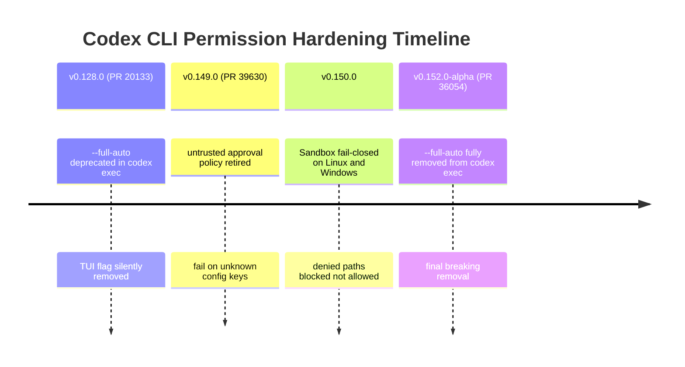
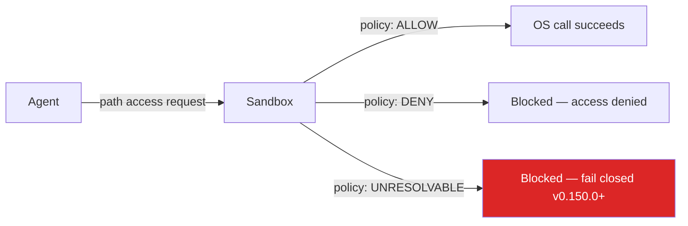

# Codex CLI Permission Hardening: `--full-auto` Removed, `untrusted` Retired, Fail-Closed Sandboxes


---

Three independent permission-related changes landed across recent Codex CLI releases that, taken together, represent the most significant hardening of the permission surface since the Rust rewrite. If your team runs Codex in CI pipelines, headless scripts, or Docker-based workflows, at least one of these changes will break something in your existing configuration. This article maps each change to a precise migration path.

## The Three Changes at a Glance



## Change 1: The Final Removal of `--full-auto`

### Background

`--full-auto` was introduced as a convenience flag that implicitly mapped to the `workspace-write` sandbox with no approval prompts. It was never part of the documented public API — the CLI help text did not list it — but it was widely used in scripts and CI jobs because it was the path of least resistance for "just run the agent automatically".[^1]

PR #20133 ("chore(cli) deprecate --full-auto") deprecated the flag in v0.128.0, removing it entirely from the TUI (where it had no effect — it resolved to the default permissions) and adding a deprecation warning for `codex exec`.[^1]

PR #36054 ("Remove legacy `--full-auto` handling from `codex exec`") completes the removal. The flag is no longer accepted; passing it raises an error.[^2]

### Who Is Affected

Any `codex exec` invocation containing `--full-auto`, in any form:

```bash
# These all break after PR #36054 merges to stable
codex exec --full-auto "refactor the auth module"
codex exec --full-auto --model gpt-4.1 "..."
```

CI configuration files (GitHub Actions, GitLab CI, Jenkins) that call `codex exec --full-auto` will fail at the exec step.

### Migration

The flag's implicit behaviour was equivalent to `--sandbox workspace-write` with no approval step. The mechanical replacement is:

```bash
# Before
codex exec --full-auto "refactor the auth module"

# After — explicit sandbox, no approval prompts for in-sandbox commands
codex exec --sandbox workspace-write --ask-for-approval never "refactor the auth module"
```

If you want the agent to be able to read outside the workspace but only write inside it (the common CI pattern), `workspace-write` is the correct mode. For jobs that must touch system paths or reach the network, use `danger-full-access` deliberately:

```bash
# Explicit full-access — do not use unless your job genuinely needs it
codex exec --sandbox danger-full-access --ask-for-approval never "..."
```

You can also set the default in `config.toml` so each call inherits it without flags:

```toml
# ~/.codex/config.toml  (or /ci/.codex/config.toml for CI-scoped config)
sandbox_mode = "workspace-write"
approval_policy = "never"
```

## Change 2: The Retirement of the `untrusted` Approval Policy

### Background

The `untrusted` approval policy was designed for repositories you had not explicitly declared safe. Its defining behaviour was prompting for every command that mutated state — writes, network calls, shell commands — regardless of whether the sandbox already restricted them. This gave security teams a belt-and-suspenders layer: the sandbox blocks by OS enforcement; `untrusted` prompted regardless.[^3]

PR #39630 ("Retire the untrusted approval policy"), merged in v0.149.0 (20 August 2026), removes `untrusted` from the CLI, the `config.toml` schema, and the MCP tool interface.[^3]

Sessions starting with `approval_policy = "untrusted"` in their config now fail immediately with an actionable error message. There is no silent fallback.

### Who Is Affected

- `~/.codex/config.toml` entries containing `approval_policy = "untrusted"`
- Profile files at `~/.codex/<profile>.config.toml` with the same setting
- `codex exec --ask-for-approval untrusted` in scripts
- `-c approval_policy=untrusted` inline overrides
- MCP tool calls that set `approval_policy` to `"untrusted"`

### Migration

The direct replacement is `on-request`:

```toml
# Before
approval_policy = "untrusted"

# After
approval_policy = "on-request"
```

```bash
# Before
codex exec --ask-for-approval untrusted "..."

# After
codex exec --ask-for-approval on-request "..."
```

**Behaviour difference to understand:** `untrusted` prompted before every mutation regardless of the sandbox. `on-request` only prompts when the agent requests a permission escalation beyond its current sandbox boundary. In a `workspace-write` sandbox, most routine file edits will not trigger a prompt — the sandbox allows them. If you relied on `untrusted` to give a human a review checkpoint even for in-sandbox writes, you need to compensate with exec policy rules.

### Exec Policy Rules as a Granular Alternative

For teams that need per-command prompting rather than per-escalation prompting, the replacement mechanism is `~/.codex/rules/default.rules`:[^4]

```toml
# Prompt before any git commit or push, regardless of sandbox
[[rule]]
type = "prefix_rule"
prefix = "git commit"
decision = "prompt"

[[rule]]
type = "prefix_rule"
prefix = "git push"
decision = "prompt"

# Auto-allow read-only cargo commands
[[rule]]
type = "prefix_rule"
prefix = "cargo check"
decision = "allow"
```

Rules are evaluated in order; first match wins. This gives you `untrusted`-style checkpoint coverage for high-impact operations without impeding routine agent work.

## Change 3: Fail-Closed Sandbox Enforcement on Linux and Windows

### Background

Prior to v0.150.0, the Linux (Landlock + seccomp) and Windows sandbox implementations would silently _allow_ access to a path that the policy engine could not evaluate — for example, paths on filesystems Landlock could not inspect, or paths where permission resolution failed due to a missing mount. The safe outcome should have been to block the access; instead, it fell through.[^5]

v0.150.0 changed the evaluation so that denied or unreadable paths are treated as blocked rather than silently allowed. macOS (Seatbelt) was already fail-closed; this brings Linux and Windows to parity.

### Impact

No configuration changes are required. However, CI jobs running on Linux that accidentally relied on fall-through behaviour — for instance, reading from a network-mounted path that Landlock could not inspect — may now see unexpected permission-denied errors inside the agent sandbox.



If you see new `permission denied` errors in agent logs on Linux after upgrading to v0.150.0+, check whether the agent is trying to access paths outside the workspace that previously relied on evaluation fall-through.

## Current Sandbox Reference Table

| Sandbox Mode | File Access | Network | Typical Use |
|---|---|---|---|
| `read-only` | Read anywhere, no writes | Blocked | Code exploration, review-only agents |
| `workspace-write` | Read anywhere, write in workspace + `/tmp` | Blocked | Normal development (default) |
| `danger-full-access` | Unrestricted | Enabled | System admin, package publishing |

| Approval Policy | Behaviour |
|---|---|
| `on-request` | Prompts when agent requests escalation beyond sandbox (default) |
| `never` | No prompts — suitable for CI with a trusted agent |
| `untrusted` | **Removed in v0.149.0** |

## CI/CD Migration Checklist

Run this against your CI configuration before upgrading to v0.150.0+ or installing the 0.152.0 release when it reaches stable:

```bash
# Find any --full-auto usage in CI configs and scripts
grep -r -- '--full-auto' .github/ .gitlab-ci.yml Jenkinsfile scripts/ 2>/dev/null

# Find untrusted approval policy in codex config files
grep -r 'untrusted' ~/.codex/ .codex/ 2>/dev/null

# Check inline -c overrides in scripts
grep -r 'approval_policy=untrusted' .github/ scripts/ 2>/dev/null
```

For each hit, apply the replacements above and verify locally with `codex exec --dry-run` before pushing to CI.

## Citations

[^1]: openai/codex GitHub, PR #20133 — "chore(cli) deprecate --full-auto" by dylan-hurd-oai. <https://github.com/openai/codex/pull/20133>

[^2]: openai/codex GitHub, PR #36054 — "Remove legacy `--full-auto` handling from `codex exec`". <https://github.com/openai/codex/pull/36054>

[^3]: blakecrosley.com — "Codex untrusted Approval Policy Retired: What to Change" (citing PR #39630 in v0.149.0, August 20 2026). <https://blakecrosley.com/blog/codex-untrusted-approval-policy-retired>

[^4]: smartscope.blog — "Codex CLI approval_policy: Legacy Patterns vs Official 2026 Approval Settings". <https://smartscope.blog/en/generative-ai/chatgpt/codex-cli-approval-policy-implementation/>

[^5]: blakecrosley.com — "Codex CLI Guide 2026: Setup, Sandbox, AGENTS.md & MCP" (v0.150.0 fail-closed behaviour). <https://blakecrosley.com/guides/codex>
