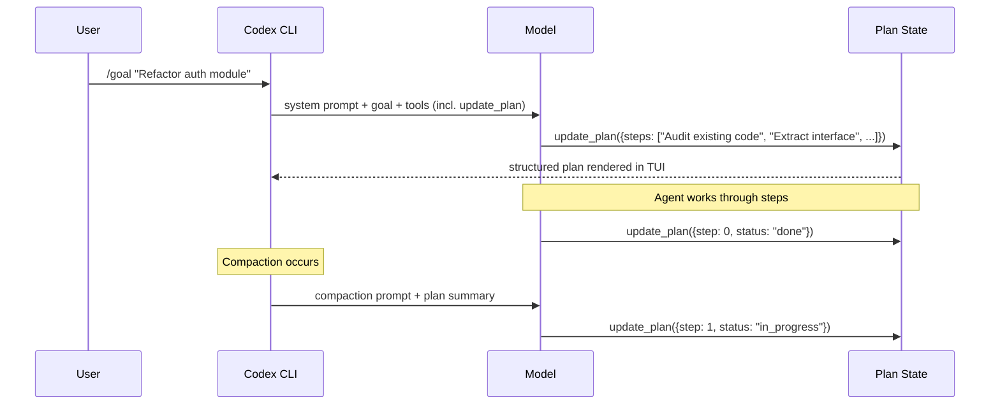
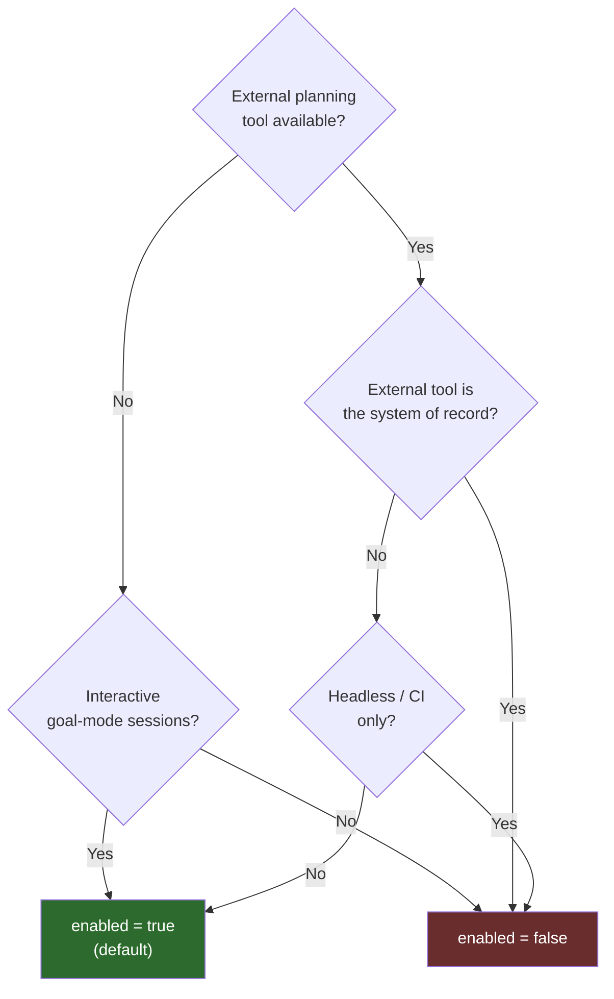

# The `update_plan` Tool Goes Opt-In: When to Disable Codex CLI's Built-In Planner


---

A pull request merged on 31 August 2026 changed the default state of Codex CLI's built-in `update_plan` tool from always-on to opt-in.[^1] The change is small in surface area but has non-trivial implications for any team running Codex alongside an external planning system — a Linear MCP server, a Jira integration, a custom task-tracking backend, or a host application that manages plans on the agent's behalf. This article explains what the tool does, why it sometimes becomes a liability, and how to configure it correctly for each usage pattern.

## What `update_plan` Actually Does

Codex CLI's goal mode lets the model pursue a durable, multi-turn objective rather than responding to a single prompt. During that pursuit, the model needs a structured mechanism to record what it has done and what remains — otherwise compaction or session resumption erases its working state and it starts repeating completed steps.

`update_plan` is the tool call that provides this mechanism. When the model issues an `update_plan` invocation, Codex updates an internal plan structure — an ordered list of steps, each tagged with a completion status — and renders that structure in the TUI's plan view.[^2] Subsequent compaction prompts, goal-continuation prompts, and collaboration-mode instructions all reference the plan, giving the model a compact, structured digest of where it is in a long task without replaying the entire conversation history.



The tool is tightly coupled to Codex's own planning prompt layer. When `update_plan` is active, the following prompt slots include planning guidance: the base model prompt, collaboration-mode instructions, multi-agent subagent instructions, the compaction summariser, the prewarm template, and goal-continuation prompts.[^1] That breadth of injection is deliberate — it keeps the plan coherent across all the lifecycle events where context might shift — but it also means that when you bring in an external planner, you now have two planning systems simultaneously shaping the model's behaviour.

## The Competing-Surfaces Problem

The issue surfaced repeatedly once MCP tool ecosystems matured in mid-2026. Developers integrating Codex with Linear, Jira, or custom task-tracking MCP servers discovered that the model would hedge its tool selection: sometimes calling `update_plan` to update Codex's internal state, sometimes calling the Linear `createIssue` or Jira `updateTicket` tool to record progress externally, and occasionally doing both for the same step.[^3]

The root cause is clear in hindsight. Given two tools that both accept step-completion events, the model has to infer the intended architectural boundary — a guess it frequently gets wrong. The model has no mechanism to know whether the operator wants Codex's native plan, the external system's state, or both kept in sync. The result is plan drift: the Codex plan panel shows one state; the Linear board shows another.

The same problem appears in headless CI usage. A `codex exec` invocation for automated code review or batch processing has no human reading the plan panel. The `update_plan` calls still happen, consuming tool-call budget and expanding prompts without providing value. In long-running CI tasks with tight token budgets, those calls are measurable waste.

## The Configuration Change

Starting from the pre-release train that began shipping on 31 August 2026, `update_plan` is disabled by default.[^1] The configuration key is `tools.update_plan.enabled` in `~/.codex/config.toml` (user-level) or `.codex/config.toml` (project-level):

```toml
# .codex/config.toml

[tools.update_plan]
enabled = true   # restore default-on behaviour (previous default)
```

```toml
# .codex/config.toml

[tools.update_plan]
enabled = false  # new default — tool absent from model's tool set
```

When `enabled = false`, the tool is removed from both the model-visible tool declaration list and the registered handler table. The model will never see it as an option, so it cannot accidentally call it. The planning-guidance sections are also stripped from all affected prompt slots — model, collaboration-mode, multi-agent, compaction, prewarm, and goal-continuation — preventing orphaned planning instructions from reaching the model.[^1]

Custom user instructions that happen to mention planning are intentionally preserved. The implementation does not attempt to parse or rewrite user-authored AGENTS.md content; it only removes the system-injected planning scaffolding.

## Decision Matrix: Enable or Disable



### When to keep it enabled

**Interactive goal-mode sessions without an external planner.** The plan panel gives developers a live, structured view of agent progress that complements the conversation thread. Compaction events that would otherwise lose track of completed steps are handled gracefully because the plan state is independent of the conversation history length.

**Teams who rely on the `/plan` + Shift+Tab interactive review flow.** The plan TUI is rendered from `update_plan` state; disabling the tool removes the plan panel entirely.

**Subagent fan-out with Codex-native orchestration.** When a root agent spawns subagents via `multi_agent_v2`, and those subagents report progress back through Codex's own tracking infrastructure, keeping `update_plan` active ensures the root agent's plan panel accurately reflects distributed work.

### When to disable it

**External MCP planning servers.** If you have a Linear, Jira, Asana, or custom task-tracking MCP server connected, set `enabled = false`. This eliminates the competing surfaces and forces all planning state into the external system, which is already where your team reviews progress.

**Headless and CI usage.** Any `codex exec` invocation, cron automation, or CI pipeline step benefits from a smaller tool surface. The plan panel has no reader, so the tool calls and extended prompts are net cost with no benefit.

**Embedded Codex integrations.** If a host application or orchestration layer manages task state on Codex's behalf — common in enterprise deployments with custom control planes — the `update_plan` calls will conflict with the host's state model. Disable the tool and let the host own planning.

**Context-window-constrained sessions.** The planning prompt injections add tokens across six prompt slots. On tasks with very large codebases already consuming most of the context window, removing those injections frees budget for actual code context.

## Migrating Existing Configurations

If your team has AGENTS.md rules or config.toml settings that reference planning behaviour, audit them after this change:

**Before (explicit enable not needed — tool was always on):**
```toml
# No update_plan config needed
```

**After (explicit opt-in if your workflow requires it):**
```toml
[tools.update_plan]
enabled = true
```

AGENTS.md rules that reference plan-related behaviours (e.g., "always update the plan before marking a step complete") still fire when the tool is enabled. When disabled, those rules remain in context but the tool call they reference is unavailable — the model will process the instruction but cannot act on it. Remove or conditionalise such rules when disabling the tool.[^2]

If you are using `model_auto_compact_token_limit` to control compaction, note that the compaction prompt is one of the slots where planning guidance was injected. With `enabled = false`, the compaction prompt is lighter, which may shift the effective token threshold at which compaction triggers. Measure if this matters for your workload.

## External Planning Pattern: Linear MCP

The cleanest pattern when replacing `update_plan` with an external planner is to explicitly encode the expected tool-call sequence in AGENTS.md:

```markdown
## Planning Workflow

This project uses Linear for task tracking. The following sequence is required:

1. Before starting any new task, call `linear_create_issue` with a step description and assignee.
2. When a task is in progress, call `linear_update_issue` with status "In Progress".
3. On completion, call `linear_update_issue` with status "Done" and a brief summary.
4. Do not maintain internal plans. External Linear issues are the canonical source of truth.
```

With `update_plan` disabled and these AGENTS.md instructions in place, the model has a single, unambiguous planning surface and no competing tool to hedge against.[^3]

## What This Does Not Change

`update_plan` is distinct from `update_goal`, which manages the durable goal lifecycle state (pending, active, paused, complete). Disabling `update_plan` does not affect goal mode's persistence, resumption, or token-budget tracking. Those are managed by a separate mechanism. You can run `/goal` sessions without `update_plan` enabled; the agent will pursue the goal without maintaining a structured step list.

The `/plan` Shift+Tab interactive planning flow also uses a different mechanism at the UX layer — the plan is initially created by the model's free-text response in plan mode, not by `update_plan` tool calls. The `update_plan` tool is what keeps the plan *updated* during execution. Disabling it means a plan created during the interactive review phase will not be updated as the agent progresses; it will show the initial approved state but not reflect step completions.

## Summary

The `update_plan` tool is now opt-in as of late August 2026.[^1] For teams using external planning systems, headless CI workflows, or host-managed orchestration, disabling it via `[tools.update_plan] enabled = false` cleans up a persistent source of competing planning state. For interactive goal-mode sessions without an external planner, keep it enabled — the plan panel and compaction coherence it provides remain valuable. The key practical question is whether your planning system of record lives inside Codex or outside it; let that answer determine the configuration.

## Citations

[^1]: PR #41744 "Make the update_plan tool opt-in" — openai/codex, merged 31 August 2026. <https://github.com/openai/codex/pull/41744>
[^2]: PR #41630 "Update tests for default-enabled update_plan" — openai/codex, merged 30 August 2026. <https://github.com/openai/codex/pull/41630>
[^3]: GitHub Issue #33890 "Allow disabling the built-in `update_plan` tool independently" — openai/codex. <https://github.com/openai/codex/issues/33890>
