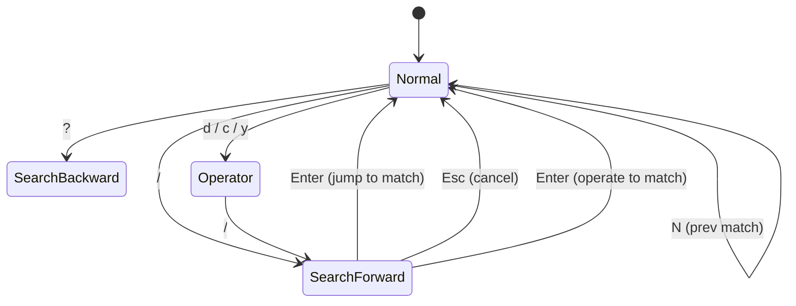
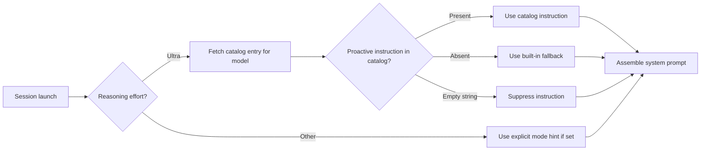

# Codex CLI v0.152 Alpha Preview: Rate-Limit Banners, Package-Style MCP Names, Vim Search, and the Model Catalog Instruction Split


---

OpenAI shipped six pre-release builds of Codex CLI v0.152 on 29–31 August 2026 — `alpha.1` through `alpha.6` — in rapid succession.[^1] The pace signals an imminent stable release. While the release notes for individual alpha builds are sparse, the merged pull requests tell a clear story: v0.152 is a UX and configuration-layer release that closes several long-standing friction points without touching the core agent loop. This article covers the five changes most relevant to daily coding workflows.

To install the latest alpha:

```bash
npm install -g @openai/codex@alpha
codex --version   # should report 0.152.0-alpha.6 or later
```

---

## Actionable Rate-Limit Banners in the TUI (PR #41742)

The most immediately visible change is a new rate-limit banner rendered above the message composer whenever the API signals that your account is approaching or has hit a quota boundary.[^2]

Previous behaviour was binary: requests either succeeded or returned an HTTP 429, at which point the CLI displayed a generic error and stalled. Developers typically resorted to inspecting `~/.codex/logs/` or watching network traffic to understand whether they were rate-limited on requests per minute, tokens per day, or overall credits — three separate limits that behave differently.

The v0.152 banner distinguishes between limit types and surfaces actionable options directly in the UI:

```
┌─────────────────────────────────────────────────────────────────┐
│ ⚠ Rate limit reached · Resets in 47 s                          │
│ Options: [V]iew usage  [C]redits  [P]lan  [N]otify owner        │
└─────────────────────────────────────────────────────────────────┘
```

Under the hood, the banner data arrives via `account/rateLimits/read` — the same endpoint that backs the usage dashboard — meaning the reset timer is authoritative rather than estimated.[^2] When a banner instructs the client to switch to a fallback model (a common backend-driven mitigation for credit exhaustion), the CLI performs the switch whilst preserving all unrelated thread settings such as sandbox policy, approval profile, and MCP server configuration.

Input queued during a limit window is paused, not dropped. The moment the reset fires, the composed prompt is dispatched automatically without user intervention. This matters for scripted workflows that pipe long prompts via `codex exec`: they no longer silently fail and require a manual retry.

The feature is authenticated-user-only; sessions using an `OPENAI_API_KEY` or `CODEX_API_KEY` without a ChatGPT account attached receive the legacy fallback UI.

---

## Package-Style MCP Server Names (PR #41700)

Until v0.152, MCP server names in `~/.codex/config.toml` were restricted to simple identifiers — lowercase letters, digits, and hyphens. That constraint ruled out the scoped package naming that the npm and PyPI ecosystems have standardised.[^3]

v0.152 lifts the restriction to permit `:`, `@`, `/`, and `.` within server names. The practical consequence is that you can now register an MCP server with the same identifier it carries in the npm registry:

```toml
[mcp_servers."npm:@modelcontextprotocol/server-sequential-thinking"]
command = "npx"
args    = ["-y", "@modelcontextprotocol/server-sequential-thinking"]
```

The parser quotes non-standard names in generated `config.toml` recovery hints, so the shell always sees the name as a single token. Credential lookups and OAuth state are keyed on the quoted form, preventing collisions between servers whose names share a prefix (e.g. `@org/tool-a` and `@org/tool-ab`).

The `mcp add`, `mcp get`, `mcp list`, and `mcp remove` commands all preserve the raw name through their lifecycle, so there is no silent normalisation to worry about.

```bash
# Add a scoped MCP server by its registry name
codex mcp add "npm:@modelcontextprotocol/server-filesystem" \
  --command npx \
  --args "-y,@modelcontextprotocol/server-filesystem,/workspace"

# List shows the full scoped name
codex mcp list
# npm:@modelcontextprotocol/server-filesystem   stdio   running
```

For teams that publish internal MCP servers to a private npm registry under an `@org/` scope, this removes the renaming step that previously forced a mapping between registry identity and config identity.

---

## Vim Search Motions in the Composer (PR #41586)

Codex CLI's Vim mode has been progressively closing the gap with a fully-featured modal editor since `/vim` shipped in v0.129.0 and text objects arrived in v0.135.0.[^4] v0.152 adds the motion that most Vim users notice is missing first: in-buffer search.

The implementation follows Vim semantics closely:

| Key | Action |
|-----|--------|
| `/` | Enter forward search; type query, `Enter` to confirm |
| `?` | Enter backward search |
| `n` | Next match (wrapped) |
| `N` | Previous match (wrapped) |
| `d/pattern` | Delete from cursor to match |
| `c/pattern` | Change from cursor to match |
| `y/pattern` | Yank from cursor to match |



Search is draft-local — it operates on the text currently in the composer, not on session history. This is the correct scope for a terminal input widget: the composer contains a single prompt under construction, not a multi-line document. The implementation skips atomic grapheme elements and avoids partial matches at grapheme boundaries, so Unicode input (including CJK and emoji) behaves predictably.[^5]

The search query renders in the composer footer during entry and remains displayed after confirmation so you can issue `n`/`N` without retyping. Configuring alternate keybindings is possible via `tui.keymap.vim_search` in `~/.codex/config.toml`:

```toml
[tui.keymap.vim_search]
next_match = "n"
prev_match = "N"
```

---

## Model Catalog as the Instruction Source for Multi-Agent Mode (PRs #41457, #41461)

Two related PRs refactor how Codex CLI assembles the system prompt for multi-agent sessions.[^6] Previously, the instructions injected when a session launched a subagent were hardcoded strings compiled into the binary. This created a maintenance burden: updating agent behaviour required a new CLI release even when the change was purely textual.

v0.152 externalises two categories of these instructions into per-model entries in the model catalog:

1. **Proactive multi-agent instructions** — the guidance injected at `Ultra` reasoning effort explaining how subagents should decompose work and coordinate.
2. **Async user message descriptions** — the boilerplate text that introduces an out-of-band message delivered via `codex queue` when the receiving session is idle.



The cascade logic is: a missing catalog value falls back to the built-in string (preserving existing behaviour), whilst an explicitly empty string suppresses the message entirely. The instruction refreshes whenever the user switches models mid-session, so switching from Terra to Luna picks up Luna's catalog entry automatically.[^6]

For most developers this change is invisible — the built-in fallback is identical to the previous hardcoded text. Its significance is operational: model-specific tuning of multi-agent behaviour can now ship via a catalog update rather than waiting for a full CLI release cycle. Expect the terra and luna catalog entries to diverge as OpenAI tunes proactive reasoning for each model tier.

---

## Guardian Authorization Preservation Across Compaction (PR #41660)

Context compaction — the summarisation pass Codex CLI performs when accumulated tokens approach the model's context ceiling — has historically voided any Guardian approvals already granted during a session.[^7] The mechanism was conservative: when conversation history was replaced with a summary, the CLI treated the resulting context as a new session and required Guardian re-authorisation for subsequent tool calls.

This was correct behaviour in principle but expensive in practice. On a long refactoring session, compaction could trigger several times. Each trigger reset the Guardian state, producing a cluster of approval prompts at exactly the moment the user expected the agent to work autonomously.

PR #41660 preserves Guardian authorization across compaction events. The implementation serialises the current Guardian state (authorised command signatures, granted permission scopes, session-level trust grants) into the compaction handoff metadata, then restores it when the new context is initialised on the other side of the summary boundary.[^7]

One nuance: the preservation applies only to approvals granted in the *current* session. Approvals are not persisted to disk and do not survive a full session restart — that would violate the principle that the human operator's intent is session-scoped. The fix specifically targets the compaction path, not the resume-from-disk path.

Combined with the v0.151.0 fix that prevented stale Guardian classifications from authorising actions after a permission change,[^8] v0.152 delivers a Guardian subsystem that is both more persistent (within a session) and more correctly scoped (invalidating on permission changes).

---

## Trying the Alpha

The v0.152 alphas are pre-release builds; expect rough edges around the Vim search rendering on non-UTF-8 terminals and occasional stale model-picker state (tracked in the repo). To install and revert cleanly:

```bash
# Install alpha
npm install -g @openai/codex@alpha

# Pin to a specific alpha if needed
npm install -g @openai/codex@0.152.0-alpha.6

# Revert to latest stable
npm install -g @openai/codex@latest
```

No configuration migration is required — all five changes described here are backwards-compatible with existing `~/.codex/config.toml` files.

---

## Citations

[^1]: OpenAI. "Releases · openai/codex." GitHub. Releases v0.152.0-alpha.1 through v0.152.0-alpha.6, 29–31 August 2026. <https://github.com/openai/codex/releases>

[^2]: `copyberry[bot]`. "Show actionable rate-limit banners in the TUI." Pull Request #41742. openai/codex. Merged 31 August 2026. <https://github.com/openai/codex/pull/41742>

[^3]: `copyberry[bot]`. "Support package-style MCP server names." Pull Request #41700. openai/codex. Merged 30 August 2026. <https://github.com/openai/codex/pull/41700>

[^4]: OpenAI. "Codex CLI Changelog — Vim mode history." Releases v0.129.0 (Vim mode), v0.135.0 (text objects). <https://github.com/openai/codex/releases>

[^5]: `copyberry[bot]`. "Add Vim search motions to the composer." Pull Request #41586. openai/codex. Merged 28 August 2026. <https://github.com/openai/codex/pull/41586>

[^6]: `copyberry[bot]`. "Source proactive multi-agent instructions from the model catalog" (PR #41457) and "Source async user message descriptions from the model catalog" (PR #41461). openai/codex. Merged 27–28 August 2026. <https://github.com/openai/codex/pull/41457>

[^7]: `copyberry[bot]`. "Preserve Guardian authorization across history compaction." Pull Request #41660. openai/codex. Merged 28 August 2026. <https://github.com/openai/codex/pull/41660>

[^8]: OpenAI. "Codex CLI v0.151.0 Release Notes — Prevented stale Guardian classifications from authorizing actions after permission changes." 29 August 2026. <https://github.com/openai/codex/releases/tag/rust-v0.151.0>
