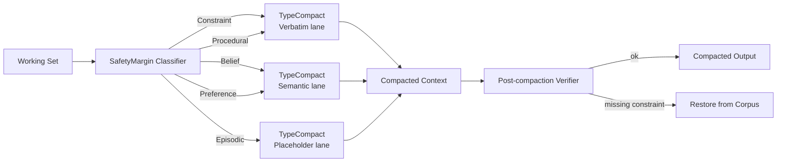
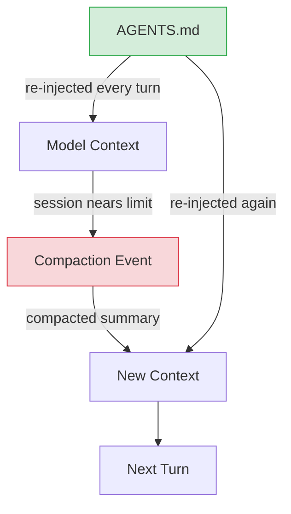

# The Compaction Cliff: How Context Compaction Silently Erodes Your AGENTS.md Safety Rules


A paper accepted at CIKM 2026 contains a number that should alarm anyone running Codex CLI on long-horizon tasks: after five rounds of standard context compaction, only **10% of safety-critical constraints survive**.[^1] The first round loses nearly half. By round five you are effectively operating without guardrails.

Zerhoudi, Mitrović, and Granitzer (University of Passau) call this failure mode the **Compaction Cliff**, and their paper — *The Compaction Cliff in Long-Running AI Agent Memory* (arXiv:2608.22752) — is the first formal treatment of why type-blind compaction systematically destroys the rules you care about most.

## Why Compaction Erodes Constraints

Context compaction is triggered when a session approaches its token budget. The default behaviour in Codex CLI is to summarise earlier conversation history using a language model, then replace the raw history with the summary.[^2] This is efficient and, for most content, acceptably lossy. But safety rules are not most content.

The core problem is **distortion tolerance heterogeneity**. An episodic observation — "refactored the auth module on Tuesday" — can be compressed to a one-sentence note with no operational impact. A constraint — "never write to `/etc/` outside a chroot" — must survive verbatim or it becomes worthless. Type-blind summarisers treat both the same.

The researchers validated this across four LLM compactor families and multiple structural baselines. The Compaction Cliff is not a prompt-engineering failure; it is a structural property of treating all knowledge as equally compressible.[^1]

## The Five-Type Knowledge Model

The paper classifies agent working-set items into five types by their distortion tolerance:[^1]

| Type | Description | Distortion Tolerance |
|---|---|---|
| **Constraint (C)** | Safety rules, hard prohibitions | Zero — must survive verbatim |
| **Procedural (P)** | Step-by-step instructions | Semantic equivalence only |
| **Belief (B)** | Factual assertions about the environment | Bounded semantic distance |
| **Preference (F)** | Soft style guidelines | High tolerance |
| **Episodic (E)** | Past observations, completed steps | Complete tolerance |

Analysis of AgentArtifactCorpus — 396,934 configuration items extracted from 54,628 public GitHub repositories — shows that constraints account for only **12.3% of all items** but carry the highest operational risk.[^1] Procedural items (28.7%), beliefs (31.4%), preferences (14.2%), and episodic content (13.4%) round out the distribution. The corpus covers Claude, Cursor, Copilot, Windsurf, Continue, Aider, and Codeium configurations, capturing 97% of real agent instruction patterns.

The type distribution maps directly onto what you write in a Codex CLI `AGENTS.md`:

- `## Rules` → Constraint
- `## Workflow` / `## Testing` → Procedural
- `## Project` (tech stack facts) → Belief
- `## Style` / `## Conventions` → Preference
- Inline reminders in conversation → Episodic

## Knowledge Triage: Per-Type Retention Operators

The paper's solution is **Knowledge Triage**: classify every working-set item by type, then route it through a type-appropriate retention operator.



### TypeCompact

Routes items into three fidelity lanes based on type. Constraints and procedural items are retained verbatim (or semantically equivalent). Beliefs and preferences are compressed. Episodic items become placeholders. A post-compaction verifier extracts canonical forms from each constraint and confirms they survive; on failure, it restores the original from the item store.

Performance at 50% compression: **1.00 constraint recall** versus 0.53 for the strongest type-blind alternative.[^1] At 25%: 0.95 versus 0.39. At 10%: 0.80 versus 0.24.

### TypeDecompose

When a knowledge base must be partitioned (for example, across multi-agent subagents in a `multi_agent_v2` workflow), TypeDecompose replicates constraints across every partition whose scope intersects the constraint. This maintains **constraint locality**: every context slice that may act on a rule also contains that rule.

The result: zero locality violations versus 13% for topic-aligned baselines and up to 93% for naive approaches.[^1] Mean token overhead is 14.5% (median 0%), with a worst case of 219% in highly constraint-dense configurations.

### TypeRetrieve

During retrieval augmented recall, TypeRetrieve pins all in-scope constraints ahead of relevance scoring. Safety rules are prepended to results before semantic similarity determines the remainder.

Performance: **100% recall@50** for in-scope constraints versus 61–73% for the strongest single-shot LLM retrievers.[^1]

## The Classifier Problem: Declarative Phrasing

The operational guarantee of Knowledge Triage is only as strong as its classifier. The paper's key finding is that grammatical or regex-based classification fails catastrophically on **declarative phrasing**.

The constraint "never prescribe a contraindicated drug" is grammatically imperative — easy to detect. But the same constraint can appear as "the patient is allergic to penicillin", which is declarative in form but safety-critical in function. Miss this, and it gets routed to the belief or preference lane and compressed.

Prevalence of declarative phrasing in safety-critical domains:[^1]

- FDA drug safety text: **49.8%** declarative
- Legal contracts: **61.1%** declarative

This creates a systematic blind spot for form-based classifiers. The paper's SafetyMargin classifier addresses this by estimating a **counterfactual safety margin**: would an agent action become unsafe if this item were removed? It scores 0.93 overall recall versus 0.60 for regex and 0.77 for a distilled MiniLM classifier.[^1]

Classifier latency comparison:

| Classifier | Latency per Item |
|---|---|
| Regex | <1 ms |
| Distilled MiniLM | ~5 ms |
| gpt-5.4-mini | 667 ms |
| SafetyMargin | 880 ms |
| Selective cascade | 1,096 ms |

For typical Codex CLI `AGENTS.md` files (heavily imperative), a MiniLM distilled classifier achieves 0.77 recall at 5 ms per item — a practical operating point. Safety-critical deployments (medical, legal, financial) require SafetyMargin.

## Downstream Behavioural Results

The paper validates the approach against two task benchmarks.

**SafetyMed** (200 scenarios using FDA drug contraindication rules):
- TypeCompact: 97.0% pass rate, 95.5% rule preservation
- Production Sonnet compactor: 92.5% pass, 81.0% preservation
- Gap: 14.5 percentage points on preservation (p<10⁻⁸)[^1]

**τ-bench Retail** (115 tasks, 1,035 paired rollouts at 50% compression):
- TypeCompact: 37.7% mean pass
- Hierarchical truncation: 29.2%
- Full policy (no compression): 28.6%
- TypeCompact *outperforms full policy* (p=0.003), a striking result explained by episodic item removal improving focus[^1]

**τ-bench Airline** (50 tasks):
- TypeCompact: 26.5% pass
- Hierarchical truncation: 15.4%
- TypeCompact ties the full-policy ceiling (34.2%, p=0.14)[^1]

## Mapping to Codex CLI

### Current Compaction Controls

Codex CLI exposes three relevant configuration surfaces:[^2]

```toml
# ~/.codex/config.toml

# Trigger auto-compaction before this limit; 85-90% of model_context_window
model_auto_compact_token_limit = 150000

# Override the compaction prompt (local models only — ignored for OpenAI-hosted)
experimental_compact_prompt_file = ".codex/compact_prompt.md"

# Inline compaction instruction (quick alternative to file)
compact_prompt = "Summarise as a structured engineering handoff. Preserve all rules from AGENTS.md verbatim."
```

The critical limitation: `experimental_compact_prompt_file` and `compact_prompt` are **ignored for OpenAI-hosted models**, where compaction runs server-side.[^2] This means custom prompt engineering cannot protect AGENTS.md constraints when using gpt-5.6-sol, gpt-5.6-terra, or gpt-5.6-luna.

### AGENTS.md as a Zero-Tolerance Zone

The paper's key architectural insight, mapped to Codex CLI: `AGENTS.md` is automatically re-injected at every turn, making it structurally immune to compaction loss. Anything that must survive compaction belongs in `AGENTS.md`, not in conversation history.

The five-type taxonomy suggests explicit section discipline:

```markdown
# AGENTS.md

## Constraints
<!-- TypeCompact zero-tolerance zone — verbatim preservation required -->
- Never commit credentials or secrets to any file
- Do not modify files outside the declared project root
- Always run `npm test` before proposing any commit

## Workflow
<!-- TypeCompact semantic-equivalence zone -->
1. Read the failing test first
2. Implement the minimal fix
3. Verify with `npm test`

## Project
<!-- TypeCompact belief zone — compress freely -->
- Backend: Node.js 22 + Fastify
- Database: PostgreSQL 17

## Style
<!-- TypeCompact preference zone — compress aggressively -->
- 2-space indentation
- Single quotes in JavaScript
```

This structural separation is not just documentation style — it is a pre-classification that any future type-aware compactor (including a Knowledge Triage implementation) could consume directly.



AGENTS.md survives every compaction by design. Constraints you embed only in conversation history do not.

### PostToolUse Hook as a Constraint Verifier

The paper's post-compaction verifier has a natural analogue in Codex CLI's `PostToolUse` hook. You can implement a lightweight constraint-presence check that fires after each tool call and exits with code 2 (aborting the session) if a critical constraint is absent from the current context:

```bash
#!/usr/bin/env bash
# .codex/hooks/post-tool-use/check-constraints.sh
# Abort if a canary constraint phrase disappears from visible context

CANARY="Never commit credentials"
if ! grep -q "$CANARY" "$CODEX_CONTEXT_SNAPSHOT" 2>/dev/null; then
  echo "[CONSTRAINT VIOLATION] Safety rule not found in context — possible compaction loss" >&2
  exit 2
fi
```

⚠️ The `CODEX_CONTEXT_SNAPSHOT` environment variable is not a current Codex CLI feature — this pattern requires either a custom hook that independently loads `AGENTS.md` and verifies constraint presence, or a future hook API extension that exposes the current context to hook scripts.

### Multi-Agent Workloads and TypeDecompose

When using `multi_agent_v2`, each subagent receives a delegated context slice. TypeDecompose's constraint locality principle applies: every subagent context must contain the constraints applicable to its scope, not just the root session's full AGENTS.md.

The current mitigation is a top-level `AGENTS.md` that each subagent inherits automatically (because Codex CLI re-injects it per turn for every session). This provides locality by default. Constraint locality only breaks if you rely on constraints embedded in tool outputs or conversation history rather than in AGENTS.md.

## What the Paper Does Not Measure

Several caveats apply when mapping these results to Codex CLI:

- **Benchmarks are configuration-driven, not SWE-bench coding tasks.** SafetyMed and τ-bench test policy compliance in text-based workflows. Constraint loss in multi-step coding workflows (file edits, test execution, git commits) may behave differently.
- **AgentArtifactCorpus is public GitHub only.** Enterprise codebases with internal security policies may have higher constraint density and different declarative phrasing prevalence.
- **Token-matched controls are absent for the retail benchmark.** TypeCompact retains 1,136 tokens versus 669 for hierarchical truncation, so the 8.5pp performance gap conflates type-awareness with token budget.
- **Five-class inter-annotator agreement is κ=0.45 overall** (though safety-critical binary agreement is κ=0.79). Procedural-vs-belief confusion adds annotation noise.[^1]

## Practical Takeaways

1. **Constraints belong in AGENTS.md, never in conversation.** Re-injection at every turn is the only compaction-proof mechanism available in current Codex CLI.

2. **Fire compaction early.** Set `model_auto_compact_token_limit` at 80–85% of `model_context_window`, not 90%+. Each additional compaction round compounds constraint loss geometrically.

3. **Use explicit section headers in AGENTS.md.** `## Constraints`, `## Workflow`, `## Project`, `## Style` give a future Knowledge Triage implementation (or a careful human reviewer) the type signal without external classifiers.

4. **Watch declarative-form constraints.** Rules phrased as facts ("the system is air-gapped", "the user is a minor") are the ones most likely to be misclassified and compressed. Rewrite them imperatively where possible, or add a bracketed annotation: `<!-- CONSTRAINT -->`.

5. **For server-side compaction, `compact_prompt` is a no-op.** With OpenAI-hosted models (gpt-5.6-sol/terra/luna), the only reliable constraint anchor is AGENTS.md re-injection.

## Citations

[^1]: Zerhoudi, S., Mitrović, J., & Granitzer, M. (2026). *The Compaction Cliff in Long-Running AI Agent Memory*. In Proceedings of the 35th ACM International Conference on Information and Knowledge Management (CIKM '26), November 7–11, 2026, Rome, Italy. arXiv:2608.22752. https://arxiv.org/abs/2608.22752

[^2]: Codex CLI documentation — context compaction configuration. `model_auto_compact_token_limit`, `experimental_compact_prompt_file`, `compact_prompt` config keys. https://codex.danielvaughan.com/2026/03/31/codex-cli-context-compaction-architecture/

[^3]: Zerhoudi et al., AgentArtifactCorpus: 396,934 agent configurations from 54,628 public GitHub repositories across eight platforms. Released alongside CIKM 2026 paper. https://arxiv.org/html/2608.22752v1

[^4]: Codex CLI context compaction showdown — Claude Code, Codex CLI, OpenCode comparison including `compact_prompt` behaviour with OpenAI-hosted models. https://codex.danielvaughan.com/2026/04/10/context-compaction-showdown-coding-agents/

[^5]: Scroll: Context as an Environment — programmatic context management paper demonstrating 53pp recall collapse for lossy compaction variants on compositional retrieval tasks. Lin et al., arXiv:2608.21690. https://arxiv.org/abs/2608.21690

[^6]: τ-bench: Tool-agent benchmark for retail and airline scenarios. Used as downstream behavioural evaluation in the Compaction Cliff paper. https://arxiv.org/abs/2406.12045
