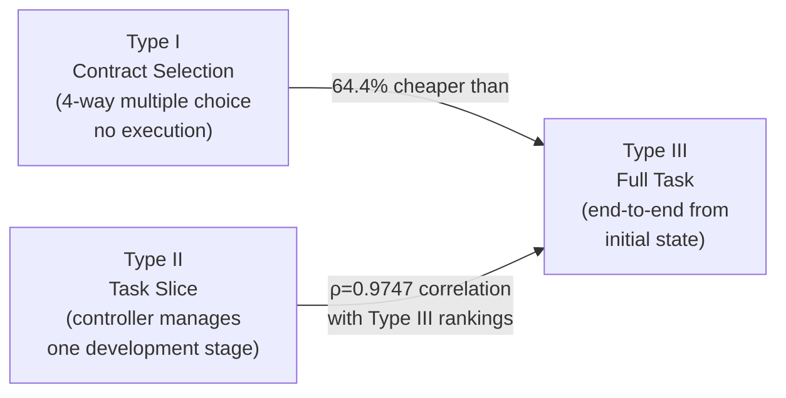
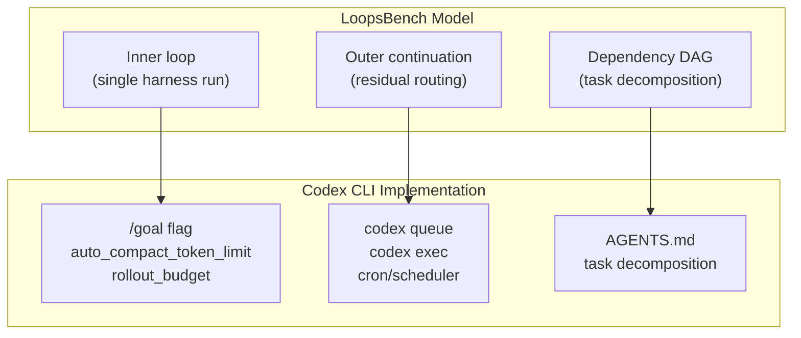

# LoopsBench & LoopArena: The Shift from Harness Engineering to Loop Engineering — What the Numbers Mean for Codex CLI Operators


For most of 2025, the dominant engineering discipline surrounding coding agents was *harness engineering* — the careful configuration of sandbox policies, hook chains, AGENTS.md files, and MCP servers that let a single agent handle a single task reliably. That craft remains important, but the frontier has moved. Two papers published in August 2026 — **LoopsBench** (arXiv:2608.00267)[^1] from Microsoft Research and **LoopArena** (arXiv:2608.28281)[^2] from Alibaba's DreamX team — establish the empirical baseline for the next discipline: *loop engineering*.

Both benchmarks are directly relevant to any team using Codex CLI's goal mode. This article unpacks what they measured, what failed, and what the numbers imply for how you should configure your outer loop today.

---

## What Loop Engineering Actually Is

Harness engineering asks: *given a task and a capable model, can I make the agent execute it correctly?*

Loop engineering asks: *given a capable agent, can I build the outer system that routes work, tracks progress, handles partial failure, and restarts the agent until the full job is done?*

The distinction matters because SWE-bench-style benchmarks evaluate single-task resolution — one issue, one agent run, pass/fail. Real software development is different. A feature branch contains a dozen interdependent tasks. A nightly hardening loop retests the same regressions until the codebase is clean. A multi-day refactor requires the agent to remember what it has already changed and what remains. None of these patterns map cleanly onto a single harness invocation.[^3]

LoopsBench formalises this gap. The benchmark defines a loop as an outer execution controller that manages persistent goals, routes residual work, and maintains continuity across multiple inner harness executions. The paper's central claim is that the performance bottleneck for long-horizon tasks has shifted from *inner loop quality* (model reasoning per turn) to *outer loop architecture* (how work is decomposed, routed, and resumed).[^1]

---

## LoopsBench: Structure and Results

### Benchmark Design

LoopsBench comprises 112 tasks sourced from authentic development contexts, spanning 8 programming languages across 9 domains.[^1] Tasks are not isolated issues; they are **dependency DAGs** over separately testable development units. A task for a game engine might have 12 units — physics core, collision detection, sprite rendering, input handling — each with its own executable test suite, connected by a prerequisite graph derived from the source repository.

The three task families are:
- **PR Sequences** (29 tasks): Multi-commit pull request chains from GitHub projects (Infra/Data, Backend, Frontend)
- **Course Labs** (57 tasks): University programming projects across Game Engines, Systems Programming, and Applications/ML
- **Research Evolutions** (26 tasks): Clusters of related arXiv experiments across Analysis/Verification, Systems/Networking, and Compiler/Database domains

Across all families: **5,300+ development units** with a median dependency depth of 6 layers.[^1]

### The Flow-Aware Runtime

The evaluation runtime is the methodological centrepiece. Tests are not all released at once. Instead, the runtime implements **topologically-gated test release**: a unit's test suite becomes available only when all prerequisite units pass. Completed units remain enforced as *regression obligations* — the agent must not break them while fixing later tasks.

Formally, the ready frontier at step *t* is:

```
Rt = {v ∈ V \ Ct : ∀(u,v) ∈ E, u ∈ Ct}
```

Where *V* is the full unit set, *Ct* is the set of confirmed passing units, and *E* is the prerequisite edge set. This design makes LoopsBench resistant to agents that solve later tasks by removing or disabling earlier ones — a failure mode observed in simpler benchmarks.[^1]

### Evaluation Results

```mermaid
xychart-beta
  title "LoopsBench Resolve Rate by Model (With/Without Outer Continuation)"
  x-axis ["Opus-4.7", "GPT-5.5", "Opus-4.5", "GPT-5.2", "Sonnet-4.5"]
  y-axis "Resolve Rate (%)" 0 --> 30
  bar [16.96, 14.29, 12.50, 9.82, 8.93]
  bar [25.00, 21.43, 17.86, 13.39, 12.50]
```



The best result — **Opus-4.7 with Claude Code and outer continuation at 25.00%** — is the paper's headline number.[^1] Without the outer continuation mechanism, the same model achieves 16.96%. The outer continuation adds roughly 5–8 percentage points across all models, not by improving agent reasoning but simply by *re-invoking the loop* on units the agent left unresolved.

Loop implementation also matters independently of model choice. With GPT-5.4 held constant across all loop implementations:

| Loop Implementation | Resolve Rate (No Outer) | Resolve Rate (With Outer) |
|---|---|---|
| Codex goal mode | 13.39% | 18.75% |
| Claude Code | 12.50% | 17.86% |
| Dynamic workflows | 24.11% | — |
| GitHub Copilot | 10.71% | 15.18% |
| Ralph loop | 7.84% | — |
| OpenHands | 6.25% | 9.82% |

Codex goal mode ranks second among fixed loop implementations, with 32.76 average context-budget rounds per run and 0.34 regression events per run.[^1]

### Where Loops Fail

The failure analysis is instructive. Three failure modes dominate:

1. **Planning fidelity gap**: Agent-generated dependency plans recover only partial prerequisite DAGs. Edge F1 scores range from 0.27 to 0.71 against the source-evidenced ground truth. Agents plan sequential dependencies where the actual codebase has parallel ones, and vice versa.

2. **Sparse test authoring**: Agents write 11–28 unit tests per run against native test suites with hundreds. Without dense oracle coverage, regression detection is unreliable.

3. **Patch bloat**: Agent patches consistently exceed gold-reference length with moderate token overlap (0.62–0.76 Jaccard). This suggests over-editing — modifying files that do not need changing — which creates downstream regression risk.[^1]

---

## LoopArena: Separating Controller from Worker

LoopArena takes a different approach.[^2] Rather than evaluating entire agent-loop stacks, it isolates the **loop controller** — the decision-making layer that observes agent progress and decides what to do next — from the **worker** — the agent that does the actual coding.

The controller receives **Evidence Packets** after each worker segment: structured summaries of what the worker attempted, what tests passed or failed, and what issues remain open. It then issues **Loop Contracts** specifying what the worker should do in the next segment: advance, verify, or stop.

### Three Evaluation Tiers

The benchmark defines three evaluation types that trade cost for coverage:



The critical finding: **Type II evaluation (task slice) maintains near-perfect Spearman rank correlation (ρ=0.9747) with full-task rankings while reducing inference cost by an average of 64.4%.**[^2] This means teams can iterate on loop controller design using cheap slice evaluations and trust that the rankings will hold at full-task scale.

### Controller Results

| Controller Model | Type I Accuracy | Type II Success Rate | Type III Success Rate | Cost/Run |
|---|---|---|---|---|
| GPT-5.5 | 87.78% | 51.85% | **24.69%** | $18.84 |
| Claude Opus 4.8 | 76.67% | 48.15% | 20.99% | $16.82 |
| Qwen3.7-Plus | 72.22% | 48.15% | 23.46% | $6.89 |
| DeepSeek-V4-Flash | 77.78% | 45.68% | 19.75% | $10.24 |
| GLM 5.2 | 74.44% | 37.04% | 16.05% | $4.86 |
| *No Control (baseline)* | — | — | 18.52% | — |
| *Fixed Control (baseline)* | — | — | 18.52% | — |

The fixed-control baseline — which simply restates the original task goal at each step, directly analogous to how a naïve `--goal` pass-through works — matched *no control at all* at 18.52%.[^2] Useful loop control must **adapt to the evolving run**, not merely persist the initial objective.

---

## Mapping to Codex CLI

Loop engineering in LoopsBench terminology maps directly onto Codex CLI's architecture. Here is the correspondence:



### The Inner Loop: Goal Mode Configuration

Codex CLI's goal mode (graduated from experimental in v0.133.0) is the inner-loop mechanism that LoopsBench evaluated as "Codex goal mode".[^3] The relevant configuration levers:

```toml
# ~/.codex/config.toml

[model]
default = "codex-1"

[features]
goal_mode = true

[limits]
rollout_budget = 40          # rounds per goal-mode session
auto_compact_token_limit = 80000  # trigger compaction before context loss
```

The LoopsBench result of 32.76 average rounds per run for Codex goal mode suggests most tasks exhaust somewhere around that budget. Setting `rollout_budget` well below 32 will cause premature stops; well above it wastes compute on sessions that have already stalled.

### The Outer Loop: Residual Continuation

The 5–8 percentage point uplift from outer continuation is cheap to implement. The outer loop re-invokes `codex exec` on unresolved units:

```bash
#!/usr/bin/env bash
# outer-loop.sh — re-invoke codex on residual failing units

MAX_ROUNDS=3
GOAL="Fix all failing tests in this repository. Focus on units with prerequisite tests already passing."

for i in $(seq 1 $MAX_ROUNDS); do
  FAILING=$(cargo test 2>&1 | grep "^FAILED" | wc -l)
  if [ "$FAILING" -eq 0 ]; then
    echo "All tests passing after $i rounds."
    exit 0
  fi
  echo "Round $i: $FAILING failing tests. Invoking Codex..."
  codex exec --approval-policy never --sandbox workspace-write \
    --goal "$GOAL" \
    "Run tests, identify failures, fix them, re-run to confirm."
done

echo "Residual failures remain after $MAX_ROUNDS rounds."
exit 1
```

Note the explicit ceiling. The LoopArena finding that naïve goal-restatement equals no control applies here: the outer loop must read evidence (test output, diff stats) and adapt, not just re-invoke blindly.

### The Controller Pattern: `codex queue` as Evidence-Driven Routing

For more sophisticated loop engineering matching LoopArena's Controller/Worker separation, use `codex queue` (introduced in v0.149.0) to deliver Evidence Packets to a running session:

```bash
# Send structured progress report to a running agent session
codex queue --session "refactor-session-001" \
  "EVIDENCE PACKET: 3 of 8 task units passing. Failing: auth-middleware (import error), rate-limiter (assertion in line 47), cache-layer (timeout). Previously passing: core-router, request-parser, response-formatter. Next action: fix auth-middleware import cycle before attempting rate-limiter."
```

This mirrors LoopArena's Evidence Packet design — the controller synthesises a structured observation and sends it as a Loop Contract. The stateless restatement of the original goal is replaced by a stateful update describing what the worker should do *given current evidence*.

### Planning Fidelity: AGENTS.md as DAG Encoding

LoopsBench's most actionable finding is the planning fidelity gap (Edge F1: 0.27–0.71). Agents trying to infer task dependencies from code struggle because the actual prerequisite structure is latent in the repository history. Encoding it explicitly in `AGENTS.md` closes this gap:

```markdown
## Task Dependency Order

Complete these tasks in dependency order. Do not attempt a task until its prerequisites show green in `cargo test`.

1. `core-types` — no prerequisites
2. `storage-layer` — requires: core-types
3. `api-handlers` — requires: storage-layer, core-types
4. `auth-middleware` — requires: api-handlers
5. `rate-limiter` — requires: auth-middleware, storage-layer

When you complete a task's tests, commit with `chore: complete <task-name>` before proceeding.
```

This directly supplies what LoopsBench's flow-aware runtime computes automatically — the ready frontier — but as explicit operator knowledge that survives compaction.

---

## What the Numbers Tell You

Three concrete takeaways for operators:

**1. The outer continuation is low-cost and high-value.** An additional 5–8 percentage points from simply re-running on residual failures costs almost nothing to implement and requires no model improvement. Most teams are leaving this on the table.

**2. Adaptive control beats goal restatement.** LoopArena's fixed-control baseline (restating the original task objective each turn) performs identically to no control at all (18.52%). If your outer loop just says "keep going" to the agent without feeding back evidence of what has changed, it is not helping.

**3. Full-task success rates remain low.** Even the best configuration (Opus-4.7, 25.00%) resolves only one in four long-horizon tasks. Loop engineering is a genuine engineering challenge, not a configuration checkbox. At current capability levels, autonomous overnight loops need human review gates, not unconditional trust.

---

## Citations

[^1]: Li, H., Fang, Z., Feng, R., Zhao, Y., Liu, J., Gao, P., Ye, H., Lin, D., Lin, Q., Rajmohan, S., & Zhang, D. (2026). *LoopsBench: From Harness Engineering to Loop Engineering in Coding Agent Evaluation*. arXiv:2608.00267. <https://arxiv.org/abs/2608.00267>

[^2]: Wang, Y., Zhang, H., Huang, C., Dai, R., Liu, K., Koniusz, P., & Chu, X. (2026). *LoopArena: Benchmarking Models as Runtime Controllers for Loop Engineering*. arXiv:2608.28281. <https://arxiv.org/abs/2608.28281>

[^3]: Codex CLI v0.133.0 release notes — goal mode graduation from experimental. OpenAI. <https://github.com/openai/codex/releases>

[^4]: Osmani, A. (2026). Loop Engineering: The next frontier after prompt engineering. Referenced via: <https://codex.danielvaughan.com/2026/06/11/loop-engineering-codex-cli-autonomous-agent-loops-automations-subagents-goal-mode/>

[^5]: LoopsBench open-source repository. Microsoft Research. <https://github.com/microsoft/LoopsBench>

[^6]: Codex CLI v0.149.0 release — `codex queue` out-of-band message delivery. OpenAI. <https://github.com/openai/codex/releases/tag/rust-v0.149.0>
