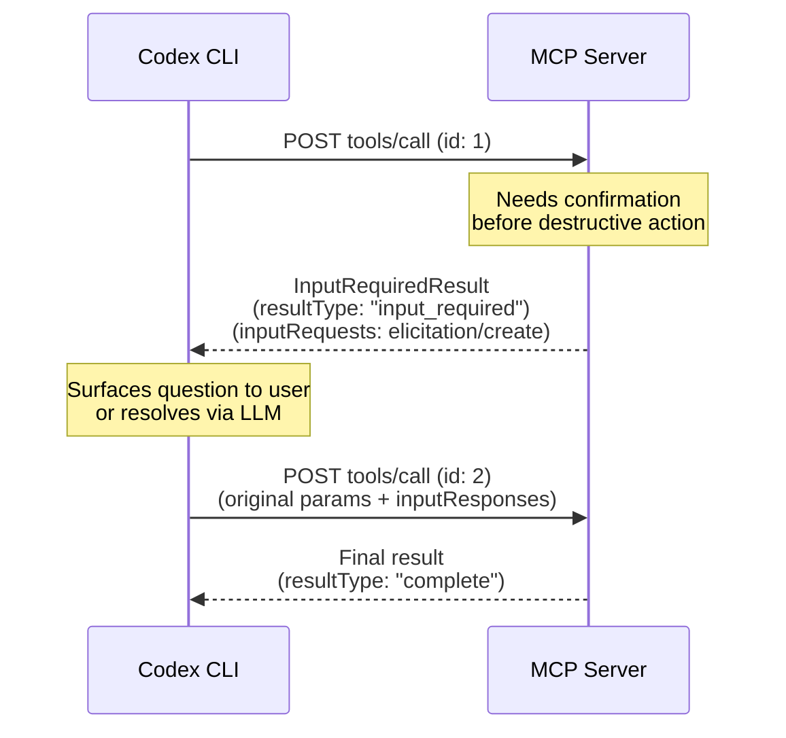
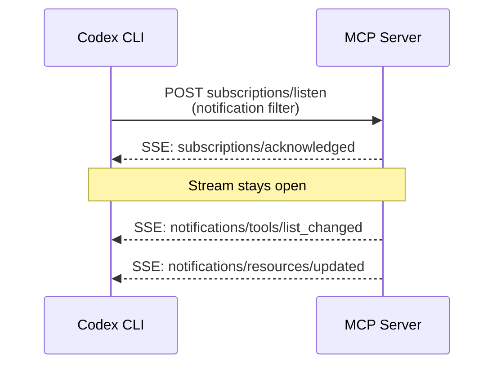

# MCP 2026-07-28: The Stateless Protocol Revolution and What It Means for Your Codex CLI Tool Stack


The Model Context Protocol specification that shipped on 28 July 2026 is the largest single revision MCP has seen since Streamable HTTP replaced the original HTTP+SSE transport in the 2025-03-26 release.[^1] The headline change — moving from a stateful, handshake-driven protocol to a fully stateless, per-request model — reshapes how every Codex CLI MCP integration is initialised, routed, and cached. If you are running MCP servers in production today, you need to understand what changed, what Codex CLI already supports, and how to migrate.

## Why Stateless?

The original MCP lifecycle opened every server connection with an `initialize`/`initialized` handshake that established a protocol-level session identified by an `Mcp-Session-Id` header.[^2] This design made sense when a single developer connected to a single local server. It becomes a deployment liability as soon as you want to put your MCP server behind a load balancer: sticky sessions are required, horizontal scaling does not degrade gracefully, and any node restart forces a reconnect.

The 2026-07-28 revision removes the session layer entirely. Each HTTP POST to the MCP endpoint is now self-describing: client identity, protocol version, and capabilities travel in a `_meta` object on every request, and the `MCP-Protocol-Version` header must match the body's `io.modelcontextprotocol/protocolVersion` field.[^1] There is no handshake, no `Mcp-Session-Id`, and no GET stream endpoint. A plain round-robin load balancer now works out of the box.

## The Five Breaking Changes

Understanding the breaking changes before touching your `config.toml` will save you debugging time.

### 1. Sessions and the Mcp-Session-Id Header Removed

Protocol-level sessions are gone from Streamable HTTP. Any server-side session stores keyed on `Mcp-Session-Id` must be refactored. Where you previously relied on per-connection state, you now pass explicit handles as ordinary tool arguments.[^3]

### 2. Initialize Handshake Removed

The `initialize` / `notifications/initialized` exchange no longer exists.[^3] Servers must expose a `server/discover` endpoint that returns their capabilities; clients extract version information from `_meta` on every request. Codex CLI PR #35724 implements the `server/discover`-based HTTP discovery path with bounded responses, redirect protection, and automatic fallback to the legacy lifecycle when the endpoint returns a non-modern JSON-RPC error.[^4]

### 3. Tasks Moved to a Formal Extension

The Tasks feature (long-running operations with polling) was in the core protocol experimentally. Production experience showed it needed its own extension lifecycle. It now lives under `io.modelcontextprotocol/tasks` and the blocking `tasks/result` method is removed; replace it with `tasks/get` polling and `tasks/update` for client-to-server input.[^3]

### 4. Routing Headers Are Mandatory

Every POST to a Streamable HTTP MCP endpoint must now include `Mcp-Method` (mirroring the JSON-RPC method field) and `Mcp-Name` (mirroring `params.name` or `params.uri` for `tools/call`, `resources/read`, and `prompts/get` calls).[^1] These headers exist so that gateways, WAFs, and rate limiters can route and inspect requests without parsing the JSON body. Servers must validate that header values match their body counterparts; a mismatch returns HTTP 400 with JSON-RPC error code `-32020` (`HeaderMismatch`).

Servers may also annotate tool parameters with `x-mcp-header` in the input schema, causing conforming clients to mirror those parameter values into `Mcp-Param-{Name}` headers for further gateway routing — useful for tenant-aware or region-aware infrastructure.[^1]

### 5. resultType Field Required

Tool results must include an explicit `resultType` field: `"complete"` for ordinary results and `"input_required"` for Multi Round-Trip Requests (MRTR). Legacy server results without the field are treated as complete for backward compatibility.[^3]

## Multi Round-Trip Requests: Tools That Ask Questions

MRTR (SEP-2322) is the headline new capability.[^5] Before 2026-07-28, tools that needed user confirmation or missing parameters mid-execution either blocked on a long-lived SSE stream or required an entirely separate channel. MRTR replaces that pattern with a structured retry loop:



No long-lived stream is required. The server returns an `InputRequiredResult` containing `inputRequests` and an opaque `requestState` blob; the client satisfies the input and resubmits with `inputResponses` and the echoed `requestState`. This pattern enables human-in-the-loop confirmation, LLM-assisted parameter resolution, and roots discovery — without holding open a persistent connection.[^5]

For Codex CLI operators, MRTR means your MCP tools can now pause and ask for user confirmation before, say, deleting a database record or deploying to production, without requiring a long-lived stdio server to maintain connection state.

## Cacheable List Responses

`tools/list`, `resources/list`, `prompts/list`, and `resources/read` now include `ttlMs` (a freshness hint in milliseconds) and `cacheScope` (`"public"` or `"private"`) in their responses.[^1] The model mirrors HTTP `Cache-Control`: public caches can be shared across connections, private ones are per-client.

For Codex CLI, this translates directly to startup performance. A server advertising `ttlMs: 300000` (five minutes) allows the CLI to skip `tools/list` on subsequent connections within that window — eliminating the tool-discovery round-trip that currently dominates first-turn latency for large tool catalogues.

## Subscriptions Replace the GET Stream

Server-initiated notifications (list changes, resource updates) previously piggybacked on the now-removed GET SSE stream. In 2026-07-28, clients that want change notifications send a `subscriptions/listen` POST; the response is a long-lived SSE stream that stays open and delivers only the notification types the client opted into.[^1]



Request-scoped notifications (`notifications/progress`, `notifications/message`) continue to flow on the response stream of the originating request — they do not appear on the listen stream.

## Codex CLI Support: What's Available Now

Codex CLI PR #35724 added opt-in 2026-07-28 support.[^4] To enable it for a specific server, add `protocol_version = "2026-07-28"` to that server's `config.toml` stanza:

```toml
# .codex/config.toml

[mcp_servers.my-api-server]
type = "http"
url = "https://api.example.com/mcp"
protocol_version = "2026-07-28"

[mcp_servers.local-db-tools]
command = "npx"
args = ["-y", "@my-org/db-mcp-server"]
protocol_version = "2026-07-28"
```

For stdio servers, the CLI passes the environment variable `CODEX_MCP_PROTOCOL_VERSION=2026-07-28` to the child process; the server must opt in explicitly.[^4]

The fallback behaviour is automatic. When Codex CLI sends a modern POST and the server returns a 400 without a recognised modern JSON-RPC error body, the CLI detects a legacy endpoint and switches to the `initialize`-based lifecycle for all subsequent requests to that server. Reusable MCP clients reconnect automatically when their selected protocol mode changes.[^4]

You can verify which protocol version a server negotiated by running `codex doctor` — the diagnostic command reports each server's discovered protocol version alongside its tool count and connectivity status.

## What Is Deprecated and When

The specification's feature lifecycle gives implementers a minimum 12-month window before a deprecated feature is eligible for removal.[^2]

| Feature | Status | Eligible for removal |
|---|---|---|
| HTTP+SSE transport (2024-11-05) | Deprecated since 2025-03-26 | Already eligible |
| `Mcp-Session-Id` / GET stream | Removed in 2026-07-28 | N/A — already gone |
| Roots feature | Deprecated | July 2027 earliest |
| Sampling feature | Deprecated | July 2027 earliest |
| Logging feature | Deprecated | July 2027 earliest |
| Dynamic Client Registration (DCR) | Deprecated | July 2027 earliest |

If your MCP servers use the `roots` or `sampling` callbacks, start planning migration now. The C# SDK v2 already marks these APIs `[Obsolete]`; the TypeScript and Python SDKs follow suit.[^6]

## SDK Migration Snapshot

The SDK changes are substantial. If you maintain custom MCP servers consumed by Codex CLI, here is the minimum you need to know:

**Python (v2):** `FastMCP` is renamed `MCPServer`. Pin dependencies with `mcp>=1.27,<2` for library consumers. Decorator API is preserved.[^6]

**TypeScript (v2):** The monolithic `@modelcontextprotocol/sdk` is split into `@modelcontextprotocol/server` and `@modelcontextprotocol/client`. The package requires Node.js 20+ and is ESM-only. Tool schemas now use Standard Schema (compatible with Zod v4, Valibot, and ArkType). The `.tool()` method becomes `registerTool`. A codemod is available:[^6]

```bash
npx @modelcontextprotocol/codemod@beta v1-to-v2 .
```

**Go (v1.7.0-pre.1):** API compatibility is maintained; stateless mode requires explicit opt-in via `StreamableHTTPOptions.Stateless = true`.[^6]

The TypeScript server entry point changes from `server.connect(new StdioServerTransport())` to the factory pattern `serveStdio(() => buildServer())`, and `createMcpHandler(factory)` replaces `StreamableHTTPServerTransport` for HTTP deployments. Per-request client identity replaces session-scoped `getClientCapabilities()` via `ctx.mcpReq.envelope`.

## Practical Migration Checklist

For each MCP server in your `~/.codex/config.toml` and `.codex/config.toml`:

1. **Check the server's SDK version.** If it is using `mcp` Python < 1.27 or TypeScript SDK v1, it speaks legacy only. Do not set `protocol_version = "2026-07-28"` until the server is updated.
2. **Remove session-store dependencies.** Any state tied to `Mcp-Session-Id` must become explicit tool arguments or external storage.
3. **Implement `server/discover`.** This endpoint is mandatory for 2026-07-28-compliant servers; Codex CLI uses it during HTTP discovery.
4. **Add `ttlMs` and `cacheScope` to list endpoints.** Even conservative values (e.g., `ttlMs: 30000, cacheScope: "private"`) yield measurable first-turn latency savings.
5. **Run `codex doctor` after updating.** The diagnostic output confirms the negotiated protocol version for each server and flags any configuration errors.
6. **Test MRTR flows.** If your tools use mid-execution input requests, verify that Codex CLI correctly surfaces the `InputRequiredResult` to the user and retries with `inputResponses`.

Servers that have not been updated continue to work through the automatic legacy fallback; the `protocol_version` key is strictly opt-in. There is no urgency to upgrade every server immediately, but teams building new MCP integrations should target 2026-07-28 from the start.

## Citations

[^1]: Model Context Protocol. "Streamable HTTP — 2026-07-28 Specification." https://modelcontextprotocol.io/specification/2026-07-28/basic/transports/streamable-http

[^2]: Model Context Protocol Blog. "The 2026-07-28 Specification." https://blog.modelcontextprotocol.io/posts/2026-07-28/

[^3]: Stacktree. "MCP 2026-07-28 spec: every breaking change, with fixes." https://stacktr.ee/blog/mcp-2026-spec-changes

[^4]: GitHub. "Add MCP 2026-07-28 discovery support — PR #35724 · openai/codex." https://github.com/openai/codex/pull/35724

[^5]: Agentic AI Foundation. "Non-blocking Human-in-the-Loop Agents with MCP MRTR." https://aaif.io/blog/non-blocking-human-in-the-loop-agents-re-engineering-agentic-runloops-and-state-machines-with-mr

[^6]: Model Context Protocol Blog. "Beta SDKs for the 2026-07-28 MCP Spec Release Candidate Are Here." https://blog.modelcontextprotocol.io/posts/sdk-betas-2026-07-28/
