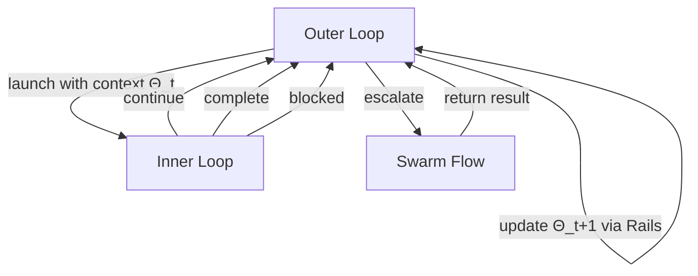
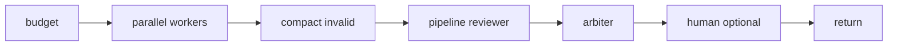

# openJiuwen: Rail-Based Harness Composition, Swarm Flow Operators, and What 82.6% SWE-bench Means for Codex CLI Operators


On 28 August 2026, the openJiuwen Team at Huawei Technologies published arXiv:2608.27969, introducing an open-source coding agent harness that reaches **82.6% on SWE-bench Verified** and **87.19% on Terminal-Bench 2.1** — outperforming prior published baselines by 3.4 and 3.39 percentage points respectively.[^1] The numbers are notable, but the architecture is more instructive. openJiuwen names and formalises two problems that every Codex CLI operator is already wrestling with implicitly: *structural composability* (attaching capabilities without rewriting the core loop) and *runtime adaptivity* (changing execution strategy as evidence accumulates during a task). Neither is new to practitioners; openJiuwen makes both first-class design dimensions, and the resulting rail and operator vocabulary maps cleanly onto primitives Codex CLI already exposes.

## The Static Harness Problem

The paper's opening framing is blunt: existing harnesses are static. Once launched, they select a strategy and execute it. Diagnostic feedback from a failing test, a lint error surfaced ten tool calls into a session, or a subagent deadlock — none of these events cause the harness topology to change. The agent replans inside a fixed execution envelope.

The authors identify two root causes.[^1]

**Structural composability failures.** Capabilities like security scanning, memory retrieval, and semantic feedback are typically baked into the control flow as monolithic blocks. Adding or removing one requires modifying the core loop, not attaching an independent module. Teams accumulate capabilities by forking harness code, which diverges the configuration surface.

**Runtime adaptivity failures.** The harness fixes its context strategy (window size, compression threshold, model) at launch. As a task evolves — particularly across the 15-minute to 4-hour horizon where the hardest SWE-bench instances live — the strategy should evolve with it, but conventional harnesses lack the machinery to do so safely.

openJiuwen addresses both problems with an Inner/Outer Loop substrate, a Rail mechanism for capability attachment, and a Swarm Flow operator algebra for multi-agent coordination.

## Inner Loop / Outer Loop: The Execution Substrate

The Inner Loop handles bounded ReAct-style interaction between model and tools, with lifecycle callbacks at entry and exit of each tool use.[^1] It is intentionally minimal: one model, one tool inventory, one context window. Its job is faithful execution of a single reasoning step, not strategy.

The Outer Loop manages task-level continuation. It receives the Inner Loop's terminal state — `{continue, complete, blocked}` — and decides whether to restart the Inner Loop with a modified context, escalate to a parent agent, or declare the task done.[^1] Goal Mode is the mechanism that carries explicit task objectives across Inner Loop restarts, preventing the agent from treating each restart as a fresh session.



This separation is not novel — Codex CLI has operated on a structurally similar model since Goal Mode shipped — but openJiuwen makes the boundary explicit and formalises the state transition semantics, which is useful when reasoning about where a breakdown in a long-horizon task actually occurred.

## Rails: Composable Capability Attachment

The Rail mechanism is the paper's most transferable contribution. A Rail ρ consists of three components:[^1]

- **Lifecycle hooks** ℋ_ρ — the execution boundaries at which the Rail fires
- **Handler function** f_ρ — the capability logic (a script, an MCP tool, an embedding retrieval call)
- **Priority** p_ρ — determines invocation order when multiple Rails declare interest in the same boundary

Rails attach to the Inner Loop's lifecycle callbacks without modifying the loop itself. Security scanning, memory retrieval, LSP diagnostic injection, and self-reflection all arrive as Rails rather than baked-in logic. The core loop is topology-agnostic; the capability stack is assembled from independently maintained modules.

Codex CLI operators will recognise this pattern immediately. The hooks system (`hooks.json` / `config.toml`) maps directly:

```toml
# Codex CLI: attaching a capability to the PostToolUse boundary
[[hooks.PostToolUse]]
matcher = ".*"

[[hooks.PostToolUse.hooks]]
type  = "command"
command = "python3 ~/.codex/hooks/lsp-feedback.py"
timeout = 10
async   = false

[[hooks.PostToolUse.hooks]]
type    = "command"
command = "python3 ~/.codex/hooks/security-scan.py"
timeout = 15
async   = true
```

Multiple hooks on the same event type fire in declaration order — analogous to Rail priority ordering. The difference is that Rails carry a formal priority field and can be suspended per-session based on context budget constraints, whereas Codex CLI hook ordering is currently declaration-order only with no budget-aware gating.

The practical implication: if you want Rail-like composability in Codex CLI today, structure each governance capability as a separate hook file and compose them through hook declarations rather than a monolithic hook script. When openJiuwen's source ships with community-maintained Rails for common patterns, those will be portable to Codex CLI's hook format with minor adaptation.

## Swarm Flow: An Operator Algebra for Multi-Agent Coordination

Swarm Flow extends the Inner/Outer Loop model to multi-agent graphs using seven composable operators:[^1]

| Operator | Semantics |
|---|---|
| `budget()` | Exposes remaining context and token budget to the controller |
| `parallel()` | Dispatches concurrent Inner Loop instances |
| `compact()` | Filters invalid or low-confidence results |
| `pipeline()` | Streams intermediate results through sequential processors |
| `agent_session()` | Maintains stateful sessions across flow stages |
| `human()` | Suspends for optional human review |
| `return` | Terminates and exposes final result |

A representative pattern from the paper sends a task to parallel workers, runs candidates through a reviewer pipeline, and uses an arbiter for aggregation:



Codex CLI operators working with the `codex agents` dashboard and `codex queue` will find direct parallels. The `parallel()` operator corresponds to launching multiple named sessions via `codex --session <name>`; `budget()` maps to the token budget visibility added in Goal Mode; `human()` maps to `approval_policy = "ask"` with the Guardian interrupt hook; `compact()` approximates the PostToolUse hook returning exit code 2 to reject a tool result. The `pipeline()` and `agent_session()` operators have no direct one-to-one equivalent in current Codex CLI, though they can be approximated using `codex queue --thread <uuid>` to send structured messages between sessions.

## Runtime Adaptivity: The Four Mechanisms

The paper formalises four mechanisms that change the runtime configuration Θ_t = (κ_t, Φ_t, ι_t) — context strategy, tool inventory, model — subject to three constraints: context budget, diagnostic feedback availability, and semantic acceptance limits.[^1]

**Progressive context compression.** Content passes through three stages: full text → summary → compact handle. Structure-aware reduction collapses repeated patterns (identical file content across tool calls, repeated stack traces); offloading externalises large artifacts to disk, replacing them with retrieval handles in context.

**Goal Mode continuation.** The `{continue, complete, blocked}` terminal state is evaluated by a composable evaluator chain. The goal persists across Inner Loop restarts; the Outer Loop adjusts κ_t (which files are in context, which tools are active) for the next attempt based on the terminal state reason.

**LSP-driven passive feedback.** After each code-writing tool use, Language Server Protocol diagnostics are queried, ranked by severity, deduplicated, and bounded by token budget before injection into the next Inner Loop context. This gives the model mechanically derived semantic evidence without requiring it to re-read files.[^1] Codex CLI operators can approximate this with a PostToolUse hook that runs a language server check and emits structured output as a `systemMessage`.

**Self-reflection.** Completed trajectories are mined for reusable patterns and stored in a retrieval index, surfacing relevant past experience at the start of new tasks. This is analogous to Codex CLI's Skills system — predefined patterns loaded at session start — but generated from execution history rather than authored by hand.

## Benchmark Results in Context

openJiuwen's 82.6% on SWE-bench Verified (500 instances) and 87.19% on Terminal-Bench 2.1 represent the strongest published results at time of submission.[^1] Performance disaggregated by task duration reveals the hardening challenge:

| Duration band | Resolution rate |
|---|---|
| < 15 minutes | 91.75% |
| 15 min – 1 hour | 81.23% |
| 1 – 4 hours | 52.38% |

The 52.38% rate on multi-hour tasks is the honest number — this is where context management, goal mode continuation, and runtime adaptivity matter most, and where the 40-point gap to sub-15-minute tasks lives. The paper explicitly avoids cherry-picking the easy band.[^1]

For comparison, the prior published SWE-bench Verified best at submission time was 79.2% (live-SWE-agent with Opus 4.5). Codex CLI with o3 sits between these numbers depending on session configuration; the paper lists Codex among its baseline comparisons, noting that its advantage comes from the Rail and Swarm Flow composability layer rather than a different model.[^2]

## What This Means for Codex CLI Operators

Three actionable takeaways:

**1. Structure your hook stack as independent Rails.** Each governance capability — security scanning, linting, memory retrieval, LSP feedback — should be a separate hook handler rather than a monolithic script. This gives you the same composability benefit openJiuwen achieves with Rails, and makes it easier to enable/disable capabilities per-project via project-level `config.toml` overrides.

**2. Budget your Outer Loop explicitly.** openJiuwen's 52.38% performance on 1–4 hour tasks reflects how much harness design matters at scale. Use Goal Mode with explicit `--goal` flags on long-horizon tasks; configure `auto_compact_token_limit` conservatively (60–70% rather than the default 80%) to leave room for LSP feedback injection without triggering cascading compaction.

**3. Treat self-reflection as a Skills authoring pipeline.** openJiuwen mines completed trajectories automatically; Codex CLI requires manual skill authoring. Bridge this gap by running a PostToolUse hook on successful task completion that appends a structured summary to a project-local skills file — a lightweight substitute for automated trajectory mining.

openJiuwen's source is available at `github.com/openJiuwen-ai/jiuwenswarm`.[^3] The Rail configuration schema will be of particular interest to teams already maintaining complex hook stacks in Codex CLI.

## Citations

[^1]: Yu, T. et al. (openJiuwen Team). "openJiuwen: Beyond Static Harnesses for Long-Horizon Coding Agents." arXiv:2608.27969, 28 August 2026. https://arxiv.org/abs/2608.27969

[^2]: SWE-bench Verified leaderboard, Princeton NLP Group. https://www.swebench.com — consulted 31 August 2026.

[^3]: openJiuwen-ai/jiuwenswarm repository. https://github.com/openJiuwen-ai/jiuwenswarm — consulted 31 August 2026.

[^4]: Codex CLI hooks documentation. "Hooks | ChatGPT Learn." https://learn.chatgpt.com/docs/hooks — consulted 31 August 2026.

[^5]: Terminal-Bench 2.1 leaderboard. https://terminal-bench.com — ⚠️ exact URL and current leaderboard position unverified at time of writing; cite arxiv:2608.27969 Table 2 as primary source.
