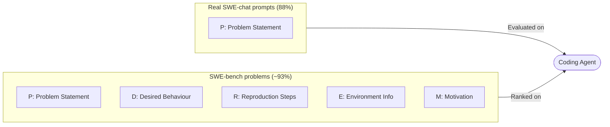
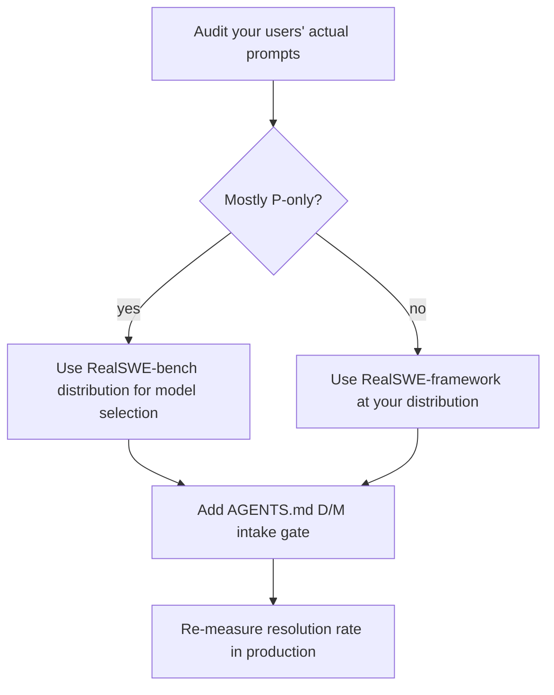

# RealSWE: The 6.4-Point Reality Penalty — What the Benchmark-Prompt Gap Means for Codex CLI Users


Every time you cite a SWE-bench resolution rate to justify a model choice, you are quoting a number collected from inputs that bear almost no resemblance to what you or your colleagues actually type. A new benchmark — **RealSWE** (Kim, Gwon, Kim, Shim & Lee, arXiv:2608.27831, August 2026)[^1] — quantifies the cost of that mismatch: a mean **6.4 percentage-point drop** in resolution rate when realistic user prompts replace the structured, information-rich issues that benchmarks use. At current frontier capability levels that represents roughly one in eight resolutions lost. The fix is neither a better model nor a cleverer harness — it is two sentences most users are not writing.

## The Information Taxonomy

The central contribution of RealSWE is a decomposition of what information a coding-agent request can contain. The authors examine real prompts from **SWE-chat** (a dataset of actual user-submitted software engineering requests) against SWE-bench Verified and Pro issues, defining six information categories.[^1]

**For bug-fix requests:**

| Category | Code | Real prompts | Benchmarks |
|---|---|---|---|
| Problem Statement (observed failure) | P | 99.8% | ~100% |
| Desired Behaviour | D | 5.4% | 73.5% |
| Reproduction Steps | R | 8.9% | 66.9% |
| Environment Information | E | 3.3% | 25.9% |
| Additional Information | A | variable | variable |

**For feature requests**, the second information type that matters is Motivation [M], present in 8.9% of real prompts but 96.1% of benchmark tasks.[^1]

The upshot: **88% of real user prompts contain only a problem statement**, with at most a fragment of additional context. Only **7% of benchmark problems** match that pattern.[^1]



## What Actually Drives Performance

Not all missing information is equally costly. RealSWE isolates contributions by removing one category at a time.[^1]

**Removing Desired Behaviour [D]** from bug-fix requests reduces resolution rates by **7.1–8.9 percentage points** across models. Desired Behaviour is not "what went wrong" — that is [P]. It is "what correct behaviour looks like": the expected output, the invariant that must hold, the state the system should reach. Real users rarely write it because they consider it obvious. Agents do not find it obvious.

**Removing Motivation [M]** from feature requests costs a mean **3.4 percentage points**. Motivation constrains solution space and reduces the probability of the agent implementing something technically correct but practically useless.

**Reproduction Steps [R] and Environment Information [E] have negligible impact.** Removing either produces no statistically significant change.[^1] This is counter-intuitive — developers often spend more effort on reproduction steps than on describing correct behaviour — and it has direct consequences for how you structure requests.

## Model Performance Under Realistic Inputs

The authors evaluated seven contemporary large language models using RealSWE-bench.[^1]

| Model | Benchmark score | RealSWE score | Drop |
|---|---|---|---|
| DeepSeek V4 Pro | 53.9% | 45.9% | −8.0 pp |
| DeepSeek V4 Flash | 49.7% | 41.6% | −8.0 pp |
| Qwen3.7 Plus | 50.1% | 43.5% | −6.6 pp |
| Claude Haiku 4.5 | 42.1% | 36.7% | −5.4 pp |
| MiMo V2.5 Pro | 49.1% | 44.0% | −5.1 pp |
| **Mean** | — | — | **−6.4 pp** |

The penalty is proportionally consistent across models — roughly 13.6% relative — suggesting the information gap is a harness-level problem, not a model-specific capability issue. Crucially, **realistic inputs change model rankings**: a model appearing superior at 50.1% versus 49.1% on conventional benchmarks may reverse at 43.5% versus 44.0% on realistic inputs.[^1] Procurement decisions made on benchmark rankings alone can point at the wrong model.

Linguistic style (formality, sentence type) contributes only minor effects of **−3.9 to +0.7 pp**, direction depending on the model.[^1] Worrying about whether your prompt sounds like a structured GitHub issue is largely wasted effort. Worrying about Desired Behaviour and Motivation is not.

## Mapping to Codex CLI

### Include [D] and [M]; Skip [R] and [E]

```bash
# Less effective — typical real-user prompt
codex "The payment service throws a NullPointerException when processing refunds"

# More effective — adds Desired Behaviour [D]
codex "The payment service throws a NullPointerException when processing refunds.
Correct behaviour: refunds complete successfully and a RefundProcessed event is emitted.
The user's account balance should reflect the refund within the same transaction."
```

For feature requests, add Motivation before the feature description:

```bash
# Less effective
codex "Add a --dry-run flag to the export command"

# More effective — adds Motivation [M]
codex "Add a --dry-run flag to the export command so that operators can validate
configuration changes in staging without writing output files.
The flag should produce identical log output to a real run, prefixed with [DRY RUN]."
```

Reproduction steps and environment information do not earn their context budget.

### AGENTS.md Intake Gate

An AGENTS.md directive can instruct the agent to elicit [D] or [M] before writing any code, converting the RealSWE finding into a session-start gate:

```markdown
## Request Intake Policy

Before implementing any bug fix, confirm you have:
- [P] A description of the observed failure
- [D] A description of correct behaviour after the fix

Before implementing any feature request, confirm you have:
- [P] A description of the requested feature
- [M] The motivation: why this feature is needed and what it enables

If either [D] or [M] is absent, ask one clarifying question before writing code.
Do NOT ask for reproduction steps or environment information unless you cannot
reproduce the bug without them.
```

The agent asks one targeted question — "What should correct behaviour look like?" — rather than a generic request for more information.

### Goal Mode and Desired Behaviour Declaration

Codex CLI's `--goal` flag sets a persistent task objective that survives compaction[^3] and subagent delegation. Embedding the Desired Behaviour declaration inside the goal ensures it remains visible throughout a long session even as the initial prompt rolls out of the active context window:

```bash
codex --goal "Fix the NullPointerException in PaymentService.processRefund().
Goal state: refunds complete without exception, RefundProcessed event emitted,
account balance updated atomically." \
  --approval-policy ask
```

The goal field is re-injected at compaction boundaries and surfaced to subagents — precisely the surfaces where information loss is highest in long-horizon sessions.

### Startup Prompt Drafting (v0.148.0)

Codex CLI v0.148.0 introduced startup prompt drafting: users begin composing a prompt while the TUI initialises.[^4] A `startup_prompt_template` in `config.toml` can pre-populate the input field with a skeleton that elicits [D] or [M] without requiring any instruction:

```toml
[tui]
startup_prompt_template = "Task: \nDesired outcome: \n"
```

Structured templates produce consistently higher completion rates than open-ended fields.

## Benchmark Calibration

RealSWE-bench[^1] is available open-source alongside a configurable RealSWE-framework for evaluation at arbitrary information composition distributions. Teams selecting models for internal use should benchmark at a prompt distribution that reflects their actual users rather than the SWE-bench default.

RealSWE-bench task descriptions average 1,417 characters — matching the 1,427-character real-user average from SWE-chat, substantially shorter than the 1,672–2,776 characters typical of conventional benchmark problems.[^1] If your users submit long, structured requests, your gap may be smaller than 6.4 pp. If your team initiates agent tasks via Slack threads or one-line ticket descriptions, your gap is likely larger.

The ranking instability result is the most consequential finding for practitioners: a model selection decision made on conventional benchmarks and one made on RealSWE can disagree. Given that the performance gap almost disappears when [D] and [M] are present,[^1] the most cost-effective mitigation is a prompting discipline enforced at the AGENTS.md level rather than a model upgrade.



## Citations

[^1]: Kim G., Gwon H., Kim J., Shim K. & Lee S. (2026). *RealSWE: A Compositional Evaluation of Coding Agents under Realistic User Requests*. arXiv:2608.27831. https://arxiv.org/abs/2608.27831

[^2]: Tan Y., Meng J., Lei F., Wang M., He S., Zhao J. & Liu K. (2026). *SWE-Touch: Benchmarking Coding Agents When Users Touch the Code*. arXiv:2608.02499. https://arxiv.org/abs/2608.02499

[^3]: OpenAI. (2026). *Codex CLI v0.150.0 Release Notes — @task mentions, persistent goals*. https://github.com/openai/codex/releases/tag/rust-v0.150.0

[^4]: OpenAI. (2026). *Codex CLI v0.148.0 Release Notes — startup prompt drafting, session fork, async hooks*. https://github.com/openai/codex/releases/tag/rust-v0.148.0

[^5]: OpenAI. (2026). *RealSWE-bench — open benchmark distribution*. https://github.com/openai/codex/releases/tag/rust-v0.151.0
