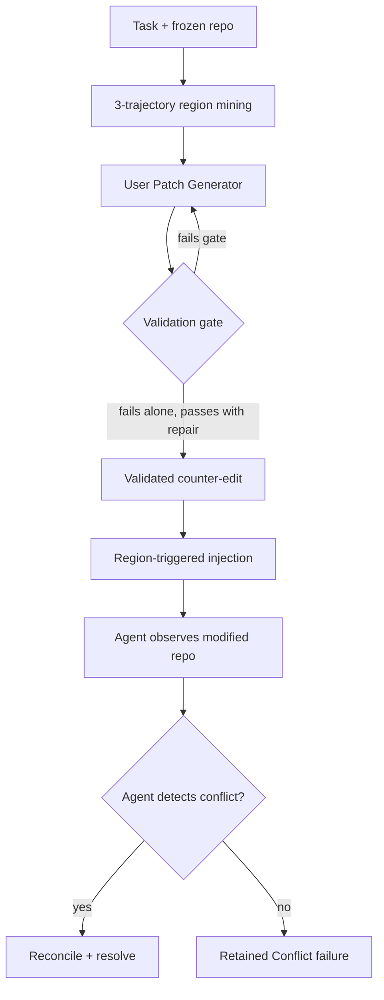
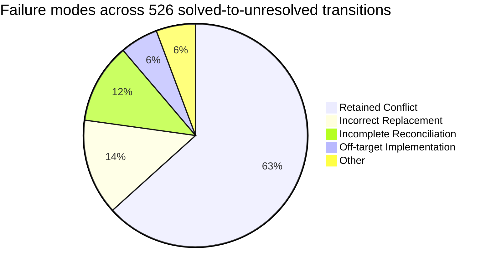

# SWE-Touch: The 7.7-Point Tax of Workspace Blindness When Users Edit Code Mid-Task


Every SWE-bench leaderboard score you have ever read was collected in a sterile environment: one agent, one repository, no interruptions. Real engineering is not like that. A colleague fixes a merge conflict while your agent is mid-repair. You notice the agent misunderstood a type constraint and save a quick correction. The product manager drops a hot-fix into the branch. The agent, reasoning over its cached mental model of the codebase, simply does not notice.

A paper from the Chinese Academy of Sciences Institute of Automation — **SWE-Touch** (Tan, Meng, Lei, Wang, He, Zhao & Liu, arXiv:2608.02499, August 2026)[^1] — makes this cost precise: a mean **7.7 percentage-point drop** in resolution rate across nine frontier models when users inject plausible, conflict-inducing edits during task execution. Nearly two-thirds of failures happen not because the agent cannot solve the problem, but because it never notices the workspace changed.

## What SWE-Touch Measures

Standard SWE-bench Verified evaluates whether an agent can resolve an issue given a frozen repository. SWE-Touch adds a single realistic perturbation: while the agent is working, a simulated user edits code in the region the agent is about to modify — an edit that is syntactically valid and plausible, but semantically conflicts with completing the task.[^1]

This is not a noise injection. The framework goes to considerable lengths to produce *validated* counter-edits:

1. **Region mining**: Three model trajectories (GPT 5.5, GLM 5.1, MiniMax M2.7) identify which lines of code every task-repair touches. The union of these regions is the injection target — the code that actually matters.
2. **User Patch Generator**: A separate model proposes edits restricted to the mined region. Each edit is syntactically valid and local (mean patch: 7.0 lines across 1.04 files[^1]).
3. **Validation gate**: An edit is only accepted if it (a) alone fails the fail-to-pass tests, but (b) when composed with the reference repair, passes. This guarantees the edit is recoverable — a patient agent that detects and reconciles it can still resolve the task.
4. **Region-triggered injection**: The edit fires when the agent accesses overlapping code, accompanied by a contextual user message. The default is K=3 interventions per task.[^1]



## Results Across Nine Models

The benchmark ran on SWE-bench Verified (200 tasks), with additional experiments on longer-horizon sets (SWE-Bench Pro and DeepSWE, 25 tasks each, two runs).[^1]

| Model | Vanilla | Counter-Edit | Δ |
|---|---|---|---|
| Claude Opus 4.8 | 85.2% | 83.3% | −1.8 pp |
| GPT 5.5 | 80.5% | 79.2% | −1.3 pp |
| GLM 5.1 | 72.7% | 68.3% | −4.3 pp |
| Qwen 3.7 Max | 75.2% | 70.3% | −4.8 pp |
| Kimi K2.6 | 70.3% | 64.3% | −6.0 pp |
| MiniMax M2.5 | 75.7% | 66.2% | −9.5 pp |
| DeepSeek V4 Pro | 74.8% | 63.8% | −11.0 pp |
| MiniMax M2.7 | 76.5% | 62.7% | −13.8 pp |
| Qwen3-Coder-480B | 57.2% | 40.7% | −16.5 pp |
| **Mean** | | | **−7.7 pp** |

The top two models (Opus 4.8, GPT 5.5) lose fewer than two percentage points — suggesting that frontier reasoning capacity does confer some workspace awareness. Models in the 70–77% autonomous range show much higher variance, with losses between 5 and 14 points. The 40-point autonomous score of Qwen3-Coder-480B drops a further 16.5 points under counter-edit pressure, suggesting that weaker models have almost no residual capacity to reason about external state changes.

Longer-horizon tasks amplify the effect in absolute terms but modestly: SWE-Bench Pro loses a mean 4.9 pp, DeepSWE 3.4 pp[^1] — both on smaller sample sizes so these figures carry wider confidence intervals.

A critical control: the **Co-Edit** condition applies an equivalent external modification that does *not* conflict with the task. Mean degradation: −0.1 pp.[^1] The workspace blindness effect is entirely attributable to semantic conflict, not to the mere presence of external edits.

## Failure Mode Taxonomy

The authors audited 526 solved-to-unresolved transitions to categorise how agents fail.[^1]



**Retained Conflict (63.3%)**: The agent's final patch contains the user's conflicting semantics. The agent never overwrote or reconciled the edit; it simply incorporated it into its final state. Retention rate correlates with edit-revision behaviour at Spearman ρ = 0.80[^1] — models that revise their own code more readily are more likely to overwrite user edits rather than reconcile them, which is a subtly different failure from pure obliviousness.

**Incorrect Replacement (13.9%)**: The agent detects the conflict and removes the edit, but substitutes an incorrect implementation. This is preferable to retained conflict (the intent was right) but the execution failed.

**Incomplete Reconciliation (11.6%)**: The agent makes a local correction at the conflict site but fails to propagate fixes across connected components, files, or invariants. A type narrowed in one module propagates a silent mismatch into three callers.

## What This Means for Codex CLI

Codex CLI was not part of the SWE-Touch evaluation (which used a Mini-SWE-Agent shell interface), but the findings map directly onto any harness that allows users to interact with the working directory during an agent turn. Codex CLI offers several relevant surfaces.

### The Hook Gap

As of v0.151.0, Codex CLI has twelve named hook events[^2] — none of which fire on external file modification. There is no `on_file_modified` equivalent. A user saving a file while an agent is thinking is, from the hook system's perspective, invisible. This is the primary gap SWE-Touch exposes.

### PreToolUse as a Workspace Drift Detector

A practical mitigation is to run `git diff --stat HEAD` (or `git status --short`) inside a `PreToolUse` hook before any file write, and compare against a baseline snapshot captured at session start. If the diff includes files the agent did not touch, the hook can log a warning or — with exit code 2 — pause the turn for human review.[^2]

```bash
#!/usr/bin/env bash
# hooks/check-workspace-drift.sh
# Fires as PreToolUse; tool name passed as $CODEX_TOOL_NAME
BASELINE="${CODEX_SESSION_DIR:-/tmp}/workspace-baseline.txt"

if [[ ! -f "$BASELINE" ]]; then
  git diff --name-only HEAD > "$BASELINE"
  exit 0
fi

CURRENT=$(git diff --name-only HEAD)
NEW_CHANGES=$(comm -13 <(sort "$BASELINE") <(echo "$CURRENT" | sort))

if [[ -n "$NEW_CHANGES" ]]; then
  echo "⚠️  External workspace modification detected: $NEW_CHANGES" >&2
  # Exit 2 requests human approval before proceeding
  exit 2
fi
```

This is a deterministic, zero-model-token guard. It catches the workspace drift that SWE-Touch identifies as the root cause of the 63.3% retained-conflict failure mode.

### AGENTS.md Re-Inspection Directive

For non-interactive sessions (CI, headless `codex exec`), a workspace-drift check cannot pause for user input. The appropriate mitigation is a re-inspection directive in `AGENTS.md`:

```markdown
## Workspace Re-Inspection Policy

Before writing any file that you have already read this turn, re-read it from disk.
Do not assume the version in your context reflects the current state of the repository.
After any tool call that modifies a file, verify the result matches your intent before
proceeding to the next step.
```

This is a textual approximation of the reconciliation behaviour that distinguishes the −1.8 pp models from the −16.5 pp models. It cannot replace structural awareness but it raises the prior that the agent will re-check before assuming its mental model is current.

### approval_policy = ask for Collaborative Sessions

In interactive sessions where a user is actively co-editing the repository, setting `approval_policy = "ask"` in `config.toml` ensures every file write goes through a human review step. The user can cancel a write that would overwrite their own changes. This is a blunt instrument — it slows everything down — but it eliminates retained-conflict failures by keeping a human in the loop at the write boundary.[^3]

### codex queue for Out-of-Band Communication

Rather than silently editing files while an agent is working, users can use `codex queue --thread <session-id> "<message>"` (introduced in v0.149.0[^4]) to deliver a message to the running session. The agent receives the message as a user turn and can reason about it before proceeding. This converts the workspace modification into an explicit signal — the pattern SWE-Touch's contextual user messages simulate in controlled conditions.

## Implications for Benchmark Interpretation

The SWE-Touch Co-Edit control establishes that external modification alone costs 0.1 pp. The full counter-edit treatment costs 7.7 pp. The difference — 7.6 pp — is the measurable cost of *semantic conflict* combined with agents' failure to detect it. Leaderboard scores that do not account for collaborative settings are measuring something closer to a single-player offline task runner than a coding assistant people actually use alongside their own editing tools.

Agents that perform well under SWE-Touch's regime (Opus 4.8's −1.8 pp) likely do so because their longer internal reasoning chains include re-reads of recently modified files as a matter of habit. That habit is, in principle, coachable via AGENTS.md directives and hook-enforced re-inspection checkpoints — even on models that would otherwise sit in the −10 pp range.

## Citations

[^1]: Tan Y., Meng J., Lei F., Wang M., He S., Zhao J. & Liu K. (2026). *SWE-Touch: Benchmarking Coding Agents When Users Touch the Code*. arXiv:2608.02499. https://arxiv.org/abs/2608.02499

[^2]: OpenAI. (2026). *Hooks — Codex CLI Documentation*. https://developers.openai.com/codex/hooks

[^3]: OpenAI. (2026). *Codex CLI approval_policy: Legacy Patterns vs Official 2026 Approval Settings*. https://smartscope.blog/en/generative-ai/chatgpt/codex-cli-approval-policy-implementation/

[^4]: OpenAI. (2026). *Codex CLI v0.149.0 Release Notes*. https://github.com/openai/codex/releases/tag/rust-v0.149.0
