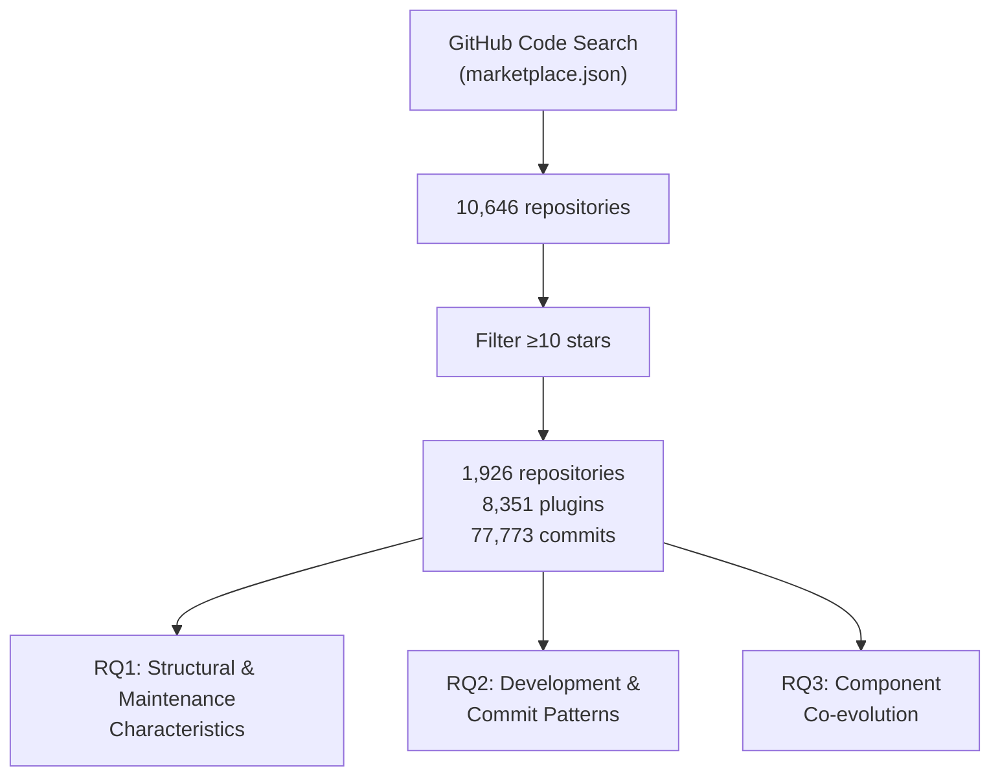
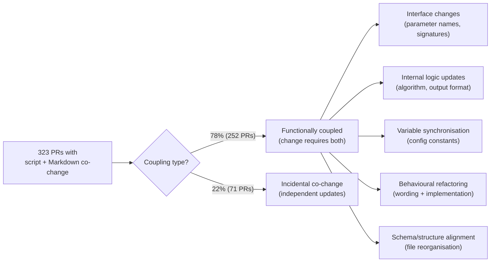
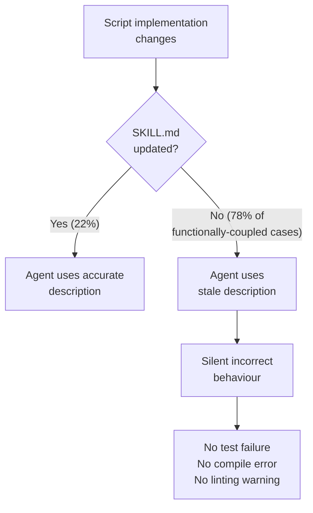

# The Script–Markdown Coupling Problem: What Empirical Research on Agent Plugin Marketplaces Means for Codex CLI SKILL.md Maintenance


---

## A New Maintenance Dependency Nobody Warned You About

When Codex CLI shipped Agent Plugins 1.0 in v0.147.0[^1], the release notes emphasised discovery, federation, and isolation. What they did not cover — because nobody had studied it yet — is the maintenance regime that emerges once your plugin library grows past a handful of skills.

A paper submitted to arXiv on 28 August 2026 by Hereiz, Lyu, Li, Adams, and Hassan from Queen's University's Software Analysis and Intelligence Lab (SAIL) fills that gap.[^2] The study analysed 1,926 repositories, 8,351 plugins, and 77,773 commits drawn from Claude Code plugin marketplaces — an ecosystem whose plugin format (SKILL.md instruction files, hook scripts, agent Markdown files) maps almost exactly onto Codex CLI's own Agent Plugins specification. The headline result: **78% of co-changes between implementation scripts and instruction Markdown files inside skill directories are functionally coupled**, not coincidental. That coupling represents a class of maintenance dependency that has no direct analogue in conventional software engineering.

---

## What the Study Actually Measured

The researchers applied GitHub Code Search to identify repositories hosting `marketplace.json` files (the registry format shared by Claude Code and Codex CLI's plugin catalogs), filtered to repositories with at least ten GitHub stars, and collected six months of data from October 2025 through March 2026 — the period immediately following the plugin ecosystem's launch.[^2]



### Growth is Still Accelerating

Plugin-touching commits grew **8.8× in six months** (2,923 commits in October 2025 to 25,618 by March 2026), with a Mann-Kendall trend test confirming statistically significant upward momentum (p=0.003).[^2] Skills component instances specifically grew **22×** — from 1,776 to 39,287 — outpacing all other component types combined by the end of the study window.

This trajectory matters for Codex CLI operators. The plugin catalog is not a static configuration artefact; it is a living codebase component under continuous development pressure.

### Software Engineering Dominates Plugin Scope

Of the 8,351 plugins categorised, **61.3% target software engineering tasks** — Code Generation (25.9%), Infrastructure (16.6%), and Debug & Analysis (14.8%).[^2] If you install third-party plugins for your Codex CLI setup, you are almost certainly drawing from this category. The domain specificity has a maintenance implication: SE plugins change when the tools and workflows they assist change, which is continuously.

---

## The Commit Pattern Inversion

The study's most practically significant finding concerns how plugin repositories differ from conventional open-source software in their development patterns.

| Commit Type | Plugin Repos | Conventional OSS |
|---|---|---|
| Feature (feat) | **39.6%** | 17.2% |
| Fix | 25.8% | ~27% |
| Chore | 21.0% | — |
| Refactor | 8.8% | — |
| Test | 0.5% | — |

Feature commits occur at **more than double the conventional rate** and test commits are essentially absent.[^2] The absence of tests is not negligence — it reflects the artifact: the primary component is a Markdown instruction file, and verifying that Claude interprets it correctly requires interactive evaluation, not a test suite.

The study also found that four Conventional Commits Specification labels carry fundamentally different meanings in plugin repositories:

- **docs commits** — 74% actually modify instruction files that Claude reads at runtime; they are functionally feat or fix, not documentation
- **perf commits** — 40.1% target model tier assignment and prompt verbosity rather than algorithmic efficiency
- **style commits** — 36% involve instruction wording precision that affects model behaviour, not code formatting
- **refactor commits** — 50% are rewording of AI-facing instruction text

If you are using commit history to assess plugin quality or decide whether an upstream update warrants review, conventional classification signals are unreliable.[^2]

---

## The 78% Coupling Finding

The co-evolution analysis is the most operationally important result. The researchers examined 323 pull requests in which implementation scripts and Markdown instruction files co-changed within the same `skills/` directory. Of those, **252 of 323 (78%) were functionally coupled**, meaning the script change required a corresponding instruction update to maintain correct agent behaviour.[^2]



The five coupling types (inter-rater κ=0.74) are[^2]:

1. **Interface changes** — A function signature is modified in the script; the instruction must be updated to reflect the new parameter names or calling convention.
2. **Internal logic updates** — The algorithm or output format of the implementation changes; the instruction's description of what the skill does becomes false.
3. **Variable synchronisation** — Configuration constants used in the implementation script appear in the instruction for documentation or template-filling purposes.
4. **Behavioural refactoring** — The developer rewrites instruction prose to reflect a parallel refactor of the implementation logic.
5. **Schema/structure alignment** — A file reorganisation changes paths or structure that both the script and the instruction reference.

This is the practical finding for any Codex CLI operator who uses skills with associated hooks or shell scripts: **updating the implementation without updating the Markdown produces a silently incorrect skill**. The agent will follow the instruction file faithfully but the instruction no longer accurately describes what the implementation does.

---

## Mapping to Codex CLI Agent Plugins 1.0

Codex CLI's Agent Plugins 1.0 specification uses an almost identical structural vocabulary to the Claude Code ecosystem the SAIL study examined. The translation between the two is direct:

| SAIL Study Component | Codex CLI Agent Plugins 1.0 Equivalent |
|---|---|
| `skills/*.md` instruction files | `skills/SKILL.md` in plugin bundle |
| Hook scripts (`hooks/`) | `hooks/` directory inside plugin bundle |
| `marketplace.json` | `plugin.json` catalog manifest |
| Agent Markdown (`agents/`) | Plugin-bundled AGENTS.md fragments |
| Commands (`commands/`) | Plugin-provided slash-command definitions |

The coupling problem the study identifies is therefore directly reproducible in Codex CLI plugins. When you update a hook script in your plugin and do not update the corresponding SKILL.md, Codex CLI will use the Markdown to reason about what the hook does and will reason incorrectly.

### What the v0.151.0 `on_mcp_tool_result` Hook Changes

The v0.151.0 release introduced `on_mcp_tool_result` extension hooks, which allow plugins to intercept and modify MCP tool results before they reach the model.[^3] This adds a new coupling axis: an `on_mcp_tool_result` handler in a plugin may transform tool output in ways that the skill's Markdown no longer documents, creating a three-way coupling between the handler script, the MCP tool behaviour, and the instruction file.

Operators shipping plugins with `on_mcp_tool_result` hooks should treat the handler as a first-class coupled component requiring coordinated updates alongside the SKILL.md whenever the transformation logic changes.

---

## Practical Mitigations for Codex CLI Operators

### 1. Treat SKILL.md Boundaries as API Contracts

The study found that interface changes are the most common coupling type. Structuring SKILL.md files with explicit input/output contracts reduces the frequency of silent coupling breaks:

```markdown
## Interface

**Input parameters:**
- `target_file` (string): Absolute path to the file to analyse
- `max_issues` (integer, default 10): Maximum issues to return

**Output schema:**
- `issues[]`: Array of `{line, severity, message, rule_id}`
- `summary`: Plain-text summary of findings

**Implementation:** `hooks/analyse.py` — changes to parameter names or
output schema in the script require corresponding updates here.
```

When the contract is explicit, a diff review is sufficient to determine whether a script change broke the coupling.

### 2. Add a Co-evolution Check to Plugin CI

The study's finding that 78% of script-Markdown co-changes are functionally necessary implies that a script-only commit to a skill directory is a red flag. A PostToolUse hook can enforce this at session time:

```bash
#!/usr/bin/env bash
# hooks/skill-coevolution-check.sh
# Runs after every Apply patch; warns if a script in skills/ changed
# without a corresponding change to its adjacent SKILL.md

CHANGED=$(git diff --name-only HEAD 2>/dev/null)

scripts_changed=$(echo "$CHANGED" | grep -E 'skills/[^/]+/[^/]+\.(py|sh|js|ts)$')
if [ -z "$scripts_changed" ]; then
  exit 0
fi

for script in $scripts_changed; do
  skill_dir=$(dirname "$script")
  md_changed=$(echo "$CHANGED" | grep -E "^${skill_dir}/SKILL\.md$")
  if [ -z "$md_changed" ]; then
    echo "WARNING: ${script} changed but ${skill_dir}/SKILL.md was not updated." >&2
    echo "If the script interface or behaviour changed, update SKILL.md to match." >&2
  fi
done

exit 0  # warning only, non-blocking
```

Register this in your plugin bundle's `hooks/` directory with the `PostApplyPatch` event.

### 3. Use the Plugin Catalog Merge to Enforce Versioning

From v0.151.0, plugin catalogs merge per-repository configuration with the user-level catalog, with invalid marketplace entries reported by `codex doctor`.[^3] Pin your plugin versions in `config.toml` rather than tracking `@latest`:

```toml
[[plugins]]
name    = "my-org/analysis-suite"
version = "1.4.2"

[[plugins]]
name    = "third-party/formatter"
version = "0.9.0"
```

This makes the script-Markdown coupling surface auditable: a version bump in `config.toml` is a signal to review the upstream changelog for coupling breaks before installing.

### 4. Keep Claude Off the SKILL.md When It Owns the Script

The study found that Claude co-authors **34.9% of all commits** in plugin repositories, with the highest rate (40.1%) on performance-related commits.[^2] When Codex CLI writes a hook script during a session, it does not automatically update the skill's SKILL.md to match — the agent-authored half of the coupling break is the most likely to slip through unreviewed.

An explicit AGENTS.md directive prevents this:

```markdown
## Plugin Maintenance Rules

When modifying any file inside `skills/<skill-name>/`:
1. If you change the interface, output schema, or behaviour of an implementation
   script, you MUST update the corresponding SKILL.md in the same directory.
2. Never commit script changes to a skill directory without reviewing
   skills/<skill-name>/SKILL.md for consistency.
3. After any hook modification, run `codex doctor --plugins` to verify
   plugin integrity before ending the session.
```

---

## The Wider Implication: Natural Language Is Now a First-Class Maintenance Artefact

The study's broader contribution is naming a pattern that every Codex CLI operator implicitly deals with but few teams manage deliberately: **natural-language instruction files are not documentation; they are executable specifications**, and they co-evolve with the code they govern.

The fact that skills component instances grew 22× in six months[^2] while test commits remained at 0.5% suggests the ecosystem is accumulating technical debt in a form that is largely invisible to conventional code review tooling. A diff on a `.py` file gives no signal about whether the adjacent SKILL.md is still accurate.



Until plugin tooling develops first-class support for verifying script-Markdown consistency — a gap the SAIL team explicitly identifies as future work — operators must enforce this discipline through AGENTS.md policy, PostToolUse hooks, and version pinning in config.toml.

---

## Citations

[^1]: OpenAI. *Codex CLI v0.147.0 Release Notes — Agent Plugins 1.0*. GitHub, 7 August 2026. <https://github.com/openai/codex/releases/tag/rust-v0.147.0>

[^2]: Hereiz, A., Lyu, Y., Li, H., Adams, B., & Hassan, A. E. (2026). *On the Maintenance and Co-evolution of Agent Plugins: An Empirical Study of Claude Code Plugin Marketplaces*. arXiv:2608.28497. Queen's University SAIL. <https://arxiv.org/abs/2608.28497>

[^3]: OpenAI. *Codex CLI v0.151.0 Release Notes — MCP Extension Middleware, Grace Periods, Plugin Catalog Merging*. GitHub, 29 August 2026. <https://github.com/openai/codex/releases/tag/rust-v0.151.0>

[^4]: OpenAI. *Codex CLI Agent Plugins 1.0 — Plugin Specification*. Codex Developers Documentation, 2026. <https://developers.openai.com/codex/plugins>

[^5]: Destefanis, G., Graziotin, D., Vaccargiu, M., & Ortu, M. (2026). *GitSkills: A Dataset of Agent Skills on GitHub*. arXiv:2608.10906. <https://arxiv.org/abs/2608.10906>
