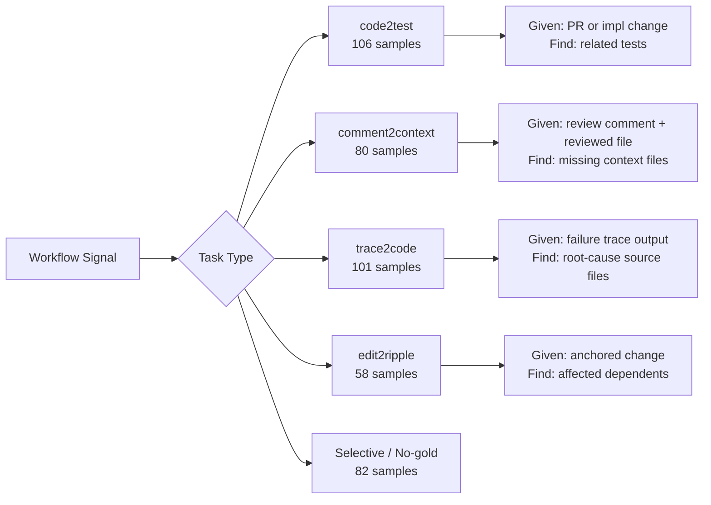
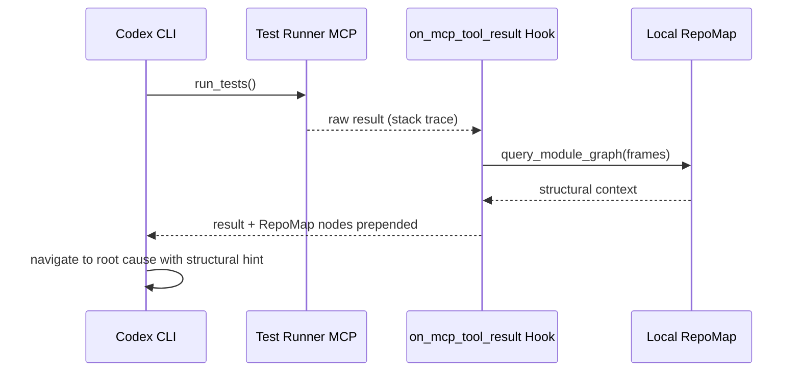

# Agent Retrieval Bench: Why Codex CLI Misses Critical Repository Files in 27–29% of Tasks — and What to Do About It


Every discussion of coding agent performance focuses on patch generation: can the model write a correct fix? The implicit assumption is that the agent already has the right files in context. **Agent Retrieval Bench** (arXiv:2607.24882)[^1] dismantles that assumption with hard numbers: Codex CLI, running against real repositories, completely misses the critical "gold files" needed for a task in **27–29% of cases**, regardless of whether you use GPT-5.4 or GPT-5.5.

The benchmark is a July 2026 contribution from Bowen Qin and Yi Xie, published under a Creative Commons licence, and represents the first systematic evaluation of the *context-acquisition stage* that precedes patch generation. The results are not a critique of Codex CLI specifically — every agent tested suffers similar miss rates — but they quantify a gap that operators can, and must, address directly.

## What Agent Retrieval Bench Measures

The benchmark separates the pre-patch retrieval problem from the patch generation problem. Given a real workflow signal (a changed file, a code-review comment, an execution trace, an edited function), can the retrieval system surface the *additional* repository files the agent will need?

The dataset contains 427 samples across 25 repositories spanning six languages — Python, Go, Rust, TypeScript, Java, and JavaScript — assembled from 308 base-commit snapshots and a corpus of 392,000 files (7.9 million chunks).[^1]

Evaluation is split across four positive-retrieval tasks and one selective-retrieval subset:



The no-gold subset (50 natural no-gold cases + 32 counterfactual wrong-repository controls) tests whether retrieval systems know when to abstain — a property benchmarks rarely measure but production systems constantly require.

## Retrieval Methods Evaluated

The paper tests five retrieval families against the corpus:

| Method | Type | Highlight |
|--------|------|-----------|
| Qwen3-Embedding-4B | Dense embedding | Best sample-weighted MRR (0.2379) |
| Qwen3-Embedding-8B | Dense embedding | Best Recall@20 (0.7029) |
| pplx-embed-v1-4B | Dense embedding | Strong on edit2ripple MRR |
| RepoMap | Structural/graph | Best budgeted context yield @ 8K tokens (0.3788) |
| Nomic-embed-code | Dense embedding | Mid-tier across tasks |
| Jina-0.5B | Dense embedding | Leads comment2context MRR |
| Path-aware TF-IDF | Lexical | Competitive on trace2code |
| BM25 | Lexical | Baseline; outperformed on MRR |

The central finding is blunt: **no single retrieval family dominates**.[^1] Dense embeddings win on recall at larger budgets; RepoMap and lexical methods win when context is tight or when the signal is an execution trace. Per-task leaders differ entirely:

- **code2test MRR leader:** Qwen3-4B (0.3225)
- **comment2context MRR leader:** Jina-0.5B (0.3043)
- **trace2code MRR leader:** RepoMap (0.2742)
- **edit2ripple MRR leader:** pplx-embed-v1-4B (0.2877)

Hybrid retrieval via **Reciprocal Rank Fusion** (Qwen3-8B + RepoMap) consistently outperforms either alone, lifting overall Recall@20 to 0.7331 and overall MRR to 0.2713.[^1]

## The Codex CLI Miss-Rate Numbers

The paper includes a controlled analysis of 287 samples where agent interaction logs were available. The primary finding for operators:

| Agent Configuration | Never-touches-gold Rate |
|---------------------|------------------------|
| OpenAI GPT-5.4-mini (strict) | 35.2% |
| Codex CLI GPT-5.4 | 27.2% |
| Codex CLI GPT-5.5 | 29.3% |

In roughly **one in four** real-world tasks, Codex CLI completes its entire turn sequence without ever reading or navigating to the file that would have resolved the issue. When it *does* reach the gold file, the median first contact is at tool-call step 3 — by which point the model may have already generated an incorrect patch based on incomplete information.[^1]

The slightly *higher* miss rate for GPT-5.5 versus GPT-5.4 (29.3% vs 27.2%) is counter-intuitive. The paper attributes this to GPT-5.5's tendency to reason more extensively in early turns, consuming context budget before file exploration begins, and to differences in file-event granularity (Codex logs 6 file/path events per sample under GPT-5.5 versus 3.2 for GPT-5.4-mini), which can obscure when navigation actually reaches the target.[^1]

## Why Semantic Similarity Is Not Enough

A core conceptual contribution of the paper is the distinction between **semantic similarity** and **agentic relevance**:

> "Agentic relevance is defined by the next repository context needed by a coding workflow, not by direct semantic similarity between query and file."[^1]

Dense embeddings are trained to minimise cosine distance between semantically similar text. But the file an agent needs next is often *structurally* related to the current file (a dependent, a test fixture, a sibling module) rather than textually similar. RepoMap's strong performance on trace2code reflects exactly this: stack traces contain function names and line numbers, not prose, and graph-based navigation of import chains outperforms any embedding on that signal.[^1]

This result has a direct consequence for Codex CLI operators: providing natural-language descriptions of file relationships in AGENTS.md may be less effective than specifying structural relationships explicitly.

## Seed Context Intervention: A Controlled Experiment

The paper includes a 45-sample intervention with Codex CLI (GPT-5.5, fixed policy) where only the initial context seed varied:

| Seed Type | Final F1 | Any-Gold Coverage | First Hit Step |
|-----------|----------|-------------------|----------------|
| No seed | 0.3222 | 51.1% | 3.0 |
| Random context | 0.3437 | 73.3% | 3.0 |
| Lexical seed | 0.3981 | 80.0% | 2.0 |
| RRF seed (Qwen3-8B + RepoMap) | **0.3967** | **80.0%** | **1.0** |
| Oracle gold context | 0.6337 | 100.0% | 0.0 |

Three conclusions jump out:[^1]

1. **Any retrieval seed beats random context** for any-gold coverage (80% vs 73.3%).
2. **RRF seed matches lexical seed on coverage** but reaches the gold file one full step earlier (step 1 vs step 2), reducing the risk of premature patch generation.
3. **The oracle gap is enormous**: 0.6337 vs 0.3222 shows that once the agent has the right context, F1 nearly doubles. The limiting factor is retrieval, not reasoning.

The implication is that the Codex CLI's current default — unguided file exploration from AGENTS.md instructions — leaves substantial performance on the table.

## Codex CLI Operator Playbook

The benchmark results translate directly into operator-level configuration choices.

### 1. Encode Structural File Relationships in AGENTS.md

For recurring task patterns, AGENTS.md should encode the structural retrieval signals the benchmark tests:

```markdown
## Context Retrieval Protocol

### code2test Tasks
When modifying `src/**/*.rs`, check `tests/` for matching test files before proposing changes.
Pattern: `src/auth/login.rs` → check `tests/auth/test_login.rs` + `tests/integration/auth/`.

### edit2ripple Tasks
After editing any public API signature in `lib/`, enumerate dependents before patching:
1. Run: `grep -r "from lib import\|use crate::lib" . --include="*.py" --include="*.rs"`
2. Include all matched files as context before generating the fix.

### trace2code Tasks
When provided a stack trace, navigate via module path before grep:
1. Parse the innermost non-stdlib frame.
2. Open the source file directly at the reported line.
3. Then expand to callers if the root cause is elsewhere.
```

This makes AGENTS.md encode task-type routing logic — the kind of structural guidance that outperforms semantic search.

### 2. Inject Retrieval-Derived Seeds via `startup_prompt_template`

The seed intervention showed that providing retrieved context at session start cuts first-hit step from 3 to 1. In `~/.codex/config.toml`, a `startup_prompt_template` can inject pre-retrieved context when the task description matches known patterns:

```toml
[session]
startup_prompt_template = """
{task}

Context seeds (from repository index):
{seed_files}

Verify each seed before relying on it; these are retrieval suggestions, not authoritative answers.
"""
```

An external pre-retrieval script (running lexical + RepoMap over the task description before launching Codex) feeds the `{seed_files}` slot. Given the paper's intervention results, this pattern is worth standardising for any team running batch codex sessions.[^2]

### 3. Run a Local Embedding MCP Server for Large Codebases

For repositories exceeding 50,000 files, unguided file navigation is no longer viable — the miss rate worsens with corpus size. An MCP server exposing a local embedding index (Qwen3-8B or pplx-embed-v1-4B, chunked at the function level) gives Codex CLI a structured retrieval tool rather than forcing it to navigate blind:

```toml
[mcp_servers.code-search]
command = "npx"
args = ["-y", "@my-org/code-search-mcp", "--index", "./.codex/embeddings/"]
timeout = 10000

[mcp_servers.code-search.tools.search_files]
output_token_limit = 60000
```

The 60K-token output limit for a search tool (set per-tool via the v0.152.0 `output_token_limit` capability)[^3] allows returning a rich set of candidate files without blowing through the session context budget.

### 4. Use `on_mcp_tool_result` to Inject RepoMap Context for Trace Tasks

v0.151.0's `on_mcp_tool_result` hook[^4] can intercept the result of a shell tool running a test suite, parse the stack trace, and automatically inject the relevant RepoMap nodes into the tool result before the model sees it:

```toml
[extensions.repomap-injector]
command = "python3"
args = [".codex/hooks/inject_repomap.py"]
hooks = ["on_mcp_tool_result"]
```

The handler parses stack frames from the tool result, queries a local RepoMap instance for the affected module graph, and prepends the relevant structural context to the result. On trace2code tasks — where RepoMap leads all retrieval methods — this converts unguided navigation into structured context injection.



### 5. Pre-compute Gold Contexts for Recurring Tasks

The oracle intervention achieved F1 of 0.6337 — nearly double the baseline — by providing perfect context. For high-value recurring tasks (nightly regression fixes, known API migration patterns, recurring security patches), pre-computing and caching the gold context in a Codex skill is the highest-return investment available:

```markdown
## Skill: JWT Authentication Patch Protocol

When: Any task involving `auth/`, `tokens/`, or `jwt` in the description.
Pre-load these files before starting:
- `src/auth/jwt.rs`
- `src/auth/middleware.rs`
- `tests/auth/test_jwt.rs`
- `docs/auth/JWT_DESIGN.md`

Oracle F1 shows ~2× performance gain from correct initial context.
```

## The Selective Retrieval Gap

One finding the paper flags as an open problem: selective retrieval calibration does not transfer between counterfactual no-gold data and natural no-gold cases. Systems trained to abstain on wrong-repository inputs still fail to abstain on real tasks that genuinely have no relevant repository file. For Codex CLI, this means a retrieval-seeded session may receive confident but irrelevant seed context — indistinguishable, from the agent's perspective, from a genuine seed.

The practical mitigation is an AGENTS.md directive:

```markdown
## Context Seed Validation
If provided with candidate context files at session start, verify each file exists and is relevant
before incorporating it into your reasoning. Exit code 2 from any pre-tool validation hook
indicates an invalid seed; discard it and proceed with standard file exploration.
```

This builds a minimal verification loop around the pre-retrieval injection, catching the selective-retrieval failure mode before it poisons the agent's reasoning.

## Implications for Model Selection

The paper's per-task retrieval results complicate the standard advice to always pick the largest available model. On comment2context, Jina-0.5B (a 500M parameter model) leads MRR. On trace2code, RepoMap (a structural, non-neural approach) leads all embeddings regardless of size. If your Codex CLI workload is dominated by a single task type, the optimal retrieval augmentation is task-specific — not model-size-specific.

The 27.2% vs 29.3% Codex CLI miss-rate comparison across GPT-5.4 and GPT-5.5 reinforces this: more reasoning capability does not automatically translate into better file navigation. Retrieval-augmented seeds are an orthogonal improvement axis.

## Summary

Agent Retrieval Bench quantifies the retrieval gap that most operators have observed qualitatively: agents explore confidently but miss the critical file in a material fraction of real tasks. For Codex CLI specifically, the numbers are 27.2% (GPT-5.4) and 29.3% (GPT-5.5) miss rates. The seed context intervention shows that RRF-retrieved context (Qwen3-8B + RepoMap) cuts first-hit step to 1 and lifts any-gold coverage to 80%. The oracle bound (F1 0.6337 vs 0.3222 baseline) confirms that the limiting factor is retrieval, not the model's reasoning once it has the right context.

The benchmark's task taxonomy — code2test, comment2context, trace2code, edit2ripple — maps directly onto Codex CLI configuration decisions: task-type-aware AGENTS.md sections, startup seed injection, RepoMap-backed `on_mcp_tool_result` hooks, and per-tool output limits for embedding-backed MCP search. None of these require changes to the model; they are all harness decisions.

## Citations

[^1]: Qin, B. & Xie, Y. (2026, July). *Agent Retrieval Bench: Evaluating Repository Context Retrieval for Coding Agents*. arXiv:2607.24882. https://arxiv.org/abs/2607.24882

[^2]: OpenAI. (2026). *Codex CLI configuration: startup_prompt_template*. Codex CLI documentation. https://github.com/openai/codex

[^3]: OpenAI. (2026, September). *Release v0.152.0*. GitHub openai/codex releases. https://github.com/openai/codex/releases/tag/v0.152.0

[^4]: OpenAI. (2026, August). *Release v0.151.0*. GitHub openai/codex releases. https://github.com/openai/codex/releases/tag/v0.151.0

[^5]: RepoMap. (2026). *Repository map for agentic coding*. Aider project documentation. https://aider.chat/docs/repomap.html

[^6]: Xin, D. et al. (2026, June). *CORE-Bench: A Comprehensive Benchmark for Code Retrieval in the Era of Agentic Coding*. arXiv:2606.11864. https://arxiv.org/abs/2606.11864
