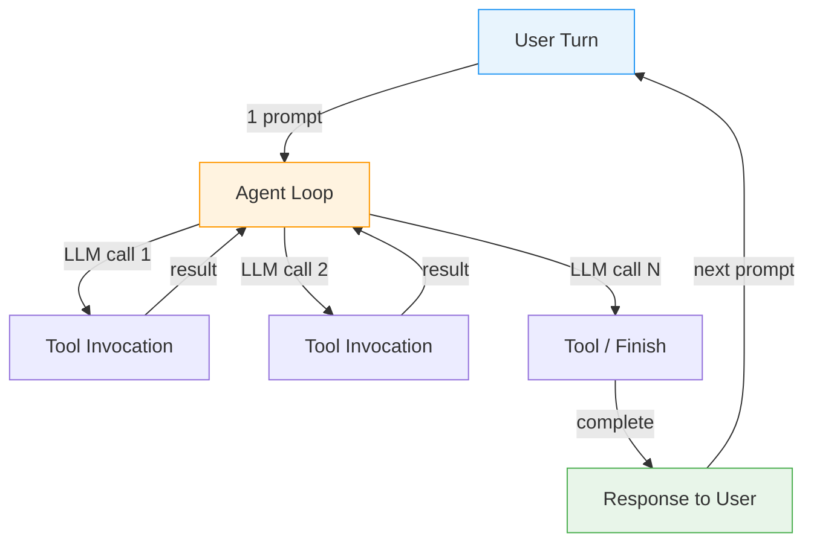
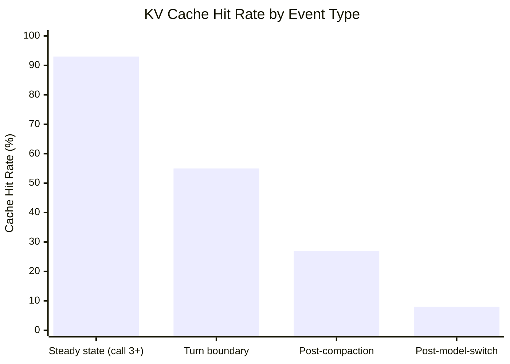
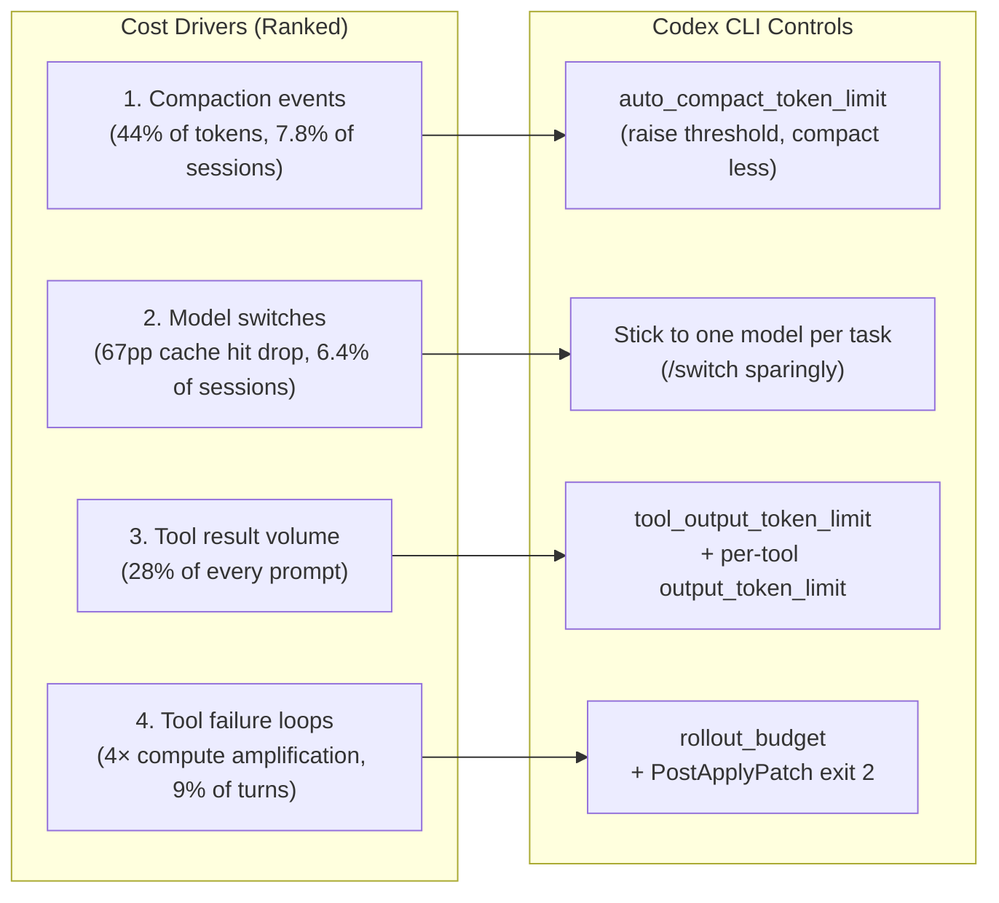

# 87% Agent, 13% Human: What 13.5M GitHub Copilot Sessions Reveal About Running Coding Agents at Scale

---

## The First Production Mirror

Benchmarks tell you what a coding agent can do in controlled conditions. Production telemetry tells you what actually happens when 3.2 million developers use one every day.

Liu, Qiu, Goiri, Fonseca, Bianchini, and Choukse (Microsoft Azure Research / UIUC) published the first production-scale characterisation of agentic coding workloads in late July 2026, using sampled GitHub Copilot traces from a single week in June 2026.[^1] The dataset is substantial: 13.5 million sessions, 760.5 million LLM calls, 774.7 million tool invocations, and 44.9 trillion prompt tokens across 27+ models and 45+ tools.[^1] The paper's core argument is that coding agents are not chatbots — they are a structurally distinct workload class that breaks the assumptions baked into every major LLM-serving infrastructure built before 2025.[^2]

For Codex CLI operators, the numbers reveal why several default settings leave performance on the table and where the real cost sinks are hiding.

---

## The 87% Autonomy Number

The headline statistic: **87% of LLM calls in GitHub Copilot sessions are agent-initiated**, not user-initiated.[^1] A single user prompt fans out into an autonomous chain of inference + tool execution that runs to completion before the next human turn. The LLM-to-tool coupling is almost exactly 1:1: sessions average 40.6 LLM calls and 43.6 tool invocations.[^1]

Per-session medians look deceptively modest — 3 user turns, 15 LLM calls, 13 tool invocations, 4.2 minutes — but means reveal the long tail: 6.1 turns, 40.6 calls, 43.6 invocations, **62.6 minutes average**.[^1] The P90 session runs for nearly three hours (177.8 minutes).[^1] That mean-to-median skew of 14.9× is the signature of a long-tailed workload where a small fraction of power sessions dominate resource consumption.

---

## KV Cache: The Compaction Cliff

KV cache hit rates follow a predictable ramp within a turn: cold-start at ~45% on the first call, jumping to ~86% by the second call, plateauing at **92–94% by call three and beyond**.[^1] Within a single turn, coding agents are cache-efficient. The problem is what happens at boundaries.

**Turn boundaries**: cross-turn cache hit rate drops to a median of 55% even under ideal conditions. The degradation is driven by idle time — if the user is away for more than ten minutes, cache hit rates collapse to 0–5%.[^1] Median user idle time between turns is **25.2 minutes**, well past that cliff.

**Model switches**: affect 6.4% of sessions. After a switch, the cache hit rate crashes to 8% — a 67-percentage-point loss.[^1] Tellingly, non-success rates before a model switch run at 36% versus the 8% baseline, meaning switches correlate heavily with the agent being stuck in a failure loop.

**Context compaction**: affects only 7.8% of sessions — but those sessions account for **44.2% of all prompt tokens**.[^1] When compaction fires, it delivers a 66.1 percentage-point median drop in cache hit rate, equivalent to a model switch. Critically, 34.3% of compaction events wipe out 90% or more of the existing cache.[^1]

For Codex CLI operators the actionable read is: **compaction is a cache reset, not just a context truncation**. The `auto_compact_token_limit` setting should be tuned conservatively. Firing compaction once per long session at 90% of the context window is far less costly than triggering it repeatedly at 70% as a session drifts — because each compaction event resets accumulated prefix cache, forcing full re-prefill of the surviving context.[^2]

---

## Token Composition: Where Tokens Actually Go

The median per-call prompt is 68K tokens; median completion is 247 tokens — a **275:1 input-to-output ratio**.[^1] That asymmetry has a direct implication: coding agent cost is dominated almost entirely by prompt re-prefill, not generation.

Prompt token composition breaks down as:[^1]

| Component | Share |
|---|---|
| Conversation history | 48% |
| Tool call/result messages | 28% |
| System prompt | 14% |
| Repo instructions (AGENTS.md) | 10% |

Two takeaways for Codex CLI operators. First, AGENTS.md is a **10% token tax per call**; this validates keeping project-level AGENTS.md files focused and free of verbose preamble. Second, tool result messages at 28% of every prompt confirm that `tool_output_token_limit` — and now per-tool `output_token_limit` (introduced in v0.152.0) — directly control the second-largest prompt cost driver.

---

## Five User Archetypes and a 50× Token Range

The paper clusters users into five behavioural types with radically different resource footprints:[^1]

| Archetype | Share | Sessions | Tools/Turn | Tokens/Turn |
|---|---|---|---|---|
| Readers | 41.7% | 2 | 4.8 | 203K |
| Coders | 30.4% | 5 | 6.2 | 417K |
| Terminal users | 11.0% | 2 | 4.0 | 213K |
| Deep-loop users | 9.2% | 2 | 20.0 | 1.1M |
| Chat-only | 7.6% | 1 | 0.0 | 23K |

The 50× token range between chat-only and deep-loop users (23K vs 1.1M per turn) has a practical consequence for Codex CLI: a single model and configuration profile is almost certainly miscalibrated for most of your actual usage pattern. Deep-loop users generating 20 tool calls per turn almost never need the same `rollout_budget`, `auto_compact_token_limit`, or `approval_policy` as the Readers majority.

---

## Tool Failures and the 4× Compute Amplifier

Tool execution latency is bimodal. The median is 166ms; the mean is 16.7 seconds; P99 is 79 seconds.[^1] The mean-to-median skew of ~100× is driven almost entirely by failed tool executions — failed `run_command` calls at P95 run **48× longer** than successful ones.[^1]

Failures occur in 9% of turns. When they do, they trigger the "deep-loop with failures" archetype: 36 LLM calls on average — four times the session median.[^1] This compute amplification is not bounded by default. An agent that cannot repair a failing build or test suite will iterate until it exhausts its context, burning token budget at 4× rate the entire time.

Codex CLI operators should treat the `rollout_budget` and PostApplyPatch hooks as a first line of defence against this pattern. A PostApplyPatch hook that runs the build and exits with code 2 on failure creates a tight feedback loop that cuts off the failure amplification cycle early — the agent receives the failure signal immediately rather than discovering it three LLM calls later through implicit tool output analysis.

---

## Tool Parallelism: The Sequential Reality

Researchers observe that **93% of tool batches contain a single invocation**.[^1] When parallelism does occur, the median width is 2 tools, and 87.5% of parallel batches contain at most 3 tools.[^1] Read tools (file access, search) are occasionally batched; write and execution tools are almost never run in parallel.

Infrastructure-level LLM-tool overlap — where tool execution is hidden behind a concurrent LLM call — covers only **7.7% of aggregate tool wall-clock time**.[^1] Coding agent tool calls are largely sequential, not pipelined.

For Codex CLI, this validates the existing `multi_agent_v2` parallel subagent design over per-tool parallelism as the right lever for throughput on large tasks. Within a single agent session, expecting tool-level concurrency to materially reduce latency is unsupported by the production evidence.

---

## What This Means in Practice for Codex CLI

Three configuration changes cover most of the actionable surface:

1. **Raise `auto_compact_token_limit`** from the default to 90% of your model's context window. Compaction is a cache reset; do it once at the end of a session's natural lifetime rather than repeatedly mid-task. The paper's data shows 34.3% of compaction events wipe out 90%+ of cache — treating compaction as routine is expensive.[^1]

2. **Set per-tool `output_token_limit` tiers** (v0.152.0 feature). Tool outputs are 28% of every prompt. File-read tools warrant 40–60K tokens; search tools 60–100K; issue/ticket tools 8–15K. The median turn already carries 217.2K cached tokens — excess tool output that isn't cached on subsequent calls is pure re-prefill waste.[^1]

3. **Add a PostApplyPatch build hook with exit code 2 on failure.** The 9% of turns that hit tool failures consume compute at 4× the median rate. A fast failure signal from a hook cuts this amplification cycle before it compounds across multiple LLM calls.[^1]

---

## Limitations

The dataset is GitHub Copilot in June 2026, running on Microsoft Azure serving infrastructure with specific model mix and tool sets. GitHub Copilot's tool catalogue (45+ tools), session lengths, and user population differ from a typical Codex CLI deployment. The paper notes that prompt token composition, particularly the 28% tool-message share, reflects Copilot's tool verbosity; Codex CLI's `tool_output_token_limit` defaults will produce a different composition. ⚠️ The archetype percentages (Readers 41.7%, Deep-loop 9.2%) are specific to the Copilot user base and should not be assumed to transfer directly to enterprise Codex CLI deployments.

---

## Citations

[^1]: Liu B, Qiu H, Goiri I, Fonseca R, Bianchini R, Choukse E. "Agentic Coding in the Wild: Characterizing GitHub Copilot Traces at Production Scale." arXiv:2608.00101 (July 2026). <https://arxiv.org/abs/2608.00101>

[^2]: Choukse E et al. "Agentic Coding in the Wild — Microsoft Research." Microsoft Azure Research (2026). <https://www.microsoft.com/en-us/research/publication/agentic-coding-in-the-wild-characterizing-github-copilot-at-production-scale/>

[^3]: Paul R. "New Microsoft Paper on GitHub Copilot's production traces…" X / Twitter (2026). <https://x.com/rohanpaul_ai/status/2086356354713985266>

[^4]: OpenAI. "Codex CLI v0.152.0 Release Notes — per-tool output_token_limit." GitHub openai/codex Releases (1 September 2026). <https://github.com/openai/codex/releases>

[^5]: Stark K. "Agentic Coding in the Wild — blog summary." kstark007.github.io (2026). <https://kstark007.github.io/blog/agentic-coding-in-the-wild/>
