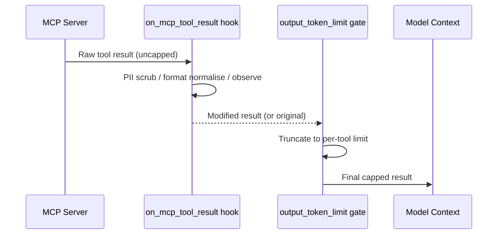
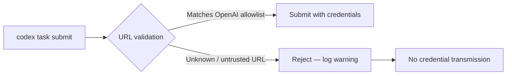

# Codex CLI v0.152.0 Stable: Per-Tool MCP Output Limits, App-Server Timeouts, and What the Alpha Preview Didn't Cover


---

v0.152.0 shipped stable on 1 September 2026.[^1] The alpha series (alpha.1 through alpha.7.2) seeded the headline features — Vim search motions, rate-limit action banners, package-style MCP server names, and model-catalog proactive instructions — into the community over the preceding week. But the stable release added two capabilities that never appeared in the alpha announcements: **per-tool `output_token_limit` for individual MCP tools** (PR #41421) and **configurable `thread/shellCommand` timeouts for app-server clients** (PR #41384). It also landed a compaction correctness fix with significant operational impact. This article covers those additions in depth.

---

## What the Alpha Coverage Already Captured

Before going further, a quick delineation. The following v0.152.0 features were covered in the alpha preview:

- **Vim search (`/` and `?` motions)** — draft-local search with `n`/`N` navigation and operator composition.[^2]
- **Rate-limit action banners** — banners now surface direct links to usage dashboards, credit top-ups, limit resets, and plan changes rather than raw error strings.[^2]
- **Package-style MCP server names** — colons, `@`, `/`, and periods are now valid in server identifiers, enabling `@scope/server:variant` naming in `config.toml` and CLI commands.[^2]
- **Proactive multi-agent instructions from model catalog** — subagent instruction text sourced from the model catalog entry, refreshed on model switch.[^2]

If you have already read that coverage, skip directly to the sections below.

---

## Per-Tool `output_token_limit` for MCP Tools

### The Problem with a Single Global Cap

Until v0.152.0, `tool_output_token_limit` in `config.toml` applied a single token cap to every tool call in the session — shell executions, MCP tool responses, and anything else the model called.[^3] That is often the right default: a file read returning 200,000 tokens of minified JavaScript will stall context accumulation regardless of which server produced it.

But a single ceiling creates operational friction at the extremes. A code-search MCP tool serving indexed monorepo results legitimately needs 80,000 tokens to return complete matches. A Slack channel-listing tool that returns 40 channel names needs fewer than 2,000. Under a shared global cap, you either under-serve the search tool or over-allocate to the channel lister — and any team running more than three or four MCP servers will encounter both failure modes simultaneously.

### What PR #41421 Adds

PR #41421 introduced an `output_token_limit` setting at the individual tool level.[^1] When set, it takes precedence over the global `tool_output_token_limit` for that specific tool's responses. The release notes confirm that the limit is respected consistently across session resumes, which means compaction and continuation sessions apply the same per-tool ceiling as the initial session.[^1]

The configuration lives in the MCP server's tool block inside `config.toml`:

```toml
# Global fallback — applies to all tools without a per-tool override
tool_output_token_limit = 25000

[mcp_servers.github]
command = "npx"
args = ["-y", "@modelcontextprotocol/server-github"]

[mcp_servers.github.tools.search_code]
output_token_limit = 80000   # code search needs headroom

[mcp_servers.github.tools.list_issues]
output_token_limit = 12000   # issue lists are compact

[mcp_servers.slack]
command = "npx"
args = ["-y", "@modelcontextprotocol/server-slack"]

[mcp_servers.slack.tools.list_channels]
output_token_limit = 4000    # channel metadata is small
```

⚠️ The exact TOML key path (`[mcp_servers.<name>.tools.<tool_name>]`) follows the existing per-tool approval configuration convention documented for `approval_mode`. Confirm the schema with your installed version via `codex config --schema` before deploying to production.[^3]

### Interaction with the `on_mcp_tool_result` Hook

The on_mcp_tool_result hook (introduced in v0.151.0, PR #41202) fires *before* the per-tool limit is applied.[^4] The sequence is:



This ordering is consequential: your hook receives the *full* MCP response, not the truncated version. An observability hook that counts unique file paths will count against the complete set, not just the portion that makes it into context. Conversely, a PII-scrubbing hook that rewrites content before the limit is applied may produce output that fits comfortably within a tighter cap that would have been overflowed by the raw response.

### Recommended Strategy

A tiered approach works well for teams with heterogeneous MCP servers:

| Tool category | Suggested per-tool limit | Rationale |
|---|---|---|
| Code search / grep | 60,000–100,000 | Results must be complete to be useful |
| File read (large) | 40,000–60,000 | Match `model_context_window` guidance |
| Issue / PR lists | 8,000–15,000 | Metadata summaries, rarely dense |
| Notification / messaging | 3,000–6,000 | Short content by design |
| Database query results | 20,000–40,000 | Depends on row density |

Set the global `tool_output_token_limit` conservatively (e.g. 15,000) as a catch-all for unlisted tools, and raise it selectively. This is safer than setting it high globally and relying on per-tool caps to bring outliers down.

---

## App-Server Shell Command Timeouts

### The One-Hour Ceiling

Prior to v0.152.0, the app-server's `thread/shellCommand` handler enforced a hard internal timeout that could not exceed 60 minutes for any single shell operation.[^5] For most interactive development sessions this was invisible — the model rarely issues a shell command that runs longer than a few minutes. However, it became a recurring obstacle for three legitimate use cases:

1. **Full CI suite execution** — large test suites (particularly in embedded, game, or scientific computing domains) regularly exceed 60 minutes.
2. **Artifact build pipelines** — Docker image builds, release packaging, and cross-compilation for multiple targets.
3. **Data migration or seeding scripts** — database migrations on large production-scale datasets inside sandboxed environments.

Teams working around the limit resorted to wrapping long-running commands in background processes, polling for completion via a separate shell call, and manually injecting the result into the agent's context — an error-prone workaround that defeats much of the value of app-server integration.

### PR #41384: Configurable Deadline

PR #41384 allows app-server clients to pass a timeout value for `thread/shellCommand` requests, including values that represent deadlines longer than one hour.[^1] The configuration is per-request rather than global, meaning host applications can set a generous ceiling for build commands while keeping a tight ceiling for interactive queries.

⚠️ The exact JSON-RPC request parameter name for the deadline is not confirmed in public documentation at time of writing. Based on the PR title, the field is likely `timeoutMs` or `deadlineMs` inside the `thread/shellCommand` request body. Consult the app-server schema endpoint (`GET /schema`) or the TypeScript SDK types for authoritative field names.[^5]

A practical integration pattern for a CI host application:

```typescript
// Pseudocode — exact field names subject to schema verification
const result = await codexClient.thread.shellCommand({
  command: "make test-all",
  workingDir: "/workspace",
  timeoutMs: 7_200_000,  // 2 hours
});
```

For long-running commands, the app-server streams partial output through the standard JSON-RPC notification channel, so the host application can display progress rather than blocking silently for two hours.

---

## Compaction Correctness Fix: User Instructions Now Persist

One of the most operationally significant fixes in v0.152.0 is not flagged as a breaking change but effectively was one: **automatic approval reviews now retain user instructions and authorisations across history compaction** (PR not individually listed, but noted in the release).[^1]

### What Was Breaking

In v0.151.x, when a long session triggered auto-compaction, the compaction summariser could drop two categories of context:

1. **Explicit user instructions** — directives like "never write to the `dist/` directory" or "always use the project eslint config" that were stated in the session but not baked into `AGENTS.md`.
2. **Guardian authorisations** — approvals the user had granted for specific tool invocations that had not yet been exercised.

After compaction, the model behaved as if those instructions and authorisations had never been given. Users reported that agents began overwriting files they had explicitly protected, and that Guardian prompts reappeared for actions the user had already approved.

### Why This Matters for Long Sessions

The failure mode is subtle and intermittent. Compaction fires when accumulated tokens exceed `model_auto_compact_token_limit`, which many teams leave at the default. A session might run for 40 minutes without compacting, compact once, and then exhibit the broken behaviour only in the second half — by which point the user has often moved to a different context and may not connect the lost instructions to the compaction event.

The fix makes compaction summarisation authoritative for instruction-bearing content: the compaction prompt now explicitly enumerates in-session user directives and outstanding Guardian authorisations, and the handoff summary must preserve them.[^1]

### Mitigation for Teams Still on v0.151.x

If you cannot immediately upgrade, externalise all session instructions into `AGENTS.md` at the project or worktree level. Instructions declared in `AGENTS.md` are injected from the filesystem on every turn and are not subject to compaction loss.

---

## Cloud Task Backend URL Security

v0.152.0 introduces rejection of untrusted backend URLs for cloud task requests.[^1] When Codex CLI submits a task to the cloud task runner, it now validates the backend URL against an allowlist of known OpenAI endpoints. Requests targeting URLs that do not match the allowlist are rejected before any credentials are transmitted.

This closes a narrow but real attack surface: a malicious `config.toml` (e.g., injected via a repository's `.codex/config.toml` in an untrusted project clone) could previously redirect cloud task submissions to an attacker-controlled endpoint, exfiltrating API keys in the process. The untrusted project lockout introduced in v0.150.0 already blocks project-level `AGENTS.md` from untrusted projects; this fix extends the same principle to cloud task endpoint configuration.



Teams using on-premises deployments or third-party Codex-compatible endpoints should verify that their backend URL is included in the allowlist, or that they are using a supported self-hosted configuration path.[^1]

---

## Planning Tool Defaults: Confirmed Stable

The change to make `update_plan` opt-in (`tools.update_plan.enabled = true`) was introduced in the alpha series and is confirmed stable in v0.152.0 (PR #41744).[^1] New sessions will no longer include `update_plan` in the default tool set. Existing sessions that rely on the built-in plan view should add the opt-in to `config.toml` before upgrading. The dedicated article on this change covers the rationale and migration paths in detail.[^6]

---

## Upgrading

```bash
npm install -g @openai/codex@0.152.0
# or
npm install -g @openai/codex@latest
```

Verify the installed version:

```bash
codex --version
# Expected: 0.152.0
```

---

## Summary of Changes Covered

| Change | Type | PR |
|---|---|---|
| Per-tool `output_token_limit` for MCP tools | Feature | #41421 |
| App-server `thread/shellCommand` timeout > 1hr | Feature | #41384 |
| Bedrock credential refresh progress in TUI | Feature | #41239 |
| User instructions persist across compaction | Bug fix | — |
| Cloud task backend URL rejection | Security | — |
| Planning tool opt-in (`tools.update_plan.enabled`) | Breaking default | #41744 |

---

## Citations

[^1]: OpenAI. *Codex CLI v0.152.0 Release Notes*. GitHub, 1 September 2026. <https://github.com/openai/codex/releases/tag/rust-v0.152.0>

[^2]: "Codex CLI v0.152 Alpha Preview: Rate-Limit Banners, Package-Style MCP Names, Vim Search, and the Model Catalog Instruction Split." Codex Knowledge Base, 31 August 2026. Internal cross-reference.

[^3]: OpenAI. *Advanced Configuration Reference — Codex CLI*. <https://learn.chatgpt.com/docs/config-file/config-advanced>

[^4]: OpenAI. *Codex CLI v0.151.0 Release Notes — on_mcp_tool_result Extension Hook*. GitHub, 29 August 2026. <https://github.com/openai/codex/releases/tag/rust-v0.151.0>

[^5]: OpenAI. *Codex App Server Documentation*. <https://learn.chatgpt.com/docs/app-server>

[^6]: "The `update_plan` Tool Goes Opt-In: When to Disable Codex CLI's Built-In Planner." Codex Knowledge Base, 31 August 2026. Internal cross-reference.
