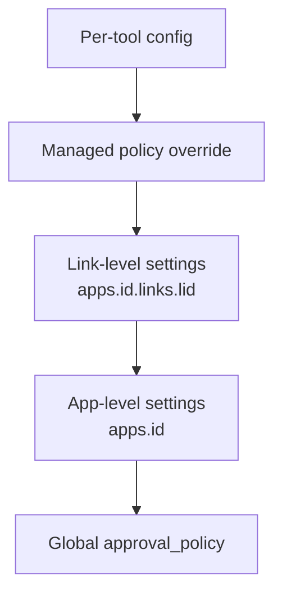

# Codex CLI v0.153.0-alpha: Per-Link Approval Policies for Connected Apps and Plugin Marketplace Source Enforcement


OpenAI shipped v0.153.0-alpha.1 and alpha.2 on 1 September 2026 — within hours of v0.152.0 going stable.[^1] The alpha series introduces a cluster of features centred on two themes: **fine-grained, per-account approval control for connected Apps**, and **source enforcement for curated plugin catalogs**. Neither is ground-breaking in isolation, but together they close meaningful governance gaps that operators of multi-account and multi-marketplace deployments have been navigating with workarounds.

## Background: What "Apps" Means in Codex CLI

The Codex CLI Apps surface (introduced during mid-2026 alongside the ChatGPT desktop integration) lets Codex invoke tools exposed by OAuth-connected third-party services — GitHub, Google Workspace, Jira, and any custom integration registered via the app-server protocol.[^2] Each connected service produces one or more *links*: a binding between an OAuth credential and a Codex identity. Until v0.153.0-alpha, approval settings (who reviews tool calls, and whether they require a prompt at all) were applied at the app level or inherited from the global `approval_policy`. There was no way to say "the production link to this GitHub App requires stricter oversight than the staging link."

## Per-Link Approval Settings (PRs #42047, #42054, #42056)

Three PRs landing together implement end-to-end per-link policy control.[^3][^4][^5]

### New Configuration Keys

```toml
# ~/.codex/config.toml

[apps.github-enterprise.links.prod-link]
approvals_reviewer   = "guardian"
default_tools_approval_mode = "on-request"

[apps.github-enterprise.links.dev-link]
approvals_reviewer   = "auto"
default_tools_approval_mode = "never"
```

Both keys sit under `apps.<app_id>.links.<link_id>`. The `app_id` corresponds to the registered app identifier; `link_id` is the account binding identifier returned by the app-server at connection time (visible with `codex apps list`).

**`default_tools_approval_mode`** accepts the same values as the global `approval_policy` (`never`, `on-request`, `always`). It overrides the app-wide default for tool calls that resolve through this specific link.

**`approvals_reviewer`** controls which review path evaluates the approval: `"guardian"` routes to the Guardian auto-review subsystem, `"auto"` bypasses the prompt entirely (equivalent to the old `approve-for-me` path), and omitting the key inherits from the app-level or global setting.

### Precedence Stack

The full precedence hierarchy, from most to least specific, is now:



Link-level settings sit above the app-level defaults but below per-tool configurations and managed (enterprise) policy overrides. This means a Guardian-managed deny rule can still trump a permissive link-level setting.

### Explicit Link ID Enforcement

PR #42054 adds a complementary guard for Apps that declare `requires_explicit_link_id: true` in their metadata.[^4] When this flag is set, Codex extracts a `link_id` from the tool-call arguments before approval or execution. Calls that omit, misformat, or supply an unrecognised `link_id` are rejected immediately — before the Guardian or approval prompt is even consulted. This prevents accidental or adversarially induced ambiguity where a tool call intended for one account is silently routed to another.

### Practical Configuration

A realistic enterprise pattern for a GitHub App with separate production and CI bot credentials:

```toml
[apps.github-enterprise]
default_tools_approval_mode = "on-request"

[apps.github-enterprise.links.prod-account]
approvals_reviewer          = "guardian"
default_tools_approval_mode = "always"

[apps.github-enterprise.links.ci-bot]
approvals_reviewer          = "auto"
default_tools_approval_mode = "never"
```

The `ci-bot` link is effectively autonomous for GitHub tooling (acceptable inside a sandboxed CI container) while `prod-account` requires an explicit Guardian review before every invocation.

## Plugin Marketplace Source Enforcement (PR #41953)

The second major change tightens how curated plugin catalogs are validated.[^6]

Previously, the OpenAI plugins Git source allowlist — the list of permitted Git hosts and repository patterns for marketplace plugins — was only enforced against *user-configured* marketplaces defined in `config.toml`. Plugins arriving via the curated catalog (the built-in OpenAI-maintained plugin registry) were implicitly trusted and bypassed the allowlist check.

PR #41953 closes this gap. The allowlist now covers:

| Validation point | Before | After |
|---|---|---|
| User-configured marketplaces | ✅ enforced | ✅ enforced |
| Curated catalog discovery | ❌ exempt | ✅ enforced |
| Curated catalog installation | ❌ exempt | ✅ enforced |
| Cached plugin loading | ❌ exempt | ✅ enforced |
| Skill loading from curated source | ❌ exempt | ✅ enforced |
| Startup repository sync | ❌ exempt | ✅ enforced |
| Bundled plugins | ✅ always trusted | ✅ always trusted |
| Remote-installed plugins | (separate path) | (separate path) |

The practical implication: an attacker who managed to inject a malicious entry into the curated catalog — or who convinced a user to point `codex.catalog_url` at a mirrored catalog with a poisoned plugin — would previously have bypassed source validation. That vector is now blocked by the same Git allowlist that user-marketplace entries traverse.

No configuration change is required for most operators. If you run a self-hosted curated catalog (uncommon but documented for air-gapped deployments), ensure its Git origin appears in your allowlist under `[plugins.sources]`.

## Guardian History Preserved Across Thread Reconstruction (PR #42065)

When a thread is reconstructed — most commonly during a `git worktree`-based session resume or after a crash recovery — Guardian's cumulative history of approved and rejected tool signatures was previously lost.[^7] The agent would re-prompt for approvals it had already granted in the prior session.

PR #42065 serialises Guardian history into the thread reconstruction metadata. Authorisations accumulated during a session survive reconstruction. The history remains session-scoped and is not persisted to disk between cold starts (that distinction was established in v0.152.0-alpha.6 and is unchanged here).[^8]

## Shared Histories in Rollout Compression (PR #42039)

A lower-profile but operationally useful fix: `local_thread_store_compression` now covers rollout files from both *shared* and *forked* execution histories.[^9] Previously, a separate mode (`local_thread_store_shared_compression`) was needed for shared-history compression. That mode is now a no-op (kept for backward compatibility in strict configuration mode). The `codex exec resume` path also gains the ability to select the correct working directory even when only compressed rollouts remain — fixing a regression where resume would fail to locate state after aggressive compression.

## Vim Undo in the TUI Composer (PR #41941)

A small but frequently requested quality-of-life addition: the TUI composer now supports Vim-style undo (`u`) when Vim mode is active.[^10] This completes the core Vim editing surface that started with navigation motions (v0.145.x), operator composition (v0.150.x), and search motions (v0.152.0).

## Upgrade and Compatibility Notes

v0.153.0-alpha.1 through alpha.4 are pre-release and not recommended for production workloads. To opt in to the latest alpha:

```bash
npm install -g @openai/codex@0.153.0-alpha.4
# or
npx @openai/codex@0.153.0-alpha.4
```

The new `apps.<app_id>.links.<link_id>` config block is additive — existing configs with no `links` sub-section continue to behave identically to v0.152.0.[^1] Plugin catalog validation changes are transparent to users; if `codex doctor` reports a source policy rejection on a catalog you control, add the Git origin to `[plugins.sources.allowed]`.

## Summary

| Feature | PRs | Impact |
|---|---|---|
| Per-link approval settings | #42047, #42054, #42056 | Multi-account Apps governance |
| Marketplace source enforcement | #41953 | Plugin supply-chain hardening |
| Guardian history on reconstruct | #42065 | Reduced re-approval friction |
| Shared history compression | #42039 | Reliable `exec resume` on compressed state |
| Vim undo | #41941 | TUI composer completeness |

The per-link approval system is the feature practitioners running multi-environment App integrations have been waiting for. Combined with the marketplace source enforcement, v0.153.0 continues the steady progression toward a security model where *every credential boundary and plugin provenance claim* has a corresponding gate rather than relying on ambient trust.

## Citations

[^1]: OpenAI. "Releases · openai/codex." GitHub, September 1, 2026. <https://github.com/openai/codex/releases>
[^2]: OpenAI. "Codex CLI App-Server Protocol." GitHub – openai/codex, 2026. <https://github.com/openai/codex>
[^3]: OpenAI. "PR #42047: Add per-account approval settings for apps." GitHub – openai/codex, September 1, 2026. <https://github.com/openai/codex/pull/42047>
[^4]: OpenAI. "PR #42054: Honor explicit account selectors for Apps tool calls." GitHub – openai/codex, September 1, 2026. <https://github.com/openai/codex/pull/42054>
[^5]: OpenAI. "PR #42056: Honor app link settings for MCP tool approvals." GitHub – openai/codex, September 1, 2026. <https://github.com/openai/codex/pull/42056>
[^6]: OpenAI. "PR #41953: Enforce marketplace source policy for curated plugins." GitHub – openai/codex, September 1, 2026. <https://github.com/openai/codex/pull/41953>
[^7]: OpenAI. "PR #42065: Preserve Guardian history across thread reconstruction." GitHub – openai/codex, September 1, 2026. <https://github.com/openai/codex/pull/42065>
[^8]: OpenAI. "PR #41660: Guardian authorisation preserved across compaction." GitHub – openai/codex v0.152.0-alpha.6, August 31, 2026. <https://github.com/openai/codex/pull/41660>
[^9]: OpenAI. "PR #42039: Include shared histories in rollout compression." GitHub – openai/codex, September 1, 2026. <https://github.com/openai/codex/pull/42039>
[^10]: OpenAI. "PR #41941: Add Vim undo to the TUI composer." GitHub – openai/codex, September 1, 2026. <https://github.com/openai/codex/pull/41941>
