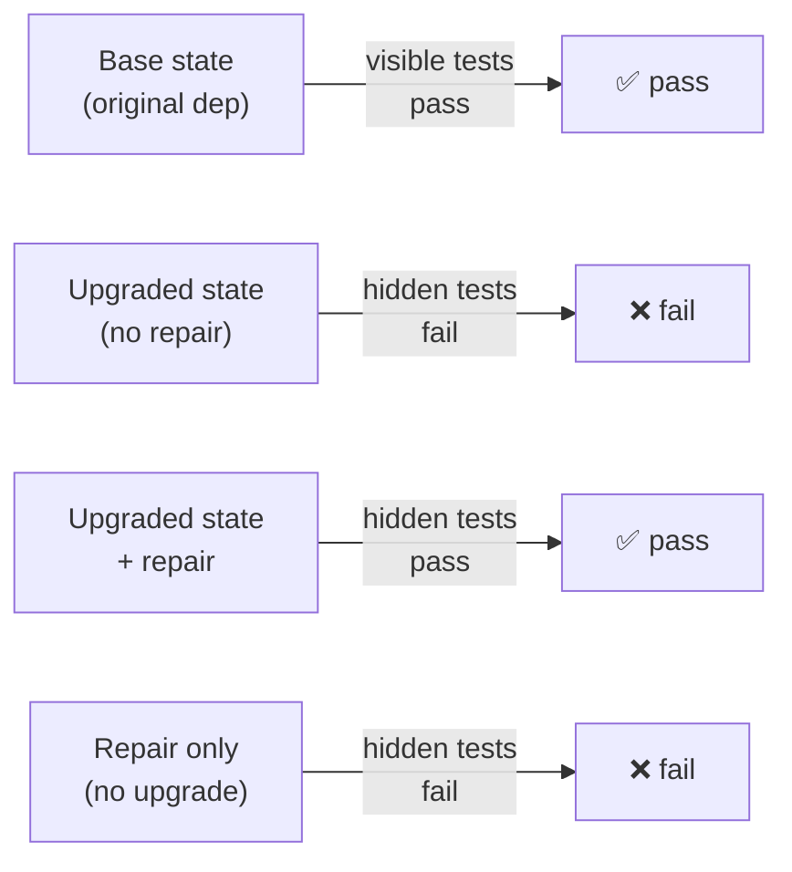
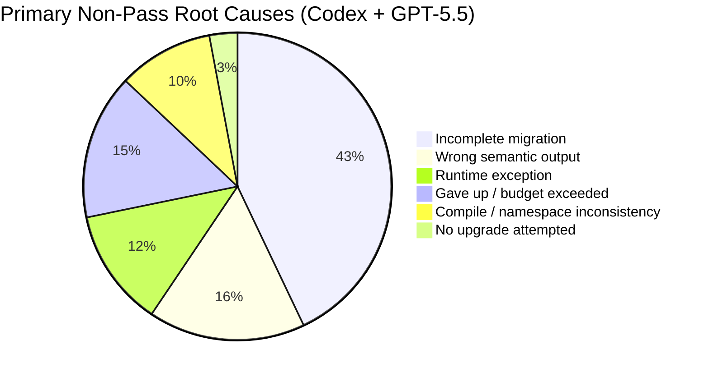
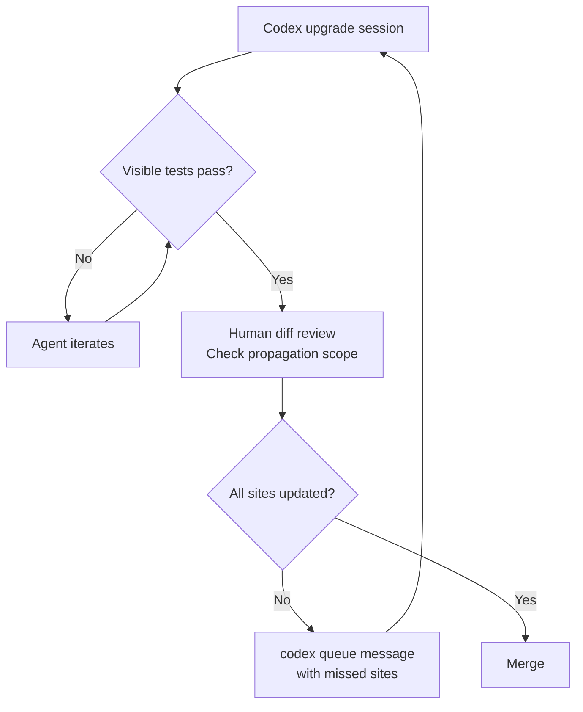

# Update from Hell: What DEPBENCH Reveals About Coding Agents and Hidden Dependency Breakage


---

Dependency upgrades are deceptively treacherous. A version bump that passes CI can silently change type widths, flip exception semantics, or invalidate fixture assumptions that no existing test encodes. Human engineers navigate this with changelog archaeology and institutional memory. Coding agents navigate it with a context window and test-run feedback — which, it turns out, is often not enough.

DEPBENCH, published by Luo, He, Gao, Kang, Lin, Ma, Lin, Rajmohan, and Tian (Monash University and Microsoft, arXiv:2608.30300, 31 August 2026), is the first benchmark to evaluate this failure mode systematically.[^1] Its headline: the best agent configuration — Codex running GPT-5.5 — solved 104 of 203 tasks (51.2%). For a class of work that developers frequently delegate to AI, that is a meaningful capability ceiling.

## The Oracle Problem

Previous dependency benchmarks conflated version bumps with repair success by checking whether visible tests passed. That conflation is the root cause of optimistic estimates: an agent that satisfies every test the repository ships may still have left the upgraded dependency contract half-propagated through the codebase.

DEPBENCH addresses this with a four-state oracle contract.[^2] Each task requires all four conditions to hold simultaneously:



The hidden test patch encodes the *correct post-upgrade contract*. Condition D prevents agents gaming the oracle by applying the repair without the version bump. Condition B ensures the upgrade genuinely breaks something — weak tasks with no real failure were excluded.

Task construction mined 4,660 candidate pull requests from Dependabot and Renovate bots across public repositories, then applied human/LLM audit to remove tasks with fixture-only hidden patches, deletion-heavy repairs, or unstable transient behaviour. The final 203 tasks are oracle-clean.[^2]

## Five Ecosystems, One Uncomfortable Truth

The benchmark spans five package ecosystems:

| Ecosystem | Tasks | GPT-5.5 + Codex | Consensus-Hard (all GPT-5.5 zero) |
|-----------|------:|----------------:|-----------------------------------:|
| Maven / Java | 65 | 46 (70.8%) | 11 |
| npm / yarn | 68 | 27 (39.7%) | 34 |
| Go | 40 | 20 (50.0%) | — |
| Cargo / Rust | 20 | 6 (30.0%) | 14 |
| Python | 10 | 5 (50.0%) | — |
| **Total** | **203** | **104 (51.2%)** | — |

[^3]

The ecosystem pattern is revealing. Maven/Java, with its strong static type system and conventional test runners, gave agents the clearest signals — both for detecting breakage and for verifying repairs. npm/yarn and Cargo proved hardest: npm tasks frequently involved runtime semantic changes (changed overflow behaviour, altered promise resolution ordering) where types give no warning, and Cargo's Rust type system made partial propagation errors uncompilable but not always test-catchable.[^3]

## The Harness Gap: 16.3 Percentage Points

Holding GPT-5.5 fixed, the spread between Codex and Claude Code was 33 tasks — 16.3 percentage points.[^4] Copilot CLI sat between them at 99/203. This is the by-now-familiar harness-matters result: the model is not the complete story.

One structural constraint explains part of the gap. After v0.94.0, Codex dropped the chat-completions wire API required for non-GPT model routes, so the DEPBENCH evaluation could only run Codex against GPT-5.5.[^4] Claude Code and Copilot CLI tested three model families (GPT-5.5, Claude Opus 4.8, Gemini 3.5 Flash), enabling a fuller picture.

```mermaid
bar
    title Pass Count by Harness + Model (203 tasks)
    x-axis [Codex+GPT-5.5, CopilotCLI+GPT-5.5, ClaudeCode+Opus4.8, ClaudeCode+GPT-5.5, CopilotCLI+Opus4.8, CopilotCLI+Gemini3.5F, ClaudeCode+Gemini3.5F]
    y-axis "Tasks Solved" 0 --> 120
    bar [104, 99, 83, 71, 78, 66, 51]
```

⚠️ Exact per-harness/per-model full breakdown is not quoted verbatim in the abstract; figures above are derived from the summary tables reported in sections III–IV of the paper.

## The Dominant Failure Mode: Incomplete Migration

The most instructive finding is the failure taxonomy. Across all configurations, *incomplete migration* was the single largest root cause.[^5]



⚠️ Counts are illustrative of the relative ordering as reported in Table V; exact values vary by configuration.

The incomplete migration pattern is subtle. The agent finds the primary site where the dependency API changed, fixes it, runs visible tests — they pass — and stops. What it misses are downstream propagation points: wrapper functions that re-export the changed type, fixtures that assume the old numeric range, generated artefacts that embed the old signature. The paper describes this as failing to "propagate the upgraded dependency contract through wrappers, types, fixtures, generated artifacts, or behavioral outputs."[^5]

A concrete example from the paper: upgrading a GitLab client from v0.161.1 to v1.2.0 required migrating pipeline IDs from `int` to `int64` across interfaces, helper functions, and return types. Codex completed this. Copilot CLI identified the issue but only repaired the primary site, leaving merge-request list returns typed as `int`.[^5]

## The Visible-Test Pass Paradox

Perhaps the most operationally important finding: in 61.8% of analysed non-pass trajectories, the agent satisfied all visible repository tests before hidden-test verification revealed the repair was incomplete.[^6]

This is not random failure. It is a systematic overconfidence signal — the agent's own test-run feedback loop is insufficient for dependency repairs. The visible test suite, by definition, was written against the pre-upgrade contract. It cannot encode what changed.

The implication for Codex CLI workflows is direct: you cannot rely on a green test run as the completion signal for dependency upgrade tasks. You need either held-out integration tests or a human review gate before merge.

## Discovery Behaviours: What Agents Actually Do

Table VII of the paper categorises agent discovery strategies across trajectories.[^7]

| Behaviour | Codex+GPT-5.5 | CopilotCLI+GPT-5.5 | ClaudeCode+GPT-5.5 |
|-----------|:---:|:---:|:---:|
| Test-running evidence | High (170–197 range) | High | High |
| Local API inspection | Consistent (68–172) | Consistent | Consistent |
| Breaking-change hypothesis formation | 66–192 | — | — |
| Documentation lookup | 75 | Low (20) | — |

[^7]

Two observations stand out. First, test-running is the dominant discovery mechanism across all harnesses — agents rely heavily on the visible test signal, which explains why the visible-test paradox bites so hard. Second, breaking-change hypothesis formation is frequent but does not imply that the hypothesis was discovered from migration evidence rather than from the error message itself. Forming a correct hypothesis about the breaking change is necessary but not sufficient for complete repair.

## Mapping DEPBENCH Findings to Codex CLI

DEPBENCH does not prescribe Codex CLI configuration, but its failure taxonomy maps directly onto available controls.

### 1. Encode propagation scope in `AGENTS.md`

The incomplete migration failure almost always involves the agent stopping at the primary site. Codex reads `AGENTS.md` at session start and you can encode a propagation checklist:

```markdown
## Dependency Upgrade Protocol

When upgrading a dependency with breaking API changes:
1. Search the full repository for every import and usage of the affected symbol — do not stop at the primary call site.
2. Update wrapper functions, helper modules, and generated code separately.
3. Grep for the old type name / function signature after each fix pass and repeat until zero results.
4. Run the full test suite only AFTER completing all propagation passes.
5. Do NOT treat a green test run as completion — check git diff for scope.
```

This directly addresses the "finds the right area but leaves wrappers inconsistent" pattern.[^5]

### 2. Use goal mode with extended budgets

The paper reports budget exhaustion as a failure cause in 1–26 instances per configuration.[^5] Repository-wide propagation across 82 hidden-test lines spanning four files (the consensus-hard average) requires multiple passes.

```toml
# ~/.codex/config.toml
[session]
rollout_budget = 60          # dependency upgrades are multi-pass
auto_compact_token_limit = 100000
```

The `--goal` flag keeps the task objective persistent across compaction, preventing the agent from losing context about which propagation passes remain outstanding.

### 3. Ecosystem-appropriate verification hooks

The DEPBENCH ecosystem ranking (Maven > Go > Python > npm > Cargo) correlates with test-runner clarity. You can compensate with a `PostToolUse` hook that enforces a full rebuild before any test run:

```bash
#!/usr/bin/env bash
# .codex/hooks/post_apply_patch.sh
# Force a clean build verification after every patch

case "${CODEX_PROJECT_ROOT}" in
  *"/java/"*|*"/maven/"*)
    mvn clean test-compile -q || exit 2 ;;
  *"/rust/"*|*"Cargo.toml"*)
    cargo check --all-targets 2>&1 | grep "^error" && exit 2 || true ;;
  *"/node"*|*"package.json"*)
    npm run build --if-present 2>/dev/null || exit 2 ;;
esac
```

Exit code 2 from a hook causes Codex to abort and retry, providing early feedback before test-running locks in an incomplete migration.[^8]

### 4. Human gate before merge

Given the 61.8% visible-test paradox, the correct workflow for dependency upgrades is:



`codex queue` (v0.149.0+) lets you send a targeted message to a named session: `codex queue "dependency-upgrade" "Missed int64 propagation in merge_request_list — see line 247"` without spawning a new session.[^8]

## What DEPBENCH Changes About How You Use Codex for Maintenance

DEPBENCH's headline — 51.2% for the best configuration — is not an argument against using Codex for dependency upgrades. It is an argument for understanding *where* the 48.8% fails and designing your workflow around it.

The three actionable changes are:
1. **Propagation-first AGENTS.md rules** — force the agent to exhaust all usage sites before running tests.
2. **Extended rollout budgets** — hard upgrades require 60+ tool calls across multiple files.
3. **Human review as the completion signal** — not green visible tests.

The ecosystem difficulty ranking also provides triage guidance. Routine Maven/Java upgrades at 70%+ success rate are good candidates for agent-first workflows with light review. npm/yarn and Cargo upgrades below 40% success rate warrant human-first investigation with agent assistance rather than full delegation.

## Citations

[^1]: Luo, Z., He, R., Gao, P., Kang, Y., Lin, Z., Ma, M., Lin, Q., Rajmohan, S., Tian, Y. (2026). "Update from Hell: Can Coding Agents Survive Hidden Breakage in Dependency Upgrades?" arXiv:2608.30300 [cs.SE]. https://arxiv.org/abs/2608.30300

[^2]: Luo et al. (2026), Section II — DepBench Construction: four-state oracle contract, PR mining pipeline, human/LLM audit process. https://arxiv.org/html/2608.30300

[^3]: Luo et al. (2026), Table II — Per-ecosystem pass rates and consensus-hard task counts by agent configuration. https://arxiv.org/html/2608.30300

[^4]: Luo et al. (2026), Section III — Harness attribution: "Holding GPT-5.5 fixed, the spread between Codex and Claude Code is 33 tasks (16.3 percentage points)." https://arxiv.org/html/2608.30300

[^5]: Luo et al. (2026), Table V — Primary non-pass root causes; Section IV case studies: GitLab int→int64 migration, Gremlin semantic overflow. https://arxiv.org/html/2608.30300

[^6]: Luo et al. (2026), Table VIII — Visible-test pass paradox: 61.8% of non-pass trajectories satisfied visible tests. https://arxiv.org/html/2608.30300

[^7]: Luo et al. (2026), Table VII — Discovery behaviour categorisation by harness and model. https://arxiv.org/html/2608.30300

[^8]: OpenAI. (2026). Codex CLI Changelog: v0.149.0 (20 August 2026) — codex queue, hooks system. https://github.com/openai/codex/releases
