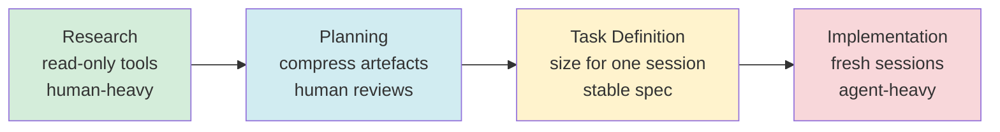

# Front-Load the Human: Infobip's Four-Phase Coding Agent Workflow and Its Codex CLI Blueprint


Benchmarks tell you what a model can do. Workflow design determines whether you can reliably extract that capability in production. A CIKM '26 industry paper from the Infobip AI research team — *A Phased Workflow for Operating LLM-Based Coding Agents* (arXiv:2608.30701) — makes this distinction the centre of its argument.[^1] Rather than proposing a new harness or benchmark, it documents how a production engineering team structures its work so that agents deliver consistent results. The paper's central insight: **delegate late, review early**. Human effort should be heaviest at the start, when the cost of a wrong assumption is greatest, and lightest at the end, when the artefacts are sufficiently well-specified that the agent can execute with minimal course-correction.

This article maps the Infobip framework — four phases, four context-management strategies, four failure modes — onto the concrete mechanisms Codex CLI provides today.

## The Problem Behind the Paper

Running a coding agent on a non-trivial task is not a single-turn interaction. It is a multi-session process spanning problem scoping, architectural choices, task decomposition, and iterative implementation. Practitioners who treat each session independently suffer two recurring costs:

- **Upstream error compounding**: A misunderstanding in research propagates into planning, which propagates into task definitions, which surfaces as mysterious failures during implementation — often far from the original mistake.[^1]
- **Correction bloat**: When a generated artefact is wrong, patching it inline introduces new complexity. The corrected version is less coherent than a fresh one written with the correct requirements, yet practitioners rarely restart from scratch.[^1]

These problems are fundamentally about context quality. The Infobip team frames context management — not model capability — as the dominant variable in reliable agent operation.[^1]

## Four Phases



### Phase 1 — Research

The practitioner and agent explore the problem space together. Tooling is intentionally restricted: file reads, codebase search, and domain-specific lookup tools (documentation, API references) are permitted; write operations are not.[^1] The session's purpose is to produce a **curated research document** — a human-validated summary of what is known, what is uncertain, and what the key decision points are.

**Codex CLI mapping:** Launch with a minimal MCP server set — only read-oriented servers. Use `approval_policy = "on-request"` so write operations require explicit confirmation. The AGENTS.md for this phase can state: `All file modifications require explicit user approval in this session. Output findings to research.md only.`

### Phase 2 — Planning

The research document becomes the sole input for a planning session. The team iterates on architectural decisions and an implementation approach. The critical step happens at the *end* of this phase: the practitioner **manually compresses** the session output.[^1] This means discarding abandoned reasoning paths, conflicting proposals, and exploratory tangents — retaining only the decisions and rationale that subsequent phases need.

The compressed artefact is not a conversation export; it is a curated document that replaces the full conversation. This prevents what the paper calls **context poisoning** — a hallucination in one session surviving into the next because the raw transcript was forwarded verbatim.[^1]

**Codex CLI mapping:** Use the `update_plan` tool (enabled via `tools.update_plan.enabled = true` in `config.toml`, stable in v0.152.0[^2]) to write a structured plan document during the session. At phase end, review and manually edit `plan.md` before the next session. Do not use `/export` alone — the transcript contains noise that the manual compression step is designed to remove.

### Phase 3 — Task Definition

Each task receives a canonical record containing: a stable identifier, goal statement, dependencies on other tasks, relevant code paths, acceptance criteria, and a validation method.[^1] Tasks are sized so they complete within a single session — when a task requires more context than an agent can hold across a session, it is split rather than stretched.

The paper names this the "effective operating range" constraint: an agent session has a finite reliable context window, and task definitions should be designed around that constraint, not against it.[^1]

**Codex CLI mapping:** A task registry file (e.g., `tasks/registry.md`) in the repository serves as the persistent store. Each task becomes a structured block that can be injected via `startup_prompt_template` in `config.toml`, or delivered via `codex queue --thread <session-id>` for in-flight task assignment.[^3] Size guidance: keep task scope within the `auto_compact_token_limit` threshold so compaction triggers at the end of the session rather than mid-task.

### Phase 4 — Implementation

Each task runs in a **fresh session** initialised with two inputs: the project-level AGENTS.md and the task definition.[^1] Nothing from earlier sessions is carried forward. This isolation is the paper's primary mechanism against **context clash** — new context contradicting stale context from a prior session.

Git stores code state. The task registry stores workflow state. The conversation that produced the code is disposable.[^1]

**Codex CLI mapping:**


```toml
# config.toml — implementation session profile
[profiles.implement]
approval_policy = "auto-edit"
auto_compact_token_limit = 90000
tools.update_plan.enabled = true

[profiles.implement.startup_prompt_template]
# Injected at session start — replace with actual task content
content = """
You are working on task {{task_id}}: {{task_goal}}

Relevant paths: {{code_paths}}
Acceptance criteria: {{acceptance_criteria}}
Validation: run `{{validation_command}}`

Project conventions are in AGENTS.md. Do not modify files outside the scope of this task.
"""
```


For multi-task parallel execution, launch each task as a separate `codex agents` session and track progress via `codex queue` messages.[^3]

## Four Context-Management Strategies

The vocabulary below — Select, Compress, Isolate, Write — is grounded in the Infobip paper's framework.[^1] For a broader treatment of context-failure modes and engineering strategies in agent systems, see dbreunig's analysis[^5] and the 2026 practitioners' guide to context engineering.[^6]

| Strategy | When Applied | Failure Mode Addressed |
|----------|-------------|------------------------|
| **Select** | Phase 1 — load only research tools | Distraction (irrelevant tool definitions compete for attention) |
| **Compress** | Phase 2→3 transition | Poisoning (hallucinations surviving as facts) |
| **Isolate** | Phase 4 — fresh sessions | Clash (stale context contradicting current task) |
| **Write** | Phases 2, 3, 4 — persistent artefacts | Confusion (superfluous content degrading reasoning quality) |

### Distraction

The model over-indexes on a detail that appeared early in the context window or in a prominent tool description. Mitigation: load only the tool definitions relevant to the current phase. In Codex CLI, this means separate MCP server configurations per phase profile, not a single monolithic config.[^4]

### Confusion

Superfluous information in context degrades reasoning by introducing competing signals. The model "averages across irrelevant signals" rather than focusing on the task.[^1] Mitigation: the **Write** strategy — replace raw conversation state with curated written artefacts. If the planning session produces 40,000 tokens of dialogue, the output artefact should be 500–1,000 words of decisions.

### Poisoning

A hallucination in turn N is referenced as fact in turn N+1 and propagates forward. Session isolation (Isolate) prevents cross-session propagation. For within-session poisoning, Codex CLI's `auto_compact_token_limit` combined with Guardian-persisted user instructions provides a compaction checkpoint that discards stale reasoning while retaining authorised directives.[^2]

### Clash

New context contradicts old context: a retrieved document disagrees with a decision made three turns ago, or a tool result invalidates a planning assumption. Mitigation: the task definition is **the stable ground truth**. When a clash is detected, the agent should re-read the task definition, not infer resolution from context history. An AGENTS.md directive enforces this: `When tool results conflict with the task definition, pause and flag the conflict rather than resolving it autonomously.`

## Open Problems the Paper Identifies

The Infobip team acknowledges two unresolved gaps:[^1]

1. **No metrics for workflow effectiveness.** There is no standard way to measure whether a phased workflow performs better than ad-hoc agent use, beyond informal practitioner assessment.
2. **Formalism–practice gap.** The context-management vocabulary (Select, Compress, Isolate, Write) is well-defined at the level of individual sessions, but the workflow-level patterns — how strategies compose across four phases — lack a formal treatment that practitioners can directly apply.

For Codex CLI specifically, the closest approximation of workflow-level telemetry is `rollout.jsonl` combined with `codex agents` session metadata. Neither provides phase-level attribution today.

## A Recommended Starting Configuration

For teams adopting the phased workflow today:

```toml
# ~/.codex/config.toml

[profiles.research]
approval_policy = "on-request"
# Load only read-oriented MCP servers in research profile

[profiles.plan]
approval_policy = "on-request"
tools.update_plan.enabled = true

[profiles.implement]
approval_policy = "auto-edit"
auto_compact_token_limit = 90000
tools.update_plan.enabled = true
```

```markdown
<!-- AGENTS.md — project level -->
## Workflow Phase Gate
Before any implementation, verify:
- [ ] research.md exists and has been reviewed
- [ ] plan.md records the architectural decision
- [ ] tasks/registry.md contains the current task definition

Refuse to proceed with implementation if the task definition is absent.
```

The workflow does not require a new tool. It requires a different relationship to sessions: treat them as bounded, single-purpose units rather than continuations of an ongoing conversation.

## Citations

[^1]: Kapetanovic, A., Duricic, T., Mercep, A. & Lacic, E. (2026). *A Phased Workflow for Operating LLM-Based Coding Agents*. Proceedings of the 35th ACM International Conference on Information and Knowledge Management (CIKM '26). arXiv:2608.30701. https://arxiv.org/abs/2608.30701

[^2]: OpenAI. (2026). *Codex CLI v0.152.0 Release Notes*. GitHub. https://github.com/openai/codex/releases/tag/v0.152.0

[^3]: OpenAI. (2026). *Codex CLI Documentation: codex queue and multi-agent sessions*. https://github.com/openai/codex

[^4]: OpenAI. (2026). *Codex CLI config.toml reference: MCP server configuration*. https://github.com/openai/codex#configuration

[^5]: dbreunig. (2025). *How Contexts Fail and How to Fix Them*. https://www.dbreunig.com/2025/06/22/how-contexts-fail-and-how-to-fix-them.html

[^6]: Reactify Solutions. (2026). *Context Engineering for AI Agents in 2026: Write, Select, Compress, Isolate, and the Four Ways Long Contexts Fail*. https://www.reactify-solutions.com/articles/context-engineering-ai-agents-2026
