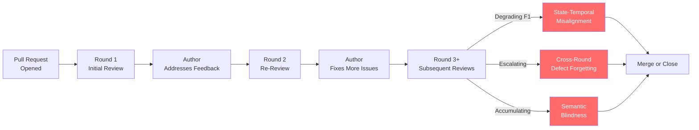
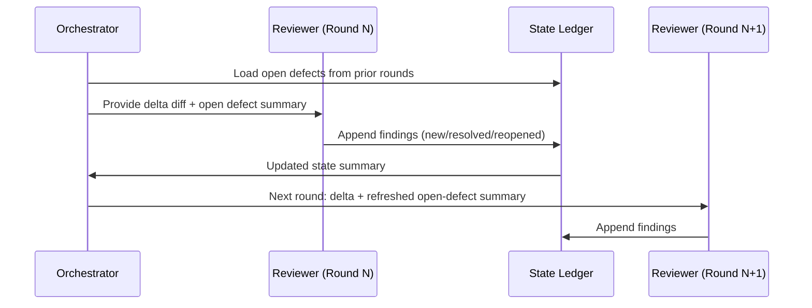

# From Static to Dynamic: What MCR-Bench Reveals About Multi-Round Code Review — and How to Configure Codex CLI for the Real Thing


---

## The Single-Round Illusion

Every mainstream code review benchmark evaluates LLMs the same way: hand the model a diff, ask for a verdict, score it once. CodeReviewer, REEF, CRBench, the PR sections of SWE-bench — all single-pass.[^1] That evaluation contract is accurate for automated comment generation but bears no resemblance to what happens in production pull-request workflows. Real reviews run through rounds of feedback, author fixes, re-review, further fixes, and eventual merge or close. The defect state — open, resolved, reopened, new — evolves with every push.

Zheng et al. (Sun Yat-sen University / Chongqing University / Huawei Cloud) published MCR-Bench in late August 2026 (arXiv:2608.27442) to fill that gap.[^2] The benchmark is the first to introduce explicit defect state tracking across multiple review rounds, and the results are sobering for anyone routing code review through a coding agent. The best model achieves F1 of 0.55 on defect detection — and that score halves by round 10.

---

## What MCR-Bench Measures

MCR-Bench draws 2,269 real-world multi-round review tasks from open-source repositories.[^2] The dataset spans five languages — Java (24.5%), C# (20.0%), TypeScript (19.4%), Python (18.1%), JavaScript (18.0%) — with an average of 3.8 review rounds per task, ranging from 2 to 10. Each task carries two layers of annotation absent from prior benchmarks:

**Defect metadata** across 13 specific categories (documentation 19.19%, logic defects 13.44%, refactoring 11.79%, testing 8.98%, and nine further subcategories) at five severity levels from Trivial to Blocker. Average defects per task: 2.37.

**Cross-round defect state labels** tracking each defect through four possible states: New, Open, Resolved, Reopened. Crucially, the benchmark expects a model to track which defects from prior rounds have been closed, which remain open, and whether author fixes introduced new issues.

Seven models were evaluated: GPT-5.2, Claude Haiku 4.5, Gemini 3 Flash, DeepSeek V3.2, Qwen3 Max, GLM 4.7, and Kimi K2.[^2]

---

## The Numbers

### Defect Detection (F1, Overall)

| Model | F1 |
|---|---|
| Claude Haiku 4.5 | 0.551 |
| GPT-5.2 | 0.542 |
| Gemini 3 Flash | 0.498 |
| DeepSeek V3.2 | 0.476 |
| GLM 4.7 | 0.441 |
| Kimi K2 | 0.373 |
| Qwen3 Max | 0.357 |

The counter-intuitive result: the two smaller, faster models lead. Haiku 4.5 outperforms Qwen3 Max by 54%. The authors attribute this to the larger models over-indexing on complex reasoning chains that become entangled across long conversation histories.[^2]

### Defect State Tracking Accuracy

Among defects that were correctly detected, models then had to classify their current state:

| Model | State Accuracy |
|---|---|
| Claude Haiku 4.5 | 79.69% |
| GPT-5.2 | 71.23% |
| Gemini 3 Flash | 64.88% |
| DeepSeek V3.2 | 61.21% |
| GLM 4.7 | 57.44% |
| Kimi K2 | 45.95% |
| Qwen3 Max | 44.34% |

The state-tracking gap is wider than the detection gap — Haiku 4.5 leads by nearly 36 points over the worst performer.

### Multi-Round Degradation

This is the finding that most directly challenges current Codex CLI review configurations. For Claude Haiku 4.5:[^2]

| Round | F1 |
|---|---|
| 2 | 0.6495 |
| 4 | 0.5611 |
| 6 | 0.4723 |
| 8 | 0.3821 |
| 10 | 0.2857 |

A 56% drop from round 2 to round 10 in the best model. Worse-performing models collapse earlier.



---

## Three Failure Modes

MCR-Bench's failure analysis identifies three distinct mechanisms driving review quality loss.

### 1. State-Temporal Misalignment (32.5% of false positives)

Models raise existing resolved defects as new findings in later rounds. They lack a durable representation of what has already been closed. Each new round arrives as a fresh context, and without explicit state tracking, the model re-discovers closed issues as if they were open.[^2]

This is architecturally equivalent to the compaction amnesia problem documented in Codex CLI long-running sessions (see the Zerhoudi et al. Compaction Cliff paper): information that was present earlier in the session is either compressed away or diluted by subsequent turns.

### 2. Cross-Round Defect Forgetting (25.1% of false negatives)

Unresolved defects stop being tracked across rounds. The model's attention drifts to recent code changes, and defects raised in round 2 that are still open in round 6 simply drop out of the model's working representation. The paper identifies this as the primary driver of false negatives: defects exist, the model saw them earlier, but they no longer appear in the output.[^2]

### 3. Semantic Blindness (22.3% of false negatives)

Certain defect categories are systematically missed regardless of round. Visual representation and structural organisation issues fall below 41% hit rate across all models. Low-severity (Trivial) defects are detected at only 40.53% compared to 51.61% for Major defects. Models appear to preferentially allocate attention to salient, high-impact issues and systematically underweight subtle or low-salience quality problems.[^2]

---

## Defect Category Sensitivity

Not all review categories are equally amenable to LLM automation:

| Defect Category | Approx. Hit Rate |
|---|---|
| Documentation (language-supported) | ~50%+ |
| Logic defects | ~48% |
| Functional correctness | ~47% |
| Refactoring suggestions | ~43% |
| Visual / structural organisation | <41% |
| Testing completeness | ~39% |

For Codex CLI operators designing review workflows, this has a direct implication: automated agents handle documentation and logic review better than structural architecture or test completeness review. Route the latter to human reviewers or to a specialist agent with architecture context.

---

## Mapping MCR-Bench Findings to Codex CLI

### Guardian Is a Round-1 Gate, Not a Multi-Round Reviewer

Guardian's auto-review mechanism fires on individual tool calls or file operations as a binary approve/deny decision.[^3] It has no state representation of prior review findings. MCR-Bench's results confirm what this architecture implies: Guardian cannot track defect lifecycle across rounds. It is designed and optimised for single-turn approval decisions, not iterative review.

For pull-request review workflows running multiple rounds, Guardian is necessary but insufficient. You need an explicit state tracking mechanism.

### PostToolUse Hook as a Defect State Ledger

The most practical mitigation within current Codex CLI capabilities is a `PostToolUse` hook that maintains a structured defect state file alongside the review session:

```json
{
  "hooks": {
    "PostToolUse": [
      {
        "name": "review-state-ledger",
        "command": "./hooks/update-review-state.sh",
        "matcher": "apply_patch"
      }
    ]
  }
}
```

```bash
#!/usr/bin/env bash
# hooks/update-review-state.sh
# Append the diff path and timestamp to .codex/review-state.jsonl
# so subsequent review turns can reference what has changed since
# the defect was first raised.
DIFF_PATH="${TOOL_ARGS_PATH:-unknown}"
TIMESTAMP="$(date -u +%Y-%m-%dT%H:%M:%SZ)"
echo "{\"event\":\"patch_applied\",\"path\":\"${DIFF_PATH}\",\"ts\":\"${TIMESTAMP}\"}" \
  >> .codex/review-state.jsonl
```

This does not give the model automatic access to the ledger — you must surface it explicitly via `SubagentStart` or `UserPromptSubmit` hooks that prepend the current state summary to each new review turn. The hook creates the raw material; your AGENTS.md protocol consumes it.

### AGENTS.md Review Protocol with Explicit State Discipline

MCR-Bench's primary lesson is that models need *explicit* instructions about state tracking cadence. The post-edit re-verification literature (arXiv:2608.28147) corroborates this: withholding cadence guidance drops bounded task success from 95/120 to 35/120 even in simulator-backed engineering agents.[^4]

A minimal AGENTS.md review protocol section:

````markdown
## Code Review Protocol

### Round Entry Requirements
Before raising any new defect finding, check `.codex/review-state.jsonl` for prior
findings on this file. If a defect was raised in a previous round:
- Mark it RESOLVED only if the author's commit explicitly addresses it.
- Mark it REOPENED if the fix was applied but the issue persists or regressed.
- Do not re-raise as NEW any defect already in the state ledger.

### Severity Triage
Always review in this order: Blocker → Critical → Major → Normal → Minor → Trivial.
Do not suppress Trivial findings; document them explicitly even if deprioritised.

### State Output Format
End each review turn with a structured state block:
```json
{
  "review_round": <N>,
  "defects_new": [],
  "defects_open": [],
  "defects_resolved": [],
  "defects_reopened": []
}
```
````

This format directly addresses the two largest failure modes: state-temporal misalignment (explicit closed-state check before raising new findings) and cross-round forgetting (explicit open-state list carried forward each turn).

### Named Profile for Code Review Model Selection

MCR-Bench's unexpected finding — that Claude Haiku 4.5 outperforms Qwen3 Max on multi-round review — has a practical implication for named profile configuration. Bigger is not always better for iterative review tasks.

```toml
# ~/.codex/profiles/review.toml
[model]
name = "claude-haiku-4-5"
model_reasoning_effort = "medium"

[features]
rollout_budget.enabled = true
rollout_budget.limit_tokens = 50000

[tools.update_plan]
enabled = false
```

The `update_plan = false` setting removes the built-in plan tool, which can compete with an external review state ledger for the model's planning attention — the same competing planning surfaces problem identified in PR #41744.[^5]

### Multi-Agent Review with State Handoff

For pull requests with more than four rounds, consider a multi-agent pattern using `multi_agent_v2` where the orchestrator maintains a shared defect register and each review subagent receives only the current-round delta and the open-defect summary:



This architecture isolates each review turn from accumulated contextual noise — addressing the cross-round forgetting failure mode by keeping each subagent's context window clean.

### Compaction Risk for Long Review Chains

MCR-Bench tasks average 3.8 rounds but can reach 10. A 10-round review in a single Codex CLI session will trigger compaction multiple times, and each compaction risks the state-temporal misalignment problem at the harness level, independent of the model-level failure documented in the paper. Set `model_auto_compact_token_limit` to fire at 80–85% of the context window (not the default ~90%) and ensure your AGENTS.md review state block is in the `## Constraints` section that survives TypeCompact compression (per the Zerhoudi et al. findings).[^6]

---

## What This Means for Code Review Strategy

MCR-Bench quantifies a failure mode that Codex CLI operators who route PR review through automated agents have been experiencing empirically: the agent is good at round 1, tolerable at round 2–3, and unreliable by round 5+.

The three actionable changes this research supports:

1. **Treat defect state as external, not in-context.** The model cannot reliably maintain a mental representation of defect lifecycle across rounds. Externalise it to a structured file and re-inject the summary at each round entry.

2. **Model size does not predict review quality.** Claude Haiku 4.5 (54% lead over Qwen3 Max on F1) and GPT-5.2 are your best choices for iterative review. Evaluate on the state-tracking metric, not just detection F1.

3. **Route structural and Trivial defects differently.** MCR-Bench's defect category analysis shows these categories fall below 41% hit rate consistently. Either route them to human review or supplement with a static analysis tool (linter, complexity analyser) and inject the report as structured context before each review turn.

The Guardian auto-review feature remains valuable for its intended purpose — single-turn action approval. The gap MCR-Bench exposes is the multi-round PR lifecycle, which requires a different architecture than Guardian provides today.

---

## Citations

[^1]: Zheng et al., "From Static to Dynamic: Benchmarking Real-World Code Review with MCR-Bench," arXiv:2608.27442 (August 27, 2026). Introduction, §1 Prior Work.

[^2]: Zheng et al., arXiv:2608.27442 — benchmark statistics, experimental results, and failure analysis. Sun Yat-sen University / Chongqing University / Huawei Cloud.

[^3]: OpenAI Codex CLI Guardian documentation. "Auto-review of agent actions without synchronous human oversight," Codex CLI documentation, 2026. <https://alignment.openai.com/auto-review/>

[^4]: Zhu, Tong, and Ren, "Post-Edit Re-Verification in Simulator-Backed Engineering Agents: A Controlled Comparison of Verification-Cadence Guidance," arXiv:2608.28147 (late August 2026). §4 Results: guidance group 95/120 vs. no-guidance group 35/120 bounded success.

[^5]: OpenAI Codex CLI, PR #41744, "Make the update_plan tool opt-in," merged 28 August 2026. See also: "The `update_plan` Tool Goes Opt-In," Codex Knowledge Base, 2026-08-31.

[^6]: Zerhoudi, Mitrović, and Granitzer, "The Compaction Cliff in Long-Running AI Agent Memory," arXiv:2608.22752, CIKM 2026. TypeCompact strategy achieves 1.00 recall at 50% compression for constraint-class knowledge vs 0.53 baseline.
