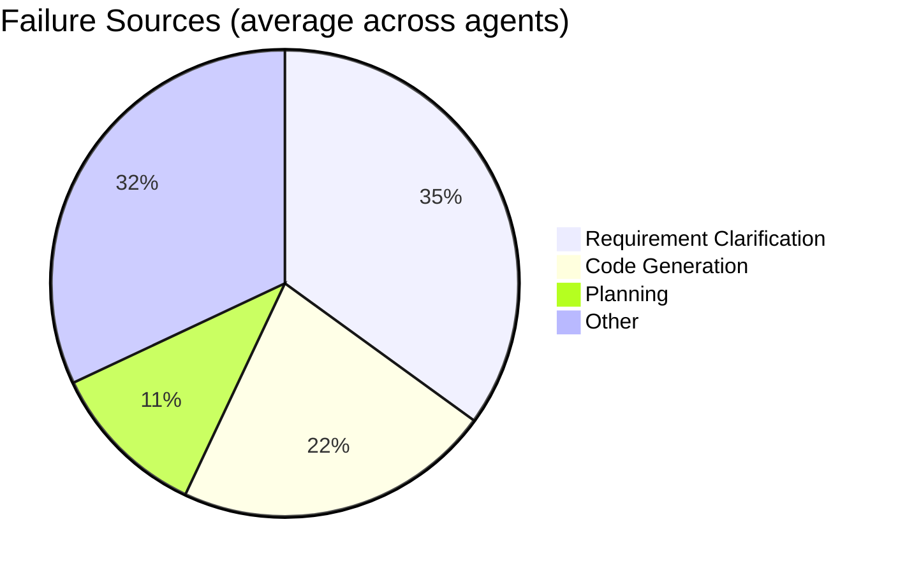
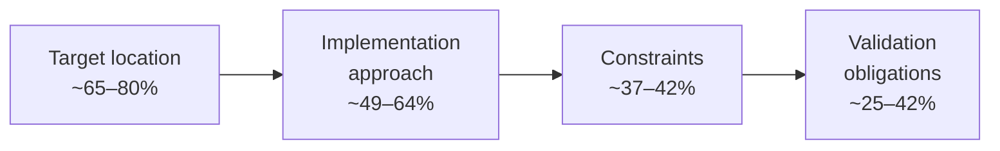

# SWE-RPG: Implicit Requirements Are the Main Bottleneck for Coding Agents — and Codex CLI Pays the Highest Price


Almost every public coding agent benchmark measures patch correctness: did the generated code pass the test suite? SWE-RPG[^1] questions what is left unmeasured — the steps *before* a line of code is written. Can the agent recover what the issue reporter forgot to say? Can it form a plan that respects the codebase's structural conventions? SWE-RPG provides the first benchmark with intermediate ground truths for all three stages: requirement clarification, implementation planning, and code generation. The answer is sobering: across three agent frameworks and six LLM backends, **implicit requirement recovery accounts for 24.5–46.0% of all agent failures**, making it the single largest contributor to non-resolution. And among the three agents tested, Codex carries the highest code-generation failure rate, even though its requirement failure rate is the lowest.

## What SWE-RPG Measures

Standard repository-level benchmarks hand an agent a verbatim GitHub issue and ask it to produce a patch. The implicit assumption is that the issue text contains everything needed. SWE-RPG encodes the opposite assumption: any real issue omits detail.

The benchmark contains 163 tasks drawn from 31 Python and Java repositories — 113 bug fixes and 50 feature additions — curated from more than 2,000 PR–issue pairs down through stability and environment checks to a verified set with matching intermediate ground truths.[^2] Repository scale is non-trivial: average codebase size is 272K lines (max 1.59M), average test suite 2,249 cases, average gold patch 57 lines modified.

The three evaluation stages are:

**Stage 1 — Requirement Clarification.** Six practitioner-informed categories capture the implicit knowledge that issue reporters assume but never write down:

| Code | Category | Avg. points/task |
|------|----------|-----------------|
| C1 | Functional Intent | 1.21 |
| C2 | Business Semantics | 0.60 |
| C3 | Technical Context | 0.72 |
| C4 | Interface / Protocol Specifications | 0.99 |
| C5 | Code Structure / Naming Conventions | 0.47 |
| C6 | Data-Structure Semantics | 0.54 |

The average task carries **4.53 implicit clarification points** validated by ten Fortune Global 500 engineers using 57 seed question–answer pairs.

**Stage 2 — Implementation Planning.** Ground-truth plans average 2.06 action steps, 2.47 file locations, and 11.80 rule constraints. Crucially, each step must be *functionally reproducible*: code generated from the steps alone must yield a semantically equivalent implementation.

**Stage 3 — Code Generation.** Standard SWE-bench pass/fail semantics: fail-to-pass tests must pass, pass-to-pass tests must not regress.

Failure attribution uses a GPT-5.6-Sol judge that assigns each non-resolution to the earliest deviating stage. Validation on 50 runs showed 92% agreement with human consensus.

## Headline Numbers

Eighteen agent–LLM pairings (3 agents × 6 models, each run twice) produced an average resolved rate of **31.5%**.[^3]

| Agent | Avg. resolve rate |
|-------|-----------------|
| OpenCode | 33.0% |
| Claude Code | 32.8% |
| **Codex** | **28.5%** |

Best single configuration: OpenCode + MoonshotAI-Kimi-K3 at **49.7%**. Worst: Codex + MiniMax-M3 at **17.8%**.

LLM backend matters more than agent scaffold for top performance — Kimi-K3 averaged 46.6% across all three agents, with DeepSeek-V4-Pro second at 38.7%. The gap between weakest and strongest backends is roughly 24 percentage points, larger than any agent-scaffold gap.

## The Failure Taxonomy



Requirement clarification failures span **24.5–46.0%** across configurations — the widest band of any stage and the highest floor. Planning failures contribute **5.5–17.8%**, code generation **7.4–37.4%**.[^4]

The planning cascade deserves particular attention. Across all agents, coverage degrades monotonically through the plan:



Agents consistently identify *where* to edit; they consistently fail to specify *how*, and almost never articulate correctness constraints or validation obligations. This pattern is identical across all three agent frameworks, which suggests it is a property of how LLMs translate issues into plans rather than a scaffold-specific failure.

## Codex-Specific Profile

Codex sits last on overall resolve rate but presents a distinctive failure profile that differs from its peers:

- **Requirement failure rate: 26.4%** — lower than Claude Code (39.3%) but higher than OpenCode's best configurations
- **Code generation failure rate: 23.9%** — the highest among the three agents[^5]
- Clarification coverage for C5 (code structure/naming): 42.0%; C6 (data-structure semantics): 41.9% — both among the weakest categories overall

The interpretation is non-obvious: Codex misses fewer implicit requirements than Claude Code does, yet converts those recovered requirements into working code less reliably. This suggests Codex's planning-to-implementation transition is the specific weak point — it reaches the right files and recovers reasonable intent, then fails to correctly operationalise constraints and boundary conditions in the generated patch.

Average cost per task across all configurations: **\$1.59** at an average of **8.5 minutes per task**. Longer execution time did not correlate with better outcomes.

## What This Means for Codex CLI Operators

SWE-RPG's requirement taxonomy maps directly onto the Codex CLI operator surface.

### Explicit Intake Protocol in AGENTS.md

C4 (Interface/Protocol Specifications) and C6 (Data-Structure Semantics) are the two categories with both high average implicit-point count and low agent coverage. Both are expressible as explicit repository conventions. Add a clarification gate to your AGENTS.md:

```markdown
## Issue Intake Protocol

Before writing any code, recover the following for every task:
- **C4 — Interface contracts**: identify all method signatures, error codes, and
  API surface that the patch must remain compatible with.
- **C6 — Data invariants**: identify any constraints on field values, nullability,
  ordering, or serialisation format implied by existing call sites.
- If either is unclear from the issue text alone, ask ONE targeted question before
  proceeding. Do not guess.
```

This mirrors the RealSWE finding[^6] that [D] (desired behaviour) is missing from 94% of real prompts — SWE-RPG names the specific sub-categories of missing detail.

### Seed the Planning Phase via `startup_prompt_template`

The planning cascade shows agents drop from ~70% location coverage to ~25% validation coverage. The `startup_prompt_template` key in `~/.codex/config.toml` can inject planning obligations before the first turn:

```toml
[task]
startup_prompt_template = """
When creating an implementation plan, include all four levels:
1. File and function locations to modify
2. Implementation approach (not just what, but how)
3. Constraints: invariants the patch must not violate
4. Validation: how you will confirm correctness beyond pass/fail tests
"""
```

### Use `--goal` to Anchor Constraint Recovery Across Compaction

C4 and C6 constraints, once identified, are exactly the kind of information lost during context compaction. Encoding them explicitly in a `--goal` argument preserves them across automatic compaction events:

```bash
codex --goal "Fix null-pointer in PaymentProcessor.settle(); \
  must preserve idempotency key contract (C4), \
  Account.balance must remain non-negative invariant (C6)" \
  "See issue #4821"
```

This prevents the recovered implicit requirements from being stripped during a mid-task compaction.[^7]

### Calibrate Agent Selection to Failure Mode

Codex's profile — lower requirement failures, higher code-generation failures — means it performs better on tasks where the issue is detailed enough that implicit requirements are minimal, but the code transformation is straightforward. For tasks with dense implicit requirements (interface-heavy APIs, data-structure invariants), the data suggests investing time in an explicit pre-clarification pass before handing off to Codex rather than expecting the agent to self-recover.

## What SWE-RPG Leaves Open

SWE-RPG evaluates agents with no clarification dialogue — the agent receives the issue text and must implicitly recover what is missing. The benchmark does not test whether providing an explicit clarification round trip (asking a human or an oracle for answers) closes the gap. That question — and whether the intake protocol above materially moves the 28.5% Codex baseline — is currently untested in the literature.[^8]

The taxonomy itself was validated against Fortune 500 engineering contexts, which may not fully generalise to open-source repositories. The Java/Python restriction also limits ecosystem coverage.

## Citations

[^1]: Zhou, X., Chong, C. Y., Kim, K., Peng, Y., Shu, R., Wu, Z., Han, X., Yuan, G., Zhuang, Z., Kim, J., Ju, J., Ju, S., Yoon, T., & Lo, D. (2026). *SWE-RPG: A Unified Issue Resolution Benchmark for Requirement Clarification, Planning, and Code Generation for Coding Agents*. arXiv:2608.09072v1. https://arxiv.org/abs/2608.09072v1

[^2]: SWE-RPG-Bench dataset and evaluation code. GitHub repository: https://github.com/Xin-Zhou-smu/SWE-RPG-Bench

[^3]: SWE-RPG HTML paper, results section: 18 agent–LLM configurations; average 31.5% resolve rate. https://arxiv.org/html/2608.09072v1

[^4]: SWE-RPG HTML paper, failure attribution analysis: GPT-5.6-Sol judge; 92% agreement with human consensus on 50-run validation sample. https://arxiv.org/html/2608.09072v1

[^5]: SWE-RPG HTML paper, Codex-specific results: 28.5% average resolve rate; code generation failure rate 23.9% (highest of three agents); requirement failure rate 26.4%. https://arxiv.org/html/2608.09072v1

[^6]: Kim et al. (2026). *RealSWE: A Compositional Evaluation of Coding Agents under Realistic User Requests*. arXiv:2608.27831. Desired Behaviour [D] absent from 94.6% of real bug-fix prompts vs 26.5% in benchmarks. https://arxiv.org/abs/2608.27831

[^7]: Codex CLI v0.152.0 stable, September 2026: user instructions and Guardian authorisations persist through auto-compaction; `--goal` flag for persistent task objective. https://learn.chatgpt.com/docs/changelog

[^8]: ⚠️ The counterfactual — resolve rate improvement when agents are provided explicit clarification answers — has not been quantified in the SWE-RPG paper as published. This remains an open research question.
