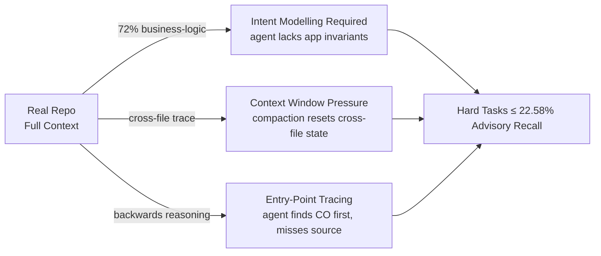

# VulnGym: Why Coding Agents Score Under 23% on Repository-Level Vulnerability Detection — and What It Means for Codex CLI Security Workflows


Most coding-agent security demos look impressive. The agent reads a snippet, identifies an injection flaw, patches it. What happens when you remove the hand-picked snippet and point the agent at an entire real-world repository — the same way a security engineer would?

VulnGym, a benchmark from Tencent (arXiv:2608.02001, August 2026), answers that empirically.[^1] The best agent-model combination achieves an advisory recall of **22.58%** on hard-difficulty tasks. Most configurations score in single digits. This article explains what VulnGym measures, why these numbers are structurally low, and what they should change in your Codex CLI security workflows.

---

## What VulnGym Tests

Existing vulnerability benchmarks are dominated by snippet-level tasks: present a pre-selected excerpt and ask for classification. That is not what a security audit looks like. VulnGym replicates real audit conditions across:[^2]

- **184 GitHub Security Advisories** from real CVEs and CWEs
- **408 vulnerability entries**, each annotated at line level with an *entry point* (where attacker-controlled input enters) and a *critical operation* (where the vulnerable effect occurs)
- **23 repositories** across **38 projects**, evaluated at fixed vulnerable-commit snapshots
- **393 entries (96.3%)** verified by human audit

The benchmark decomposes the task into four evaluation modes:

| Task | Oracle Hints | Measures |
|---|---|---|
| T1 — End-to-End Detection | None | Full autonomous detection |
| T2 — Entry Point | Advisory text | Can agent locate where input enters? |
| T3 — Critical Operation | Advisory + EP | Can agent locate the dangerous operation? |
| T4 — Trace Construction | Advisory + EP + CO | Can agent build the full data-flow trace? |

An agent can pass T2–T4 and still fail T1. The oracle subtasks are diagnostic probes that reveal exactly where the reasoning chain breaks.

Two primary metrics drive the leaderboard:[^3]

- **Advisory-level recall**: fraction of advisories where ≥1 entry matches
- **Entry-level recall**: fraction of individual entries matched (|Δline| ≤ 5 tolerance, exact normalised file-path)

---

## The Dataset: 71% Business Logic

VulnGym's vulnerability distribution deliberately diverges from prior benchmarks. **71.2% of advisories are business-logic flaws** — not injection patterns that static analysers catch reliably.[^2]

Top categories: broken authorisation logic (31 advisories), missing authorisation (23), AI capability boundary bypass (20), code injection (12), path traversal (9), command injection (8).

The AI capability boundary bypass category is notable for 2026: these are LLM-integrated applications that fail to enforce limits on what the model component can do — exactly the attack surface that grows as coding agents ship to production.

Business-logic flaws require understanding the *intended* data flow across multiple files. That is why conventional SAST tools plateau and why coding agents struggle.

---

## Results

The paper tests seven models across three agent scaffolds — Claude Code, OpenHands, and MiniSWE — on hard-difficulty tasks (31 advisories, 46 entries).[^1]

### End-to-End Detection (T1, Hard)

| Configuration | Advisory Recall | Entry Recall |
|---|---|---|
| DeepSeek-V4-Flash + OpenHands | **22.58%** | **15.22%** |
| Qwen3.5-27B + Claude Code | 12.90% | 8.70% |
| GLM-5.2 + OpenHands | 6.45% | 4.35% |
| Qwen3.5 9B and below | 0% | 0% |

Scaling within the Qwen3.5 family is non-monotonic: the 4B model outperforms the 9B on easy tasks, pointing to context management rather than raw capacity as the binding constraint.

### Oracle Subtask Ceilings (T2–T4, Hard)

Even with the full advisory text provided (T2), the best file-level recall for entry-point identification is **30.23%**. With both EP and advisory (T3), CO file recall peaks at **51.16%**. Trace edit similarity (T4) tops out at **36.37%**. These oracle ceilings define an upper bound on what T1 end-to-end performance could ever reach.

### Failure Modes (T1, 347 relation-level failures)

```
No matching file for EP or CO:       26.8%
CO file matched, EP missing:         29.7%
EP missing, CO-only match:           23.1%
CO missing (EP file matched only):    9.2%
No usable finding submitted:         11.2%
```

The dominant pattern — finding the CO file but missing the entry point — reveals that agents locate *where the dangerous operation occurs* but cannot trace backwards to *where attacker input enters*. This is the hard half of data-flow analysis.

---

## Why the Gap Is Structural



Three architectural issues compound each other. First, business-logic flaws require the agent to model what *correct* authorisation looks like for a specific application — a kind of intent modelling that current agents do not maintain persistently. Second, cross-file traces span modules never simultaneously loaded into context; compaction events (which drop KV cache hit rate by ~66 percentage points[^4]) erase the cross-file state the agent has built. Third, agents are optimised for forward code generation, not backwards source-tracing; the failure taxonomy confirms this — 29.7% of failures find the target operation but cannot complete the inbound path.

---

## Codex CLI Mapping

VulnGym is not a reason to abandon agentic security tooling. It is a reason to deploy it in the workflow positions where agents actually perform.

### Deploy as First-Pass Triage, Not Sole Reviewer

Agents score meaningfully higher on easy-to-medium advisory difficulty. Use Codex CLI for high-volume initial triage; route flagged findings to human review or SAST tools (Semgrep, CodeQL) for hard cases.

```toml
# config.toml — read-only security audit profile
[profile.security-audit]
approval_policy = "on-request"
sandbox = "read-only"

[agent]
auto_compact_token_limit = 120000   # headroom for cross-file context
```

```bash
codex --profile security-audit \
      --goal "Audit for authorisation bypass. For each finding report: \
              entry_point file+line, critical_operation file+line, data-flow path." \
      --rollout-budget 120 /path/to/target-repo
```

### Encode the Oracle-Subtask Protocol in AGENTS.md

The T1–T4 decomposition is itself a prompting discipline. Encoding it in AGENTS.md forces the agent to work the way VulnGym measures performance:

```markdown
## Security Audit Protocol

1. Identify entry_point (attacker-controlled input) before anything else.
   Never submit a finding without a specific file+line for the entry point.
2. Trace the data flow from entry_point to critical_operation.
3. Report critical_operation only after establishing the inbound path.
4. Prioritise authorisation/access-control flaws over pattern-detectable injection.
```

### Gate Incomplete Findings with on_mcp_tool_result

The 11.2% of failures that produce no usable finding waste token budget. An `on_mcp_tool_result` hook (available since v0.151.0)[^5] can detect and reject incomplete finding objects before compaction discards the loaded repository context:

```bash
#!/usr/bin/env bash
# hooks/security-finding-gate.sh
RESULT=$(cat /dev/stdin)
ENTRY_POINT=$(echo "$RESULT" | jq -r '.entry_point // empty')
CRITICAL_OP=$(echo "$RESULT" | jq -r '.critical_operation // empty')

if [[ -z "$ENTRY_POINT" || -z "$CRITICAL_OP" ]]; then
  echo "Incomplete finding: missing entry_point or critical_operation" >&2
  exit 2   # signal agent to refine before proceeding
fi
echo "$RESULT"; exit 0
```

---

## Caveats

VulnGym evaluates detection only — not exploitation or remediation. An agent that correctly maps entry point to critical operation may still produce an incorrect patch. False-positive rates are not measured; a tool that flags every line achieves 100% recall at zero utility. The AI capability boundary bypass category (20 advisories) is methodologically novel and lacks external CWE validation. ⚠️

Codex CLI is not among the three tested scaffolds; Claude Code, OpenHands, and MiniSWE results are indicative of the capability class, not Codex CLI-specific benchmarks.

---

## Summary

VulnGym (Tencent, arXiv:2608.02001) is the first repository-scale benchmark requiring coding agents to find vulnerabilities from scratch across 184 real advisories and 408 line-annotated entries. The best configuration reaches 22.58% advisory recall on hard tasks; most score below 13%; models at 9B parameters and below score zero. The failure modes — inability to trace entry points backwards, context loss across files, missing business-logic intent modelling — are structural. For Codex CLI practitioners: deploy agents as first-pass triage on easy-to-medium complexity, encode the oracle-subtask decomposition in AGENTS.md, gate incomplete findings via `on_mcp_tool_result`, and maintain SAST or human review as the primary signal on hard-difficulty targets.

---

## Citations

[^1]: Ji, K., Liu, J., Hu, E., Gao, C., Lian, K., Liu, Y., Zhang, L., Dong, T., Chen, H., & Bin, W. (2026). *VulnGym: Benchmarking Coding Agents for Repository-Level Vulnerability Detection*. arXiv:2608.02001. https://arxiv.org/abs/2608.02001

[^2]: Tencent/VulnGym GitHub repository (v0.1.4, updated June 26, 2026). https://github.com/Tencent/VulnGym

[^3]: Promptfoo LLM Security Database — Repository-Level Coding Agent Vulnerability Detection Gaps. https://www.promptfoo.dev/lm-security-db/vuln/repository-level-coding-agent-vulnerability-detection-gaps-b4001fcb/

[^4]: Liu, Y. et al. (2026). *Agentic Coding in the Wild: Characterizing GitHub Copilot Traces at Production Scale*. arXiv:2608.00101. https://arxiv.org/abs/2608.00101

[^5]: OpenAI Codex CLI v0.151.0 — `on_mcp_tool_result` hook. https://github.com/openai/codex/blob/main/CHANGELOG.md

[^6]: Hugging Face — tencent/VulnGym dataset card. https://huggingface.co/datasets/tencent/VulnGym
