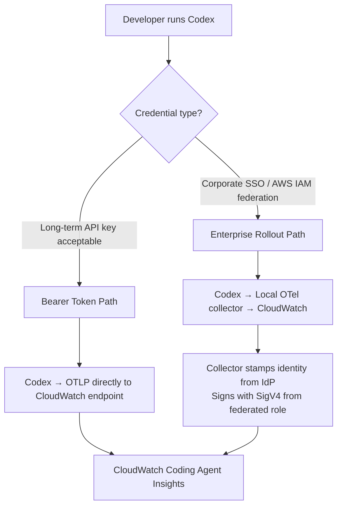
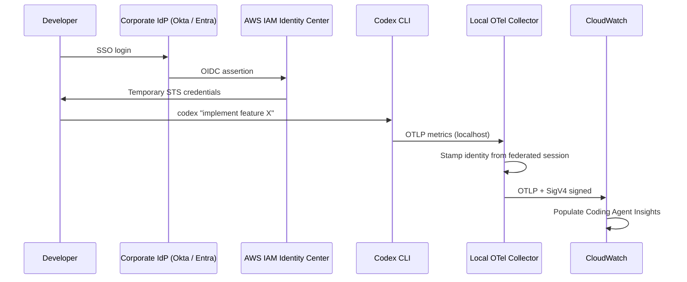
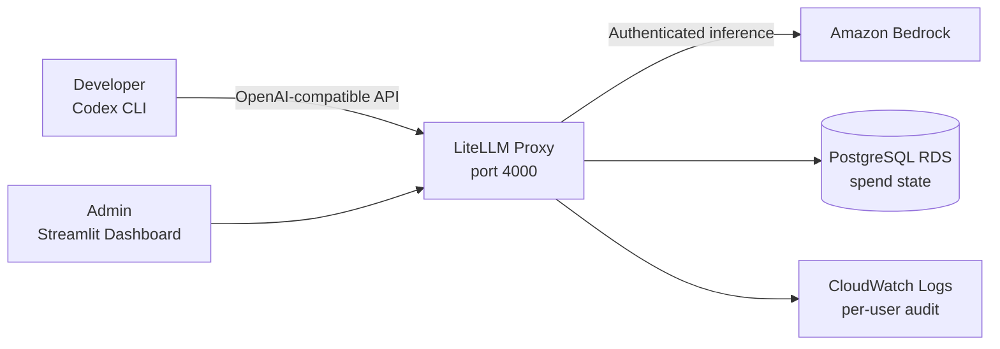

# Codex CLI Fleet Observability: CloudWatch Coding Agent Insights, OTel Bearer Tokens, and Enterprise SSO Rollout


On 20 July 2026, AWS launched **CloudWatch Coding Agent Insights** — a purpose-built console experience for tracking token consumption, per-turn latency, tool calls, and developer adoption across Claude Code, Codex, and GitHub Copilot.[^1] If you have been waiting for a first-class answer to "how much is Codex actually costing us and who is using it", this is it. The tricky part is the wiring: getting identity attributes flowing through OpenTelemetry correctly without exposing secrets or breaking the dashboard groupings. This article covers both setup paths, the LiteLLM quota layer, and the attribute-schema gotcha that breaks dashboards silently.

## What the Dashboard Tracks

Coding Agent Insights reads standard OTel metrics emitted by Codex over the OTLP protocol.[^2] The signals fall into four categories:

- **Token consumption** — input and output token counts per turn, per session, and per model
- **Per-turn latency** — time-to-first-token and round-trip, useful for spotting compaction events or context-explosion costs
- **Tool calls and API requests** — shell executions, file reads, MCP invocations — the activity mix that distinguishes exploratory sessions from focused implementation
- **Approvals** — how often `approval_policy = ask` interrupts the agent, by team and by task type

Metrics appear in the CloudWatch console under **GenAI Observability → Coding Agent Insights → Codex**. You can segment by `organization`, `department`, `team`, `cost_center`, or individual `user.id`, export as CSV, or query with PromQL.[^3]

The dashboard does _not_ automatically infer cost from token counts — it reports raw tokens. You join them against model pricing outside the console. ⚠️ Beware third-party articles that quote dollar figures directly from the dashboard; those calculations embed assumptions about pricing tiers that may not match your Bedrock contract.

## Two Setup Paths

AWS documents two paths based on credential strategy:



The inference backend (OpenAI direct vs. Amazon Bedrock) is independent of which telemetry path you choose for the bearer token variant.[^4] The enterprise SSO path, however, is built around centralised Bedrock access — inference and telemetry credentials come from the same federated role.

## Bearer Token Path: Fastest Start

For an individual developer or a team of fewer than ~20, the bearer token path needs no collector infrastructure. Add an `[otel]` block to `~/.codex/config.toml`:

```toml
[otel]
environment = "production"

[otel.metrics_exporter]
otlp-http = { endpoint = "https://monitoring.us-east-1.amazonaws.com/v1/metrics", protocol = "binary", headers = { "Authorization" = "Bearer ${CLOUDWATCH_METRICS_API_KEY}" } }
```

Key points:
- The `/v1/metrics` path must be explicit — Codex does not append it.[^5]
- Replace `us-east-1` with your AWS region.
- `chmod 600 ~/.codex/config.toml` — bearer tokens are long-lived credentials. Do not commit this file.

Before launching Codex, export identity as OTel _resource_ attributes:

```bash
export OTEL_RESOURCE_ATTRIBUTES="\
user.id=jsmith,\
user.email=jsmith@example.com,\
user.name=Jane Smith,\
department=platform-engineering,\
team.id=dx,\
cost_center=cc-4420,\
organization=example-corp"
```

**Critical schema rule**: these fields must be resource attributes, not metric attributes.[^6] If you emit them as metric labels via a custom exporter configuration, the dashboard grouping logic silently breaks — panels render as empty or "unknown". AWS is explicit that the identity fields must sit in the OTel resource bundle.

Verify by running a short Codex session and navigating to the dashboard. Metrics typically appear within minutes.

## Enterprise SSO Path: Fleet-Scale

For organisations federating identity through Okta, Microsoft Entra ID, Auth0, or AWS IAM Identity Center, the enterprise path avoids distributing any static credentials.[^7] The architecture introduces a per-developer local OTel collector that:

1. Receives metrics from Codex on `localhost`
2. Stamps `user.email`, `department`, `team`, and `cost_center` from the federated IAM session
3. Signs OTLP requests with AWS Signature Version 4 (SigV4) using the developer's temporary credentials
4. Forwards to the CloudWatch native OTLP endpoint

Centralised Bedrock access uses a federated role scoped to the Bedrock model invocations Codex needs — no static model credentials distributed to laptops. AWS provides CloudFormation templates and setup scripts in [github.com/openai-on-aws/guidance-codex](https://github.com/openai-on-aws/guidance-codex) that generate per-developer collector configs and populate the Codex `[otel]` block automatically from the federated session.[^8]



The identity and organisational attributes arrive in the same OTel resource attribute shape as the bearer token path, so the same dashboards populate without any additional configuration.[^7]

## Adding Hard Quota Enforcement with LiteLLM

CloudWatch Coding Agent Insights is observability — it tells you what happened. If you need to _prevent_ runaway spend before it accumulates, add a LiteLLM proxy layer between Codex and Bedrock.[^9]

The `aws-samples/sample-codex-amazon-bedrock-usage-governance-with-litellm` reference architecture positions LiteLLM as a governance gateway:



LiteLLM enforces:
- **Hard USD budget blocks** per user and per team (rolling monthly); the proxy refuses requests at the limit — no soft warnings
- **Token-per-minute and request-per-minute rate limits**
- **Model whitelisting** — restrict which Bedrock model IDs a given team can invoke
- **Immutable audit trails** — every spend reset is written to a `SpendAuditHistory` table; users cannot self-reset

Because LiteLLM speaks the OpenAI API wire format, `model_provider = "amazon-bedrock"` in `config.toml` is replaced by a direct endpoint pointing at the proxy — Codex does not need to know a proxy is in the chain.[^9]

## Operational Gotchas

**Region availability**: Coding Agent Insights is not available in Middle East (UAE), Middle East (Bahrain), or Israel (Tel Aviv).[^1] If your Bedrock region is `eu-west-1` or `ap-southeast-1` you are fine; confirm before rolling out.

**Credential refresh for Bedrock API keys**: Bedrock short-term API keys (generated in the Bedrock console) expire after 12 hours.[^10] Codex retries five times before surfacing the `401 Signature expired` error clearly (improved in PR #28992). For long-running agent sessions, prefer AWS SDK credential chain profiles — `credential_process` with a helper script that fetches fresh credentials from your secrets manager — over bearer tokens that silently expire mid-session.

**Token overhead**: Codex injects its own system prompt and tool definitions into every Bedrock request — approximately 9,400–9,500 tokens before your task content reaches the model.[^10] This baseline appears in the CloudWatch token-consumption charts and inflates apparent per-turn costs for short tasks. Account for it when calculating unit economics.

**1Password `credential_process` pattern**: the `op plugin run` approach fails when invoked non-interactively (Codex does not spawn an interactive shell). Use `op item get` directly in your credential script instead.[^11]

## What This Changes for Platform Teams

Before Coding Agent Insights, understanding Codex spend required parsing OpenAI API billing exports and cross-referencing against git activity logs by hand. You now get segmented, real-time token consumption with department- and team-level breakdowns inside the same CloudWatch console you already use for production observability. The enterprise SSO path makes every Codex session attributable to a named human, scoped by IAM permissions, routed through your VPC, and logged to CloudTrail — a meaningful step towards treating Codex as first-class infrastructure rather than a developer convenience.

## Citations

[^1]: Amazon Web Services. "Amazon CloudWatch announces coding agent insights." AWS What's New, 20 July 2026. <https://aws.amazon.com/about-aws/whats-new/2026/07/cloudwatch-coding-agent-insights/>

[^2]: AWS Documentation. "Set up OpenTelemetry for OpenAI Codex." Amazon CloudWatch Developer Guide. <https://docs.aws.amazon.com/AmazonCloudWatch/latest/monitoring/coding-agents-codex.html>

[^3]: Let's Data Science. "AWS Launches CloudWatch Coding Agent Insights." <https://letsdatascience.com/news/cloudwatch-adds-coding-agent-insights-dashboards-83f474af>

[^4]: AWS Documentation. "Set up OpenAI Codex with a bearer token." Amazon CloudWatch Developer Guide. <https://docs.aws.amazon.com/zh_cn/AmazonCloudWatch/latest/monitoring/coding-agents-codex-bearer-token.html>

[^5]: ofox.ai. "Codex CLI config.toml: Custom Model, API & Proxy Setup (2026)." <https://ofox.ai/blog/codex-cli-config-toml-deep-dive/>

[^6]: Let's Data Science. "AWS Launches CloudWatch Coding Agent Insights." Identity and organisational fields must be OTel resource attributes for dashboard grouping. <https://letsdatascience.com/news/cloudwatch-adds-coding-agent-insights-dashboards-83f474af>

[^7]: AWS Documentation. "Set up OpenAI Codex for an enterprise rollout." Amazon CloudWatch Developer Guide. <https://docs.aws.amazon.com/AmazonCloudWatch/latest/monitoring/coding-agents-codex-enterprise.html>

[^8]: OpenAI on AWS. "Guidance for Codex on Amazon Bedrock." GitHub repository. <https://github.com/openai-on-aws/guidance-codex>

[^9]: AWS Samples. "sample-codex-amazon-bedrock-usage-governance-with-litellm." GitHub repository. <https://github.com/aws-samples/sample-codex-amazon-bedrock-usage-governance-with-litellm>

[^10]: DEV Community / AWS. "How to run Codex with GPT-5.6 on Amazon Bedrock." <https://dev.to/aws/how-to-run-codex-with-gpt-56-on-amazon-bedrock-12f4>

[^11]: Classmethod. "I tried Codex with Amazon Bedrock!" DevelopersIO. Credential process non-interactive invocation caveat. <https://dev.classmethod.jp/en/articles/codex-with-amazon-bedrock/>
