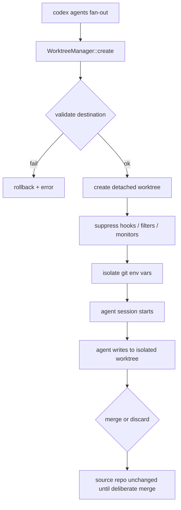
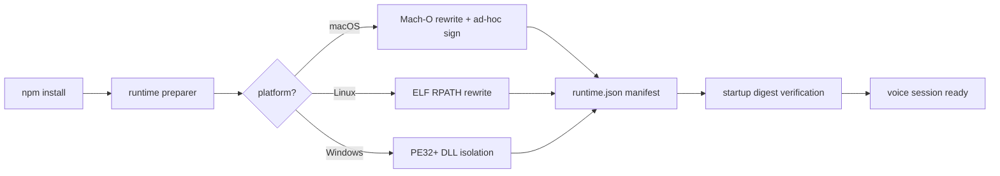

# Codex CLI, 2 September 2026: Managed Worktrees, Cross-Platform Voice Runtime, and TUI Resilience


Five pull requests merged on 2 September 2026 collectively reshape three distinct layers of Codex CLI: the agent-workspace boundary, the voice distribution pipeline, and the TUI session model.[^1][^2][^3][^4][^5] None of these is a headline feature in the marketing sense, but each solves a problem that practitioners hit regularly. This article unpacks what changed and why it matters.

---

## Managed Worktree Creation

The most significant addition for multi-agent workflows is `WorktreeManager::create` (PR #42196).[^1] Until now, creating isolated git worktrees for parallel agent sessions required scripting around `git worktree add` by hand—and, critically, passing the right environment-variable suppressions to prevent hooks, filesystem monitors, and content filters from the source repository leaking into the worktree context.

`WorktreeManager::create` handles that isolation contract automatically:

- Creates a **detached, Desktop-compatible worktree** from `HEAD` or an explicit base ref.
- **Isolates git operations** from inherited repository selectors, hooks, filesystem monitors, and configured content filters.
- **Preserves the source working-directory path** so the agent knows where the original workspace is.
- **Validates the destination directory** before writing and rolls back any incomplete worktree state and empty allocation buckets on failure.

### Why This Matters for Parallel Agent Sessions

When you run `codex agents` to fan out multiple tasks, each agent session needs a stable, independent view of the repository. Without worktree isolation, concurrent agents can observe each other's in-progress edits, trigger the wrong pre-commit hooks, or have their index state clobbered by a sibling session. Worktree isolation at the OS level is the standard defence—but wiring it up correctly requires suppressing a non-obvious list of git environment variables (`GIT_DIR`, `GIT_WORK_TREE`, `GIT_INDEX_FILE`, core hooks paths, and protocol filters).

`WorktreeManager::create` encapsulates that list behind a single API call. The managed worktree lifecycle—validate, create, isolate, roll back on error—now mirrors what Codex CLI already does for sandboxed execution environments, giving parallel agents a coherent story at every layer.



### Configuration Pattern

There is no `config.toml` key to set — `WorktreeManager` is an internal runtime concern invoked by `codex agents` when spinning up multi-agent tasks. The practical implication is that existing AGENTS.md directives and per-project hooks continue to fire within their worktree scope without contaminating sibling sessions.

---

## Cross-Platform Voice Runtime Distribution

Three PRs landed on the same day to complete a tri-platform voice runtime packaging story: macOS (PR #42204)[^2], GNU/Linux (PR #42208)[^3], and Windows (PR #42209)[^4].

Codex CLI's voice subsystem relies on platform-native audio libraries—primarily GStreamer for Linux and Windows, and Mach-O–linked frameworks on macOS. Distributing these as self-contained, relocatable binaries is non-trivial: system paths baked into shared libraries at build time break when the user installs Codex CLI to a different prefix.

The new runtime preparers solve this by post-processing libraries before packaging:

| Platform | Binary Format | Relocation Mechanism |
|----------|--------------|---------------------|
| macOS    | Mach-O       | Remove build-time runpaths; rewrite non-system dylib references relative to loader; apply ad-hoc signature[^2] |
| Linux    | ELF64 (x64 + ARM64) | Force relative RPATH; manage `lib/gstreamer-1.0/` plugin layout[^3] |
| Windows  | PE32+ (x64 + ARM64) | Validate with `dumpbin`; resolve GStreamer plugin deps; copy to isolated `bin/`[^4] |

Each preparer validates inputs before writing outputs and emits a `runtime.json` manifest capturing file digests and dependency closures. This manifest is verified on startup to detect corrupt or tampered distributions—a defence-in-depth measure that complements the OS-level sandbox.

### What Changes for Users

If you install Codex CLI via npm (`npm install -g @openai/codex`) on any of the three platforms, voice sessions will now work out of the box without requiring a pre-installed system GStreamer or specific `DYLD_LIBRARY_PATH` configuration. The preparer runs once at install time, materialises the required libraries into a package-relative `bin/` or `lib/` directory, and records digests. Subsequent launches verify the manifest instead of probing system paths.

### What Changes for Plugin Developers

The GStreamer plugin selection is explicit—each preparer lists the plugins it expects. If you build a custom voice processing plugin and want it bundled, the plugin must be declared in `third_party/voice/sources.json`.[^4] Unknown plugins are rejected rather than silently included. This makes the voice runtime surface a **closed, auditable bill of materials** rather than an ambient system dependency—consistent with Codex CLI's broader posture on sandboxed, reproducible execution.



---

## TUI LocalSettings Separation

PR #42202[^5] addresses a subtler but frequently encountered irritation: user preferences getting clobbered when reconnecting to a thread, forking a session, or switching app-server roots.

The root cause was architectural—TUI preferences and server-derived thread configuration were both stored in the same resolved `Config` object. When a session transition triggered a config reload, server-provided values would silently overwrite local user settings (history depth, notice visibility, keybindings, and persistence paths).

The fix introduces `LocalSettings` as a **client-owned, TUI-scoped layer** that lives outside the server-negotiated config:

- `LocalSettings` persists across widget replacement, root switching, and thread reconnects.
- User preference modifications write directly to the selected user config file rather than to transient in-memory state.
- Local settings reload from disk only when the user explicitly changes configuration roots—not on every server message.
- Authentication-dependent onboarding is now driven by server account responses rather than local model-provider config, removing a category of false-positive onboarding nags.

The practical effect: if you have customised `tui.history_size`, `tui.notice_filter`, or any keymap overrides, those settings survive session forks and app-server reconnects without needing to be re-applied.

---

## Vim Replace Mode

PR #42194[^6] adds Replace mode to the TUI composer, activated by `R` in Vim normal mode:

```
Normal mode → R → Replace mode
```

Behaviour mirrors standard Vim: typing overwrites graphemes one at a time; on reaching the end of the line, additional input is appended rather than wrapping. Backspace recovers the previously overwritten character. Replace mode integrates with undo and dot-repeat, and is configurable via `tui.keymap.vim_normal.enter_replace_mode` for custom keymap layouts.

Small addition, but it completes the Vim modal editing surface in the composer alongside Insert, Normal, and Visual modes introduced in earlier releases.

---

## TUI Reconnect Retry for Closing Threads

PR #42207[^7] fixes a false-negative in the reconnect logic. When a TUI client attempts to resume a thread that is still in the process of closing, the app server returns error code `-32600`—the same code used for permanently unavailable threads. The previous implementation treated these identically and immediately marked the conversation unavailable.

The fix distinguishes between transient "is closing" responses and permanent unavailability, allowing the reconnect loop to retry rather than abort. In practice this manifests as a shorter, transparent pause rather than a broken session requiring manual intervention.

---

## Summary of September 2 Changes

| PR | Feature | Layer |
|----|---------|-------|
| #42196 | `WorktreeManager::create` — managed, isolated git worktrees for parallel agents | Agent runtime |
| #42204 | macOS voice runtime: Mach-O relocation + ad-hoc signing | Voice distribution |
| #42208 | Linux voice runtime: ELF64 RPATH rewrite, ARM64 support | Voice distribution |
| #42209 | Windows voice runtime: PE32+ DLL isolation, ARM64 support | Voice distribution |
| #42202 | `LocalSettings` separation — preferences survive session transitions | TUI stability |
| #42194 | Vim Replace mode (`R`) in TUI composer | Editor UX |
| #42207 | Reconnect retry for closing threads | TUI resilience |

The managed worktree feature is the most directly actionable for teams running parallel agent sessions: the WorktreeManager delivers the correct isolation contract without manual environment plumbing. The voice runtime work completes a distribution story that makes voice sessions installation-ready across all three desktop platforms. And the TUI preference separation quietly removes an everyday frustration for anyone who customises their Codex CLI session model.

---

## Citations

[^1]: openai/codex PR #42196, "Add managed worktree creation", merged 2 September 2026. [https://github.com/openai/codex/pull/42196](https://github.com/openai/codex/pull/42196)

[^2]: openai/codex PR #42204, "Add macOS voice runtime projection", merged 2 September 2026. [https://github.com/openai/codex/pull/42204](https://github.com/openai/codex/pull/42204)

[^3]: openai/codex PR #42208, "Add GNU Linux voice runtime preparation", merged 2 September 2026. [https://github.com/openai/codex/pull/42208](https://github.com/openai/codex/pull/42208)

[^4]: openai/codex PR #42209, "Add Windows voice runtime preparation", merged 2 September 2026. [https://github.com/openai/codex/pull/42209](https://github.com/openai/codex/pull/42209)

[^5]: openai/codex PR #42202, "Separate TUI preferences from server configuration", merged 2 September 2026. [https://github.com/openai/codex/pull/42202](https://github.com/openai/codex/pull/42202)

[^6]: openai/codex PR #42194, "Add Vim replace mode to the TUI composer", merged 2 September 2026. [https://github.com/openai/codex/pull/42194](https://github.com/openai/codex/pull/42194)

[^7]: openai/codex PR #42207, "Retry TUI reconnects while threads are closing", merged 2 September 2026. [https://github.com/openai/codex/pull/42207](https://github.com/openai/codex/pull/42207)
