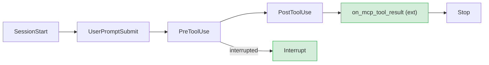
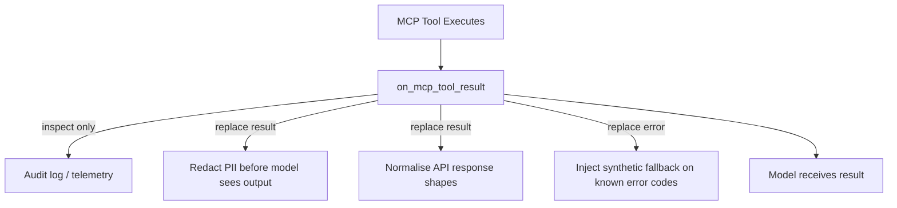
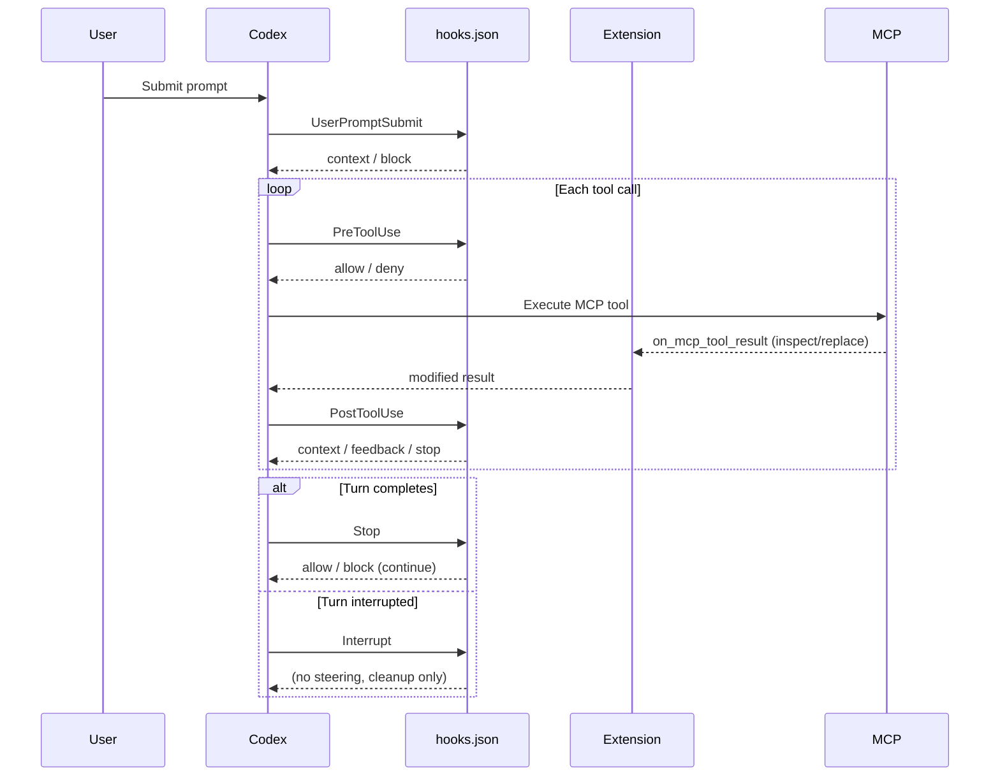

# Codex CLI v0.150.0 & v0.151.0: Interrupt Hooks, MCP Result Interception, and the Completed Lifecycle Architecture


Two releases shipped in quick succession on 26 and 29 August 2026 — v0.150.0 and v0.151.0 — that together close the last gaps in Codex CLI's hooks architecture.[^1] The additions are technically modest in size but strategically significant: you can now intercept every meaningful phase of an agent turn, from first prompt submission through tool invocation, MCP result processing, voluntary stop, and now involuntary interruption. This article covers both releases in depth, with configuration examples and practical patterns for each new capability.

## The Hooks Lifecycle Before These Releases

Prior to v0.150.0, the `hooks.json` event set covered five phases:[^2]


There were two visible gaps. First, **interruption** — pressing Escape or receiving a kill signal during an active turn — fired no hook, leaving no structured place to record partial state or trigger cleanup. Second, **MCP tool results** arrived at the model without any extension being able to examine or modify them after execution. v0.150.0 closed the first gap; v0.151.0 closed the second.



---

## v0.150.0 — Interrupt Hooks

Released 26 August 2026.[^1] PR #40511, merged 25 August.[^3]

### What Fires the Interrupt Event

The `Interrupt` event fires **before** the interrupted-abort event is emitted for an active top-level turn. The turn transcript is flushed to disk before the hook runs, so the handler receives a consistent snapshot of what the agent had done up to the moment of interruption.

**Constraints:**
- Fires only for **top-level turns** — never for subagents running within a multi-agent session.[^3]
- Default timeout: **1 second**. Maximum: **3 seconds**.[^3] These are much tighter than other hook timeouts because the user is actively waiting after pressing Escape.
- Supports both `command` handlers and **MCP handlers**, including asynchronous commands.

### Configuration

Add an `Interrupt` key to your `hooks.json`:

```json
{
  "hooks": {
    "Interrupt": [
      {
        "hooks": [
          {
            "type": "command",
            "command": "python3 ~/.codex/hooks/on_interrupt.py",
            "timeout": 2,
            "statusMessage": "Saving turn state..."
          }
        ]
      }
    ]
  }
}
```

The payload delivered to the hook on stdin matches the pattern of other lifecycle hooks, providing session metadata, turn context, the transcript path, the current working directory, the active model, and the permission mode.

### Practical Patterns

**State snapshot on interruption.** If your team runs long-horizon tasks, an Interrupt hook that appends a structured entry to `~/.codex/interrupt-log.jsonl` gives you a resumption artefact — the last known working directory, pending tool calls, and the transcript path — without relying on manual memory or conversation scroll-back.

```python
#!/usr/bin/env python3
import json, sys, datetime, pathlib

payload = json.load(sys.stdin)
log = pathlib.Path.home() / ".codex" / "interrupt-log.jsonl"
entry = {
    "ts": datetime.datetime.utcnow().isoformat(),
    "session_id": payload.get("session_id"),
    "cwd": payload.get("cwd"),
    "transcript": payload.get("transcript_path"),
    "model": payload.get("model"),
}
with log.open("a") as f:
    f.write(json.dumps(entry) + "\n")
```

**CI pipeline abort notification.** When a Codex session runs in a CI worker, an Interrupt hook can POST to a webhook or call `codex queue` on the orchestrating session with the partial transcript path, preventing silent failures that leave downstream tasks blocked indefinitely.

**Cleanup before discard.** If your PreToolUse hook tracks a list of temporary artefacts created during the turn (scratch files, test databases, ephemeral containers), the Interrupt hook is the correct place to tear them down — not Stop, which only fires on voluntary completion.

---

## v0.150.0 — Terminal Workflow Improvements

Beyond Interrupt hooks, v0.150.0 also shipped several productivity changes.[^1]

**@ task mentions.** Inside a terminal session you can now reference other Codex tasks by name using `@` syntax. The agent can read, create, or send messages to referenced tasks, supporting explicit task graphs without leaving the current session.[^4] This complements `codex queue` (v0.149.0) by enabling in-context cross-task references rather than out-of-band delivery.

**Smarter `/copy` picker.** The command now presents a multi-choice picker — full response, individual code blocks, or blockquoted sections — rather than copying the entire last response unconditionally.

**Auto-titling and `/rename` suggestions.** Unnamed terminal tasks receive descriptive titles automatically generated from conversation context. `/rename` now pre-populates an editable suggestion rather than presenting a blank prompt.

**Clickable Markdown links.** Hyperlinks in agent output render as clickable labels in terminals that support OSC 8 hyperlinks, with the raw URL preserved for terminals that do not.

**Vim dot-repeat.** Vim mode now supports `.` for repeating the last edit action in the TUI composer.

---

## v0.151.0 — MCP Result Interception

Released 29 August 2026.[^1] Two PRs are relevant.

### on_mcp_tool_result — The Extension Hook

PR #41202 adds `ToolLifecycleContributor::on_mcp_tool_result` to the extension API.[^5] This is an **extension hook** (not a `hooks.json` hook) — it is implemented in code that runs within the Codex process, not as an external process invoked over stdio. The distinction matters for where it sits in the trust boundary.

The contributor receives:

| Field | Type | Notes |
|---|---|---|
| Executed MCP tool context | Object | Tool name, server ID, call arguments |
| Rewritten tool arguments | Object | Arguments after any PreToolUse transformation |
| Extension data stores | Map | Per-extension persistent store for this session |
| Mutable server result | Object | The raw MCP result, replaceable |

The hook fires **before** the MCP completion event is published and **before** the result is prepared for the model context window. Extensions can:[^5]

- Inspect successful results (e.g., log structured tool outputs to an external system)
- Inspect error results (e.g., detect specific error codes and set extension state)
- **Replace** the result entirely — both successful and error cases

### Why This Matters

Previously, `PostToolUse` in `hooks.json` could inspect the result of built-in tools (Bash, file reads) via the `tool_response` field and return additional context or a feedback message. But MCP tool results flowed directly to the model with no analogous interception point.

Common use cases for `on_mcp_tool_result`:



**Redacting sensitive fields.** If a CRM MCP server returns customer records that contain fields your model should not reason over (national ID numbers, raw payment tokens), `on_mcp_tool_result` can strip those fields before the result is written into the context window.

**Normalising heterogeneous API responses.** When a workspace integrates MCP servers from multiple vendors with inconsistent response schemas, a normalising extension can project all results to a canonical shape, reducing prompt engineering overhead.

**Injecting fallback content on known errors.** Rather than having the model retry on a transient 503, the extension can recognise the error code and replace the error result with a synthetic "service temporarily unavailable — retry after 30s" message that the model knows how to handle according to AGENTS.md directives.

### mcp_optional_startup_grace_ms

PR #41199 makes the optional MCP server startup grace period configurable.[^6]

Previously, when Codex CLI started a session it would wait up to a fixed duration for optional MCP servers to initialise before proceeding without them. That duration is now exposed as `mcp_optional_startup_grace_ms` in `config.toml`:

```toml
[mcp]
mcp_optional_startup_grace_ms = 2000   # extend to 2 s for slow remote servers
```

**Default:** 1,000 ms. **Setting to 0** disables the shared grace window entirely; each optional server then falls back to its individually configured `startup_timeout_sec` value, which allows per-server tuning without a global gate.

Updated grace values take effect immediately during runtime MCP configuration refreshes — cached startup deadlines are reset when the configured duration changes.[^6] This means you can adjust the value in `config.toml` and trigger a refresh without restarting the session.

**When to adjust it:**

| Scenario | Recommendation |
|---|---|
| All MCP servers are local stdio | Keep at 1,000 ms (default) |
| Mix of fast local and slow remote servers | Set to 0, tune per-server `startup_timeout_sec` |
| Networked MCP servers on high-latency links | Raise to 3,000–5,000 ms |
| CI environment where optional servers are sometimes absent | Set to 500 ms to fail fast |

### Additional v0.151.0 Fixes

Beyond the two headline features, v0.151.0 also fixed several correctness issues:[^1]

- Permission profiles now survive TUI turns correctly; `/cd` can no longer silently weaken sandbox restrictions by moving outside the permitted path tree
- Plugin catalogs now merge per-repository configuration without hiding valid plugins when invalid project marketplaces are present
- Tool availability and reasoning effort stay correct when switching models mid-session or falling back to an alternative model
- Telemetry was added for escalated stdin reviews and remote executor MCP discovery — useful for diagnosing silent failures in remote setups

---

## Putting It Together: The Complete Hook Surface

After v0.150.0 and v0.151.0, the full interception surface for a top-level turn looks like this:



The one remaining gap is that `on_mcp_tool_result` is an **extension hook** (in-process, Rust) rather than a `hooks.json` handler (out-of-process, any language). If you need post-MCP-result logic in an external script today, the closest approximation is a `PostToolUse` handler matched to the relevant MCP tool name — but note that `PostToolUse` cannot replace the result, only append feedback to the model's context.

---

## Upgrade Notes

Both releases are stable. Pull the latest via your package manager:

```bash
npm install -g @openai/codex@latest   # or brew upgrade codex
codex --version   # should report ≥ 0.151.0
```

The `Interrupt` hook event is additive — existing `hooks.json` files continue to work unchanged. The `mcp_optional_startup_grace_ms` key is optional; omitting it preserves the 1,000 ms default. The `on_mcp_tool_result` extension hook requires a custom extension; there is no change required if you do not ship one.

---

## Citations

[^1]: OpenAI Codex CLI release history, Releasebot mirror — [https://releasebot.io/updates/openai/codex](https://releasebot.io/updates/openai/codex)
[^2]: Codex CLI Hooks: Complete Guide to Events, Policy Engines and Production Patterns — [https://codex.danielvaughan.com/2026/04/15/codex-cli-hooks-complete-guide-events-policy-patterns/](https://codex.danielvaughan.com/2026/04/15/codex-cli-hooks-complete-guide-events-policy-patterns/)
[^3]: PR #40511 — Add hooks for interrupted turns — [https://github.com/openai/codex/pull/40511](https://github.com/openai/codex/pull/40511)
[^4]: OpenAI Codex Agents Dashboard and Codex Queue Tutorial — [https://proflead.dev/posts/openai-codex-agents-dashboard-codex-queue/](https://proflead.dev/posts/openai-codex-agents-dashboard-codex-queue/)
[^5]: PR #41202 — Let extensions process MCP tool results — [https://github.com/openai/codex/pull/41202](https://github.com/openai/codex/pull/41202)
[^6]: PR #41199 — Make the optional MCP startup grace configurable — [https://github.com/openai/codex/pull/41199](https://github.com/openai/codex/pull/41199)
