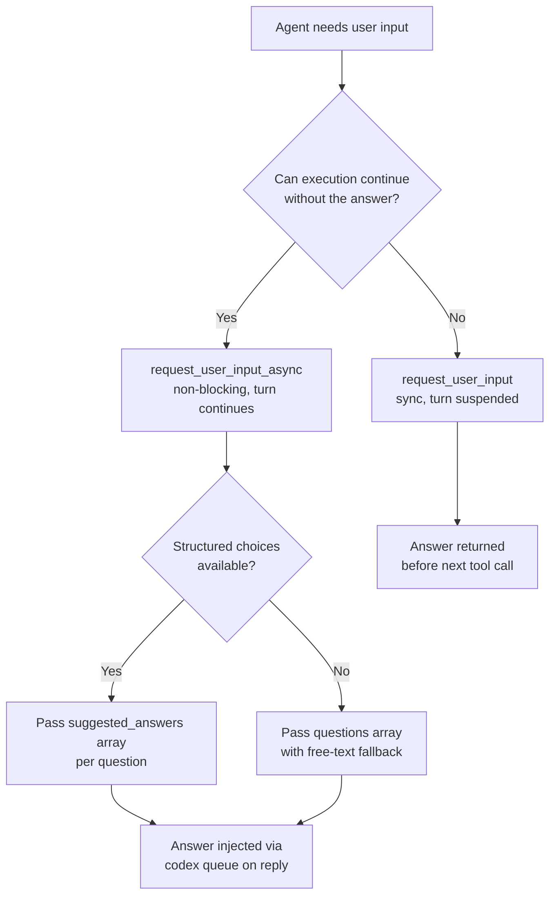
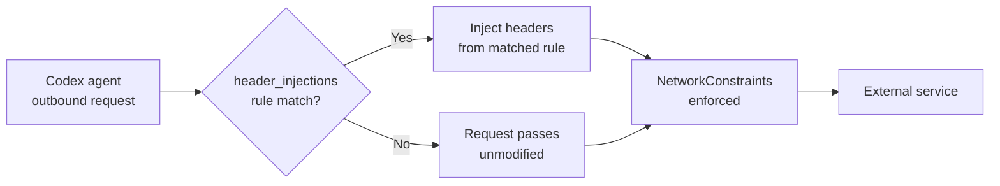

# Codex CLI v0.153.0-alpha.3 & alpha.4: Structured Async User Input, Remote Plugin Marketplaces, and Network Header Injection


OpenAI published v0.153.0-alpha.3 and alpha.4 on 1–2 September 2026, building on the per-link approval and marketplace source-enforcement work that landed in alpha.1 and alpha.2.[^1] The headline addition is **`request_user_input_async`** — a structural change to how agents communicate with developers mid-turn, replacing the earlier `send_user_message_async` with a richer, structured protocol. Alongside it: remote catalog support for the plugin CLI, declarative network header injection for managed environments, and model-settings visibility in app-server thread metadata.

## `request_user_input_async`: Asking Without Blocking

The synchronous `request_user_input` tool has existed since early 2026. It works by halting the current agent turn, surfacing a question to the developer, and resuming once a response arrives.[^2] That blocking semantics is correct for many situations — choosing a migration strategy, confirming a destructive operation — but it is wasteful when the agent has independent work it could pursue while waiting.

`send_user_message_async` was the first attempt at a non-blocking path: fire a message, receive an `accepted` acknowledgement, continue.[^3] PR #42178 replaces it with `request_user_input_async`, which preserves the non-blocking contract and adds two important improvements:

1. **Multiple questions per call.** The tool accepts an array of question objects rather than a single free-text string, allowing the agent to batch all its clarifications into one round-trip.
2. **Suggested answers.** Each question can carry an array of predefined option strings. These render in the TUI as selectable choices, reducing the surface area for unstructured free-text and making automated response injection (via `codex queue`) more predictable.[^4]

### Behaviour

When the model invokes `request_user_input_async`, the runtime:

1. Serialises the structured question payload and attaches it to the outbound async agent message.
2. Returns an `accepted` result to the model **immediately** — the turn is not suspended.
3. Delivers the question to the developer via the normal notification path (`codex queue`, TUI notification, or webhook, depending on session configuration).
4. On reply, injects the answers into a future turn via `codex queue` — the same mechanism used for out-of-band messages since v0.149.0.

The tool remains root-thread only: subagents do not receive it during tool registration.[^4] In a multi-agent session the orchestrator agent owns the async communication channel; workers operate within it.

### Backward Compatibility

Model catalogs advertising either the old `send_user_message_async` name or the new `request_user_input_async` name are handled transparently.[^4] Teams using the experimental flag on older model versions will continue to receive the previous tool without reconfiguration.

### When to Use Each Tool



### Practical Example

```toml
# No configuration required — the tool is registered automatically
# when the model catalog advertises it.
# Subagent sessions suppressed automatically by root-only constraint.
```

An AGENTS.md pattern for consistent async clarification:

```markdown
## Async Clarification Protocol

When a decision has independent sub-tasks that can proceed in parallel:
1. Call `request_user_input_async` with all open questions grouped
   into a single invocation.
2. Continue with any sub-tasks that do not depend on the answers.
3. When answers arrive via codex queue, resume the blocked sub-tasks.

Do NOT call `request_user_input_async` for decisions that gate the
entire next step — use `request_user_input` (synchronous) instead.
```

## Remote Plugin Marketplaces in the Plugin CLI (PR #42150)

PR #42150 extends `codex plugin` to discover and install plugins from remote catalogs, not just the locally cached curated list.[^5]

### What Changed

Previously `codex plugin list` showed only the local curated catalog synced at startup. The new behaviour:

- **Remote entries appear in `codex plugin list`** with source, version, install policy, and any authentication requirements rendered as JSON.
- **Install and remove commands work against remote entries** without introducing new subcommands — the existing `codex plugin install <name>` and `codex plugin remove <name>` interfaces resolve across both local and remote catalogs.
- **Caching is scope- and collection-scoped.** The runtime prefers a cached catalog entry and refreshes once when an install request cannot resolve locally. This prevents thundering-herd refreshes across concurrent sessions.
- **Graceful degradation:** If an unfiltered remote listing fails, the local curated catalog remains available. Errors surface only when the user explicitly requests a specific remote marketplace by identifier.

### Use Case: Enterprise Private Marketplaces

Teams running private plugin registries (e.g., for internal tooling or compliance-constrained environments) can now expose those registries alongside the public catalog without requiring manual `config.toml` vendor entries for every plugin. The install flow remains identical from the developer's perspective.

⚠️ The `config.toml` keys for declaring remote marketplace endpoints are not yet documented in the public configuration reference. The feature is stabilising across the alpha series.

## Network Header Injection (PR #42173)

PR #42173 adds `experimental_network.header_injections` to the `config.toml` schema — a declarative mechanism for injecting HTTP headers into outbound Codex network requests without hardcoding credentials in application logic.[^6]

### Configuration


```toml
[experimental_network]
header_injections = [
  { host = "api.internal.corp.example", headers = { "X-Corp-Token" = "{{env.CORP_TOKEN}}" } },
  { host = "registry.npmjs.org", methods = ["GET"], headers = { "Authorization" = "Bearer {{env.NPM_TOKEN}}" } },
  { host = "*.github.example.internal", path_prefix = "/api/v3/", headers = { "X-GitHub-Internal-Auth" = "{{env.GH_INTERNAL_TOKEN}}" } },
]
```


Each rule supports:

| Key | Type | Description |
|-----|------|-------------|
| `host` | string | Exact hostname or glob pattern to match |
| `methods` | string[] | Optional HTTP method filter; absent = all methods |
| `path_prefix` | string | Optional path prefix filter |
| `headers` | map | Header key-value pairs to inject |

Rules are incorporated into `NetworkConstraints` and evaluated in order. The first matching rule wins.

### Security Considerations

The TUI debug output (`/debug network`) summarises rule count and targeted host patterns but **deliberately redacts header values** to prevent credential leakage into logs or screen captures.[^6] The `experimental_` prefix signals that the schema may evolve before the feature graduates to stable.

This is particularly useful for:

- **Proxied environments** where an authenticating reverse proxy requires a custom identity header on all requests.
- **Internal package registries** accessed by MCP tools that invoke package managers.
- **Corporate audit systems** requiring a request-tagging header across all agent egress traffic.



## Model Settings in App-Server Thread Metadata (PR #42151)

PR #42151 exposes `model` and `reasoningEffort` as nullable fields on the shared app-server Thread object.[^7] Both are returned across all thread lifecycle operations: read, list, start, resume, rollback, metadata update, and notification.

### Behaviour

- **Loaded threads** report the current live model and reasoning-effort settings.
- **Unloaded threads** report the latest persisted settings from disk.
- **Legacy or filesystem-only threads** return `null` for both fields — metadata reads succeed without requiring thread loading.

### Why This Matters

Before this PR, the only way to determine which model a background session was using was to open the TUI or inspect `~/.codex/threads/` directly. With thread metadata now carrying model settings, external monitoring tools and orchestration scripts can query session state without side-effects:

```bash
# Query model for a specific session UUID
codex threads get <uuid> --format json | jq '.model, .reasoningEffort'
```

This complements the `codex agents` TUI dashboard (introduced in v0.149.0) and the `codex queue` out-of-band message API, forming a more complete programmatic surface for session management.

## Analytics Result Sources (PR #42164)

PR #42164 adds `analytics_result_source` as a per-tool configuration key, currently supporting `detailed_message_search_v1` as the only declared format.[^8] Host-generated source identifiers attached to accepted app tool results are now propagated through executed-tool call records, surviving wait cycles, retries, and compaction.

This is primarily relevant to teams building analytics pipelines over Codex app-server event streams. Source metadata is bounded and deduplicated by the runtime; caller-supplied values are rejected, and stale records cannot overwrite accepted metadata.

## Combining the New Capabilities: An Async Clarification Flow

The following shows how `request_user_input_async`, `codex queue`, and remote marketplace plugins compose in a real workflow:

```mermaid
sequenceDiagram
    participant Dev as Developer
    participant Codex as Codex Agent (root)
    participant Queue as codex queue
    participant Plugin as Remote Plugin

    Dev->>Codex: codex "Refactor auth module and update docs"
    Codex->>Plugin: Install remote doc-gen plugin (v2.4.1)
    Codex->>Codex: request_user_input_async([{question: "Target audience: internal or public?", suggested_answers: ["internal","public"]}])
    Note over Codex: Turn continues — starts refactor
    Codex->>Codex: Edit auth/handlers/*.ts
    Dev->>Queue: codex queue <session> "internal"
    Queue->>Codex: Answer injected into next turn
    Codex->>Plugin: Generate internal-format docs
    Codex->>Dev: Refactor complete; docs at docs/auth/internal.md
```

## Summary of v0.153.0-alpha.3 / alpha.4 Changes

| PR | Feature | Status |
|----|---------|--------|
| #42178 | `request_user_input_async` — structured multi-question async input | Alpha |
| #42150 | Remote marketplace support in `codex plugin` CLI | Alpha |
| #42173 | `experimental_network.header_injections` in config.toml | Experimental |
| #42151 | `model` + `reasoningEffort` in app-server thread metadata | Alpha |
| #42164 | `analytics_result_source` per-tool config for result tracking | Alpha |

The `request_user_input_async` change is the most immediately useful for interactive agent workflows. The network header injection feature will matter most to teams operating in managed corporate environments where outbound request authentication cannot be embedded in process environment variables. Remote marketplace support closes the last significant gap in the `codex plugin` CLI for enterprise private registry use cases.

## Citations

[^1]: OpenAI, "Releases · openai/codex", GitHub, September 2026. <https://github.com/openai/codex/releases>
[^2]: OpenAI, "request_user_input handler", `codex-rs/core/src/tools/handlers/request_user_input.rs`, GitHub. <https://github.com/openai/codex/blob/main/codex-rs/core/src/tools/handlers/request_user_input.rs>
[^3]: OpenAI, "Keep request_user_input direct-model only", Pull Request #27316, openai/codex, GitHub. <https://github.com/openai/codex/pull/27316>
[^4]: OpenAI, "Add structured asynchronous user input requests", Pull Request #42178, openai/codex, GitHub. <https://github.com/openai/codex/pull/42178>
[^5]: OpenAI, "Support remote marketplaces in the plugin CLI", Pull Request #42150, openai/codex, GitHub. <https://github.com/openai/codex/pull/42150>
[^6]: OpenAI, "Support header injections in network requirements", Pull Request #42173, openai/codex, GitHub. <https://github.com/openai/codex/pull/42173>
[^7]: OpenAI, "Expose model settings in app-server thread metadata", Pull Request #42151, openai/codex, GitHub. <https://github.com/openai/codex/pull/42151>
[^8]: OpenAI, "Record result sources in app tool analytics", Pull Request #42164, openai/codex, GitHub. <https://github.com/openai/codex/pull/42164>
