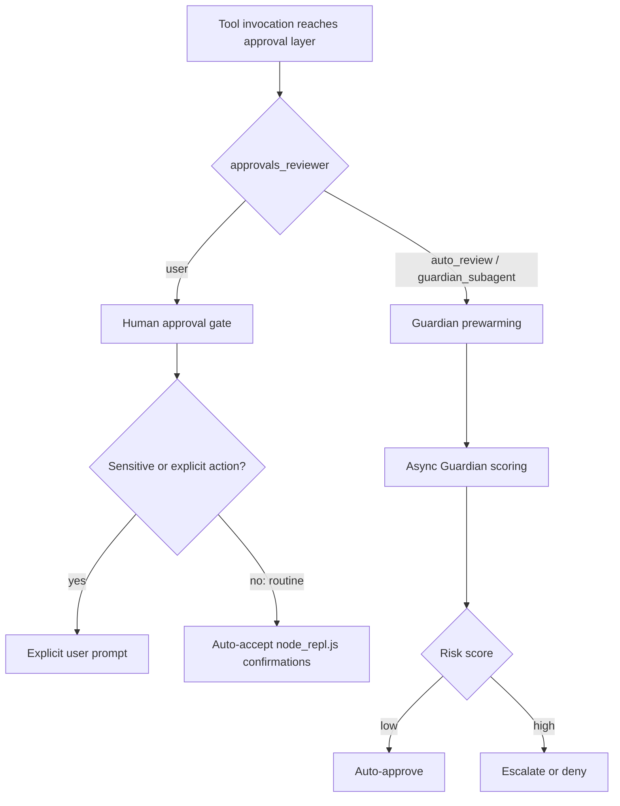
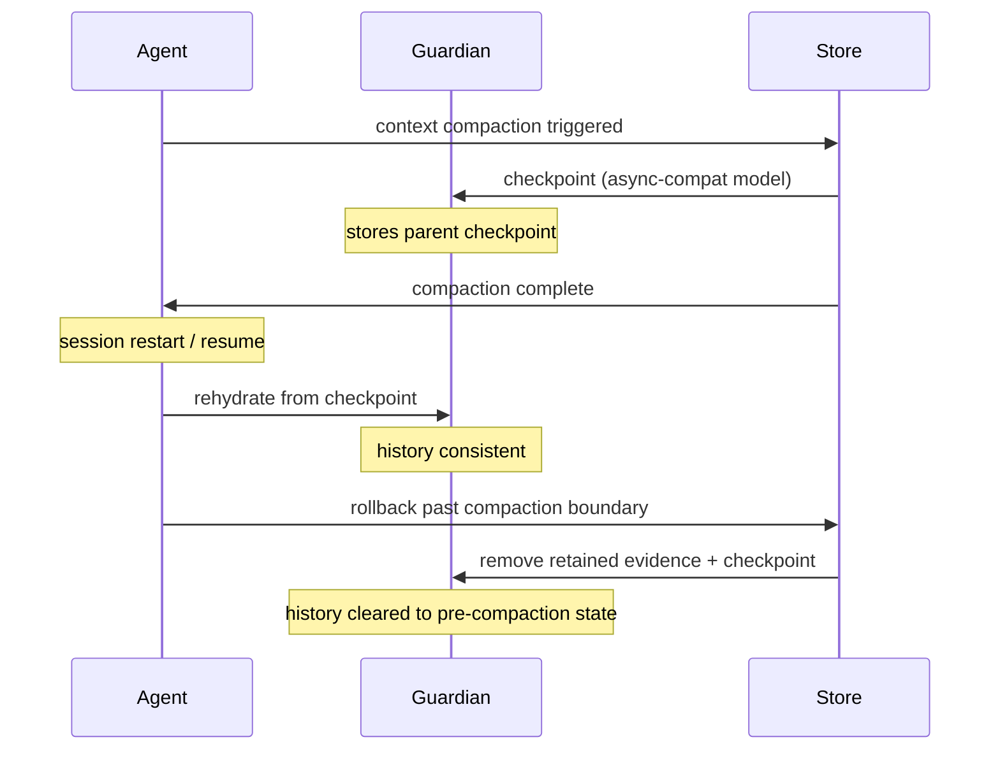
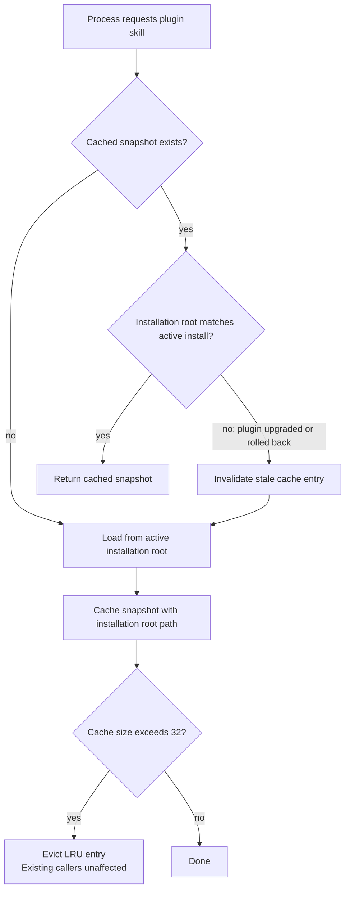

# Codex CLI v0.153.0-alpha.5 & alpha.6: Guardian Reliability, Plugin Cache Invalidation, and macOS MCP Native Spawning


Six pull requests merged on 2 September 2026 form the substance of the v0.153.0-alpha.5 and alpha.6 pre-releases, covering areas not captured by the earlier worktrees and voice runtime article.[^1][^2] The changes fall into three distinct concerns: making Guardian smarter about when it actually needs to act, hardening plugin skill caching for multi-process deployments, and improving operational observability at both the session and executor level. A seventh PR extends macOS MCP command resolution to bare binary names. This article covers each in depth.

---

## Guardian Becomes Mode-Aware

Guardian — Codex CLI's `codex-auto-review` subagent that evaluates tool invocations before they execute — has always run on every action that reaches the approval layer.[^3] Two PRs change that calculus meaningfully.

### Skip Scoring in User Approval Mode (PR #42256)

When `approvals_reviewer` is set to `"user"` in `config.toml`, a human is already approving every relevant action in real time.[^4] Running Guardian prewarming and async scoring on top of that was redundant: a second reviewer was silently consuming compute and adding latency for zero net security benefit, because the human approval is already the definitive gate.

PR #42256 eliminates this duplication.[^1] When the reviewer is `"user"`, both Guardian prewarming and the async scoring pass are skipped entirely. The optimisation is session-aware: if you switch reviewer modes mid-session via a live config update, the change takes effect immediately without a thread restart.

The one deliberate carve-out: `node_repl.js` execution confirmations are auto-accepted in user mode, but **explicit user input requests and high-sensitivity actions remain unaffected**. The logic distinguishes between routine orchestration approvals (which a human presence already covers) and actions that warrant explicit escalation regardless of policy.

```toml
# config.toml — user approval mode
[agent]
approvals_reviewer = "user"
# Guardian prewarming + async scoring now skipped automatically.
# No additional configuration required.
```



The practical implication: if you run sessions with `approvals_reviewer = "user"` during exploratory work, pair-programming flows, or in CI pipelines where you control the approval callback, you will see measurably lower turn latency on tool-heavy sessions. Guardian model invocations are not free — this skip applies unconditionally to every invocation that would otherwise have triggered async scoring.

### Guardian History Robustness Across Resume and Rollback (PR #42290)

A subtler but operationally more significant change lands in PR #42290.[^2] Guardian maintains a **history** — a record of what it has reviewed and authorised — that must survive several disruptive events: thread compaction (context-window pruning), server restart, and session resume. Getting this wrong means Guardian loses its authorisations, re-reviews already-approved actions, or fails to carry forward the correct context after a rollback.

The fix extends both integration testing and the underlying correctness guarantees for these scenarios:

**Compaction handling by model type:**
- *Async-compatible review models* receive the parent compaction checkpoint as their Guardian context — a compact but complete record of what was approved before the trim point.
- *Incompatible models* fall back to retained evidence — the raw set of retained approval records — preserving correctness at the cost of a marginally larger context.
- *Synchronous reviewers* continue receiving the checkpoint unchanged.

**Rollback semantics:**
- Rolling back a single input removes only that targeted entry from Guardian history.
- Rolling back past a compaction boundary removes **both** the retained evidence **and** the compaction checkpoint, ensuring no ghost approvals survive a deep rollback.

**Compaction metadata preservation:**
The compaction request now carries the original user restriction and MCP tool output, so Guardian can reconstruct the pre-compaction policy context when rehydrating after a restart.



For teams running long autonomous sessions — deep-loop workloads, overnight CI agents, or multi-hour refactoring tasks — this means Guardian's approval state is now a reliable invariant across the full session lifecycle rather than a best-effort approximation that degrades after compaction or restart.

---

## Plugin Skill Cache Invalidation for Multi-Process Deployments (PR #42284)

Codex CLI caches installed plugin skills in `~/.codex/plugins/cache/` for fast startup.[^5] In single-process usage this is straightforward, but the cache becomes a liability when multiple processes share the same `CODEX_HOME` — a common pattern in CI environments running parallel test suites, or on developer machines with a background `codex exec` daemon running alongside interactive sessions.

The problem is a classic cache invalidation failure: one process upgrades (or rolls back) a plugin. The other processes continue loading skills from the stale cache entry tied to the previous installation root. The skills they expose may be outdated, removed, or subtly different in behaviour from what the updated plugin provides.

PR #42284 introduces two mechanisms to address this:

**Cache validation on load:**
Before returning a cached skill snapshot, the runtime checks whether the snapshot's recorded installation root still matches the currently active installation. If they diverge — because the plugin was upgraded, downgraded, or reinstalled — the stale snapshot is rejected and the skill is reloaded fresh from the updated installation.

**Bounded cache with graceful eviction:**
A cap of 32 recently accessed configuration-based skill snapshots is enforced. Evicted snapshots do not invalidate existing callers that already hold references — those callers can continue using their snapshot until natural release — but new lookups will load a fresh copy.



The practical upshot: if you run `codex plugin update <plugin-name>` while sibling processes are running, those processes will pick up the new skill definitions on their next skill lookup rather than silently executing stale code. In CI pipelines where plugins embed version-pinned tools or model configurations, this prevents the class of failure where one shard runs updated skill logic and another runs the previous version within the same pipeline run.

---

## Observability Additions

Two smaller PRs improve operational visibility without changing behaviour.

### History-Notes Thread Hint Analytics (PR #42247)

The history-notes thread hint system — which retrieves compressed summaries of prior thread context to inform new sessions — now emits a `codex_thread_hint_status` analytics event on every retrieval attempt.[^1] The event records whether retrieval succeeded or failed, thread metadata, and timing. Hint content itself is deliberately excluded from the event payload to avoid leaking sensitive context through analytics pipelines.

Empty responses are classified as successful retrievals (the absence of notes is a valid state), though empty hint content continues to be excluded from the model context window.

For engineering teams operating Codex CLI at scale, this telemetry closes a meaningful observability gap: previously, hint retrieval failures were silent. The session continued without prior context and no signal indicated that history recovery had failed. The new event enables alerting on elevated failure rates before they affect developer productivity in ways that are difficult to attribute.

### Executor Version in Environment Info (PR #42270)

The `initialize` and `environment/info` responses from the exec-server now include an `executorVersion` field.[^1] The value is resolved once at server startup and held constant for the server's lifetime. Legacy executors or source builds that cannot determine their version report `0.0.0` as a safe default.

```json
// environment/info response (excerpt)
{
  "executorVersion": "0.153.0-alpha.6",
  "platform": "darwin",
  "arch": "aarch64"
}
```

This enables downstream clients — IDE extensions, app-server middleware, custom orchestration layers — to make version-gated capability decisions without scraping `codex --version` output or inferring capabilities from trial invocations. The practical use case is gating features that require a minimum exec-server version: instead of probing and failing, a client can inspect `executorVersion` at session initialisation and degrade gracefully or surface an upgrade prompt.

---

## macOS MCP Native Spawning for Bare Commands (PR #42192)

The macOS MCP launcher previously only applied native spawning to absolute executable paths.[^1] PR #42192 extends this to **bare command names** (e.g. `uvx`, `python`) and **relative executable paths** (e.g. `./scripts/mcp-server`).

PATH resolution follows the child process's configured `PATH` environment variable, including handling of empty entries and a default-path fallback when `PATH` is unset. `argv[0]` and the original script spelling are preserved through the resolution chain to ensure the spawned process sees the correct argument zero.

If native spawning fails — or if the target executable lacks a shebang — the code falls back to the existing shell-based command launcher, preserving its error handling and shell expansion behaviour. This makes the fallback transparent to MCP server definitions that rely on shell expansion.

```toml
# config.toml — now works on macOS with bare commands and relative paths
[mcp_servers.python_tool]
command = "uvx"
args = ["some-mcp-server@latest"]

[mcp_servers.local_server]
command = "./scripts/mcp-server"
args = ["--port", "8080"]
```

Before this change, both definitions required absolute paths on macOS to use native spawning; the shell fallback would run instead, with its associated overhead and different environment isolation characteristics. This change aligns macOS behaviour with what developers already expect from the Linux implementation.

---

## Summary

| PR | Change | Impact |
|----|--------|--------|
| #42256 | Skip Guardian scoring in user approval mode | Lower latency in human-in-the-loop sessions |
| #42290 | Guardian history robust across compaction/restart/rollback | Reliable approval state in long-running sessions |
| #42284 | Plugin skill cache invalidation on version change | Correct skills in multi-process and CI deployments |
| #42247 | `codex_thread_hint_status` analytics event | Observability for history-notes retrieval failures |
| #42270 | `executorVersion` in environment/info | Version-gated capability decisions for clients |
| #42192 | Native PATH resolution for macOS MCP commands | Bare commands and relative paths work without shell fallback |

The alpha.5 and alpha.6 pre-releases are available via `npm install -g @openai/codex@0.153.0-alpha.5` and `@0.153.0-alpha.6` respectively. The stable v0.153.0 has not shipped at time of writing; breaking changes remain possible before stabilisation.

---

## Citations

[^1]: openai/codex pull requests merged 2 September 2026 — [#42256](https://github.com/openai/codex/pull/42256), [#42290](https://github.com/openai/codex/pull/42290), [#42284](https://github.com/openai/codex/pull/42284), [#42247](https://github.com/openai/codex/pull/42247), [#42270](https://github.com/openai/codex/pull/42270), [#42192](https://github.com/openai/codex/pull/42192). Retrieved 2 September 2026.

[^2]: openai/codex GitHub Releases — [v0.153.0-alpha.5](https://github.com/openai/codex/releases) (2 September 2026, 03:05 UTC); [v0.153.0-alpha.6](https://github.com/openai/codex/releases) (2 September 2026, 11:26 UTC). Retrieved 2 September 2026.

[^3]: Codex Knowledge Base — "Purpose-Built Agent Models: What codex-auto-review Tells Us About the Future of Specialised AI." [codex.danielvaughan.com](https://codex.danielvaughan.com/2026/04/17/purpose-built-agent-models-codex-auto-review/). Retrieved 2 September 2026.

[^4]: Codex Knowledge Base — "Codex CLI Guardian Approval: Configuring Auto-Review Policies." [codex.danielvaughan.com](https://codex.danielvaughan.com/2026/04/20/codex-cli-guardian-approval-configuring-auto-review-policies/). Retrieved 2 September 2026.

[^5]: Codex Knowledge Base — "Codex CLI Plugin Marketplace: Building, Distributing, and Managing Extensions at Scale." [codex.danielvaughan.com](https://codex.danielvaughan.com/2026/04/24/codex-cli-plugin-marketplace-building-distributing-extending/). Retrieved 2 September 2026.
