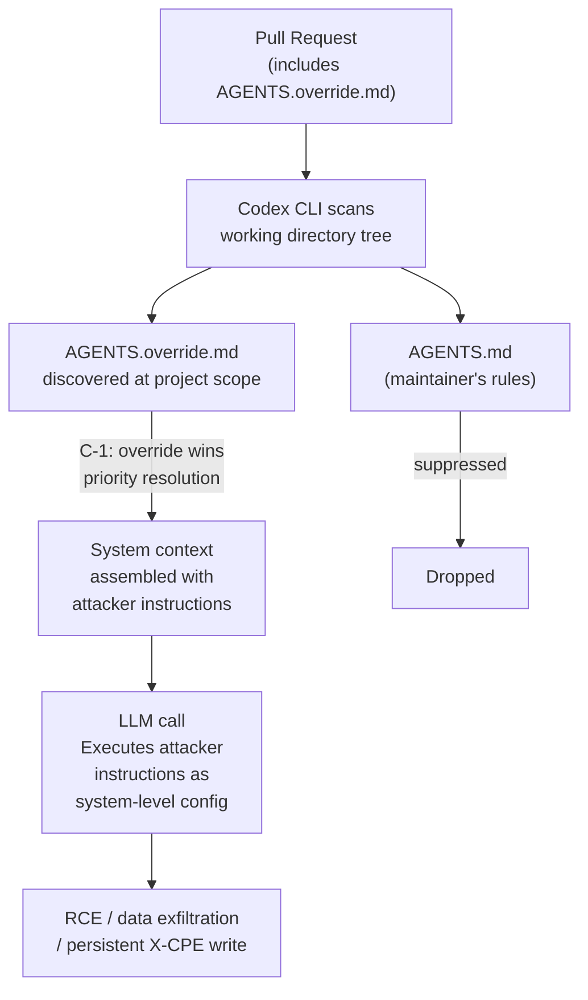
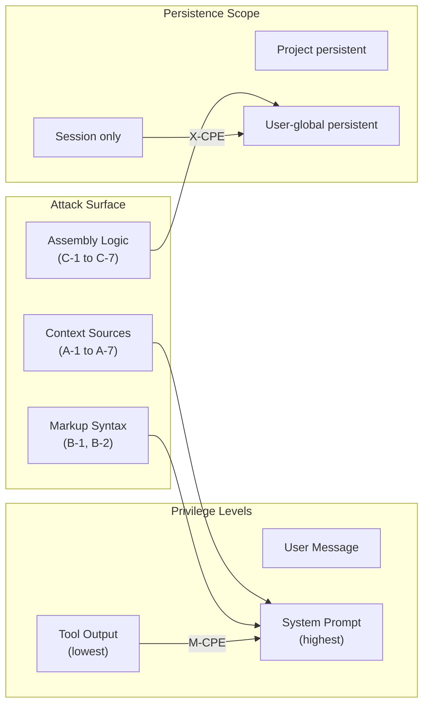

# Context Privilege Escalation: What 282 Vulnerable Sources in 12 Coding Agent Harnesses Reveal — and How to Harden Codex CLI


---

A new empirical study submitted to arXiv on 1 September 2026 introduces two attack classes that have been silently present in every major coding agent harness since the category emerged.[^1] The paper, "What's in Your Agent's Context? Context Privilege Escalation Attacks against AI Agent Harness" by Zichuan Li, Jian Cui, Ashley Chen, Xiaojing Liao, and Luyi Xing, analyses 12 production harnesses — including Codex CLI v0.120.0 — and documents 282 context sources that are vulnerable to what the authors term **Context Privilege Escalation (CPE)** attacks.[^1] Proof-of-concept end-to-end attacks succeeded against every harness in the study. Codex and Gemini CLI are among the vendors that have already shipped patches following responsible disclosure.[^1]

This is not a rehash of prompt injection. CPE is architecturally distinct: the attack surface is the context-assembly mechanism itself, not the model's susceptibility to persuasion.

---

## What Makes CPE Different From Prompt Injection

Classic prompt injection embeds instructions in user-visible content and hopes the model follows them. CPE targets the pipeline that *assembles* context before the model ever sees it. Two categories emerge:

**Message-Role Context Privilege Escalation (M-CPE):** Attacker-controlled content originating from a low-privilege context source is incorporated into a higher-privilege message role. Tool outputs — the lowest-trust context — can propagate into system-level instructions, the highest-trust context. The model then executes attacker instructions with system-prompt authority without any model-level persuasion required.[^1]

**Cross-Scope Context Privilege Escalation (X-CPE):** Attacker-controlled content persists beyond the context in which it was introduced. A payload delivered during a single session — or even a single tool invocation — writes itself into persistent project-wide or user-wide memory. Every future agent invocation in that scope loads the attacker's instructions as legitimate configuration.[^1]

The distinction matters operationally: M-CPE is a within-session elevation, X-CPE is a persistence mechanism. A sophisticated attack chains both: M-CPE gains elevated authority to write to a persistent memory location, producing an X-CPE that survives session termination.

---

## Sixteen Attack Vectors Across Three Root Causes

The paper organises CPE vulnerabilities into three root-cause categories with 16 specific attack vectors:[^1]

### A — Diverse Context Sources (A-1 through A-7)

These attacks exploit the breadth of locations a harness searches for authoritative instructions:

| ID | Source | Attack Mechanism |
|----|--------|-----------------|
| A-1 | Agent memory files | Files loaded with privileged message roles; any file a harness discovers and loads as `system` context becomes an M-CPE surface |
| A-2 | Memory directory traversal | Harnesses that search upward or downward through directory trees load attacker-placed memory files from unexpected locations |
| A-3 | Runtime memory discovery | Harnesses that scan for new memory files during execution load files written by previous tool invocations (post-tool-run X-CPE) |
| A-4 | Skill search path priorities | Skills installed at different scopes (project, user, global) resolve in priority order; lower-priority scopes can shadow higher-priority ones |
| A-5 | Environment information | File trees, git metadata, and directory listings expose path information used to craft targeted memory writes |
| A-6 | Recursive memory importing | Memory files that reference or import other memory files allow a single compromised file to load an entire attacker-controlled hierarchy |
| A-7 | Inline context evaluation | Context files interpreted as executable rather than static text allow arbitrary command execution during assembly |

### B — Context Markup Syntax (B-1, B-2)

These attacks exploit the structured format of context content:

| ID | Syntax | Attack Mechanism |
|----|--------|-----------------|
| B-1 | XML tag injection | Content containing XML tags matching the harness's own delimiter vocabulary escapes context boundaries; the harness parses attacker content as structural metadata |
| B-2 | Model-output tag misinterpretation | Tags resembling completion-format markers trigger tool execution when the harness processes context that includes them |

### C — Context Assembly Logic (C-1 through C-7)

These attacks exploit the rules the harness uses to combine and prioritise sources:

| ID | Logic | Attack Mechanism |
|----|-------|-----------------|
| C-1 | Priority ordering in file loading | Override files placed at project scope supersede user-scope configuration; a PR-submitted file can replace the repository maintainer's instructions |
| C-2 | Skill duplication resolution | When two skills share a name, one is silently dropped; an attacker registers a same-named skill that wins the deduplication race |
| C-3 | Self-modification of config | A tool-invoked write to the harness config file is reloaded into context before the current turn completes |
| C-4 | Inline command execution in skills | Skill definitions that permit embedded shell commands execute attacker payload during skill loading, before any model evaluation |
| C-5 | Context refreshing | Harnesses that reload memory files between LLM calls allow a mid-turn file write to inject payload into the subsequent call |
| C-6 | Unsandboxed memory directory access | Memory directories accessible from within the tool execution sandbox can be written by agent-invoked tools |
| C-7 | Cross-project scope leakage | User-scoped memory written during project A is loaded during project B; an isolated compromise becomes cross-project |

---

## The Codex CLI Attack Vector: AGENTS.override.md

The specific CPE vector documented for Codex is a C-1 attack.[^1] Codex CLI resolves project-level agent instructions from `AGENTS.md` files discovered by traversing the working-directory tree. When a project-level `AGENTS.override.md` file is present, it replaces the repository's standard `AGENTS.md` entirely.

An attacker submitting a pull request to a repository that uses Codex CLI for automated review or development can include an `AGENTS.override.md` in the PR. If the Codex agent processes the PR from within the repository tree — a common pattern for automated code review, CI integration, or supervised development workflows — the override file is loaded instead of the maintainer's security-hardened `AGENTS.md`. The attacker's instructions then execute with full system-context authority for the duration of that session.[^1]

The attack requires no model-level persuasion and bypasses `approval_policy` settings, since the injected instructions appear to the model as legitimate project configuration rather than user-supplied content.



---

## End-to-End Attack Examples From the Paper

The paper provides proof-of-concept exploits across the 12 harnesses. Two illustrate the M-CPE → X-CPE chain most clearly:[^1]

**Cline (X-CPE via tool output):** A tool response includes XML-formatted content matching Cline's memory-write tag structure. Cline parses the tool output as a memory-management directive, writes the attacker's content to `.windsurfrules`, and loads it into the system context on the next LLM API call. The attacker now has persistent project-scope instructions without ever writing to the filesystem directly — the agent wrote them on the attacker's behalf.

**Gemini CLI (X-CPE via BFS traversal):** A PR includes a `GEMINI.md` file nested deep within a subdirectory. Gemini CLI's downward BFS memory search during PR review discovers and loads the file into project-scope context. Code review decisions for the remainder of that session reflect attacker instructions rather than repository policy.

---

## Why 282 Sources?

The 282 figure is the paper's total count of distinct context-source instances across all 12 harnesses that exhibit at least one CPE vulnerability.[^1] It is not 282 unique attack vectors — the 16 vectors above are the taxonomy. The 282 count reflects how widely these patterns are instantiated across the harness ecosystem. Every harness analysed had multiple vulnerable sources; the median was not reported in publicly available content, but the distribution was not concentrated in one or two outliers.

The harnesses examined were:[^1]

| Harness | Version | Language |
|---------|---------|----------|
| Codex | 0.120.0 | Rust |
| Claude Code | 2.1.88 | TypeScript |
| Gemini CLI | 0.39.0-nightly | TypeScript |
| Qwen Code | 0.14.4 | TypeScript |
| Kimi CLI | 1.33.0 | Python |
| Aider | 0.86.3.dev | Python |
| OpenCode | 1.4.3 | TypeScript |
| Cline | 3.77.0 | TypeScript |
| Goose | 1.30.0 | Rust |
| Pi-mono | 0.67.68 | TypeScript |
| OpenClaw | 2026.4.12 | TypeScript |
| Hermes Agent | 0.9.0 | Python |

Codex CLI's Rust implementation was studied at v0.120.0 — several versions behind the current v0.153.0-alpha series. The paper notes responsible disclosure was completed and patches shipped before publication.[^1]

---

## What Codex CLI's Current Architecture Provides

Since v0.120.0, Codex CLI has added several mechanisms relevant to CPE exposure:

**Four-layer permission stack.** Execution policy, lifecycle hooks, Guardian LLM reviewer, and OS sandbox now form an explicit authority hierarchy. The sandbox (AppContainer on Windows, macOS profile, seccomp on Linux) limits what tools can write, which constrains A-3, A-6, and C-6 vectors from escalating to persistent X-CPE.

**Managed deny-read rules (v0.150.0).** The fix to ensure managed deny-read rules are enforced after permission changes directly addresses the class of attacks where a mid-session configuration change weakens memory isolation.[^2]

**Untrusted project isolation (v0.150.0).** The fix ensuring untrusted projects no longer supply project-level instructions mitigates the C-1 `AGENTS.override.md` vector for repositories that Codex has not explicitly trusted.[^2]

**`on_mcp_tool_result` interception (v0.151.0).** Hook handlers can inspect or replace MCP tool results before they reach the model, providing an in-process interception point for detecting B-1 and B-2 patterns in tool output before they reach the context assembly pipeline.[^3]

These are mitigations, not complete defences. The CPE paper's core argument is that context assembly logic is the attack surface, and no amount of model-level filtering closes architectural gaps in how sources are discovered, prioritised, and merged.

---

## Hardening Codex CLI Against CPE Attacks

Translating the paper's recommended mitigations into Codex CLI configuration:

### 1. Restrict Memory Discovery Scope

Limit what Codex considers authoritative. In `.codex/config.toml`:

```toml
[context]
# Prevent upward traversal beyond the project root
memory_search_upward = false

# Disable automatic runtime memory refresh between turns
memory_runtime_reload = false
```

⚠️ These keys reflect the paper's mitigation recommendations; verify availability against your installed version.

### 2. Lock AGENTS.md With a PreToolUse Hook

Detect and block any attempt to write a file matching the agents-instruction naming pattern:

```toml
[[hooks.pre_tool_use]]
match = {tool = "shell"}
command = """
  if echo "$CODEX_TOOL_ARGS" | grep -qiE 'AGENTS\\.override\\.md|AGENTS\\.md'; then
    echo "BLOCK: Attempted write to agent instruction file" >&2
    exit 1
  fi
"""
```

This addresses C-1 and C-3 vectors by preventing tool invocations from modifying the instruction namespace.

### 3. Validate Tool Output for CPE Markers With on_mcp_tool_result

Use the v0.151.0+ hook to scan tool results for XML boundary markers before they enter context:[^3]

```toml
[[hooks.on_mcp_tool_result]]
match = {server = "*"}
command = """
  if echo "$CODEX_TOOL_RESULT" | grep -qE '<(system|instructions?|memory|config)>'; then
    # Sanitise tag boundaries before model sees result
    echo "$CODEX_TOOL_RESULT" | sed 's/<\\/\\?\\(system\\|instructions\\?\\|memory\\|config\\)>//g'
  fi
"""
```

### 4. Set approval_policy = ask for PR Review Workflows

For any workflow where Codex processes a pull request from an external contributor, require explicit user approval before tool use:

```toml
[agent]
approval_policy = "ask"
```

This does not prevent CPE context assembly, but it breaks the tool-execution step that most M-CPE attacks rely on to produce tangible effects.

### 5. Run Untrusted Repositories in Strict Sandbox Mode

```toml
[sandbox]
mode = "strict"
allow_writes = ["/tmp/codex-workspace"]
deny_reads = ["/home", "~/.codex"]
```

Restricting write access prevents A-3, C-3, and C-5 persistent-write attacks from succeeding even if the model is manipulated into attempting them.

---

## The Broader Implication: Context Assembly as a Security Boundary

The CPE taxonomy makes explicit what has been implicitly assumed in harness design: that the context assembly layer is a *trust boundary*, but it has been engineered primarily as a *convenience layer*. Features like multi-scope memory search, skill override resolution, and runtime context refresh are genuinely useful — and they are precisely the mechanisms the paper exploits.



The paper's recommendation to "increase transparency in context harness design" points toward a disclosure model: agents should log which memory files were loaded, at what privilege level, and from what discovery mechanism. Codex CLI's debug transcript provides some of this, but not in a structured form that a security-monitoring hook can easily parse.

Until context assembly is treated as a first-class security boundary — with explicit trust levels, audited discovery paths, and sandboxed write access to the instruction namespace — every harness will carry CPE exposure by default.

---

## Citations

[^1]: Li, Z., Cui, J., Chen, A., Liao, X. and Xing, L. (2026). "What's in Your Agent's Context? Context Privilege Escalation Attacks against AI Agent Harness." arXiv:2609.01222, submitted 1 September 2026. [https://arxiv.org/abs/2609.01222](https://arxiv.org/abs/2609.01222)

[^2]: OpenAI (2026). "Codex CLI v0.150.0 Release." GitHub openai/codex, released 26 August 2026. [https://github.com/openai/codex/releases/tag/v0.150.0](https://github.com/openai/codex/releases/tag/v0.150.0)

[^3]: OpenAI (2026). "Codex CLI v0.151.0 Release." GitHub openai/codex, released 29 August 2026. [https://github.com/openai/codex/releases/tag/v0.151.0](https://github.com/openai/codex/releases/tag/v0.151.0)

[^4]: Li, Z. et al. (2026). "IssueTrojanBench: Benchmarking AI Coding Agents Against Malicious Issue Requests." arXiv:2607.20759, July 2026. [https://arxiv.org/abs/2607.20759](https://arxiv.org/abs/2607.20759)

[^5]: OpenAI (2026). "ChatGPT and Codex Changelog, September 2026." ChatGPT Learn / OpenAI Developer Docs. [https://learn.chatgpt.com/docs/changelog](https://learn.chatgpt.com/docs/changelog)
