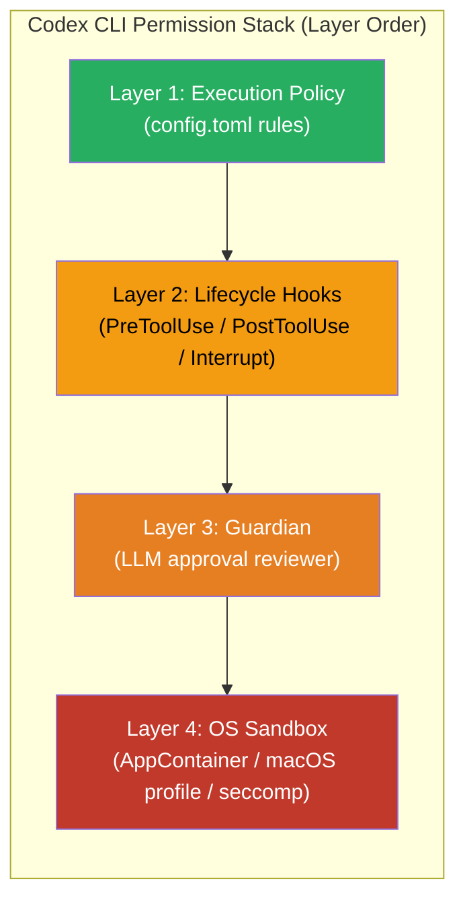
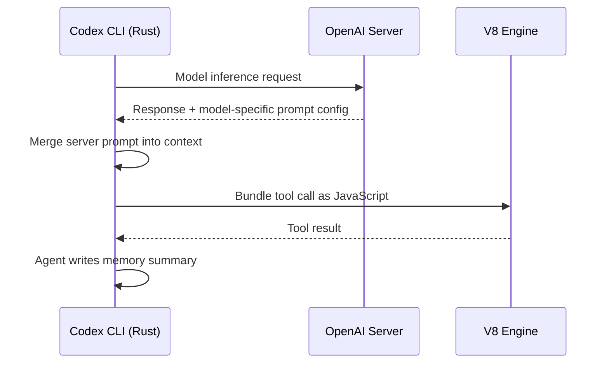

# Inside the Harness: What a Source-Code Study of Eleven Coding Agents Reveals About Codex CLI's Architecture


A new paper by Barbaste, Darrigol, Vu, and Wiltberger, "Harness Engineering: Anatomy, Architecture, and Evolution of Coding Agents — A Source-Code Study of Eleven Systems" (arXiv:2609.00006), is the most thorough cross-sectional analysis of production coding agent runtimes published to date.[^1] The authors examined roughly four million lines of Python, TypeScript, and Rust across eleven production harnesses — including Claude Code, Codex CLI, Gemini CLI, Mistral Vibe, OpenHands, Aider, and Mini-SWE-Agent — plus a meta-harness contrast point called Omnigent. They distilled 29 recurring design patterns, 13 cross-cutting observations, and 18 actionable recommendations, and repeated the analysis on eight of those systems 90 days later to track evolution.[^1]

For Codex CLI practitioners, the findings are directly actionable: the paper surfaces architectural facts about Codex that are not documented elsewhere, explains why certain configuration choices matter, and reveals where the ecosystem is converging.

## Methodology

The study is source-code archaeology, not benchmarking. The authors pinned each system at a fixed commit, performed manual pattern extraction across the full codebase, and documented findings against a shared seven-subsystem taxonomy.[^1] The longitudinal component re-pinned eight of the same systems 90 days after the initial April 2026 snapshot, quantifying architectural drift. Codex CLI's July 2026 snapshot weighed in at approximately 1.1 million lines of Rust — the largest single-language codebase in the corpus.[^1]

## The Seven Canonical Subsystems

Every harness implements the same seven components.[^1] Where Codex sits on the minimal/maximal spectrum reveals deliberate engineering choices:

| Subsystem | Minimal | Maximal | Codex CLI position |
|---|---|---|---|
| Agent Loop | Mini-SWE-Agent's linear while-loop | OpenHands event-sourced parallel batches | **Tokio async state machine** — native async, no framework |
| Tools & Actions | bash-only | Claude Code's 43 typed tools | **V8-executed code** — tool calls as JavaScript |
| Memory & Context | Unbounded linear history | Codex's own cross-session pipeline | **Agent-maintained memory pipeline** — maximal |
| Safety & Permissions | Cost and step limits | Codex's four-layer stack | **Four-layer fortress** — maximal |
| Orchestration | Aider (intentional absence) | Recursive composition (Claude Code) | **Thread-tree model** — fan-out over task trees |
| Extensibility | Python structural typing | Pi's everything-is-an-extension runtime | **Marketplace-distributed plugins** — first of its kind |



This four-layer permission stack is the most sophisticated in the corpus.[^1] The study notes Pi deliberately documents its *lack* of safety infrastructure as a security argument (local-only, no network). Most systems cluster around three mechanisms. Codex implements all four — and the ordering matters: a tool invocation must clear the policy gate first, then pass any matching hook, then satisfy Guardian if approval is required, and finally survive OS-level enforcement.

## Codex CLI's Architectural Signature

Three patterns make Codex architecturally distinctive:

### V8-Executed Tool Calls

Rather than dispatching to discrete typed functions, Codex bundles tool invocations as JavaScript and executes them inside an embedded V8 engine.[^1] This enables dynamic tool composition that typed function dispatch cannot express — a tool can conditionally delegate to another at the JavaScript level before returning to the Rust harness. No other system in the corpus does this.

### Agent-Maintained Memory Pipeline

Codex's cross-session memory works differently from the threshold-based compaction that seven of eleven systems use.[^1] The *agent itself* writes summaries and stores them persistently; the harness retrieves them on resume rather than re-summarising on the fly. The practical implication: when you observe Codex updating its `memories/` files during a session, you are watching the agent maintain its own retrieval index. Corrupted or stale memory files affect all future sessions on that project — a failure mode that is specific to this pattern and not present in harnesses that compact in-band.

### Per-Model Prompts as Server-Delivered Data

Model-specific instructions ship as configuration from OpenAI's servers, not baked into the client binary.[^1] This is why a model update can change Codex's behaviour without a CLI release. It also explains the `proactive_multi_agent_instructions` field introduced in v0.152.0-alpha, which the model catalog populates on model switch — the mechanism is server-push, not client-side logic.[^2]



## Thirteen Observations, Distilled

Three of the paper's 13 cross-cutting observations warrant immediate attention for Codex CLI users:[^1]

**Skills beat MCP in adoption.** By July 2026, SKILL.md files lead in 9 of 11 systems; MCP appears in 8 of 11. The gap is not large but the trajectory matters — skills added supply-chain governance and trust tiers faster than MCP's protocol evolution. If you are choosing between authoring a SKILL.md plugin and running an MCP server for a simple capability, the ecosystem has already voted.

**No production harness uses embedding-based retrieval.** All eleven systems employ deterministic retrieval: ripgrep, tree-sitter, glob patterns, auto-discovered Markdown context files. Vector similarity is conspicuously absent. This is a direct rebuttal to the conventional advice to add a vector store to improve agent context. For code retrieval specifically, `grep` and `tree-sitter` are not a compromise; they are what production systems at scale choose.

**Convergence became imitation within one quarter.** Between April and July 2026, Codex adopted Claude Code's hook vocabulary verbatim — the diff shows word-for-word copies of hook names and signatures.[^1] OpenHands shipped a Claude Code plugin format importer. Mistral Vibe's middleware naming mirrors Claude Code's event-bus vocabulary. This means documentation written for Claude Code hooks transfers directly to Codex in many cases, and the canonical reference for hook semantics is whichever system coined the term first.

## Architecture Insights for AGENTS.md Authors

The paper's findings translate into four concrete practices:

**Trust the memory pipeline.** The agent-maintained memory pattern means your `memories/` directory is not ephemeral — it is the retrieval index for future sessions. Structure it accordingly: keep entries factual and short, purge stale entries after a project is complete, and treat memory corruption as a first-class debugging concern.

**Do not add embeddings to your MCP stack for code retrieval.** The study confirms that eleven production systems find ripgrep and tree-sitter sufficient. Embedding servers add latency, operational overhead, and a staleness problem. Add them for prose retrieval (documentation, issue history) where semantic similarity matters; skip them for source code.

**Policy in `config.toml` is more durable than policy in AGENTS.md prose.** The longitudinal analysis shows the field migrated from prompt directives to structured configuration between April and July 2026.[^1] Rules expressed as TOML capability gates survive compaction; rules expressed as prose instructions can be dropped or misinterpreted during context compression.

```toml
# Prefer structured policy over prose directives
[approval_policy]
mode = "on-request"

[sandbox]
writable_roots = ["./src", "./tests"]
network = "none"

[mcp_servers.filesystem.tools.write_file]
approval_policy = "always"
```

**Expect hook vocabulary to cross-pollinate.** If you are porting a Claude Code AGENTS.md or skill to Codex, the event names and hook invocation contracts are likely identical — the paper confirms Codex copied them verbatim. PreToolUse, PostToolUse, and PostApplyPatch have the same semantics across both runtimes as of July 2026.

## The Minimum-Viable Harness

The paper closes with an approximately 90-line harness scaffold encoding the recommendations distilled from the corpus.[^1] The core is a linear `tool_call → execute → observe` loop — exactly Mini-SWE-Agent's pattern — with threshold-based compaction, a flat permission gate, and a single extensibility hook. The point is not that this scaffold is sufficient for production; it is that the additional 1.1 million lines of Rust in Codex address safety, UX, transport resilience, extensibility markets, and platform support — not loop complexity. The loop itself has not changed in sophistication since SWE-agent.

## Summary

Barbaste et al. produced the closest thing to a field manual for harness engineering that exists at the time of writing. For Codex CLI specifically, the study surfaces facts — V8 tool execution, server-delivered model prompts, agent-maintained memory — that explain behaviours practitioners encounter but rarely have documented. The cross-cutting finding that the field runs on deterministic retrieval and hand-rolled async loops, with no general-purpose agentic frameworks in sight, is a useful corrective against the prevailing narrative in AI tooling marketing.

The paper is a recommended read for anyone building skills, authoring AGENTS.md configurations, or designing MCP server integrations for Codex. The design pattern catalog alone is worth the time.

## Citations

[^1]: Barbaste, P., Darrigol, T., Vu, G., & Wiltberger, T. (2026). *Harness Engineering: Anatomy, Architecture, and Evolution of Coding Agents — A Source-Code Study of Eleven Systems*. arXiv:2609.00006. https://arxiv.org/abs/2609.00006

[^2]: OpenAI. (2026). *Codex CLI v0.152.0-alpha release notes: Proactive multi-agent instructions from model catalog*. GitHub releases, openai/codex. https://github.com/openai/codex/releases/tag/rust-v0.152.0-alpha.5
