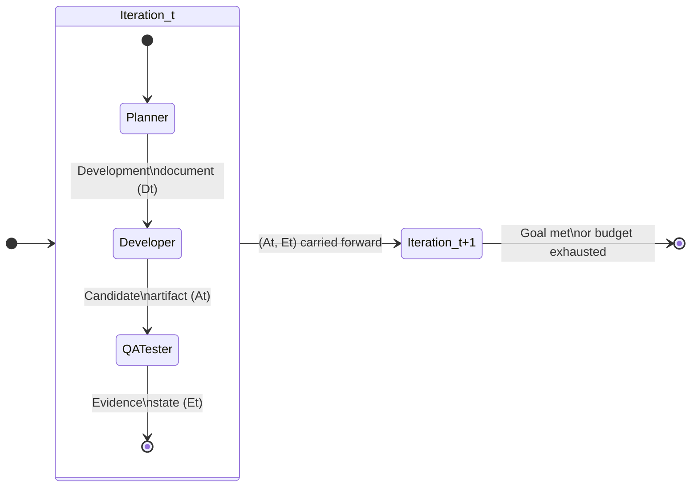
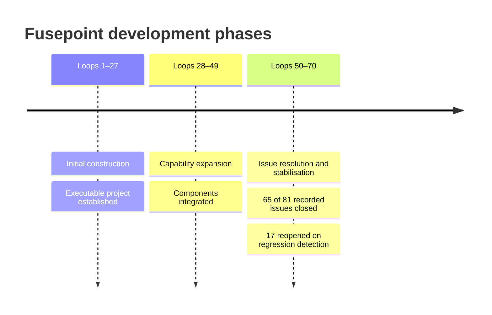

# Harness-of-Harness: When Iterative Evidence Loops Beat Bigger Models for Multi-Day Autonomous Development


The dominant assumption in coding-agent deployment is that performance is a model problem: swap in a stronger model, get better outcomes. A paper submitted on 2 September 2026, arXiv:2609.01481, challenges this directly.[^1] Yan, Su, Zhang et al. introduce the Harness-of-Harness (HoH) framework and show that — holding the model constant — wrapping an existing coding-agent harness in an outer iterative loop of plan, implement, and independently verify produces gains of up to 82.86% relative improvement.[^1] The practical implication for Codex CLI operators is significant: the ceiling on a single-session goal-mode run is not a GPT-5.5 ceiling. It is a structural one.

## The Single-Session Limit

Standard coding-agent harnesses — including Codex CLI's goal mode — operate within a single bounded episode. The agent receives a task, reasons over it, executes tools, and terminates. Evidence accumulated during the run (test failures, regressions, partial results) exists only within that session's context window. When the session ends, that evidence is gone.

For small tasks this is sufficient. For multi-day software projects — full game implementation, research-grade performance optimisation, complex multi-module codebases — the architecture fails in two ways.[^1]

First, context compaction discards intermediate reasoning before the agent can learn from it. Second, there is no separation between the agent doing the work and the agent verifying it; the same model that wrote the code judges whether it is correct, introducing a systematic blind spot.

HoH addresses both by lifting the harness into a persistent outer loop with a strict three-role separation.

## The Harness-of-Harness Architecture

HoH does not prescribe a new internal agent workflow. It wraps any existing harness — in this study, Codex CLI (v0.142.5), OpenCode, and Pi — inside a structured outer loop with three distinct roles and two persistent state objects.[^1]



**Project Planner** — reads the current artifact state and all accumulated evidence, then produces a bounded development document (D_t) for the next increment. Crucially, the Planner cannot write to the artifact: it is a read-only synthesis role, preventing it from short-circuiting the verification step.[^1]

**Developer** — the sole writer. Receives D_t and the current artifact state (A_{t-1}), implements the increment, and embeds shift-left tests during development. The Developer does not see evidence from prior iterations directly — only the synthesised plan — reducing the risk of anchoring on stale assumptions.[^1]

**QA Tester** — operates on a frozen candidate using scenario-specific black-box and white-box tests entirely independent of the Developer's own tests. Produces the evidence state (E_t): validated behaviours, unmet requirements, observed regressions. This is the only source of ground truth carried into the next iteration.[^1]

The two persistent state objects — artifact state A_t (code, configuration, resources, metadata) and evidence state E_t (verified facts about runtime behaviour) — are persisted to the filesystem between iterations. Fresh sessions receive A_{t-1} and E_{t-1} as warm-start context; the outer loop never attempts to reconstruct them from conversation history.[^1]

## Benchmark Results

HoH was evaluated on three benchmarks across three harness-model pairs: Codex + GPT-5.5 (high reasoning effort), OpenCode + DeepSeek-V4-Pro, and Pi + MiniMax-M3.[^1]

### GameCraft-Bench

GameCraft-Bench comprises 45 stratified tasks drawn from 15 game families, evaluated within the Godot 4.7 engine using replayed gameplay demonstrations and rubric-guided multimodal judging.[^2] A score of 41.46% represents the prior single-session frontier.[^2]

| Harness | Vanilla | HoH@3 | Gain |
|---|---|---|---|
| Codex + GPT-5.5 | 49.58 | 71.52 | +21.93 |
| OpenCode + DeepSeek-V4-Pro | 26.90 | 48.98 | +22.08 |
| Pi + MiniMax-M3 | 42.16 | 58.78 | +16.62 |

At a pass-controlled budget (three passes for both vanilla continuation and HoH@3), Codex achieves 71.52 versus vanilla continuation's 58.24 — a 13.28-point advantage that cannot be explained by compute alone.[^1]

### FrontierSWE

FrontierSWE is an ultra-long-horizon benchmark covering implementation, performance engineering, and ML research tasks, evaluated with a dominance metric (win rate against a random opponent).[^3] Results at T=3 and extended T=10:

| Harness | Vanilla reward | HoH@3 reward | HoH@3 dominance | HoH@10 dominance |
|---|---|---|---|---|
| Codex + GPT-5.5 | 0.31 | 0.54 | 71% (from 44%) | 72.67% |
| OpenCode + DeepSeek-V4-Pro | 0.23 | 0.31 | — | — |
| Pi + MiniMax-M3 | 0.26 | 0.55 | — | — |

HoH@10 for Codex reaches 72.67% dominance — a 45.34-point improvement over vanilla's 27.33%.[^1] Performance does not degrade with more iterations; the evidence-guided objective selection prevents the loop from thrashing.

### ProgramBench

ProgramBench measures average test pass rate across a general programming task suite.

| Harness | Vanilla | HoH@3 | Gain |
|---|---|---|---|
| Codex + GPT-5.5 | 60.41% | 66.50% | +6.09 pp |
| OpenCode + DeepSeek-V4-Pro | 45.27% | 57.56% | +12.29 pp |
| Pi + MiniMax-M3 | 35.83% | 52.68% | +16.85 pp |

The average relative gain across all three benchmarks and three harnesses is 52.25%, with a maximum of 82.86%.[^1] Weaker harnesses gain proportionally more — the outer loop compensates for harness deficiencies rather than amplifying existing strengths.

## The Fusepoint Case Study: 70 Iterations, One Playable Game

To validate multi-day applicability, the authors ran HoH against an empty workspace for 70 iterations, producing a first-person-shooter game with storyline, implemented mechanics, visuals, and audio.[^1]



The versioned project history — commits at each agent stage, GitHub issues opened and closed by the QA Tester across iterations — provides a complete, inspectable trajectory. Regression detection was automatic: a reopened issue in loops 50–70 triggers the Planner to prioritise stability over new features in the subsequent development document.[^1]

## What the Ablation Reveals

Removing individual HoH mechanisms from a Codex HoH@3 run on GameCraft-Bench reveals where the gains originate:[^1]

| Mechanism removed | Score drop |
|---|---|
| Plan updates (Planner carries evidence forward) | −8.13 points |
| Warm-start (artifact injected at session start) | −7.85 points |
| Evidence feedback (E_t carries verified facts) | −6.28 points |

Removing warm-start increases token consumption from 8.41 M to 11.12 M — a 32% overhead — because each session reconstructs context from scratch.[^1] The gains from HoH are therefore not free compute: the outer loop is genuinely more token-efficient than naive continuation because it avoids redundant reconstruction.

## Mapping to Codex CLI

The study used Codex CLI v0.142.5.[^1] The current stable release is v0.152.1, which adds features — goal mode, codex agents dashboard, codex queue, hooks, managed worktrees — that map directly onto HoH's architecture. Operators can approximate HoH today without bespoke infrastructure.

**Evidence state → `codex queue`**

The QA Tester's evidence state (E_t) is a structured description of verified facts. `codex queue --thread <id>` (v0.149.0) delivers out-of-band messages to a running session. Route your test harness output — parsed failures, regression diffs, coverage gaps — into a queue message at the end of each session, and the next session receives E_{t-1} without relying on rollout compaction.[^1]

**Planner → `AGENTS.md` planning phase gate**

Define a planning phase in AGENTS.md that the agent must complete before writing code. Require the agent to emit a structured development document as a file (e.g. `plan/iteration-N.md`) before any `apply_patch` call. A `PreToolUse` hook can enforce this: reject `apply_patch` until `plan/iteration-N.md` exists and contains the required sections.

```toml
# ~/.codex/config.toml
[hooks.pre_tool_use]
  command = "bash ~/.codex/hooks/require-plan.sh"
```

```bash
#!/usr/bin/env bash
# require-plan.sh — reject file writes until plan exists
TOOL=$(echo "$CODEX_HOOK_INPUT" | jq -r '.tool_name')
if [[ "$TOOL" == "apply_patch" ]]; then
  ITER=$(ls plan/iteration-*.md 2>/dev/null | wc -l)
  EXPECTED_PLAN="plan/iteration-${ITER}.md"
  [[ -f "$EXPECTED_PLAN" ]] || { echo "No plan for iteration ${ITER}. Write ${EXPECTED_PLAN} first." >&2; exit 2; }
fi
```

**QA Tester → independent verification session**

Launch a separate Codex session with `--sandbox read-only` scoped to the artifact directory, a test-execution MCP server, and no write permissions. This matches HoH's role separation: the verifier sees the frozen candidate, not the Developer's implementation context.

```bash
codex exec \
  --sandbox workspace-read \
  --model gpt-5.5 \
  --goal "Run all tests. Report failures, uncovered requirements, and regressions to evidence/iteration-N.json. Do not modify any source file." \
  --max-turns 30
```

**Warm-start → `startup_prompt_template`**

Configure `startup_prompt_template` in `config.toml` to inject the current artifact index and the previous iteration's evidence file into every session. This is the computational equivalent of HoH's artifact warm-start and avoids the 32% token overhead measured in the ablation.


```toml
[profile.hoh-developer]
  startup_prompt_template = """
You are continuing iteration {{ env.HOH_ITER }}.
Artifact index: {{ file "./plan/artifact-index.md" }}
Prior evidence: {{ file "./evidence/iteration-{{ math.sub env.HOH_ITER 1 }}.json" }}
Development document: {{ file "./plan/iteration-{{ env.HOH_ITER }}.md" }}
"""
```


**Iteration budget → `rollout_budget` + outer shell loop**

Set `rollout_budget` to the p75 of observed turns for a single increment (not the full project), then drive iterations from a shell script that checks exit codes, commits the artifact, runs the QA session, and increments `HOH_ITER`.

```bash
#!/usr/bin/env bash
for ITER in $(seq 1 10); do
  export HOH_ITER=$ITER
  codex exec --profile hoh-developer --rollout-budget 40 --goal "$(cat plan/iteration-${ITER}.md)"
  git add -A && git commit -m "hoh: iteration ${ITER} artifact"
  codex exec --profile hoh-qa --goal "Verify iteration ${ITER}. Write evidence/iteration-${ITER}.json."
  git add evidence/ && git commit -m "hoh: iteration ${ITER} evidence"
done
```

## Limitations and Caveats

HoH was tested at T=3 (three iterations); T=10 was evaluated only on FrontierSWE.[^1] It is not yet clear how gains scale beyond ten iterations or whether evidence state accumulation eventually becomes a liability as it grows. The paper does not report a limitations section explicitly, and the token accounting across providers varies in cache-hit handling, making direct cost comparisons approximate.[^1] ⚠️ The Codex version tested (v0.142.5) pre-dates goal mode maturity, the codex agents dashboard, and the hooks system — improvements available in the current release may further raise the baseline.

GameCraft-Bench uses Godot 4.7 and game-specific rubrics,[^2] and FrontierSWE tasks are deliberately ultra-long-horizon.[^3] Operators on shorter-horizon tasks — single-file bug fixes, isolated feature additions — should expect smaller gains from the outer loop overhead.

## The Practical Takeaway

The paper's central finding is that a 52.25% average relative gain is available on existing models and harnesses today, without a model upgrade, simply by separating planning, implementation, and verification across bounded iterations with a shared evidence state.[^1] For Codex CLI operators managing complex, multi-session projects — particularly where the same agent that wrote the code is currently also the one judging whether it works — the structural lesson is clear: the role separation is load-bearing, not ceremonial.

## Citations

[^1]: Yan, H., Su, M., Zhang, H., Li, Z., Zhang, C., Zhang, S., Chen, Y., Bai, L., & Hu, S. (2026). *Harness-of-Harness: Multi-Day Autonomous Software Development with Continual Improvement*. arXiv:2609.01481. <https://arxiv.org/abs/2609.01481>

[^2]: FreedomIntelligence. (2026). *GameCraft-Bench: Can Agents Build Playable Games End-to-End in a Real Game Engine?* arXiv:2606.17861. <https://arxiv.org/abs/2606.17861>

[^3]: Proximal Labs. (2026). *FrontierSWE: Ultra-Long-Horizon Coding Agent Benchmark*. GitHub repository. <https://github.com/Proximal-Labs/frontier-swe>

[^4]: FrontierSWE Leaderboard. Epoch AI. <https://epoch.ai/benchmarks/frontierswe>

[^5]: OpenAI. (2026). *Codex CLI Releases*. GitHub. <https://github.com/openai/codex/releases>
