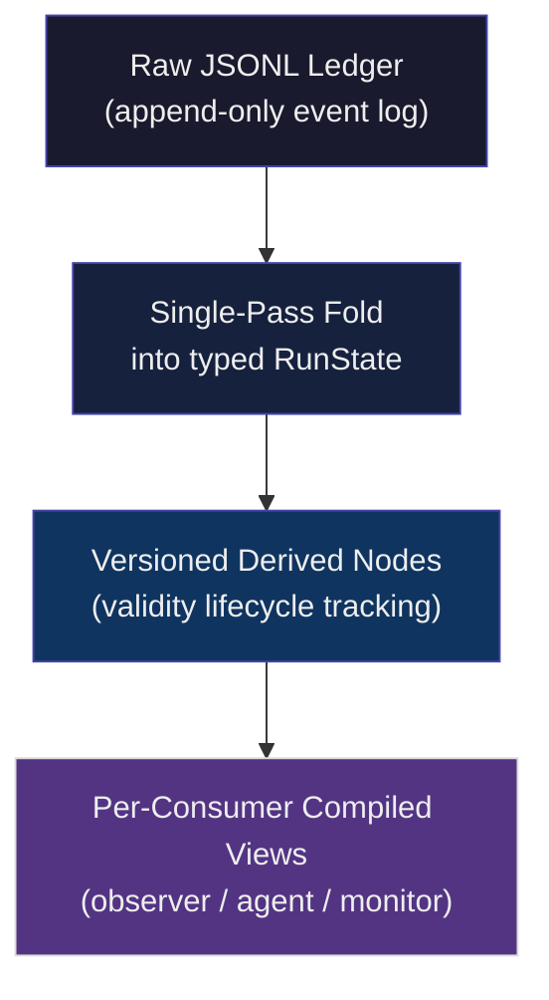

# Parsing the Stream: What a Live Trace Model Reveals About Keeping Long-Horizon Agents on Track — and What It Means for Codex CLI


---

Long-horizon agent tasks fail in a specific, predictable way: the agent loses track of what it has done. Not because the model is wrong, but because the raw execution transcript — an ever-growing JSONL stream of tool calls, results, and model replies — becomes too expensive to keep in context and too noisy to reason over once it is. The standard workaround is compaction: summarise the history and replace it with a shorter version. But compaction destroys structure, introduces latency, and frequently loses the very task-tracking state the agent needed most.

Egor Pakhomov and Erik Nijkamp of Salesforce AI Research propose a different answer in "Parsing the Stream: A Live Trace Model for Long-Horizon Agents and Their Observers" (arXiv:2609.01466, September 2026)[^1]. Rather than compressing the transcript after the fact, they maintain a *live trace model* — an append-only ledger that incrementally folds the raw event stream into a typed, versioned state representation, then compiles per-consumer views on demand. The paper proves the approach across four benchmarks with hard numeric results. The numbers are striking enough to justify a close read by every developer running Codex CLI on anything beyond a single-file task.

## Why Raw Traces Break

Before examining the solution, it is worth understanding the failure modes the paper quantifies. The COMPREHEND benchmark[^1] asks an LLM observer to answer twelve different question types about an agent's completed run — aggregations ("how many files were edited?"), recency queries ("what was the last tool called?"), and cross-run summaries. On raw tail context, Sonnet 5 achieves only **0.479 accuracy** while consuming **779K tokens** across the twelve transcripts. A compiled view of the same runs achieves **0.871 accuracy** at only **57K tokens** — roughly fourteen times fewer tokens with nearly twice the accuracy[^1].

The per-question-type breakdown is more revealing. Whole-run aggregation questions — the kind that ask the agent to count, sum, or categorise across its entire run — score between 0.13 and 0.20 on raw tail. On compiled views the same questions score close to 1.0. The raw transcript literally cannot support this class of query, regardless of model capability, because the answer is distributed across hundreds of tool-call/result pairs that no context window can simultaneously hold[^1].

For agent self-monitoring — asking a running agent to track its own progress — the numbers are equally decisive. The CONTINUE benchmark[^1] presents 120-step sequential dependency chains where each step requires correct state from all prior steps. Three conditions:

| Condition | Success rate | Cost per run |
|---|---|---|
| Full context (flat) | 8 / 30 | $7.13 |
| Curated view | 30 / 30 | $1.59 |
| Scratchpad | 30 / 30 | $0.97 |

McNemar test between full context and curated view: **p ≈ 5 × 10⁻⁷**[^1]. The curated view is not a marginal improvement — it converts near-certain failure into guaranteed success at a fifth of the cost.

## The Four-Layer Architecture

The live trace model is organised as four layers stacked on top of the raw event stream[^1]:



**Layer 1 — Append-only ledger.** Every event is written exactly once and never mutated. This is the canonical source of truth. On-disk it is a plain JSONL file; the format is human-readable and trivially replayable.

**Layer 2 — Typed RunState fold.** A single-pass incremental reducer walks the ledger in arrival order and maintains a structured in-memory state. The fold is deterministic: given the same ledger, the same state emerges. FIDELITY benchmark results confirm the incremental fold matches an independent oracle on all eight bookkeeping fields across five 120-link traces with zero mismatches[^1].

**Layer 3 — Versioned derived nodes.** Derived computations (aggregates, statistics, summaries) are registered against the RunState and re-evaluated only when their upstream fields change. Each derived node tracks a validity lifecycle, so stale views are impossible by construction.

**Layer 4 — Per-consumer compiled views.** Different consumers need different representations. A monitoring dashboard needs counts and status; a running agent needs its task-tracking state; an LLM observer needs a terse narrative. Views are compiled on demand from the current RunState rather than materialised from the raw transcript.

## Eleven Requirements Extracted from Live Failures

The paper's most practically useful section is the enumeration of eleven requirements the team discovered by observing how the system broke in production[^1]. Each requirement was identified when a failure mode appeared in real runs:

1. **Content carrying** — Views must carry values, not references. When a view referred back to transcript positions (0.20 accuracy), replacing references with literal values recovered accuracy to 1.0.
2. **Occurrence identity** — Each event is a distinct occurrence. A "newest-wins" update rule caused accumulators to collapse; identity-preserving append fixed it.
3. **No silent truncation** — The prior renderer silently kept only the last 40 facts. Surfacing truncation explicitly to the consumer eliminated an entire failure class.
4. **Source-scoped identity** — Values with the same key from different files must not be merged. Cross-file merging produced phantom values on multi-repository tasks.
5. **Deterministic aggregates** — Aggregates must be computed in a fixed order. Non-deterministic ordering caused end-stage arithmetic errors.
6. **Aggregate-preserving eviction** — When the bounded accumulator store evicts old entries, aggregates must be updated to reflect eviction. Missing this produced +65 double-counting on 120-link runs.
7. **Re-read idempotence** — Reprocessing the same ledger segment must not change state. Non-idempotent processing produced +65 phantom values from batch nondeterminism.
8. **Canonical key schemas** — Accumulator keys must be normalised before comparison. Phrasing variants ("total\_cost" vs "totalCost") caused undetected duplicate accumulation.
9. **Refusal-tolerant batching** — Safety classifiers refused approximately 37 of 85 batched extraction calls. The fold must have a bisection fallback that processes refused batches one-by-one.
10. **Verbatim validation** — Output strings should be compared byte-for-byte against the ledger, not semantically. Semantic comparison masked +41 phantom values.
11. **Coverage transparency** — When a summary covers events A–B, the consumer must know which events were summarised and which were not. Ambiguous coverage caused double-add errors on 5 out of 5 failing seeds[^1].

The eleventh requirement — coverage transparency — is the one most often violated by conventional compaction approaches, including the kind Codex CLI applies today.

## Where Curated Views Fail

The paper is explicit about the regime where the curated-view approach breaks down. On alternating-sign dependency chains — tasks where the correct output depends on the *order* of all prior operations, not just their aggregate — the curated view scores **3/10** at 60 links while full context scores **6/10**[^1]. The fold's applicability is bounded by tasks where the preserved statistics match the required computation. If the task requires full-trace replay, the fold cannot reconstruct it.

The deconfounding experiments separate two factors: the aggregate component (carrying task-tracking state) and the boundedness component (limiting context size). The aggregate component carries accuracy; boundedness carries cost[^1]. A view with full history but curated aggregates achieves 10/10 at $7.63/run. A view with bounded context but no aggregates achieves 4/10 at ~$2.14/run. Both factors must be present simultaneously to achieve 10/10 at $1.59/run.

## Mapping to Codex CLI

The paper does not instrument Codex CLI directly, but the architectural insights map cleanly onto Codex's existing configuration surface.

### Compaction as a partial live trace

Codex CLI's `auto_compact_token_limit` triggers compaction when the running context reaches a threshold[^2]. Compaction summarises the conversation history and restarts the context from the summary. This is approximately equivalent to Layer 2 of the live trace model — a fold into RunState — but without Layer 3 (versioned derived nodes) or Layer 4 (per-consumer views). The practical consequence is that Codex's compaction, like conventional summarisation, can violate requirements 3, 6, and 11 from the paper's list: it truncates silently, can lose aggregate state, and provides no coverage transparency.

Setting `auto_compact_token_limit` conservatively — high enough that compaction fires rarely — is the most direct mitigation available today:

```toml
# config.toml
[profiles.long-horizon]
model = "gpt-5-codex"
auto_compact_token_limit = 180000
max_turns = 200
```

### Scratchpad injection via startup\_prompt\_template

The scratchpad condition in CONTINUE achieves 30/30 at $0.97/run — cheaper than the curated view and equally accurate[^1]. A scratchpad is a structured text block the agent maintains itself: at each step, the agent reads its own scratchpad, performs the step, and rewrites the scratchpad with updated state. Codex CLI's `startup_prompt_template` can inject a scratchpad template at session start:

```toml
[profiles.long-horizon]
startup_prompt_template = """
## Task Scratchpad

You MUST maintain the following fields throughout this session.
Update them at the end of every turn, even if unchanged.

- completed_steps: []
- pending_steps: []
- files_modified: []
- open_issues: []
- last_verified_state: ""

Do not summarise this section. Rewrite it in full each turn.
"""
```

The key design constraint is requirement 7 (re-read idempotence): the scratchpad format must be structured enough that re-reading a turn's output produces identical state to a first read. Freeform prose scratchpads violate this; JSON or TOML-structured scratchpads do not. ⚠️ Codex CLI's native scratchpad support is not documented as of v0.152.1; this pattern requires explicit instruction in AGENTS.md or startup\_prompt\_template[^2].

### AGENTS.md as a typed state schema

Requirement 8 (canonical key schemas) maps directly to AGENTS.md's role as a session-wide schema document. If the agent is expected to track specific quantities — file counts, test pass rates, dependency versions — those quantities should be named and typed in AGENTS.md:

```markdown
## Task Tracking Schema

The agent MUST use these exact key names in its scratchpad:

- `files_modified` (list of strings): absolute paths only
- `tests_passing` (integer): count of passing tests, not a ratio
- `open_pr_refs` (list of strings): PR numbers as "#NNN"
- `next_action` (string): one sentence, imperative mood
```

Naming conventions that are consistent across sessions feed directly into the fold's canonical key schema requirement — and prevent the failure mode where two agents on the same task accumulate state under different key names.

### Per-tool output limits as view compilation

Each MCP tool in Codex CLI can now specify `output_token_limit` (introduced in v0.152.0)[^2]. This is a bounded-output mechanism: rather than passing raw tool output to the model, the output is truncated at a configured size. This is a weak form of view compilation — the tool's response is pre-filtered before it enters the context window. The paper's requirement 3 (no silent truncation) suggests that the truncation boundary should be surfaced to the model, not silently applied. A PostToolUse hook can inject a truncation annotation:

```toml
[[hooks]]
event = "PostToolUse"
tool_names = ["shell", "computer"]
run = """
  python3 -c "
import sys, json
result = json.load(sys.stdin)
if result.get('truncated'):
    print('[TRACE NOTE: output truncated at token limit — full output available via read_file]')
"
"""
```

### Monitoring with compiled views

The COMPREHEND results — 0.871 accuracy at 57K tokens vs 0.479 at 779K — directly motivate external monitoring of running Codex sessions. The `codex agents` dashboard (introduced v0.149.0) provides task-level visibility, but for programmatic monitoring the TaskOutput API exposes the raw turn log[^2]. A monitoring agent reading compiled views of that log — aggregating file-modification counts, tracking tool-call patterns, detecting stall conditions — would reproduce COMPREHEND's accuracy advantage at a fraction of the token cost.

## Summary

The live trace model paper establishes three results that should influence how senior developers configure Codex CLI for production long-horizon tasks:

1. **Fourteen times fewer tokens, twice the observer accuracy.** Structured folding of the trace beats raw context comprehensively; raw tail context is not a viable baseline for long-horizon monitoring.

2. **30/30 vs 8/30 on 120-step tasks.** Curated views and agent-maintained scratchpads both achieve near-perfect task completion on sequential dependency chains. Full-context prompting fails the same tasks 73% of the time at 4.5× the cost.

3. **Eleven concrete engineering requirements.** Each requirement names a specific failure mode that can arise from naive compaction or summarisation. Requirements 3, 6, and 11 — silent truncation, aggregate-preserving eviction, and coverage transparency — are the ones most directly relevant to evaluating Codex CLI's current compaction behaviour.

The tracelab implementation and all four benchmark harnesses are available under BSD-3-Clause at [https://github.com/SalesforceAIResearch/tracelab](https://github.com/SalesforceAIResearch/tracelab)[^1].

## Citations

[^1]: Pakhomov, E., & Nijkamp, E. (2026). *Parsing the Stream: A Live Trace Model for Long-Horizon Agents and Their Observers*. arXiv:2609.01466. [https://arxiv.org/abs/2609.01466](https://arxiv.org/abs/2609.01466)

[^2]: OpenAI. (2026). *Codex CLI v0.152.0 Release Notes*. GitHub. [https://github.com/openai/codex/releases/tag/v0.152.0](https://github.com/openai/codex/releases/tag/v0.152.0)

[^3]: OpenAI. (2026). *Codex CLI Documentation — Configuration Reference*. [https://openai.github.io/codex/](https://openai.github.io/codex/)

[^4]: Pakhomov, E., & Nijkamp, E. (2026). *tracelab: Live Trace Model Implementation*. GitHub (BSD-3-Clause). [https://github.com/SalesforceAIResearch/tracelab](https://github.com/SalesforceAIResearch/tracelab)

[^5]: OpenAI. (2026). *Codex CLI v0.149.0 Release Notes — Agents Dashboard*. GitHub. [https://github.com/openai/codex/releases/tag/v0.149.0](https://github.com/openai/codex/releases/tag/v0.149.0)
