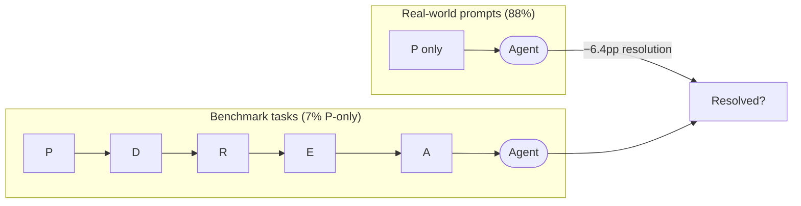
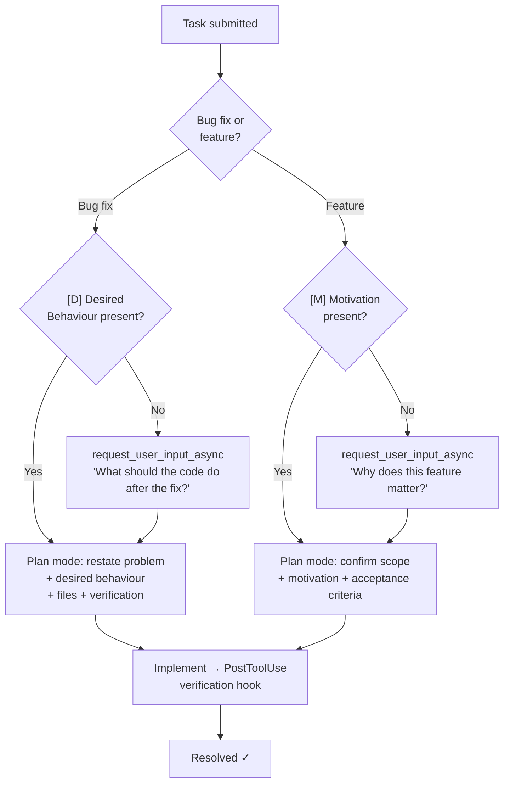

# The 6.4pp Tax: What RealSWE Reveals About Prompt Quality and How to Fix It in Codex CLI


Coding agent benchmarks have a dirty secret: they describe tasks the way technical writers do, not the way developers actually write bug reports. A new dataset published in August 2026 puts a number on the cost of that gap — and it is larger than most practitioners suspect.

## The Study: RealSWE

Kim, Gwon, Kim, Shim, and Lee (arXiv:2608.27831, August 2026) introduce **RealSWE**, a compositional evaluation that asks a deceptively simple question: how much does resolution rate drop when you replace benchmark-style task descriptions with the kind of casual, information-sparse prompts that developers actually write?[^1]

The dataset covers 381 task families — 192 bug fixes and 189 feature requests — derived from 1,229 original SWE-bench Verified and Pro tasks across 21 repositories and four languages (55.1% Python).[^1] Each family keeps the same underlying fix or implementation while varying what information the agent receives and how it is phrased.

Seven models were evaluated: DeepSeek V4 Pro, DeepSeek V4 Flash, MiMo V2.5 Pro, MiMo V2.5, Claude Haiku 4.5, Qwen3.7 Plus, and MiniMax M3.[^1]

## The Benchmark-Reality Gap

The mismatch between benchmark inputs and real-world prompts is stark.[^1]

| Metric | Real User Prompts | Benchmark Tasks |
|---|---|---|
| Problem Statement only \[P\] or \[P+A\] | **88%** | 7% |
| Average information fields per task | **1.4** | 2.9 |
| Includes Desired Behavior \[D\] | **5.4%** | 73.5% |
| Includes Motivation \[M\] | **8.9%** | 96.1% |

Developers overwhelmingly write one-liner problem statements and skip the context that benchmarks treat as standard. The result is a systematic overestimation of what agents can actually do in production.

### The Information Taxonomy

The researchers define a structured taxonomy for task descriptions:[^1]

**Bug fixes:** `[P]` Problem Statement · `[D]` Desired Behavior · `[R]` Reproduction Steps · `[E]` Environment Information · `[A]` Additional Context

**Feature requests:** `[P]` Problem Statement · `[M]` Motivation · `[A]` Additional Context



## What the Numbers Say

Moving from benchmark-style inputs to realistic ones reduces resolution rates by **6.4 percentage points on average** across all seven models.[^1]

The spread is meaningful: MiniMax M3 loses 4.0pp; DeepSeek V4 Pro loses 8.0pp.[^1] Bug fixes suffer more than feature requests — 9.1pp average versus 3.7pp — likely because bug resolution depends more heavily on the agent forming a precise mental model of the correct end state.[^1]

### What Helps: Desired Behavior and Motivation

Removing `[D]` (Desired Behavior) from bug-fix descriptions caused resolution rates to fall by **7.1–8.9pp across every tested model**, with statistical significance at p<0.01 across all configurations.[^1] This is the single most impactful missing field.

For feature requests, omitting `[M]` (Motivation) caused a **3.4pp average decrease**.[^1] Motivation clarifies *why* the feature is needed, which shapes which implementation trade-offs the agent accepts.

### What Doesn't Help: Steps and Environment

`[R]` Reproduction Steps and `[E]` Environment Information together contributed only **1.8pp combined** on average.[^1] Developers who front-load environment details and reproduction recipes in their prompts are probably optimising the wrong thing.

Linguistic style — formal versus casual phrasing, declarative versus imperative sentences — had **no statistically significant effect** (p≥0.35 across all models and task types).[^1] You do not need to write formal prose; you need to write complete thoughts.

```mermaid
xychart-beta
    title "Resolution Rate Impact by Information Field (pp change when removed)"
    x-axis ["Desired Behavior [D]", "Motivation [M]", "Repro Steps [R]", "Env Info [E]", "Style change"]
    y-axis "Resolution rate delta (pp)" -10 0
    bar [-8.0, -3.4, -1.2, -0.6, -0.8]
```

## Why This Matters for Codex CLI

Codex CLI's resolution rate in production is bounded by the quality of the task descriptions it receives. The RealSWE findings give practitioners a concrete lever: **adding one sentence of desired behaviour to a bug report is worth roughly as much as switching from a mid-tier to a top-tier model**.

The following sections show how to encode this insight directly into your Codex CLI configuration.

### 1. AGENTS.md Task Description Templates

Add a structured task template to your project's `AGENTS.md` that makes `[D]` mandatory for bugs and `[M]` mandatory for feature requests. The agent sees this template on every session start.

```markdown
## Task Description Protocol

When you receive a task, identify whether it is a **bug fix** or a **feature request**.

### Bug Fix — Required Fields
- **Problem:** What is broken and where?
- **Desired Behaviour:** What should the code do after the fix? (REQUIRED — never begin implementation without this)
- **Reproduction:** Steps to reproduce (if provided; do not block on this)

### Feature Request — Required Fields
- **Problem:** What capability is missing?
- **Motivation:** Why does this feature matter? What user scenario does it enable? (REQUIRED)
- **Scope:** What is explicitly out of scope?

If a required field is absent, use `request_user_input_async` to ask for it before writing any code.
```

### 2. Plan Mode as a Requirements-Gathering Phase

Use `plan_mode` to force an explicit requirements-confirmation step before the agent touches any files. This is especially effective for bug fixes, where the `[D]` field has the largest impact.

```toml
# ~/.codex/config.toml
[plan_mode]
enabled = true
plan_mode_reasoning_effort = "high"
```

In your `AGENTS.md`, add:

```markdown
## Plan Mode Directive

When entering plan mode for a bug fix:
1. Restate the problem in your own words
2. State the desired behaviour explicitly — quote or paraphrase from the task if present; ask if absent
3. List the files you expect to modify
4. Describe your verification method

Do not exit plan mode until desired behaviour is confirmed.
```

### 3. Structured `codex queue` Task Format

When submitting tasks programmatically via `codex queue`, enforce the `[D]`/`[M]` fields in the task payload itself.

```bash
# Bug fix — include desired_behavior field
codex queue submit --json '{
  "type": "bug_fix",
  "problem": "Login form throws 500 when email contains a plus sign",
  "desired_behavior": "Login succeeds; plus signs in emails are URL-encoded before submission",
  "reproduction": "POST /auth/login with body email=user+tag@example.com"
}'

# Feature request — include motivation field
codex queue submit --json '{
  "type": "feature",
  "problem": "Add CSV export to the reports page",
  "motivation": "Finance team runs manual exports weekly; automation saves ~2 hours/week and removes copy-paste errors"
}'
```

### 4. PreToolUse Hook: Block Implementation Without Required Fields

A lightweight hook can refuse to let the agent call file-editing tools until required fields are confirmed in its working memory.

```bash
#!/usr/bin/env bash
# ~/.codex/hooks/pre-tool-use-require-desired-behavior.sh
# Blocks write/edit tools if CODEX_TASK_TYPE is bug_fix and desired_behavior is unset

TOOL="$CODEX_TOOL_NAME"

if [[ "$TOOL" == "str_replace_editor" || "$TOOL" == "create_file" ]]; then
  if [[ "${CODEX_TASK_TYPE:-}" == "bug_fix" && -z "${CODEX_DESIRED_BEHAVIOR:-}" ]]; then
    echo "BLOCK: Desired Behaviour field is missing for this bug fix. Ask the user before editing files." >&2
    exit 2
  fi
fi

exit 0
```

```toml
# config.toml
[hooks.PreToolUse]
command = "~/.codex/hooks/pre-tool-use-require-desired-behavior.sh"
```

### 5. Named Profiles for Bug-Fix vs Feature Workflows

Encode the different information requirements for each task type as named profiles so you can switch contexts cleanly.

```toml
# config.toml
[profiles.bugfix]
model = "gpt-5.6-sol"
model_reasoning_effort = "medium"
startup_prompt_template = """
TASK TYPE: Bug Fix
Required: clearly state desired behaviour before touching any file.
If absent, call request_user_input_async asking: "What should the code do after this fix?"
"""

[profiles.feature]
model = "gpt-5.6-terra"
model_reasoning_effort = "high"
startup_prompt_template = """
TASK TYPE: Feature Request
Required: confirm motivation (why this matters) before designing the implementation.
If absent, call request_user_input_async asking: "What user scenario or business need drives this feature?"
"""
```

Switch at invocation time:

```bash
codex --profile bugfix "Login form crashes on plus-sign emails"
codex --profile feature "Add CSV export to reports page"
```

### 6. startup_prompt_template as a Field Reminder

Even without named profiles, a single `startup_prompt_template` directive serves as a standing reminder across all sessions.

```toml
# config.toml
startup_prompt_template = """
Before implementing anything, confirm:
- Bug fix? → State the desired behaviour explicitly.
- Feature? → State the motivation (why it matters).
Prompt the user for missing fields using request_user_input_async.
"""
```

## Putting It Together



## What the Research Does Not Address

RealSWE was evaluated with a scaffolding harness that does not map exactly to Codex CLI's hook-and-lifecycle architecture. The −6.4pp figure covers agents run against SWE-bench-derived tasks; production codebases with more context, existing AGENTS.md files, and ongoing sessions may show different magnitudes.[^1] ⚠️ The absolute numbers should be treated as directional, not precise predictions for your specific repository.

The study also did not test the effect of *adding* synthesised `[D]` or `[M]` fields to tasks that originally lacked them (i.e., whether the agent can recover information value by asking a clarifying question). That remains an open research question. The Codex CLI approach of using `request_user_input_async` to gather missing fields is based on the logical extension of the findings, not a direct experimental result.

## Practical Summary

| Action | Mechanism | Expected uplift |
|---|---|---|
| Add `[D]` to all bug-fix tasks | AGENTS.md template / profile startup prompt | ~7–9pp resolution rate |
| Add `[M]` to all feature requests | AGENTS.md template / profile startup prompt | ~3–4pp resolution rate |
| Block file edits until `[D]` confirmed | PreToolUse hook | Prevents premature implementation |
| Use plan mode for requirements | `plan_mode.enabled = true` | Surfaces missing fields early |
| Skip detailed reproduction steps | Focus effort elsewhere | ~1–2pp (low-value field) |
| Skip style formatting | Focus effort elsewhere | ~0pp (negligible) |

The lesson from RealSWE is uncomfortable but clear: agents lose roughly 6–8 percentage points every time you hand them a problem statement without a desired outcome. That cost is not paid in model capability — it is paid in task description quality. Codex CLI gives you the configuration primitives to enforce the fields that matter.

## Citations

[^1]: Kim G., Gwon H., Kim J., Shim K., Lee S. "RealSWE: A Compositional Evaluation of Coding Agents under Realistic User Requests." arXiv:2608.27831 (August 28–31, 2026). https://arxiv.org/abs/2608.27831
