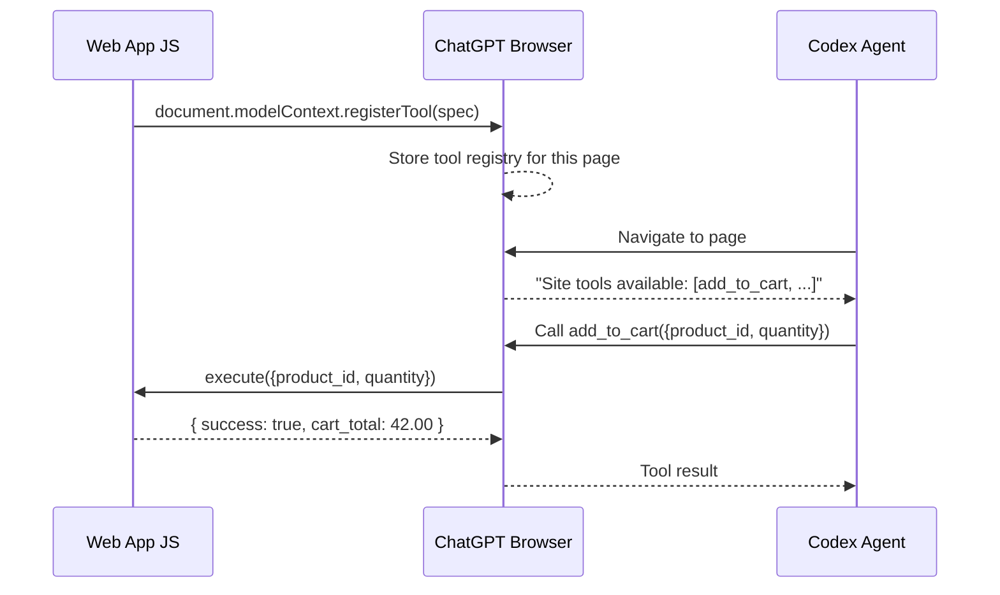
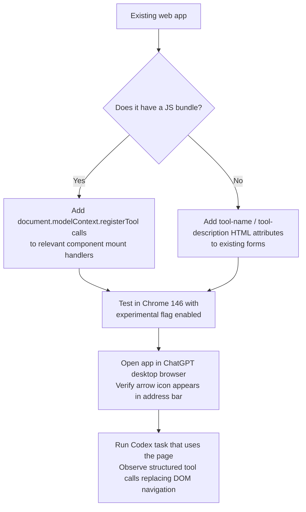

# WebMCP Site Tools: How Codex Now Calls Your Web App Like an API


On 25 August 2026, OpenAI switched on a capability that changes how Codex interacts with the web.[^1] Instead of navigating a page by interpreting screenshots, inferring button semantics from the DOM, and simulating clicks, Codex can now call named, typed JavaScript functions declared by the page itself. OpenAI calls this feature "site tools". The underlying standard is **WebMCP** — a W3C Web Machine Learning Community Group proposal authored by engineers from Microsoft and Google.[^2]

This article covers what WebMCP is, how to implement it, how it differs from the backend MCP servers you already run alongside Codex CLI, and what the current limits are.

## The Problem WebMCP Solves

Traditional browser automation forces an agent to reconstruct intent from presentation: screenshot → element detection → click sequence. This is slow (30–60 seconds for a non-trivial task), brittle (a layout change breaks the workflow), and expensive (screenshot interpretation consumes substantially more tokens than structured data).[^3]

WebMCP inverts this. Instead of the agent inferring what a page can do, the page explicitly advertises it:

```
"I expose a tool called `add_to_cart`.
It takes { product_id: string, quantity: number }.
Here is the function that handles it."
```

The agent never touches the DOM for that action. It constructs a validated JSON payload, the browser executes the registered function within the page's JavaScript context, and the result comes back as structured data. Measured task completion drops from 30–60 seconds to approximately 5 seconds.[^3]

## The JavaScript API

WebMCP introduces `document.modelContext` as the registration surface. The imperative form, which gives you full control, looks like this:[^4]

```javascript
const controller = new AbortController();

if (typeof document.modelContext?.registerTool === "function") {
  await document.modelContext.registerTool(
    {
      name: "add_to_cart",
      description: "Add a product to the shopping cart by product ID and quantity.",
      inputSchema: {
        type: "object",
        properties: {
          product_id: { type: "string", description: "The SKU of the product." },
          quantity:   { type: "number", minimum: 1 }
        },
        required: ["product_id", "quantity"],
        additionalProperties: false
      },
      annotations: { readOnlyHint: false },
      async execute({ product_id, quantity }) {
        await cart.addItem(product_id, quantity);
        return { success: true, cart_total: cart.getTotal() };
      }
    },
    { signal: controller.signal }
  );
}
```

The `AbortController` signal allows you to unregister the tool when the component unmounts — appropriate when tool availability depends on application state (e.g., a tool that only makes sense when a modal is open).

For static pages and legacy CMS deployments, a declarative HTML form approach also works:[^3]

```html
<form tool-name="book_table"
      tool-description="Reserve a table at the restaurant">
  <input name="party_size"
         tool-param-description="Number of guests, integer" />
  <input name="date"
         tool-param-description="Reservation date in YYYY-MM-DD format" />
</form>
```

The browser infers the input schema from the form's field types. This requires no JavaScript changes, making it viable for teams that cannot modify their client-side bundle.

## How Codex Discovers Site Tools

When Codex (or ChatGPT Work) navigates to a page inside the ChatGPT desktop app's built-in browser, the browser checks for registered tools automatically.[^1] An arrow icon appears in the address bar when tools are available; users can click "Site tools" to inspect the full capability list before granting access.

Tools are **page-scoped**: they exist only while the page is open and disappear on navigation. There is no persistent tool registry — each page load triggers fresh registration. This design keeps tool surface area predictable and avoids stale capability descriptions.



## WebMCP vs Traditional MCP Servers

These are complementary, not competing, integration paths. The choice depends on where Codex is running and what the action requires:[^3][^4]

| Dimension | WebMCP Site Tools | Backend MCP Server |
|---|---|---|
| **Execution context** | Browser JS context, user's active session | Standalone server process |
| **Authentication** | Inherits cookies, SSO, RBAC — zero credential plumbing | Requires token management or OAuth flow |
| **Discovery** | Auto-detected when page loads | Configured in `config.toml` `[mcp_servers.*]` |
| **Availability** | Page must be open in desktop browser | Always-on, accessible from CLI and headless tasks |
| **Scope** | Tools only — no Resources or Prompts | Full MCP: Tools, Resources, Prompts, Sampling |
| **Speed** | Fast — no network round-trip to a server | Depends on server implementation |
| **Best for** | Web apps with existing UIs, authenticated actions | CLI workflows, server-side operations, cross-client reach |

If you are building a Codex-powered workflow that starts in the terminal and needs to interact with an internal web dashboard, you may use both: a backend MCP server for filesystem/CI operations and WebMCP site tools for the dashboard actions that depend on the user's active browser session.

## Security Model

The WebMCP security model is deliberately conservative:[^4][^5]

- **Tool definitions and results are untrusted content.** The agent treats them as external data, not as instructions. Prompt injection via a malicious tool description is a known concern.
- **Consequential actions require confirmation.** Purchases, deletions, and permission changes must pass a safety review and may surface a user confirmation dialog before execution.
- **Tools are origin-scoped.** Registrations from iframes — including same-origin iframes — are not discoverable. Register tools only in the top-level document.
- **Users can opt out.** Settings → Browser → Permissions allows site tools to be disabled globally or per-domain.

For developers: the `annotations.readOnlyHint` field (set to `true` for read-only tools) allows the agent runtime to apply lighter-touch review to non-mutating calls, reducing friction for information-retrieval tools.

## Model Requirements and Availability

Site tools require GPT-5.6 Sol or GPT-5.6 Terra.[^1] GPT-5.6 Luna has WebMCP disabled. The feature is not available in Enterprise or Edu workspaces.

On the browser side, the `document.modelContext` API shipped in Chrome 146 behind the "Experimental Web Platform Features" flag.[^2] Firefox, Safari, and Edge were involved in W3C working group discussions but had not shipped implementations as of this writing. ⚠️ Cross-browser support timelines have not been finalised.

## The 10-Day WebMCP Challenge

OpenAI launched a developer challenge alongside the site tools rollout.[^1] Submissions opened 25 August and closed 3 September 2026. The top 10 submissions each receive \$3,000, one year of ChatGPT Pro, a Codex Micro keyboard, and merchandise (\$35,000 total prize pool). Challenge partners include Chromium, Cloudflare, Shopify, Vercel, Render, and Netlify. Winners are announced 23 September 2026.

Eligible submissions: new WebMCP-native web apps, or existing apps with WebMCP integration added. Codex itself can scaffold the integration: "Ask Codex to add WebMCP support to any web app or ChatGPT Site, with Codex generating the integration using the app's existing logic and permissions."

## Implementation Checklist for Codex CLI Operators

If you run internal tools that Codex accesses via browser automation today, here is a migration path:



Key design decisions:[^4]

- **Keep `inputSchema` narrow.** Codex performs better with fewer, well-described parameters than with a generic catch-all schema.
- **Return verification data.** Include enough in the result (e.g., the updated cart total, a confirmation ID) for Codex to confirm the action succeeded without a follow-up read.
- **Re-use existing auth.** Do not create a parallel API key system. The tool executes in the user's browser session — trust the session's identity and permissions.
- **Describe side effects explicitly.** If a tool modifies persistent state, say so in `description`. This allows the safety reviewer and the user to make an informed decision about confirmation.

## Summary

WebMCP converts web applications into structured tool endpoints that Codex can call directly, replacing brittle DOM-scraping with typed, contract-defined function calls. The integration requires minimal code — as little as a few `registerTool` calls on component mount — and inherits your existing session authentication without any additional credential plumbing. The performance and reliability gains over conventional browser automation are substantial. For Codex CLI operators running workflows that include browser-based steps, WebMCP is the cleaner integration path wherever the target application can be modified.

## Citations

[^1]: OpenAI, "OpenAI Adds WebMCP to ChatGPT's Browser, Letting AI Agents Use Websites Directly", Search Engine Journal, August 2026. <https://www.searchenginejournal.com/chatgpt-adds-webmcp-support/587237/>

[^2]: W3C Web Machine Learning Community Group, "WebMCP Repository", GitHub, 2026. <https://github.com/webmachinelearning/webmcp>

[^3]: Scalekit, "WebMCP Explained: How Browser Agents Can Call Web Tools Without Scraping the DOM", 2026. <https://www.scalekit.com/blog/webmcp-the-missing-bridge-between-ai-agents-and-the-web>

[^4]: OpenAI, "Site Tools", ChatGPT Learn Documentation, 2026. <https://learn.chatgpt.com/docs/webmcp>

[^5]: Superpower Daily, "OpenAI Launches 10-Day WebMCP Challenge as ChatGPT Gains a Browser Tool Interface", August 2026. <https://superpowerdaily.com/posts/openai-launches-10-day-webmcp-challenge-as-chatgpt-gains-a-browser-tool-interface>
