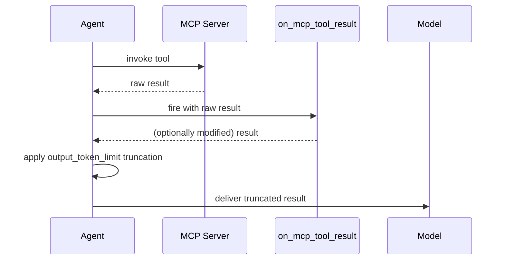
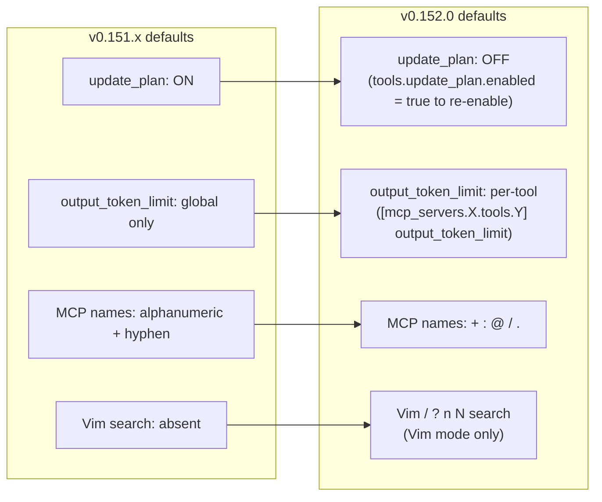

# Codex CLI v0.152.0: Vim Search in Drafts, Per-Tool MCP Token Limits, and the Planning Tool Goes Opt-In


Codex CLI v0.152.0 shipped on 1 September 2026[^1], followed by a targeted patch in v0.152.1 the same day[^2]. The release is notable on three distinct fronts: a meaningful ergonomic uplift for Vim users in the TUI composer, a new token-governance primitive for MCP tool outputs, and a breaking-ish default change that quietly disables the built-in planning tool. Each deserves attention before you upgrade a team-wide deployment.

## Vim Search in the TUI Composer

Vim users gained full `/` and `?` search inside the TUI draft composer in v0.152.0 (PR #41586)[^1]. The implementation mirrors the standard Vim search contract: `/pattern` searches forward, `?pattern` searches backward, and `n`/`N` navigate between matches. Matched text is highlighted inline.

Before this release, Vim mode — introduced back in v0.129.0 — offered normal-mode movement (`h`, `j`, `k`, `l`), word jumps (`w`, `b`), and basic text objects, but no search. Drafts containing long pasted code blocks or multi-paragraph prompts were awkward to edit without search. That gap is now closed.

A companion fix (PR #41921) corrects the insert-mode entry point: after submitting a message or dispatching a slash command, a fresh composer now opens in Insert mode rather than Normal mode. Previously, Vim users had to press `i` after every submission — a small but persistent friction point.

```bash
# Enable Vim mode from within the TUI (persists across sessions)
/vim

# Or set it permanently in config.toml
# ~/.codex/config.toml
[tui]
vim_mode = true
```

The Vim search state is local to the current draft session; it does not persist to the next turn.

## Per-Tool Output Token Limits for MCP

MCP tool outputs have always been subject to the model's global output truncation budget. In practice this meant a single verbose tool — a database dump, a long test log, a recursive file listing — could consume the entire token allowance for a round-trip, leaving subsequent tools starved. v0.152.0 adds `output_token_limit` as a per-tool configuration key under each MCP server's `tools` table (PR #41421)[^3].

```toml
# ~/.codex/config.toml or .codex/config.toml (project-level)

[mcp_servers.my-db-server]
command = "npx"
args = ["-y", "@my-org/db-mcp-server"]

[mcp_servers.my-db-server.tools.query_database]
output_token_limit = 4096

[mcp_servers.my-db-server.tools.list_tables]
output_token_limit = 512
```

When plugin and user policies overlap, the most restrictive limit wins while the approval policy remains independent. The effective budget is written into the conversation history, which means the same truncation ceiling applies to post-tool hook responses and when the session is resumed via `codex exec resume` — there are no silent budget changes across compactions.

This integrates cleanly with the `on_mcp_tool_result` hook introduced in v0.151.0. The hook fires before the truncated result is prepared for the model, so you can inspect or rewrite the result before the token limit is applied.



## MCP Server Names Now Support Package-Style Identifiers

A smaller but practically useful change (PR #41700)[^4] expands the character set allowed in MCP server names to include `:`, `@`, `/`, and `.`. This enables identifiers like `npm:@modelcontextprotocol/server-sequential.thinking` — the natural name for npm-distributed MCP packages — without needing to invent a sanitised alias.

The special characters are preserved across all `codex mcp` CLI operations (`add`, `get`, `list`, `remove`), runtime tool namespaces, and OAuth credential lookups. In `config.toml`, names containing special characters must be quoted:

```toml
[mcp_servers."npm:@modelcontextprotocol/server-sequential.thinking"]
command = "npx"
args = ["-y", "@modelcontextprotocol/server-sequential-thinking"]
```

Non-bare names are automatically quoted in any `config.toml` recovery hints Codex generates, so the output remains valid TOML if you copy it directly.

## The Planning Tool Is Now Opt-In

The largest behavioural change in v0.152.0 is the quietest in the release notes: `update_plan` is disabled by default (PR #41744)[^5]. The tool — which lets the model maintain a structured task plan that persists across turns — was previously always available. From v0.152.0, it is absent from all default prompts (model, collaboration-mode, multi-agent, compaction, prewarm, and goal-continuation).

To restore the previous behaviour, add one line to your config:

```toml
# ~/.codex/config.toml
[tools.update_plan]
enabled = true
```

User-provided custom instructions that mention planning are preserved regardless of this setting. The model will still reason about tasks in its scratchpad; what changes is that it no longer maintains an explicit, structured plan object unless the tool is enabled.

**Why this matters for teams:** If you have AGENTS.md files or startup prompts that reference `/plan` or rely on structured plan output, verify they still work after upgrading. The model may silently stop writing plan updates without emitting an error.

## Rate-Limit Banners with Actionable Options

When a rate limit is hit, the TUI now shows an interactive banner (PR #41742)[^1] offering direct options: check current usage, manage credits, see when limits reset, or switch plan. Previously the banner was informational only; users had to navigate to chatgpt.com independently.

## Credential Refresh Progress for Bedrock and Other Providers

Long-running Codex sessions against Amazon Bedrock frequently fail with silent token expiry (the 12-hour credential limit[^6]). v0.152.0 adds authenticated recovery events to the app-server protocol (PR #41239): `modelProvider/authRecoveryStarted` and `modelProvider/authRecoveryCompleted` notifications are emitted when a provider refreshes credentials. The TUI surfaces these as progress indicators; `codex exec` logs them to stdout. You can now observe a Bedrock reauth in flight rather than seeing a silent pause followed by success or failure.

## Configuration Changes at a Glance



## v0.152.1: Guardian Policy Fix

The same-day patch (v0.152.1) addresses a single regression: Guardian approval review was not honouring Node REPL policies supplied through model metadata[^2]. Teams using Node-based sandboxes with custom Guardian policies should update past v0.152.0 to v0.152.1 or the subsequent v0.153.0 stable release.

## Upgrade Checklist

1. **Planning tool** — if your workflow depends on `update_plan`, add `[tools.update_plan] enabled = true` to config.toml before deploying.
2. **MCP token limits** — audit verbose tools and add per-tool `output_token_limit` values to prevent single tools from saturating context.
3. **MCP server names** — if you use package-style identifiers, quote them in config.toml (Codex will quote them automatically in recovery hints).
4. **Bedrock users** — credential refresh progress is now visible; no action required, but watch for `authRecoveryStarted` in logs during long sessions.
5. **Vim users** — update muscle memory: fresh composers open in Insert mode after submission.

## Citations

[^1]: OpenAI. "Release 0.152.0 — openai/codex." GitHub Releases, 1 September 2026. <https://github.com/openai/codex/releases/tag/rust-v0.152.0>
[^2]: OpenAI. "Release 0.152.1 — openai/codex." GitHub Releases, 1 September 2026. <https://github.com/openai/codex/releases>
[^3]: copyberry[bot]. "Support per-tool MCP output limits." Pull Request #41421, openai/codex. <https://github.com/openai/codex/pull/41421>
[^4]: copyberry[bot]. "Support package-style MCP server names." Pull Request #41700, openai/codex. <https://github.com/openai/codex/pull/41700>
[^5]: OpenAI. "Disable update_plan tool by default." Pull Request #41744, openai/codex. Merged 31 August 2026.
[^6]: OpenAI Codex Updates — September 2026. Releasebot. <https://releasebot.io/updates/openai/codex>
