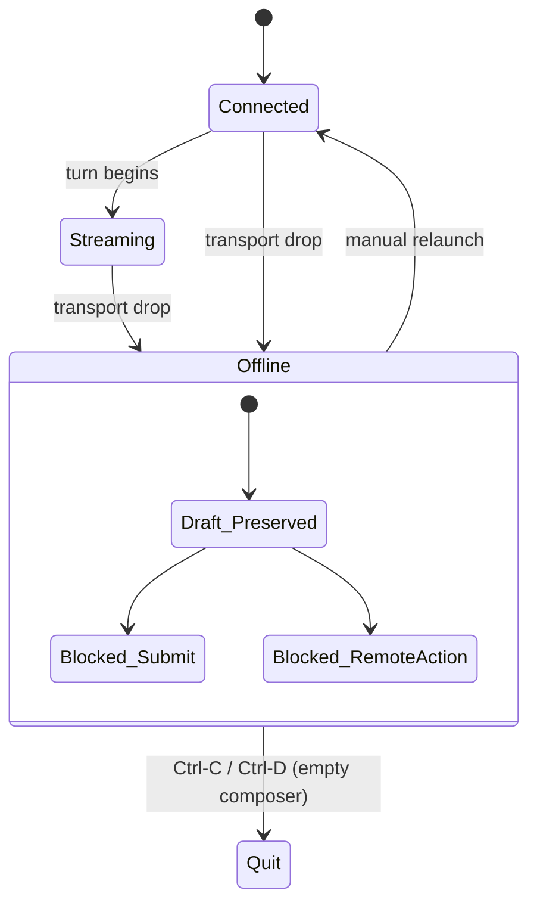
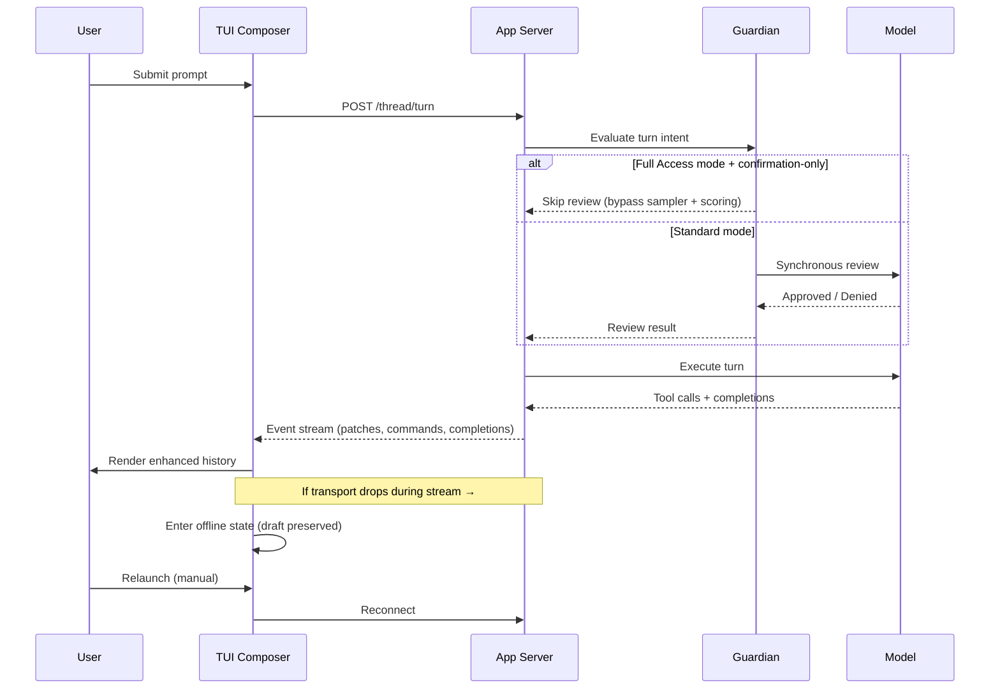

# Codex CLI v0.153.0 Stable: TUI Session Resilience, Guardian Full Access Optimisation, and Experimental Context Management


Released on 3 September 2026, v0.153.0 is the stable graduation of the alpha series that shipped through the preceding week.[^1] With 50+ merged pull requests consolidated from five alpha builds, the headline changes split across four engineering themes: TUI session resilience under network failure, Guardian review elimination for Full Access workflows, a disabled-by-default experimental context management mode, and remote plugin marketplace management reaching stable. This article unpacks each in detail.

## TUI Session Resilience Under App-Server Disconnection

The most operationally significant change in v0.153.0 is the overhaul of how the TUI handles transient app-server connection loss (PRs #41911, #41916, #41918).[^2]

Previously, if the WebSocket transport to the app-server dropped mid-session — during startup, active event streaming, or immediately after submission — the TUI would leave the composer in an ambiguous state. Drafts, queued input, pasted content, and attachments could be lost.

The new behaviour introduces an explicit **offline state**:



When the transport drops, the TUI:

- Preserves the in-progress draft, queued input, expanded pastes, and any attachments
- Displays a connection-lost banner directing the user to copy their work and relaunch
- Blocks new submissions, remote actions, and automatic queue replay
- Cancels pending view requests and discards stale server completions

Two exit paths remain available: `Ctrl-C` to quit unconditionally, and `Ctrl-D` (when the composer is empty) as an alternative. The embedded app-server mode is unaffected — the change only applies to externally connected transports.

This matters in practice for teams running Codex against a remote app-server over SSH or WSS tunnels. A brief network hiccup no longer means losing a multi-line prompt or a pasted diff. The draft survives the disconnect; the engineer relaunches and picks up exactly where they were.

## Guardian Full Access Optimisation

v0.153.0 eliminates unnecessary Guardian review overhead when Full Access mode is in effect (PRs #42147, #42256).[^3]

Full Access mode combines `approvalPolicy: never` with unrestricted environment permissions. Under the previous implementation, Guardian still triggered synchronous model reviews, sampler prewarming, and background scoring connections for confirmation-only actions — work that by definition could never result in a denial under Full Access.

The update introduces three changes:

**Consistent Full Access detection.** The system now evaluates Full Access uniformly across the conversation thread and all selected environments. Pending, failed, or restricted environments are excluded from Full Access qualification — they don't inherit the bypass.

**Confirmation-only bypass.** For actions where Guardian's only possible outcome is confirmation, the following operations are now skipped entirely:

- Synchronous model review
- Sampler prewarming
- Background scoring connection

Cancellations, explicit denials, and user input forms retain their existing validation paths.

**Dynamic re-evaluation per turn.** The permission state is re-assessed at the start of each conversation turn. A thread can transition into or out of Full Access mid-session without requiring a restart.

```toml
# config.toml — Full Access mode (existing config; no change required)
[sandbox]
policy = "full-access"
```

The practical effect is reduced per-turn latency in trusted local or CI environments running Full Access. Teams that do not use Full Access are unaffected.

## Experimental Context Management Mode

v0.153.0 ships `features.context_management.experimental_mode`, a disabled-by-default opt-in for ChatGPT Plus, Pro, and Pro Lite subscribers using the Codex backend (PR #42385).[^4]

When enabled, three components activate:

1. **Token-budget context** — manages the live conversation within server-defined token limits rather than relying solely on client-side `auto_compact_token_limit`
2. **History notes** — the backend maintains structured notes about prior turns, surfacing relevant history without replaying full transcript
3. **New context tool** — exposes a tool for active context management operations within a session

Activation is intentionally restricted:

- Eligible plans: ChatGPT Plus, Pro, Pro Lite
- Backend: Codex backend only (not custom providers or provider credentials)
- Excluded: non-Codex endpoints, temporary structured threads

```toml
# config.toml — opt-in only; disabled by default
[features.context_management]
experimental_mode = true
```

⚠️ This is explicitly marked experimental and under active development. The behaviour, configuration keys, and eligibility criteria may change without a deprecation window. Do not rely on it for production workflows until it reaches stable status.

The feature signals OpenAI's intent to move context management responsibility toward the server side for ChatGPT-backend sessions, complementing the existing client-side `auto_compact_token_limit` and `startup_prompt_template` scratchpad patterns. For now, treat it as a preview of where Codex's long-session handling is heading.

## Plugin CLI Remote Marketplace Support

Remote marketplace management, introduced in alpha.3, ships stable in v0.153.0 (PR #42150).[^5]

The `codex plugin` subcommand now resolves entries from remote marketplace registries alongside local configuration:

```bash
# List all available plugins (local + remote marketplaces)
codex plugin list

# Install from a remote marketplace
codex plugin install @openai/codex-plugins/git-historian

# Remove by scoped name
codex plugin remove @openai/codex-plugins/git-historian
```

Remote entries appear in `list` output alongside locally configured plugins. Installation and removal work uniformly across sources. The implementation includes scope- and collection-scoped caching and graceful degradation when a remote marketplace is unreachable — a failed fetch falls back to the cached manifest rather than erroring the entire command.

Security enforcement also landed stable: Git source allowlisting (PR #41953) covers curated catalog discovery, installation, cached loading, skill loading, and startup repository sync. The allowlist applies uniformly; previously it only covered user-configured marketplace entries.

## Automatic Recap Control

Codex's automatic recap feature periodically summarises long-running sessions to maintain model coherence. v0.153.0 adds a configuration key to disable the automatic scheduling while preserving the `/recap` slash command for on-demand use (PR #42101).[^6]

```toml
# config.toml — disable automatic recaps
[tui]
auto_recap = false
```

When `auto_recap = false`, the implementation:

- Cancels any scheduled automatic recap checks
- Rejects automatically triggered recap requests
- Discards pending automatic results without retry

Manual `/recap` continues to work regardless of this setting. The distinction matters for teams that manage their own compaction strategy — e.g., using `startup_prompt_template` for warm-start summaries — and do not want the TUI to insert unsolicited recap turns that consume tokens and add latency.

## Vim Mode: Undo and Redo

Vim mode gains undo (`u`) and redo (`Ctrl+R`) in the TUI composer (PRs #41941, #42140).[^1] Undo history spans the complete draft including pasted content and attachments, making accidental overwrites recoverable without copy-paste gymnastics.

Combined with the v0.152.0 additions of `/` and `?` in-draft search and v0.153.0-alpha.4's character replacement, the TUI Vim implementation now covers the core editing primitives most developers rely on daily.

## Enhanced TUI History

The TUI history panel (`↑`/`↓` to navigate) now renders complete patch diffs inline and shows individual completed shell commands within a turn (PRs #41893, #42107).[^1] Previously, history showed turn-level summaries; the enhanced view surfaces the full content of each `apply_patch` and shell invocation, making post-turn review possible without scrolling back through the transcript.

## Other Notable Changes

**Configuration consolidation.** `tui.disable_paste_burst` replaces the former top-level `disable_paste_burst` key (PR #41976). The old key is retained as a fallback for backwards compatibility but will be removed in a future release. Update your `~/.codex/config.toml` if you have this set.[^1]

**Early rate-limit warnings.** Plus and Team users now see a usage warning banner when less than 50% of their session allowance remains — approximately a five-hour advance notice window (PR #42142).[^1] The banner offers direct links to usage dashboards and plan management.

**MCP account-scoped approvals.** Tool approval decisions are now scoped to the currently selected app account, not the session globally (PR #42133). Switching accounts mid-session no longer inherits approvals granted under a different identity.[^1]

**Rollout compression.** `codex exec resume` now handles compressed rollouts correctly, shared histories are included in compression, and symlinks are followed during thread forks (PRs #42039, #42135).[^1]

## Upgrade Path

```bash
# npm
npm install -g @openai/codex@latest

# Verify
codex --version
# → 0.153.0
```

No configuration changes are required to take advantage of the stability fixes. Opt-in changes require explicit `config.toml` additions:

```toml
[features.context_management]
experimental_mode = true   # ⚠️ experimental only

[tui]
auto_recap = false          # optional: disable automatic recaps
```

The move from `disable_paste_burst` (top-level) to `tui.disable_paste_burst` is non-breaking but worth addressing now before the top-level key is removed.

## Architecture: Complete v0.153.0 Turn Lifecycle



## Summary

v0.153.0 delivers meaningful reliability improvements (TUI offline resilience, Guardian Full Access bypass), developer experience polish (Vim undo/redo, enhanced history, auto_recap control), and an early signal of the server-side context management direction. For teams running Codex against remote app-servers, the TUI reconnection change alone is worth the upgrade. The experimental context management mode is worth watching but not depending on yet.

## Citations

[^1]: OpenAI. "Release v0.153.0." *GitHub openai/codex*, 3 September 2026. https://github.com/openai/codex/releases/tag/rust-v0.153.0

[^2]: OpenAI. "TUI offline state on app-server transport disconnect." Pull Requests #41911, #41916, #41918. *GitHub openai/codex*, September 2026. https://github.com/openai/codex/pull/41911

[^3]: OpenAI. "Guardian Full Access optimisation: skip confirmation-only reviews." Pull Requests #42147, #42256. *GitHub openai/codex*, September 2026. https://github.com/openai/codex/pull/42147

[^4]: OpenAI. "Experimental context management mode (Plus/Pro, Codex backend)." Pull Request #42385. *GitHub openai/codex*, September 2026. https://github.com/openai/codex/pull/42385

[^5]: OpenAI. "Plugin CLI remote marketplace support." Pull Request #42150. *GitHub openai/codex*, September 2026. https://github.com/openai/codex/pull/42150

[^6]: OpenAI. "tui.auto_recap configuration key." Pull Request #42101. *GitHub openai/codex*, September 2026. https://github.com/openai/codex/pull/42101
