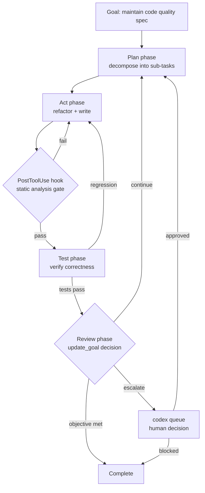

# Continuous Autonomous Refactoring: What the ICSME 2026 Roadmap Demands — and How Codex CLI Delivers It Today


---

A paper accepted at the 42nd International Conference on Software Maintenance and Evolution (ICSME 2026, Benevento, Italy, 14–18 September) proposes a significant shift in how the field thinks about refactoring.[^1] Rather than asking "how do we fix the AI-generated code smells we already have?", Sun, Ståhl, Sandahl, and Kessler ask a harder question: *How could AI agents continuously and autonomously maintain code quality against an explicit, evolving specification of "good"?*[^2]

The paper — "Continuous Autonomous Refactoring: A Research Roadmap for AI-Driven Code Quality Maintenance" — is a vision paper, not an empirical study. It does not claim to solve any of its five named challenges. What it does is systematise the landscape clearly enough that practitioners can begin mapping their existing toolchain against the requirements. For Codex CLI users, the mapping is striking — several of the five CAR dimensions are already addressable with features shipping in stable releases.

## The Enterprise Gap That Motivates CAR

The motivating scenario is familiar to any team maintaining a large codebase: millions of lines of code across hundreds of modules, thousands of static analysis warnings, and engineers who know that many of those warnings are *intentional* — a redundant adapter layer that preserves backward compatibility with an external API, a deliberately inflated memory allocation that absorbs burst traffic. A standard code-smells audit cannot make these distinctions.

The paper's core argument is that current LLM refactoring tools treat quality as a constraint on code *generation*. CAR reframes quality as a *primary and ongoing objective* — the output of a continuous loop rather than a gate before delivery. The analogy to autonomic computing is explicit: self-configuration, self-optimisation, self-healing, self-protection — but applied to code quality rather than runtime behaviour.[^3]

## Five Dimensions of the CAR Framework

### 1. Multi-objective Optimisation

Refactoring real systems involves conflicting objectives. Reducing cyclomatic complexity in one module may increase coupling elsewhere. The paper recommends decomposition-based multi-objective evolutionary algorithms (MOEA/D), where a global agent sets priorities and specialist sub-agents execute sub-tasks with real-time feedback. The critical open problem is that the search space is "large and discontinuous, and the interactions among quality dimensions remain poorly understood."[^2]

### 2. Quality Definition and Evaluation

Static metrics are poor proxies. An LLM optimising for reduced local complexity may over-partition code and increase system-level coupling. The paper proposes a utility function that translates metrics into comparable scores reflecting project priorities, aggregates weighted utilities to identify high-impact options, and verifies functional correctness first via existing test suites.

### 3. Multi-timescale Signal Integration

Different signals arrive at different rates: static metrics per commit, test results per build, production load data per hour, customer feedback over months. The CAR system must synchronise all of these. Critically, temporal archives — git history, bug reports, code-review comments, operational logs — encode implicit design rationale. An agent that cannot read this rationale will repeatedly re-introduce "pseudo-optimisations": changes that appear beneficial locally but reverse intentional design decisions.

### 4. Architecture and Design Pattern Challenges

A CAR system requires multiple agents with distinct capability profiles: some better at long-context reasoning, others at structured generation. General benchmark scores are insufficient for model selection — what matters is per-task refactoring capability. The paper calls for a capability taxonomy that classifies models for this purpose.

### 5. Trust and Escalation

Full autonomy in high-risk scenarios risks serious failures; excessive escalation destroys the efficiency gains. Trust is built incrementally through evidence and explanation mechanisms — shifting developer attention from line-by-line code inspection to validating intent and decision logic. Human responses during escalation events should themselves be captured as learning signal.

### Cross-cutting: Cost and CI/CD Integration

The paper acknowledges that system-level refactoring "scales with repository size and iteration frequency" in inference cost. It calls for cost-aware scheduling and reuse of intermediate results across cycles — but does not prescribe specific implementation. For CI/CD, the question of *where* autonomous refactoring fits (pre-commit, post-integration, parallel) remains open.

## Mapping CAR to Codex CLI Today

The CAR roadmap describes requirements. Codex CLI v0.152.x provides several mechanisms that address them directly.



### Goal Mode as the Outer Loop (Dimension 1 and 2)

`/goal` in Codex CLI implements the continuous loop at the agent level.[^4] You define a verifiable completion condition — for example, "zero `ruff` violations at severity E and W across the entire `src/` tree" — and goal mode re-enters the agent after each turn, checking whether the condition is satisfied. The internal `continuation.md` and `budget_limit.md` files maintain state across turns without polluting the context window. Dimension 1's requirement for a global agent setting priorities maps directly to the goal definition; Dimension 2's utility function maps to the completion condition and the quality gates embedded in hooks.

```toml
# ~/.codex/config.toml — quality-focused refactoring profile
[profiles.refactor]
model = "gpt-5.6-terra"
approval_policy = "on-request"
auto_compact_token_limit = 90000

[tools.update_plan]
enabled = true   # disabled by default since v0.152.0; re-enable for structured planning[^5]
```

### Hooks as the Quality Gate (Dimension 2 and 3)

`PostToolUse` hooks fire after every tool call and can block progression if quality gates fail.[^6] A refactoring agent that writes a file and then immediately runs `ruff check --select E,W` is implementing a lightweight version of CAR's utility function. Hooks targeting `apply_patch` or `shell` commands with a non-zero exit code (convention: `exit 2` for non-blocking feedback, non-zero for blocking) give the agent corrective signal without requiring human intervention.

```toml
# Managed hooks in config.toml
[[hooks.PostToolUse]]
name = "ruff-quality-gate"
run = "ruff check --select E,W,C90 ${CODEX_TOOL_ARGS_PATH} 2>&1 | head -20"
match_tools = ["apply_patch"]

[[hooks.PostToolUse]]
name = "pytest-correctness"
run = "python -m pytest --tb=short -q 2>&1 | tail -20"
match_tools = ["shell"]
match_commands = ["git", "touch"]
```

Dimension 3's multi-timescale signal requirement is partially addressed by AGENTS.md as a persistent quality specification and by `startup_prompt_template`, which injects git log summaries or static analysis history at session start.

### Multi-agent Coordination (Dimension 4)

Dimension 4's requirement for specialist agents with distinct capability profiles maps to Codex CLI's `codex agents` multi-session model. A Global Planner session (model: `gpt-5.6-terra`, high reasoning effort) can decompose the quality objective and dispatch sub-tasks via `codex queue` to Specialist Executor sessions (model: `gpt-5.6-luna`, lower cost) focused on individual modules.[^7]

```bash
# Dispatch a refactoring sub-task to an active session
codex queue --session refactor-auth-module \
  "Reduce cognitive complexity in auth/token.py below 10. \
   Do not touch the adapter layer — see AGENTS.md §3."
```

### Escalation via codex queue (Dimension 5)

The CAR trust model requires a clear escalation path. An `Interrupt` hook (available since v0.150.0) fires when the agent is about to abort, capturing the failure state. Alternatively, the agent can call `codex queue` on the root session to surface a human-readable decision request. Approved changes proceed; blocked changes are logged for the next cycle.

## What CAR Cannot Yet Deliver with Codex CLI

The paper is honest about what the roadmap does not solve, and several gaps remain genuine in today's tooling:

- **Cross-session memory of design rationale.** The multi-timescale signal problem requires integrating git history, issue trackers, and observability data into agent context. Codex CLI does not yet have a structured mechanism for this beyond `startup_prompt_template` injection. Codex's agent-maintained memory pipeline helps within a project, but correlating runtime anomalies to refactoring decisions requires external orchestration.
- **Cost-aware scheduling.** There is no built-in scheduler that throttles the CAR loop based on inference spend. You must implement this externally — a shell loop that checks a cost budget before re-invoking `codex exec`.
- **Cross-module conflict resolution.** If two specialist sub-agents propose competing changes to a shared interface, Codex CLI has no built-in conflict arbitration. The Planner session must review and resolve via `codex queue` before merging.

## A Pragmatic Starting Point

The five-dimension CAR roadmap is ambitious. Start with Dimensions 2 and 3 — the areas where Codex CLI today offers the most direct leverage:

1. **Write the quality specification into AGENTS.md.** Be explicit: list the static analysis rules that apply, the test coverage floor, and the intentional exceptions with their rationale.
2. **Add a `PostToolUse` hook for your primary quality gate.** A single `ruff` or `eslint` hook gives the agent corrective signal on every file write.
3. **Define a `/goal` with a verifiable completion condition.** "Zero violations, all tests passing" is concrete and checkable.
4. **Re-enable `update_plan`** (`tools.update_plan.enabled = true`) so the agent can maintain a structured decomposition of the quality objective across turns.
5. **Add an `Interrupt` hook** to capture failure state and surface it to the human operator, rather than silently aborting.

The CAR paper ships its most valuable contribution not in answers but in questions: how do you elicit implicit quality preferences from engineers and formalise them as agent-actionable specifications? The answer, for now, is a disciplined AGENTS.md and a test suite that encodes what "correct" means — instrumented with hooks that enforce it at every tool boundary.

## Citations

[^1]: ICSME 2026 — International Conference on Software Maintenance and Evolution. Benevento, Italy, 14–18 September 2026. <https://conf.researchr.org/home/icsme-2026>

[^2]: Sun, X., Ståhl, D., Sandahl, K., & Kessler, C. (2026). *Continuous Autonomous Refactoring: A Research Roadmap for AI-Driven Code Quality Maintenance*. ICSME 2026 Visions and Emerging Results Track. arXiv:2609.01236. <https://arxiv.org/abs/2609.01236>

[^3]: Kephart, J. O., & Chess, D. M. (2003). The vision of autonomic computing. *IEEE Computer*, 36(1), 41–50. Referenced as conceptual foundation in Sun et al. 2026. <https://ieeexplore.ieee.org/document/1160055>

[^4]: Codex CLI goal mode documentation — long-horizon autonomous workflows. <https://codex.danielvaughan.com/2026/07/23/codex-cli-goal-mode-long-horizon-autonomous-workflows-ralph-loop-token-budgets/>

[^5]: OpenAI Codex CLI v0.152.0 release notes — Planning Tool disabled by default; enable with `tools.update_plan.enabled = true` (PR #41744). <https://github.com/openai/codex/releases/tag/rust-v0.152.0>

[^6]: Codex CLI hooks reference — PreToolUse, PostToolUse, Interrupt lifecycle events. <https://agenticcontrolplane.com/blog/codex-cli-hooks-reference>

[^7]: Codex CLI agents dashboard and codex queue — multi-session orchestration since v0.149.0. <https://proflead.dev/posts/openai-codex-agents-dashboard-codex-queue/>
