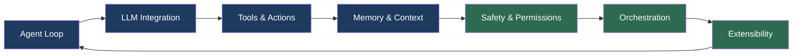
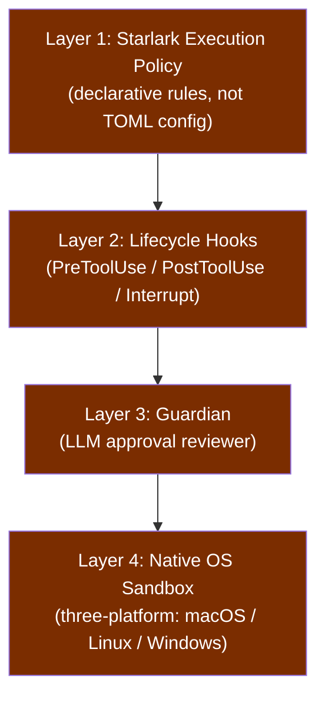
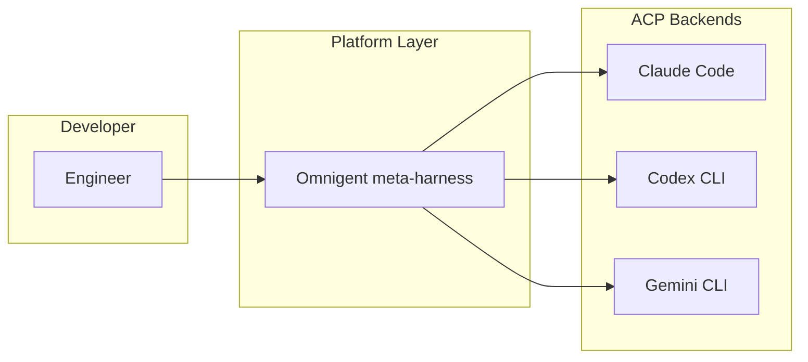

# Harness Engineering: What a Source-Code Autopsy of Eleven Coding Agents Reveals About Codex CLI's Architecture

An 83-page source-code study by Barbaste, Darrigol, Vu, and Wiltberger (Wavestone AI Lab, arXiv:2609.00006) pins eleven production coding harnesses at their July 2026 releases and dissects every one along the same seven subsystems.[^1] The result is the most rigorous cross-system anatomy the discipline has produced: four million lines of Python, TypeScript, and Rust, 13 cross-cutting observations, and a catalogue of 29 recurring design patterns. Codex CLI emerges as the largest system in the corpus — approximately 1.1 million lines of Rust — and the one with the most distinctive safety architecture. What follows is a practitioner's reading of the study's findings as they bear on Codex CLI specifically.

## What the Study Actually Did

The authors took controlled snapshots of eleven systems in April 2026, then repeated the analysis in July 2026 to measure a 90-day delta. The eleven harnesses are: Claude Code, Codex CLI, Gemini CLI, Mistral Vibe, OpenHands, Aider, Mini-SWE-Agent, Hermes, Pi, OpenCode, and OpenClaw — plus Omnigent as a contrast point (the first meta-harness, which orchestrates five of the eleven behind a single API).[^1]

Code size spans three orders of magnitude — from Mini-SWE-Agent's ~5K lines to Codex's ~1.1M — yet the study's first observation is that loop sophistication does not predict benchmark performance.[^1] Mini-SWE-Agent achieves SWE-Bench scores comparable to much larger systems by doing almost nothing: a linear while-loop, bash as its sole tool, and no safety layer beyond cost and step limits. Production complexity is driven by safety, user experience, and transport concerns, not raw task completion.

## The Seven Canonical Subsystems

The study maps every harness against the same seven subsystems:

Each subsystem admits a minimal and a maximal implementation. The spread between them is informative:

| Subsystem | Minimal | Maximal |
|---|---|---|
| Agent Loop | Mini-SWE-Agent: linear while-loop | OpenHands: event-sourced conversation engine |
| LLM Integration | Single LiteLLM call | Hermes: five owned transports, 29 provider profiles |
| Tools & Actions | Bash only (1 tool) | OpenClaw: 109+ tools via gateway delegation |
| Memory & Context | Unbounded linear history | Codex: agent-maintained cross-session memory pipeline |
| Safety & Permissions | Cost/step limits only | Codex: four-layer stack |
| Orchestration | Deliberate absence (Aider) | Claude Code: recursive composition |
| Extensibility | Structural typing | Pi: everything-is-an-extension runtime |

## Where Codex CLI Sits

### Agent Loop: Tokio Async State Machine

Codex's loop is a Tokio async state machine — not a blocking sequential loop, not an event-sourced engine, but a concurrent-capable Rust async runtime that can batch tool calls without serialising them.[^1] This architecture enables the multi-agent fan-out in `codex agents` (v0.149.0+) where independent sub-sessions execute in parallel without competing for a single event queue.

### Tools & Actions: V8-Executed Tool Calls

The study identifies Codex CLI's signature capability as "agent-maintained cross-session memory pipeline; tool calls as V8-executed code."[^1] The V8 execution surface means tool definitions can be evaluated as JavaScript at runtime — a pattern that allows the server to deliver tool schemas dynamically rather than hardcoding them at build time. No other system in the corpus uses this approach; the contrast point is Claude Code's deferred loading of 43 typed tools, which achieves similar flexibility through lazy static dispatch rather than a scripting engine.

### Safety & Permissions: The Four-Layer Stack

The safety subsystem is where Codex's architecture is most distinctive. The study identifies a four-layer stack:[^1]

Claude Code has three layers; Gemini CLI has four approval modes plus a cross-platform sandbox; Codex has the most compositionally distinct stack, with Starlark (a Python-like deterministic language) driving the policy engine rather than TOML key-value configuration.[^1] This matters in practice: Starlark policies can express conditionals and loops that flat config cannot. The Guardian layer — an LLM reviewer that judges ambiguous actions — sits above the OS sandbox, meaning policy decisions are made by a reasoning model before execution, not only enforced after the fact.

### Memory & Context: Cross-Session Pipelines

The study credits Codex with "agent-maintained cross-session memory" as its differentiator in the Memory & Context subsystem.[^1] Since v0.100.0, Codex CLI has persisted facts, preferences, and project context to `~/.codex/memories/` across sessions. The v0.153.0 experimental context management feature (disabled by default, Plus/Pro backends) extends this with token-budget context, history notes, and a dedicated context tool.[^2]

### Orchestration: Thread-Tree Model

Codex's orchestration uses AgentControl and AgentRegistry to manage a thread-tree of sessions with fan-out and declarative roles.[^1] This is distinct from Claude Code's recursive composition (sub-agents that spawn further sub-agents) and OpenHands's parallel delegation over conversation trees. The thread-tree model means every sub-session has a traceable parent in the `codex agents` dashboard, and `codex queue` can deliver messages to any node in the tree by UUID or name.[^3]

### Extensibility: Hooks, Skills, and MCP

The extensibility landscape across the corpus reveals a striking metric: SKILL.md skills lead MCP adoption (9 of 11 systems vs. 8 of 11).[^1] This runs counter to the industry narrative that MCP is the dominant extension surface. Skills — portable Markdown files that inject capability descriptions into the system prompt — ship in more systems and emerged earlier. Codex supports both, with Agent Plugins 1.0 managing skills under `~/.agents/skills/` and MCP servers configured via `~/.codex/config.toml`.

## Cross-Cutting Findings That Directly Affect Codex Users

### No Agentic Frameworks, No Vector Embeddings

The study's most emphatic observation: "no agent runtime imports a general-purpose agentic framework (LangChain, LangGraph, AutoGen, or a dozen others; Gemini CLI uses neither of Google's own), and none retrieves code with vector embeddings; the field runs on hand-rolled async loops and deterministic retrieval (ripgrep, tree-sitter, glob, auto-discovered Markdown context files)."[^1]

This is a design choice with implications for operators who want to customise retrieval. There is no embedding index to tune, no vector store to provision — Codex's file-finding is deterministic and configurable via `memory_search_upward`, `AGENTS.md` file discovery, and per-session `deny_reads` rules. That determinism is also why the AGENTS.md model works: the agent can reason about what context it will and will not have access to without stochastic retrieval surprises.

### Convergence Became Imitation

The longitudinal delta between the April and July 2026 snapshots surfaces a pattern the authors call "convergence becoming imitation."[^1] Codex adopted Claude Code's hook vocabulary verbatim — `PreToolUse`, `PostToolUse`, `Interrupt` — and shipped an importer for Claude Code sessions and settings. OpenHands adopted Claude Code's plugin format. Patterns diffused across the corpus in under three months.

For users, this means hook implementations are increasingly portable. A `PreToolUse` shell script written for Claude Code will often run unmodified under Codex CLI, and vice versa. The price of that portability is that differentiation in the extensibility layer is eroding: systems that once diverged on hook semantics are converging on a shared vocabulary with Claude Code as the reference implementation.

### Policy Migrated Out of Prose

A third observation: "behavioral policy migrated from prompt prose to configuration."[^1] The study traces how constraints that once lived as natural-language instructions in system prompts — git commit policies, file scope restrictions, approval thresholds — have moved into config keys and AGENTS.md declarations. This is visible in Codex's own evolution: `approval_policy`, `sandbox_mode`, `memory_search_upward`, and `tools.update_plan.enabled` are all configuration-layer controls that replaced equivalent prompt instructions in earlier versions.

### The Platform Turn

The study's concluding argument is structural: "in the first half of 2026 the coding harness completed a turn from tool to _platform_."[^1] Evidence: harnesses became importable SDKs; Omnigent orchestrates eleven vendor harnesses (five from the corpus) behind an OpenAI-compatible endpoint; OpenHands runs Codex CLI as an interchangeable ACP backend.[^4] ACP (Agent Control Protocol) now ships in six of the eleven systems, having acquired a third role — harness hosting — beyond its original scope.[^1]

This has a concrete implication for organisations evaluating switching cost: the study explicitly notes that cross-session importers and harness-hosting adapters are being shipped as switching-cost tooling, not just convenience features. Vendor lock-in in 2026 is not about file formats — it is about which harness hosts the others.

## What This Means in Practice

The study's 29 design patterns are not all equally actionable, but three map directly onto the Codex CLI configuration surface:

**Hand-rolled loops beat frameworks.** There is no LangGraph layer between your hooks and the model's tool calls. `PreToolUse` scripts run synchronously in the agent loop without framework overhead. Instrument them precisely; the latency you add is real.

**Four-layer safety is compositional, not redundant.** Starlark policy, hooks, Guardian, and OS sandbox address distinct threat classes. Disabling Guardian for a confirmed-only session (`approval_policy = "untrusted"`) does not weaken the sandbox; removing `deny_reads` does not disable hooks. Treat each layer as independently configurable and audit each independently.

**Skills before MCP for capability injection.** The corpus data suggests skills reach more systems and are more portable than MCP. For capability descriptions that need to travel across harnesses (e.g., in an Omnigent-mediated multi-harness workflow), SKILL.md is currently the safer format.

## Citations

[^1]: Barbaste P, Darrigol T, Vu G, Wiltberger T. "Harness Engineering: Anatomy, Architecture, and Evolution of Coding Agents — A Source-Code Study of Eleven Systems." arXiv:2609.00006. 2026. <https://arxiv.org/abs/2609.00006>

[^2]: OpenAI. "Codex CLI v0.153.0 Release Notes." GitHub openai/codex Releases. 3 September 2026. <https://github.com/openai/codex/releases/tag/v0.153.0>

[^3]: OpenAI. "Codex CLI v0.149.0: codex queue and codex agents dashboard." GitHub openai/codex Releases. 20 August 2026. <https://github.com/openai/codex/releases>

[^4]: Fowler M. "Harness Engineering for Coding Agent Users." martinfowler.com. 2026. <https://martinfowler.com/articles/harness-engineering.html>

[^5]: OpenAI. "Codex CLI Changelog — releases page." GitHub openai/codex. 2026. <https://github.com/openai/codex/releases>
