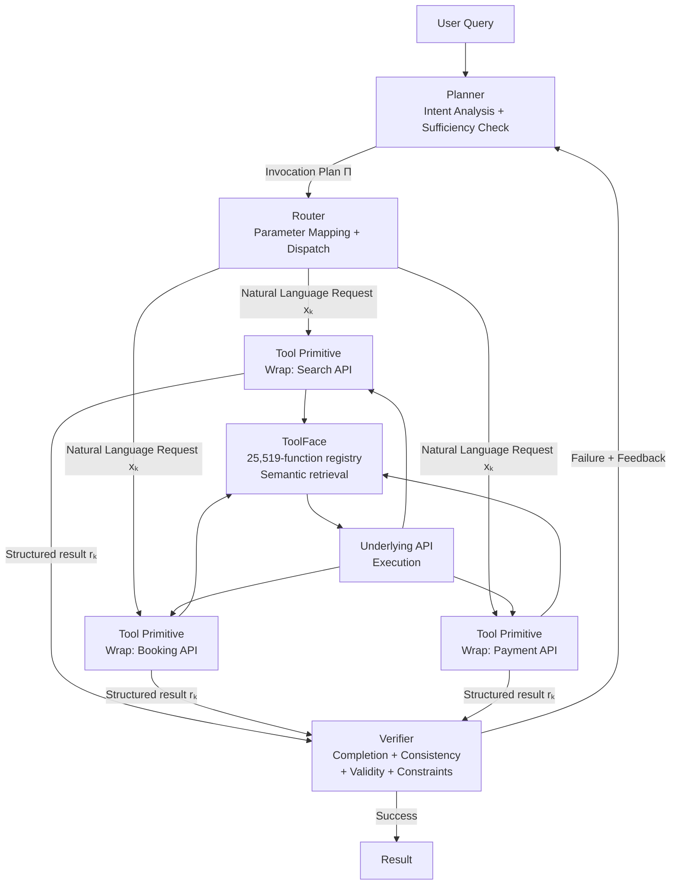

# Agent-Native Tool Primitives: What the HEART Framework's 84% vs 22% Completion Gap Reveals About LLM Tool Design — and How It Applies to Codex CLI


---

A new preprint from September 2026 puts a number on something practitioners have suspected for a while: the way you surface tools to an LLM matters far more than which LLM you use. In "Harness Engineering in LLM Tool Use via Agent-Native Reusable Tool Primitives," Jin, Wang, Yu, Luo, and Wang introduce the HEART framework and demonstrate an 84% end-to-end task completion rate across 50 real-world workflows — compared to 20–24% for GPT-5.4, Claude-4.6-Sonnet, and Gemini-3.1-Pro using conventional tool-calling[^1]. That 3.8× gap, achieved on the same models as underlying workers, makes the tool interface design the dominant variable.

Understanding why HEART works, and why frontier models fail where it succeeds, has direct implications for anyone designing MCP servers or AGENTS.md tool policies for Codex CLI.

---

## The Root Cause: Schema Fragility at Scale

Conventional tool calling exposes raw API schemas directly in the model's context. As catalogues grow, two compounding failure modes emerge.

The first is **catalogue poisoning**. Research cited in the paper shows accuracy drops of 7–85% as tool catalogue size scales from 8 K to 120 K tokens[^2]. Models lose precision in tool selection, confuse overlapping argument names, and begin hallucinating parameters that exist in nearby schemas but not the target one. Codex CLI users have run into the practical manifestation of this: stale schema caches causing Codex to call tools with argument layouts that changed after a server restart[^3], or schema-conversion failures that silently drop tools entirely[^4].

The second is **output format heterogeneity**. Tool A returns a JSON object; Tool B returns a plain string; Tool C returns a structured error envelope that looks like a success to a naive reader. When the model must both call tools and interpret their outputs in one attention pass, these mismatches compound across chains: a bad parse in step 3 corrupts the argument assembly in step 5.

HEART addresses both by placing a small specialised LLM — Qwen3-8B in the experiments — between the orchestrating model and every tool it calls.

---

## HEART Architecture



**Tool Primitives** are LLM-wrapped interfaces that accept a natural language invocation request rather than a pre-assembled JSON argument object. The primitive formulation is:

```
𝒫ᵢ(x, c) = ℳ([sᵢ; c; x])
```

where `x` is the natural language request from the Router, `c` is optional chained context from prior primitive results, `sᵢ` is the underlying tool schema, and `ℳ` is the primitive LLM. Schema resolution — mapping `x` to concrete typed arguments — happens inside the primitive, not in the orchestrating model's context. Results are returned with natural-language summaries that downstream primitives can consume without parsing raw API responses.

**ToolFace** is a centralised registry of 25,519 schema-function pairs across ToolBench, NESTFUL, ACEBench, τ²-Bench, and BFCLv4 corpora. The key insight is deferred loading: rather than enumerating schemas in context, the Planner retrieves only the tools relevant to a given step via semantic search over schema descriptors. This sidesteps catalogue degradation almost entirely.

**The three-agent pipeline** divides labour by competency:

| Agent | Responsibility | Re-trigger condition |
|---|---|---|
| Planner | Decompose intent; build ordered invocation plan Π | Verifier returns failure + feedback |
| Router | Resolve arguments; construct natural language request `xₖ`; dispatch | Per-step, after Planner emits plan |
| Verifier | Check completion, argument consistency, execution validity, constraint satisfaction | Always, post-execution |

The re-planning budget defaults to B=3, providing a saturation point with marginal gains beyond B=5.

---

## Benchmark Results

On structured benchmarks, HEART's improvements over frontier models are measured but not dramatic:

| Benchmark | HEART | GPT-5.4 | Claude-4.6-Sonnet |
|---|---|---|---|
| ToolBench Pass Rate | 75.1% | — | 73.4% |
| NESTFUL Full Accuracy (one-shot) | 0.44 | 0.40 | — |
| τ²-Bench Retail Pass@4 | 0.73 | — | 0.60 |
| ACEBench Overall | 86.9% | 86.0% | — |

The real signal is in the real-world tasks. Fifty end-to-end tasks spanning travel planning, healthcare, e-commerce, finance, and local services — each requiring multi-step invocation across heterogeneous APIs, with results evaluated by human raters confirming actual completion (not just response plausibility):

| Domain | HEART | GPT-5.4 | Claude-4.6-Sonnet | Gemini-3.1-Pro |
|---|---|---|---|---|
| Finance | 100% | ~20% | ~24% | ~22% |
| Local Services | 90% | | | |
| Travel | 80% | | | |
| E-commerce | 80% | | | |
| Healthcare | 70% | | | |
| **Overall** | **84%** | **20%** | **24%** | **22%** |

The failure pattern for frontier models was consistent: they retrieved information correctly (recommendation tasks) but failed when tasks required *acting* on behalf of the user — booking a flight, completing a purchase, submitting a form. These actions chain multiple tools with dependent state, precisely the scenario where schema fragility and output heterogeneity compound[^1].

---

## What This Means for Codex CLI Tool Design

Codex CLI interacts with tools through MCP servers. Each server exposes a JSON Schema definition for every tool; Codex resolves calls and interprets results in the main model context. The HEART paper identifies exactly where this architecture strains — and the insights translate directly.

### 1. Write MCP Tool Descriptions as Invocation Contracts

The Tool Primitive pattern succeeds because natural language requests are richer than argument name matching. When writing MCP server tool descriptions, treat the `description` field as a full invocation contract rather than a one-liner. Include:

- **When to use this tool** (not just what it does)
- **What information the caller should supply** (in prose, not just parameter names)
- **What the result looks like and how to interpret it**
- **Common failure modes and their error shapes**

This mirrors what a Tool Primitive's internal LLM does implicitly, but puts the knowledge in the schema where Codex can surface it during planning.

### 2. Use `on_mcp_tool_result` for Normalised Output

HEART's primitives return results with natural-language summaries that downstream steps can consume without parsing raw API responses. Codex CLI's `on_mcp_tool_result` hook (introduced in v0.151.0) runs before the result is delivered to the model, making it the natural place to implement normalisation:

```toml
[hooks]
on_mcp_tool_result = [
  { command = "normalize-tool-output.sh" }
]
```

The hook receives the raw MCP result and can rewrite it into a consistent envelope — structured error with actionable fields on failure, normalised JSON with a plain-English summary on success — before Codex ever sees it. This is the lightweight HEART Primitive pattern applied at the Codex layer.

### 3. Constrain Tool Surface per Task Type via AGENTS.md

ToolFace's dynamic retrieval — loading only tools relevant to the current step — maps to the `AGENTS.md` `allowed_tools` field and per-session MCP server configuration. For long-running batch workflows, consider splitting MCP servers by domain and enabling only the relevant set:

```toml
# config.toml — finance workflow profile
[mcp_servers.finance]
command = ["finance-mcp-server"]

# Disable unrelated servers for this task
[mcp_servers.travel]
enabled = false
```

Codex's `per-tool output_token_limit` (v0.152.0) further reduces catalogue noise by capping verbose schema descriptions that would otherwise consume context budget.

### 4. Instrument Verification with PostToolUse Hooks

The Verifier agent in HEART checks four criteria per step: task completion, argument consistency, execution validity, and constraint satisfaction. PostToolUse hooks in Codex CLI can enforce the same:

```toml
[hooks]
post_tool_use = [
  # On apply_patch: run linter to verify structural validity
  { command = "ruff check --select E --stdin-filename $CODEX_TOOL_INPUT_PATH", on_tool = "apply_patch" },
  # On shell: exit non-zero if the command failed silently
  { command = "verify-exit-code.sh", on_tool = "shell" }
]
```

A PostToolUse hook that exits with code 2 triggers Codex to re-attempt the step — the equivalent of HEART's re-planning loop.

### 5. Document Inter-Tool Dependencies in AGENTS.md

HEART's Planner excels at ordered invocation planning. The equivalent in Codex is the goal-mode plan, but the model can only sequence correctly if it understands dependencies. In AGENTS.md, document which tools produce outputs that other tools consume:

```markdown
## Tool Dependencies
- `search_inventory` → produces `item_id` required by `reserve_item`
- `reserve_item` → produces `reservation_id` required by `confirm_payment`
- Never call `confirm_payment` before `reserve_item` succeeds
```

This is the prose equivalent of the invocation plan Π that HEART's Planner constructs algorithmically.

---

## Limitations and Caveats

The HEART paper does not evaluate against Codex CLI directly, and the ToolFace retrieval infrastructure is not publicly available as an MCP server at the time of writing. ⚠️ The 84% real-world completion figure relies on human raters and a specific task selection; generalisation to arbitrary enterprise workflows is unconfirmed.

The Qwen3-8B primitive LLM adds latency and cost per tool invocation. For Codex CLI workflows where tools are called dozens of times per session, wrapping every call in a separate LLM inference round-trip would be prohibitive. The practical takeaway is the *design pattern* — richer descriptions, normalised outputs, hook-based verification — rather than deploying HEART wholesale.

---

## Citations

[^1]: Jin, H., Wang, Z., Yu, T., Luo, Y., & Wang, W. (2026). *Harness Engineering in LLM Tool Use via Agent-Native Reusable Tool Primitives*. arXiv:2609.01736. https://arxiv.org/abs/2609.01736

[^2]: Accuracy drop range 7%–85% as tool catalogue scales from 8K to 120K tokens, as cited in arXiv:2609.01736. See also LongFuncEval (arXiv:2505.10570) for supporting evidence on context-length vs function-calling accuracy. https://arxiv.org/abs/2505.10570

[^3]: Codex CLI GitHub Issue #19155: *Stale MCP Tool Schema After Server Restart*. https://github.com/openai/codex/issues/19155

[^4]: Codex CLI GitHub Issue #31374: *Codex Desktop MCP instability across July 2026: tool exposure mismatch, reviewer interception, malformed MCP calls*. https://github.com/openai/codex/issues/31374

[^5]: Codex CLI v0.151.0 release notes — `on_mcp_tool_result` ToolLifecycleContributor; fires before MCP completion published and before result prepared for model. https://github.com/openai/codex/releases/tag/rust-v0.151.0

[^6]: Codex CLI v0.152.0 release notes — per-tool `output_token_limit` in `[mcp_servers.X.tools.Y]` config with most-restrictive merge semantics. https://github.com/openai/codex/releases/tag/rust-v0.152.0
