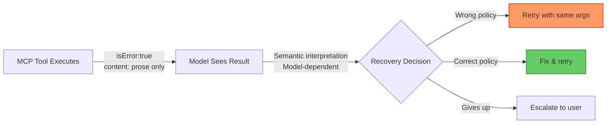
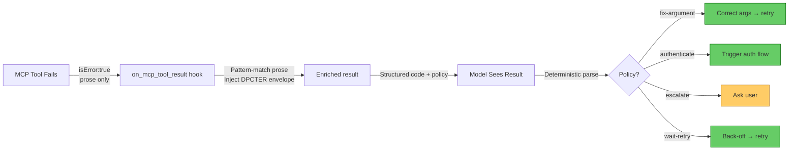

# The MCP Failure Gap: Why `isError:true` Is Rarely Enough — and How Codex CLI's `on_mcp_tool_result` Hook Bridges It


A new paper out of September 2026 puts a number on something Codex CLI operators have been bumping into empirically: when an MCP tool fails, the result alone often cannot tell the agent what to do next. Rishabh Mehan's "Can MCP Clients Decide What to Do After Failure? A Result-Only Actionability Audit" (arXiv:2609.00072)[^1] audits 21 deliberately-induced failures across 10 production MCP servers and finds that executable recovery guidance is absent in every single case — not most, every. The paper also supplies a six-coordinate framework that makes the gap measurable, and a fail-closed prototype that closes it. Both map directly onto Codex CLI's `on_mcp_tool_result` hook, which has been available since v0.151.0.[^2]

## What the MCP Spec Actually Provides

The current MCP spec (revision 2026-07-28)[^3] specifies a tool result object with three fields relevant to failure:

```json
{
  "resultType": "tool",
  "isError": true,
  "content": [{ "type": "text", "text": "No such file: /data/report.csv" }]
}
```

That is the entire vocabulary. No standard error code. No repair target. No retry policy. No side-effect declaration. The spec's error model, as Mehan notes, "makes failure observable, sometimes makes a broad response possible, and rarely makes concrete recovery or safe replay self-contained."[^1]

The MCP specification audit in the paper confirms this: all 12 error-construction paths found in the sampled repositories pair `isError` with text content and nothing else. No repository used standard codes or provided machine-readable recovery actions.[^1]

## The DPCTER Actionability Profile

Mehan introduces a six-coordinate, non-cumulative framework for classifying what a result-only observer can determine from a failure:

| Coordinate | Question answered |
|---|---|
| **D** — Detection | Can software distinguish failure from success? |
| **P** — Policy | Can it select among: fix argument, authenticate, retry, alternate tool, escalate? |
| **C** — Cause | Does it distinguish argument type errors from auth failures from missing resources? |
| **T** — Target | Does it identify the offending parameter, tool, or dependency? |
| **E** — Executable Repair | Can it construct the corrected call without additional discovery? |
| **R** — Replay Constraints | Are timing, safety, and side-effect constraints explicit? |

Non-cumulative means no positive assignment is inherited. Knowing the cause does not imply knowing the target. Knowing the policy does not imply knowing how to execute it.

## Empirical Results

The audit covers 21 failures induced across 10 reachable servers drawn from 54 audited repositories. Failure types: 10 nonexistent tool calls, 7 invalid argument types, 3 invalid values, 1 authentication failure.

Results under two observation conditions:[^1]

| Coordinate | Typed fields only | Typed fields + text |
|---|---|---|
| D — Detection | 18 / 21 (86%) | 21 / 21 (100%) |
| P — Policy | 8 / 21 (38%) | 19 / 21 (91%) |
| C — Cause | 0 / 21 (0%) | 19 / 21 (91%) |
| T — Target | 0 / 21 (0%) | 18 / 21 (86%) |
| E — Executable Repair | 0 / 21 (0%) | 0 / 21 (0%) |
| R — Replay Constraints | 0 / 21 (0%) | 0 / 21 (0%) |

The pattern is stark. Text carries almost all diagnostic information — but requires semantic interpretation, which introduces model-dependent fallibility. Executable Repair and Replay Constraints are zero regardless of whether text is examined, because no server provides them.

A model stress test using Llama 3.2 3B and Qwen 0.8B across 840 decisions confirms the asymmetry:[^1]

- Normalised observation alone: 42/105 strict matches (Llama), 6/105 (Qwen)
- Structured JSON action descriptor: 95/105 (Llama), 39/105 (Qwen)
- Prose action descriptor: 105/105 (Llama), 30/105 (Qwen)

Prose is maximally informative for capable models but collapses for weaker ones. A structured cause code alone adds nothing useful (42 → 39 for Llama), suggesting taxonomy labels without executable content do not improve recovery reasoning.

## The Fail-Closed Prototype Design

The paper proposes separating controls from explanations in the error envelope — the same separation HTTP Problem Details[^4] and gRPC status codes apply in their respective protocols. The proposed envelope:

```json
{
  "error": {
    "schema": "mcp-error/1",
    "code": "argument.type",
    "target": { "kind": "parameter", "pointer": "/path/to/repo" },
    "policy": "fix-argument",
    "retry": { "same_request": false },
    "sideEffects": "none",
    "text": "Expected string at /path/to/repo, got integer"
  }
}
```

The deterministic prototype, operating only on the structured fields, handled all 21 controlled scenarios correctly without invoking the model for recovery decisions.[^1]

## The Flow Today Without Enrichment



The model's path to E (the correct outcome) depends entirely on how well the prose error text happens to encode cause, target, and policy — which the audit shows is inconsistent across servers.

## Bridging the Gap with Codex CLI

Codex CLI v0.151.0 added `on_mcp_tool_result` as a `ToolLifecycleContributor` that fires before the MCP completion is published and before the result is prepared for the model.[^2] It receives a mutable server result and can replace it. This is exactly the interception point the paper's fail-closed design requires.

### Hook-Based Error Enrichment

```toml
# ~/.codex/config.toml
[hooks.on_mcp_tool_result]
command = "codex-mcp-enricher"
```

The enricher script pattern:

```bash
#!/usr/bin/env bash
# codex-mcp-enricher: reads mcp_tool_result JSON on stdin, writes enriched version on stdout
#
# Input shape:
#   { "server": "...", "tool": "...", "result": { "isError": true, "content": [...] } }
# Output shape: same, with error envelope injected into content[0].text as JSON

INPUT=$(cat)
IS_ERROR=$(echo "$INPUT" | jq -r '.result.isError // false')

if [ "$IS_ERROR" != "true" ]; then
  echo "$INPUT"
  exit 0
fi

SERVER=$(echo "$INPUT" | jq -r '.server')
TOOL=$(echo "$INPUT" | jq -r '.tool')
PROSE=$(echo "$INPUT" | jq -r '.result.content[0].text // ""')

# Pattern-match common failure signatures into structured codes
CODE="unknown"
POLICY="escalate"
TARGET_KIND="tool"
SAME_REQUEST_RETRY="false"

if echo "$PROSE" | grep -qi "not found\|no such\|does not exist"; then
  CODE="resource.not_found"; POLICY="fix-argument"
elif echo "$PROSE" | grep -qi "invalid.*argument\|type.*error\|expected.*got"; then
  CODE="argument.type"; POLICY="fix-argument"
elif echo "$PROSE" | grep -qi "unauthori\|forbidden\|401\|403"; then
  CODE="auth.required"; POLICY="authenticate"; SAME_REQUEST_RETRY="true"
elif echo "$PROSE" | grep -qi "timeout\|timed out"; then
  CODE="execution.timeout"; POLICY="retry"; SAME_REQUEST_RETRY="true"
elif echo "$PROSE" | grep -qi "rate.limi\|too many"; then
  CODE="rate.limit"; POLICY="wait-retry"; SAME_REQUEST_RETRY="true"
fi

ENVELOPE=$(jq -n \
  --arg schema "mcp-error/1" \
  --arg code "$CODE" \
  --arg server "$SERVER" \
  --arg tool "$TOOL" \
  --arg target_kind "$TARGET_KIND" \
  --arg policy "$POLICY" \
  --argjson same_request_retry "$SAME_REQUEST_RETRY" \
  --arg text "$PROSE" \
  '{error:{schema:$schema,code:$code,source:{server:$server,tool:$tool},
    target:{kind:$target_kind},policy:$policy,
    retry:{same_request:$same_request_retry},text:$text}}')

echo "$INPUT" | jq --argjson env "$ENVELOPE" \
  '.result.content[0].text = ($env | tojson)'
```

With this hook in place, the model receives a structured error envelope it can parse deterministically rather than interpreting opaque prose.

### Annotated Flow with Enrichment



### Per-Tool Output Limits for Error Payloads

Codex CLI v0.152.0 added per-tool `output_token_limit` configuration.[^5] Long stack traces in error payloads can burn context unnecessarily. Cap them:

```toml
# ~/.codex/config.toml

[[mcp_servers]]
name = "my-api-server"

[[mcp_servers.tools]]
name = "execute_query"
output_token_limit = 512  # errors rarely need more than 512 tokens

[[mcp_servers.tools]]
name = "run_pipeline"
output_token_limit = 1024
```

The `on_mcp_tool_result` hook runs before this limit is enforced, so the enricher can compress verbose prose into a compact JSON envelope that fits comfortably within the budget.

### AGENTS.md Error Policy Specification

Document expected MCP error behaviour so the agent has prior context before it ever sees an `isError` result:

```markdown
## MCP Tool Error Policy

When a tool returns `isError: true`, consult the `error.policy` field:

- `fix-argument`: Re-read the tool schema. Do not retry with the same arguments.
- `authenticate`: Call the `authenticate` tool on the same server before retrying.
- `wait-retry`: Wait 5 seconds. Retry the same call once. If still failing, escalate.
- `escalate`: Ask the user. Never retry autonomously.
- `unknown` (no envelope): Read `error.text`, classify manually, default to `escalate`.

Never interpret a resource.not_found error as a reason to create the resource unless
the task description explicitly permits creation.
```

## What This Means for MCP Server Authors

The paper's findings should change how you author MCP tool error responses. The current pattern of returning `isError: true` with a human-readable string is insufficient for autonomous agents operating without a capable model in the recovery loop.

Until the MCP spec itself adopts structured error fields, adopt the fail-closed convention in your servers:

```python
# Python MCP server — enriched error result
def execute_query(params):
    try:
        return run_query(params["sql"], params["database"])
    except DatabaseNotFoundError as e:
        return {
            "isError": True,
            "content": [{
                "type": "text",
                "text": json.dumps({
                    "error": {
                        "schema": "mcp-error/1",
                        "code": "resource.not_found",
                        "target": {"kind": "parameter", "pointer": "/database"},
                        "policy": "fix-argument",
                        "retry": {"same_request": False},
                        "sideEffects": "none",
                        "text": str(e)
                    }
                })
            }]
        }
    except AuthenticationError as e:
        return {
            "isError": True,
            "content": [{
                "type": "text",
                "text": json.dumps({
                    "error": {
                        "schema": "mcp-error/1",
                        "code": "auth.required",
                        "policy": "authenticate",
                        "retry": {"same_request": True},
                        "sideEffects": "none",
                        "text": str(e)
                    }
                })
            }]
        }
```

The `on_mcp_tool_result` hook approach covers servers you do not control. For servers you do own, embedding the envelope at source eliminates the pattern-matching step entirely.

## Summary

Mehan's audit establishes a baseline that practitioners can use for evaluation: an MCP error result that scores below P on the DPCTER profile forces the agent into probabilistic prose interpretation — which works reliably only with frontier models and degrades with smaller local models. The fix is straightforward: structured error envelopes, either emitted by the server or injected by Codex CLI's `on_mcp_tool_result` hook. The hook is already there. The enricher pattern shown above takes roughly 60 lines of shell and costs nothing at runtime.

The longer-term pressure is on the MCP specification itself. HTTP took 25 years to accumulate RFC 7807 Problem Details. The MCP community has an opportunity to adopt structured error vocabulary early, before the corpus of non-actionable prose error strings grows too large to retrofit.

## Citations

[^1]: Rishabh Mehan, "Can MCP Clients Decide What to Do After Failure? A Result-Only Actionability Audit," arXiv:2609.00072 (September 2026). https://arxiv.org/abs/2609.00072

[^2]: OpenAI, "Codex CLI v0.151.0 Release Notes — on_mcp_tool_result ToolLifecycleContributor," GitHub Releases (29 August 2026). https://github.com/openai/codex/releases/tag/rust-v0.151.0

[^3]: Anthropic / OpenAI / MCP Working Group, "Model Context Protocol Specification — Revision 2026-07-28." https://modelcontextprotocol.info/docs/concepts/tools/

[^4]: M. Nottingham & E. Wilde, "Problem Details for HTTP APIs," RFC 7807, IETF (March 2016). https://datatracker.ietf.org/doc/html/rfc7807

[^5]: OpenAI, "Codex CLI v0.152.0 Release Notes — Per-Tool MCP Output Limits (#41421)," GitHub Releases (1 September 2026). https://github.com/openai/codex/releases/tag/rust-v0.152.0
