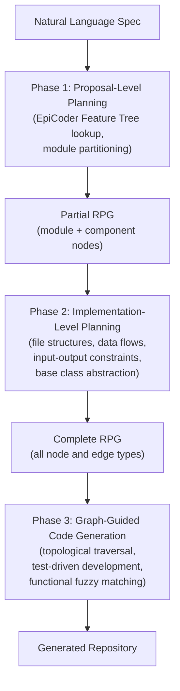

# Repository Planning Graphs: How Microsoft's ICLR 2026 Architecture Beats Claude Code on Whole-Codebase Generation — and What It Means for Codex CLI


---

The dominant failure mode of today's coding agents is not line-by-line quality — it is structural coherence at scale. Ask any current agent to generate a complete repository and you will get code that compiles and even passes narrow tests, but whose module boundaries are arbitrary, whose data flows are ad hoc, and whose file organisation bears no relationship to the feature hierarchy in the original specification. A new ICLR 2026 paper from Microsoft Research proposes a fix: replace natural language as the planning medium with a first-class graph structure called a Repository Planning Graph (RPG).[^1] The companion framework, ZeroRepo, outperforms Claude Code on the RepoCraft benchmark by 27.3 percentage points on functionality coverage and 35.8 points on test pass rate.[^2]

## Why Natural Language Planning Fails at Repository Scale

Current agents plan in prose. The model is given a requirement, writes a bullet list of files and features, and then attempts to implement each file in isolation. At function scale this works well enough. At repository scale — dozens of interdependent modules, complex data flows, shared base classes — the prose plan becomes an unreliable guide: it is ambiguous, cannot be traversed in dependency order, and provides no machine-verifiable specification of cross-module contracts.

The RPG paper formalises this diagnosis: "current approaches rely on natural language planning, which often produces unclear specifications and structural misalignment."[^1] The solution is to make the plan a proper data structure that both the planner and the code-generation pass can reason over mechanically.

## The Repository Planning Graph

An RPG is a hierarchical directed graph that unifies two levels of planning that were previously handled by separate prose artefacts.

**Node types:**
- *Module nodes* encode high-level functional categories derived from the project specification
- *Component nodes* are mid-level decompositions within a module
- *Leaf nodes* represent concrete algorithms, classes, or functions

**Edge types:**
- *Hierarchical edges* connect parent nodes to their refined children
- *Inter-module edges* capture data flows and output contracts between modules (e.g., a data-loading module feeding a normalisation module)
- *Intra-module edges* define file-level ordering within a module — which file must exist before another can compile

The graph is constructed in two phases:



**Proposal-level planning** transforms the specification into a functionality graph by sampling from the EpiCoder Feature Tree — a pre-built taxonomy of 1.5 million software capabilities.[^1] An LLM partitions sampled functionalities into cohesive modules, following software engineering principles rather than guessing free-form.

**Implementation-level planning** enriches the graph with file structures and inter-file data flows. It encodes cross-module contracts as input-output constraints and abstracts recurring patterns into common data structures or base classes. The result is a machine-readable blueprint that any traversal algorithm can walk without requiring further model interpretation.

**Code generation** traverses the RPG in topological order — dependencies before dependants — and applies test-driven development at each leaf node. Functional fuzzy matching maps requirements to the correct part of the graph even when language varies between specification and implementation.

## Benchmark Results: RepoCraft

The RepoCraft benchmark evaluates whole-repository generation against six mature Python projects: scikit-learn, pandas, sympy, statsmodels, requests, and Django.[^2] Together they represent 1,052 evaluation tasks derived from each project's own test suite — a deliberate choice that makes gaming the benchmark via memorisation difficult, since the agent must demonstrate functional equivalence rather than textual similarity.

| System | Coverage (%) | Pass Rate (%) | LOC |
|---|---|---|---|
| MetaGPT (o3-mini) | 16.6 | 4.5 | 225 |
| ChatDev (Qwen3-Coder) | 22.1 | 6.9 | 541 |
| OpenHands (o3-mini) | 22.0 | 5.1 | 292 |
| Paper2Code (Qwen3-Coder) | 30.2 | 4.9 | 1,365 |
| Gemini CLI | 42.0 | 14.5 | 1,485 |
| **Claude Code** | **54.2** | **33.9** | **10,587** |
| **ZeroRepo (o3-mini)** | **81.5** | **69.7** | **23,977** |
| Human gold | 81.0 | 81.0 | 97,820 |

Three observations for practitioners:

1. **Claude Code is the strongest vanilla agent baseline by a wide margin** — 54.2% coverage against MetaGPT's 16.6% — which confirms it is a credible upper bound for unstructured agent approaches.
2. **ZeroRepo with o3-mini closes to within 0.5pp of human coverage** while producing repositories 3.9× larger than the Claude Code baseline.[^2] The gap to human pass rate (69.7% vs 81.0%) likely reflects test suite depth rather than functional correctness — the human-authored repositories were built over years.
3. **Architecture matters more than model size.** ZeroRepo with the smaller Qwen3-Coder produces 36,941 lines of code (more than o3-mini) at 75.1% coverage and 57.3% pass rate — surpassing every non-RPG baseline regardless of which model they use.

## CoderMind: Bringing RPG to Existing Agents

The ZeroRepo framework covers greenfield repository generation from scratch. For working with existing codebases — and for connecting RPG to agent tools in daily use — Microsoft released CoderMind, an open-source CLI that wraps the RPG machinery into an installable tool.[^3]

### Installation

```bash
uv tool install cmind-cli \
  --from "git+https://github.com/microsoft/RPG-ZeroRepo.git#subdirectory=CoderMind"
cmind check
```

For an existing repository:

```bash
cd your-repo
cmind init . --encode
```

The `--encode` flag invokes the RPG-Encoder pipeline (arXiv:2602.02084, ICML 2026)[^4] to build an RPG from the existing codebase. The reverse pipeline uses three mechanisms: semantic extraction, incremental diff-based evolution (reducing maintenance overhead by 95.7% compared to full re-encoding), and a unified agentic interface for graph navigation.

### MCP Server

CoderMind exposes four MCP tools that any compliant agent can call:

```toml
# Example MCP configuration (Claude Code / Codex CLI format)
[mcp_servers.codermind]
command = "cmind"
args    = ["serve"]
```

| Tool | Purpose |
|---|---|
| `search_rpg` | Semantic query across the planning graph |
| `explore_rpg` | Navigate relationships from a named node |
| `get_node_detail` | Full specification for a single node |
| `list_rpg_tree` | Display the hierarchical graph structure |

### Slash Commands

CoderMind ships workflow-specific slash commands for the forward (generation) and maintenance pipelines:

```text
# Forward pipeline — generate a new repository
/cmind.feature_construct   # NL requirements → feature specs
/cmind.feature_edit        # Refine (optional)
/cmind.plan                # Build the RPG
/cmind.code_gen            # Test-driven generation

# Maintenance pipeline — update an existing RPG
/cmind.encode              # Build RPG from existing codebase
/cmind.update_rpg          # Incremental graph update
/cmind.rpg_edit            # Synchronised graph + code modification
```

### Agent Support Status

| Agent | Slash Commands | MCP Tools |
|---|---|---|
| Claude Code | ✅ Native | ✅ |
| GitHub Copilot CLI | ✅ (via `/agent` prefix) | ✅ |
| **Codex CLI** | ⌛ Upcoming | ⌛ Upcoming |[^3] |

Codex CLI is listed as in progress. Until native CoderMind support lands, Codex users can approximate the workflow using Codex's existing MCP infrastructure — see the section below.

## Practical Implications for Codex CLI Users

### Today: Manual RPG Workflow

The CoderMind MCP server works over any standards-compliant MCP host. You can wire it into Codex CLI today via the `[mcp_servers]` configuration block and call the four graph tools manually. The limitation is that the slash-command dispatch layer (which sequences multi-step workflows) requires Claude Code or GitHub Copilot for automated orchestration — with Codex you drive the workflow through explicit tool calls:

```toml
# ~/.codex/config.toml
[mcp_servers.codermind]
command = "cmind"
args    = ["serve"]
```

Then in an AGENTS.md or startup prompt:

```markdown
## Repository Context
This project has an RPG workspace at ~/.cmind/workspaces/<id>/data/rpg.json.
When planning changes across modules, call `search_rpg` before touching files.
For any new feature spanning more than one file, call `explore_rpg` on the
affected component node to retrieve cross-module contracts before editing.
```

### Structural Lessons for AGENTS.md Authors

The RPG research formalises patterns that senior engineers apply intuitively but that agent instructions rarely make explicit. Three worth encoding directly:

**1. Dependency-ordered implementation.** ZeroRepo generates files in topological order — shared utilities before the modules that consume them. Your AGENTS.md can enforce this:

```markdown
## Implementation Order
Implement in dependency order: shared types and utilities first,
then domain modules, then integration and CLI layers.
Do not edit a file that imports from a module you have not yet implemented.
```

**2. Inter-module contracts before intra-module code.** The RPG encodes input-output constraints at module boundaries before any leaf-node code is generated. The equivalent in a Codex session:

```markdown
## Cross-Module Work
Before implementing any feature that touches more than one module,
write the interface (function signatures, type definitions, protocol)
and get approval before writing implementations.
```

**3. Test-driven traversal.** ZeroRepo applies test-driven development at each graph node. With Codex hooks:

```toml
# Enforce TDD at the tool level
[[hooks]]
hook    = "PostToolUse"
matcher = "apply_patch"
run     = "pytest ${FILE} --tb=short -q || exit 1"
```

## The Bigger Picture

The RPG work arrives at the same moment that Codex CLI's own planning machinery is being rethought. Version 0.152.0 disabled `update_plan` by default — making structured decomposition an explicit opt-in.[^5] Version 0.153.0 shipped experimental context management, which activates token-budget context and history notes for managing long-horizon tasks.[^6] These are the same problems the RPG paper attacks from a research angle: how to maintain coherent intent across a generation process that takes hundreds of model calls.

The empirical result — 81.5% functional coverage against human gold at 81.0%, compared to 54.2% for the best unstructured agent — is not marginal. It suggests that for tasks at whole-repository scale, graph-structured planning is not an optimisation but a prerequisite. Practitioners building on Codex CLI who regularly ask the agent to scaffold or significantly restructure large codebases should watch the CoderMind Codex support issue closely.

## Citations

[^1]: Luo, J., Zhang, X., Liu, S., Wu, J., Huang, Y., et al. (2025). *RPG: A Repository Planning Graph for Unified and Scalable Codebase Generation*. arXiv:2509.16198. ICLR 2026. <https://arxiv.org/abs/2509.16198>

[^2]: Microsoft Research. *RPG: A Repository Planning Graph for Unified and Scalable Codebase Generation — Publication Page*. <https://www.microsoft.com/en-us/research/publication/rpg-a-repository-planning-graph-for-unified-and-scalable-codebase-generation/>

[^3]: Microsoft. *RPG-ZeroRepo GitHub Repository — CoderMind README*. <https://github.com/microsoft/RPG-ZeroRepo/blob/main/CoderMind/README.md>

[^4]: Luo, J., et al. (2026). *Closing the Loop: Universal Repository Representation with RPG-Encoder*. arXiv:2602.02084. ICML 2026. <https://arxiv.org/abs/2602.02084>

[^5]: OpenAI. *Codex CLI v0.152.0 Release Notes — update_plan disabled by default*. <https://github.com/openai/codex/releases>

[^6]: OpenAI. *Codex CLI v0.153.0 Release Notes — experimental context management*. <https://github.com/openai/codex/releases>
