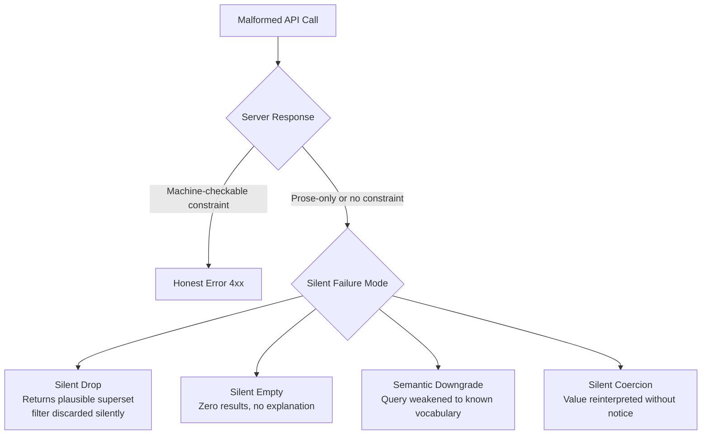
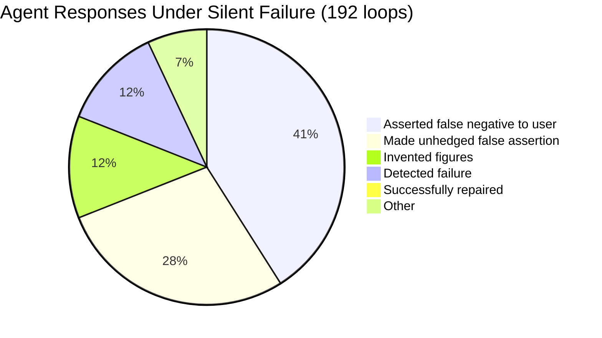
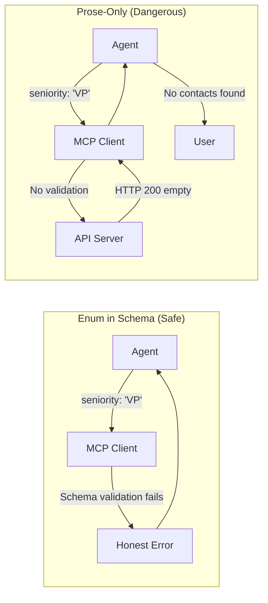

# SilentProbe: The HTTP 200 Problem — When Production APIs Lie to Your Codex CLI Agent


A Codex CLI agent querying a production API via MCP cannot tell the difference between two very different outcomes: a query that returned zero results because nothing matched, and a query the server silently misunderstood. Both arrive as HTTP 200 with a parseable JSON body. No exception is raised. No field distinguishes them. The agent sees an empty list and — 41% of the time, according to new empirical data — confidently reports to the user that nothing exists.[^1]

This is the central finding of *SilentProbe: Measuring Silent Failure in Production APIs Used as Agent Tools* (arXiv:2609.00035, September 2026), a systematic audit of 721,320 parameters across 2,501 OpenAPI documents from 27 production vendors, with 219 live perturbations and 192 agent end-to-end loops.[^1] The fix, when it exists, is often one line of schema.

## The Problem: Constraint Form, Not Vendor Identity

The SilentProbe team — Zongrong Li (Texas A&M / Monid), Shengkun Ye, Feiyou Guo, and Zuoyou Dang (Monid, Inc.) — structured their audit around a simple question: when a malformed API call is made (wrong enum value, out-of-vocabulary parameter, type mismatch), does the server respond with an honest error or a silent success?

Their key finding: whether you receive an honest error or a silent failure is determined by *how the constraint is documented in the schema*, not which vendor wrote the API.[^1]

| Constraint Encoding | Honest Error | Silent Failure |
|---|---|---|
| Machine-checkable (enum in schema) | 111 / 111 | 0 / 111 |
| Prose-only (described in description field) | 17 / 61 | 44 / 61 (p = 2×10⁻¹³) |

The schema gap is pervasive. Across the 2,501 OpenAPI documents audited:[^1]

- **7.5%** of parameters declare any enumeration
- **15.2%** declare any machine-checkable constraint of any kind
- **40.1%** of documents state at least one constraint in prose that their schema does not encode

In other words, for the overwhelming majority of parameters, there is nothing a validator — or an LLM — can check before the call is made.

## The Vocabulary Trap: 88 of 88 Failures

One of the most striking results concerns vocabulary disclosure. When an OpenAPI document lists accepted values as *examples* rather than *enum entries*, models trained on that documentation perform dramatically differently from models shown a complete enum:[^1]

- **Example-only vocabulary** (values shown in `examples` field): 88 of 88 attempts failed silently
- **Full enum vocabulary** (values encoded in `enum` array): 8–9% failure rate
- **Promoting vocabulary from examples to enum**: resolved failures from 88/88 to 0/89 (p = 5×10⁻¹³)

This is not a modelling problem. The fix is structural: move the vocabulary into the schema's `enum` field, and both server-side validation and LLM compliance improve to near-zero failure.

## The Ten Perturbation Families

The study systematically varied API calls across ten perturbation families, all derived directly from schema definitions:[^1]

1. **Enum synonym** — valid alternative spelling (`vp` → `vice_president`)
2. **Case** — mechanical capitalisation (`vp` → `VP`)
3. **Whitespace** — padding (`vp` → `" vp"`)
4. **Separator** — delimiter change (`c_suite` → `c-suite`)
5. **Inflection** — pluralisation (`vp` → `vps`)
6. **Out-of-vocabulary** — fixed unknown token
7. **Format variant** — schema pattern mismatch (`51,200` → `51-200`)
8. **Numeric range** — bounds violation (`per_page=3` → `0`)
9. **Type mismatch** — type coercion (`3` → `'3'`)
10. **Parameter name** — property name misspelling (`headcount` → `headcount_range`)

Many of these are perturbations an agent might produce entirely naturally — a different separator style, a pluralised term, an integer passed as a string by an upstream formatter.

## Four Silent Failure Modes

When a perturbation hits a prose-constrained or unconstrained endpoint, the server response falls into one of four failure patterns:[^1]



Each mode is invisible to the agent without additional recovery logic. From the agent's perspective, all four look identical: a parseable response with no error.

## What Agents Do Under Silent Failure

The team ran 192 full agent loops against live APIs under controlled silent-failure conditions. The results are uncomfortable:[^1]



The zero repair rate is not coincidental — the study also tested 12 models across 8 families (Anthropic, Google, Meta/Llama, Mistral, OpenAI, DeepSeek, Grok, and others) via OpenRouter. No model successfully repaired a silent failure. Llama-3.3 declined tool calls in 44 of 72 attempts, a separate pathology. The others proceeded confidently to incorrect conclusions.

The reason models cannot detect silent failure without intervention: they have no signal. An empty list is a semantically valid response. A zero-row result is indistinguishable from "there are no records".

## The MCP Surface Area

For Codex CLI specifically, every MCP server that wraps a REST API is exposed to this class of failure. The pattern is common: an MCP tool calls an internal or third-party API, receives HTTP 200, and returns the response body to the model. If that body contains an empty list due to a silently misunderstood parameter, the model has no recovery path.

The Monid aggregation layer used in the study — which provides a unified schema contract, per-call identifiers, and single authentication across 27 vendors — represents one architectural answer: normalise the API surface before the agent sees it.[^1] For teams building their own MCP servers, the equivalent is explicit schema discipline.

## Mapping SilentProbe Findings to Codex CLI

### 1. The `on_mcp_tool_result` Hook as Silent-Failure Gate

Codex CLI v0.151.0 introduced the `on_mcp_tool_result` lifecycle hook, which intercepts MCP tool responses before they reach the model.[^2] This is the correct injection point for silent-failure detection:

```typescript
// hooks/mcp-silent-failure.ts
export async function on_mcp_tool_result(ctx: HookContext) {
  const result = ctx.tool_result;

  // Detect empty-list responses from search/filter tools
  if (isEmptyResult(result) && isFilteredQuery(ctx.tool_call)) {
    const retryResult = await retryUnfiltered(ctx.tool_call);

    if (!isEmptyResult(retryResult)) {
      // Server understood an unfiltered query — the original was silently rejected
      ctx.inject_message({
        role: "system",
        content: `Silent API failure detected: '${ctx.tool_call.name}' returned empty on filtered query ` +
                 `but ${retryResult.count} records exist unfiltered. ` +
                 `The filter parameter may have been silently ignored. ` +
                 `Report constraint mismatch to user; do not assert absence.`
      });
    }
  }
}
```

The retry-with-unfiltered-query pattern is the study's primary recommendation for agent builders: "distinguish 'no matches' from 'unsupported filters' through unfiltered retry queries".[^1]

### 2. Per-Tool `output_token_limit` for Verbose Empty Responses

Some silent failures produce unexpectedly large responses — a discarded filter that returns an unconstrained superset. Codex CLI v0.152.0 added per-tool `output_token_limit` in `config.toml`:[^3]

```toml
[mcp_servers.my_api.tools.search_contacts]
output_token_limit = 2000  # Cap superset responses; log truncation for hook inspection

[mcp_servers.my_api.tools.filter_records]
output_token_limit = 4000
```

A response that hits this limit on a query that should return zero or few records is itself a signal of a silent-drop failure.

### 3. AGENTS.md: Zero-Result Disambiguation Policy

The study's finding that 41% of agents assert false negatives unprompted makes AGENTS.md directives essential:[^1]

```markdown
## API Failure Policy

When any MCP tool returns an empty list or zero-count result:
1. Do NOT assert to the user that no records exist
2. Check whether the same tool returns results with parameters removed (unfiltered query)
3. If unfiltered returns results but filtered returns empty, report: "The filter may not have been applied correctly. API returned empty for [parameter]=[value]."
4. Only assert absence if both filtered and unfiltered queries return empty
5. Never invent figures or estimates when API results are empty
```

### 4. MCP Server Design: Schema-First Vocabulary

For teams authoring MCP servers that wrap REST APIs, SilentProbe's primary finding has a direct corollary in MCP tool definitions. The same principle applies: declare vocabularies as enums in the tool's input schema, not as description prose.

```json
{
  "name": "filter_contacts",
  "description": "Search contacts by seniority level",
  "inputSchema": {
    "type": "object",
    "properties": {
      "seniority": {
        "type": "string",
        "enum": ["vp", "director", "manager", "ic"],
        "description": "Seniority level to filter by"
      }
    }
  }
}
```

Contrast with the prose-only alternative that SilentProbe demonstrates fails 72% of the time:

```json
{
  "seniority": {
    "type": "string",
    "description": "Seniority level. Accepted values: vp, director, manager, or ic."
  }
}
```

The first form allows both the MCP client and gateway validation to catch violations before the call is made. The second form is transparent to validators and produces silent failure at the server.



## Benchmark Environments Cannot Replicate This

The study makes an explicit methodological point: "simulated environments cannot exhibit this class of failure."[^1] Benchmark APIs return honest errors or deterministic results. Production APIs accumulate schema debt over time — constraints added in documentation without corresponding schema changes, vocabulary expanded without enum updates, new parameter combinations left untested.

This means evaluating a Codex CLI integration against a mocked or sandboxed API provides no signal about silent-failure susceptibility. Only live integration testing against production endpoints, with deliberate perturbations from the ten families above, can measure the actual failure surface.

The code, schemas, perturbation sets, agent transcripts, and judge labels from SilentProbe are released at https://github.com/Jasper0122/silentprobe.[^1]

## Practical Checklist for Codex CLI + MCP Integrations

Before shipping an MCP server that wraps a production API:

- [ ] Audit OpenAPI docs for prose-only constraints; promote vocabularies to `enum` entries
- [ ] Implement `on_mcp_tool_result` hook with empty-result retry logic
- [ ] Add AGENTS.md zero-result policy blocking false-negative assertions
- [ ] Set `output_token_limit` on search/filter tools to catch silent-drop supersets
- [ ] Run perturbations from at least enum-synonym, case, separator, and out-of-vocabulary families against the live endpoint before deployment
- [ ] Instrument retries to distinguish "no matching records" from "filter not applied" in logs

The campaign cost for the full SilentProbe audit across 27 production vendors was under $8 USD.[^1] The cost of shipping an agent that fabricates answers when its API silently misunderstands a filter is considerably higher.

## Citations

[^1]: Li, Z., Ye, S., Guo, F., & Dang, Z. (2026). *SilentProbe: Measuring Silent Failure in Production APIs Used as Agent Tools*. arXiv:2609.00035. https://arxiv.org/abs/2609.00035

[^2]: OpenAI. (2026). Codex CLI v0.151.0 Release Notes — `on_mcp_tool_result` hook. GitHub. https://github.com/openai/codex/releases/tag/v0.151.0

[^3]: OpenAI. (2026). Codex CLI v0.152.0 Release Notes — per-tool `output_token_limit`. GitHub. https://github.com/openai/codex/releases/tag/v0.152.0

[^4]: SilentProbe code, schemas, perturbation sets, agent transcripts, and judge labels. GitHub. https://github.com/Jasper0122/silentprobe

[^5]: OpenAI. (2026). Codex CLI AGENTS.md documentation. https://github.com/openai/codex/blob/main/AGENTS.md

[^6]: Monid, Inc. (2026). Monid API aggregation layer documentation. https://www.monid.io/docs
