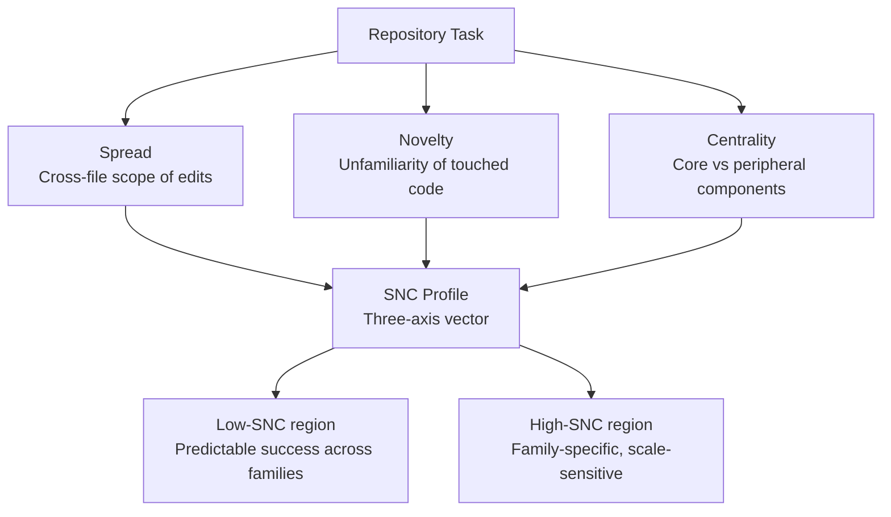

# What Do Agentic SWE Benchmarks Actually Measure? The SNC Profile Framework — and What It Means for Codex CLI Task Design


---

If you have ever chosen a model for Codex CLI based on SWE-bench scores, you have made an assumption that those scores measure something stable and well-defined. A paper published on 1 September 2026 by Radin Shayanfar, Keheliya Gallaba, and Ahmed E. Hassan shows that assumption does not hold[^1]. After analysing 14,922 agent trajectories across five widely used benchmarks using two model families at three different scales, they find that every pair of benchmarks is statistically separated on at least two of three task-demand axes — meaning each benchmark is testing fundamentally different underlying capabilities, regardless of how the tasks are labelled.

The practical upshot: "bug fix: 73%" on one leaderboard cannot be compared to "bug fix: 68%" on another. The categories are nominally identical but structurally divergent. For Codex CLI practitioners selecting models and tuning AGENTS.md policies, this is not an academic concern. It changes how you should read vendor comparisons, design internal eval sets, and structure task prompts.

---

## The Core Claim: Labels Lie

The starting point is straightforward. Benchmark tasks are routinely grouped into categories — bug fixes, feature implementations, refactoring, documentation — and model performance within those categories is compared across benchmarks. The implicit assumption is that the label captures the essential complexity of the work.

Shayanfar et al. introduce the **SNC profile** — a three-axis characterisation of what a coding task actually demands from an agent at the repository level[^1]:

- **Spread**: How broadly across the codebase a task touches. A one-file patch scores low; a change requiring edits across a dozen modules scores high.
- **Novelty**: How much unfamiliar code the agent must process. Tasks deep in domain-specific logic score higher than changes to boilerplate or well-trodden utility functions.
- **Centrality**: Whether the task involves core, load-bearing components or peripheral functionality. A fix to a logging utility is low-centrality; a change to the parser that every other module depends on is high-centrality.

These three axes are computed from static repository structure and from the agent's observed trajectory — specifically from the files it reads, the edits it makes, and the paths it explores before submitting a patch.



---

## What Separates the Benchmarks

The key empirical finding is benchmark divergence. Every pair of the five evaluated benchmarks was found to be statistically distinguishable on at least two of the three SNC axes[^1]. This means:

1. Two benchmarks that both call their tasks "bug fixes" are not measuring the same thing.
2. A model that excels on one benchmark may be optimised for a different SNC profile than the model that excels on another.
3. Cross-benchmark leaderboard comparisons conflate distinct capability profiles.

Task phrasing shapes what agents produce. When a problem statement is sparse, agents produce **larger solutions** — hedging against ambiguity by touching more of the codebase. When benchmark curation inflates expected solution scope, agents produce **smaller patches** relative to that gold standard, suppressing their apparent resolution rate even when the actual repair is valid[^1]. This directly echoes RealSWE (arXiv:2608.27831)[^2]: real-world user prompts contain far less structured information than benchmark task descriptions, and the SNC framework now gives us a measurement instrument for that gap.

---

## Model-Family Patterns: Scope Matching vs Scope Exceeding

The analysis of two model families at three scales (small, medium, large) reveals distinct behavioural strategies that correlate with success and failure[^1]:

**Claude (Anthropic):** Success correlates with matching the gold solution's file scope — editing roughly the same number of files that the reference solution edits. At the smallest model scale, the file-count ratio between agent and gold solution is approximately 0.17; at the largest scale it rises to 0.54. Claude succeeds when it correctly identifies which files need changing, not by being more thorough than necessary.

**Qwen (Alibaba):** Success correlates with *exceeding* the gold solution scope consistently across all scales. Qwen resolves tasks by editing more broadly, accepting a higher noise floor on its changes in exchange for higher recall on the right changes.

Both families exhibit the same failure mode: resolution fails when the total editing effort is insufficient relative to what the task actually demands — that is, when the agent's spread falls below the task's spread requirement.

For Codex CLI model selection: if your workload is high-Spread (multi-file refactors, cross-module changes), Qwen-family scope-excess behaviour may resolve more tasks. If your workload is low-Spread but high-Centrality (targeted changes to critical shared infrastructure), Claude-family scope-matching produces less review noise.

---

## Practical Implications for Codex CLI

### 1. Build an Internal SNC Profile Before Choosing a Model

Before evaluating models against a public leaderboard, characterise your actual workload:

```bash
# Count files touched per PR in recent history (proxy for Spread)
git log --name-only --format="" --since="6 months ago" \
  | grep -v '^$' | sort | uniq -c | sort -rn | head -20

# Identify high-centrality files (imported by many others — proxy for Centrality)
grep -r "from \.\." --include="*.py" -l | sort | uniq -c | sort -rn | head -20
```

If your median task touches more than five files (high Spread), favour models and configurations that have demonstrated scope-exceeding behaviour on similar benchmarks. If most changes land in one or two central files, scope-matching models are preferable — they are less likely to create review noise.

### 2. Write Dense Task Descriptions to Suppress Agent Scope Inflation

The finding that sparse problem statements cause agents to produce larger, broader solutions is immediately actionable. An underdescribed task leads to an agent that hedges by touching more of the codebase than necessary.

Use AGENTS.md to codify the template fields that matter most:

```markdown
## Task Description Template

Every task submitted to this agent MUST include:

**[D] Desired Behaviour:** Precise description of the expected change in observable behaviour.  
State what the code should do after the patch, not what the bug currently does.

**[M] Motivation:** Why this change is needed. Reference the issue, ticket, or design doc.

**[S] Scope Boundary:** Enumerate the files or packages that are in scope.  
Files not listed here require explicit approval before editing.

Incomplete task descriptions will be rejected at PreToolUse.
```

A hook to enforce this at the PreToolUse stage:

```toml
[hooks.pre_tool_use]
command = "python3 /repo/.codex/hooks/check_task_description.py"
description = "Reject tasks missing [D], [M], or [S] fields"
```

### 3. Interpret Benchmark Scores in Context of SNC Profile

When a vendor publishes a SWE-bench score for a new model, ask which benchmark variant was used and whether its SNC profile matches your workload. The SNC framework gives you the vocabulary:

- SWE-bench Verified tasks tend to be lower-Spread, well-specified, lower-Novelty — good for measuring targeted precision.
- Benchmarks built from real issue trackers tend to have higher-Novelty and more variable-Spread — closer to production conditions.

A model that scores highly on the former may not transfer to the latter. Internal evals on a sample of your own repository's tasks, characterised by SNC axes, give you ground truth that public leaderboards cannot.

### 4. Use Scale to Adjust Scope Behaviour

Claude-family scope-matching improves with model scale (0.17 → 0.54 file-ratio). For high-Centrality, low-Spread tasks where surgical precision matters, route to a larger reasoning model:

```toml
[model]
# Surgical, high-centrality tasks — larger model, tighter scope
provider = "openai"
name = "o3"
reasoning_effort = "high"
```

Scale is not uniformly beneficial: it helps scope matching but does not expand scope when breadth is needed. For high-Spread tasks, a moderately scaled model with a wider agent exploration budget may outperform a larger model constrained by context pressure.

---

## The Benchmark Literacy Takeaway

The SNC framework does not invalidate existing benchmarks — SWE-bench and its variants remain useful. What it reveals is that each benchmark has an implicit SNC profile that determines which model behaviours are rewarded. A model that topped a low-Spread, low-Novelty leaderboard may be poorly suited to your production environment, where tickets are ambiguous, dependencies sprawl, and domain code is unfamiliar[^3].

Benchmark literacy means asking not just "what score?" but "what SNC profile?" The paper's trajectory data are available at `DeepSoftwareAnalytics/PTA-IRT` on GitHub[^1]. Informally profiling your own repository — median files-per-PR as a Spread proxy, dependency fan-in as a Centrality proxy — will give you a more reliable basis for model selection than any vendor leaderboard.

---

## Citations

[^1]: Shayanfar R., Gallaba K., Hassan A.E. "What Does an Agentic Software Engineering Benchmark Measure? Profiling Task Demands and Agent Behaviour Beyond What Category Labels Reveal." arXiv:2609.01271, September 2026. https://arxiv.org/abs/2609.01271

[^2]: Kim et al. "RealSWE: A Compositional Evaluation of Coding Agents under Realistic User Requests." arXiv:2608.27831, August 2026. https://arxiv.org/abs/2608.27831

[^3]: Gorinova M.I. et al. "Position: Coding Benchmarks Are Misaligned with Agentic Software Engineering." arXiv:2606.17799, June 2026. Presented at SE 3.0 Workshop, KDD 2026. https://arxiv.org/abs/2606.17799
