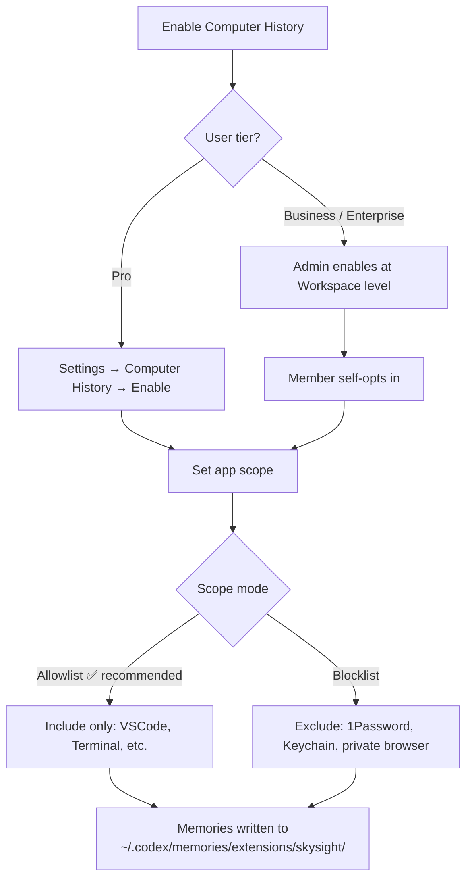

# Computer History: OpenAI's Accessibility-Based Memory Layer for Codex — Architecture, Security, and Developer Implications


OpenAI shipped Computer History into the ChatGPT desktop app on 13 August 2026, rolling it out to Pro, Business, and Enterprise subscribers on macOS.[^1] The feature converts macOS accessibility events — clicks, keystrokes, app switches — into structured Markdown memory files that ChatGPT and Codex can draw on across sessions. It replaces Chronicle, an earlier research preview that relied on screen captures.

For developers running Codex as a long-horizon coding agent, Computer History changes the context equation. Instead of re-explaining what you were doing before you called on Codex, the agent can inspect a structured timeline of your recent activity and pick up where you left off. That promise comes with architectural trade-offs and security considerations worth understanding before enabling it in a professional environment.

## How It Works

### Event Capture via macOS Accessibility

Computer History does not take screenshots or record audio.[^2] It reads interaction events through the macOS accessibility API — the same surface used by screen readers. Captured event types include:

- App focus changes (switches between applications)
- Typing activity (summarised structurally, not verbatim)
- Clicks and UI element interactions
- Website navigation within permitted contexts

Private browsing sessions are excluded. The feature is macOS-only; there is no Windows or Linux equivalent in the current release.[^3]

### The Processing Pipeline

```mermaid
graph LR
    A[macOS Accessibility Events] -->|collected locally| B[Raw Event Files<br/>ChatGPT App Group Container]
    B -->|uploaded within 48h| C[OpenAI Servers<br/>Ephemeral Codex Session]
    C -->|summarised| D[Markdown Memory Files<br/>~/.codex/memories/extensions/skysight/]
    B -->|deleted after processing| E[/dev/null]
    D -->|injected as context| F[ChatGPT / Codex Session]
```

Raw event files live on the local Mac for up to 48 hours.[^4] OpenAI processes them server-side using an ephemeral Codex session and writes the resulting summaries as plain-text Markdown into `$CODEX_HOME/memories/extensions/skysight/` — typically `~/.codex/memories/extensions/skysight/`. Raw events are then deleted from OpenAI's servers; the company states they are not retained after processing unless legally required.[^2]

Memory files are structured by day and application context, with YAML front matter (title, timestamp, app list) followed by a prose summary of activity during that window. The granularity is coarse by design — you get structural traces of what you worked on and in what sequence, not verbatim content.

```markdown
---
title: "Afternoon session — VSCode, Terminal, Chrome"
recorded_at: "2026-09-03T15:42:00Z"
apps: ["Visual Studio Code", "Terminal", "Google Chrome"]
---

Edited `src/auth/token.ts` in VSCode for approximately 22 minutes, primarily
within the `refreshToken` function. Switched to Terminal to run `npm test`.
Browsed to GitHub pull request #4812 in Chrome.
```

## Codex Integration

### Context and Skill Discovery

When a Codex session opens on a machine with Computer History enabled, the agent can query the `skysight/` memory files to reconstruct recent working context — resolving queries like "What was I working on before lunch?" against a local timeline rather than requiring re-explanation.[^5]

This closes a genuine gap in long-horizon agentic workflows. The standard Codex memory pipeline (`~/.codex/memory/`) captures what the *agent* did in prior sessions. Computer History captures what the *user* did — including IDE work, browser navigation, and terminal activity that Codex never touched directly.

The more consequential integration is pattern recognition. When Computer History identifies repeated workflows in the timeline, it surfaces a suggestion to encode them as a Codex Skill.[^6] The user can then ask Codex to build a reusable automation from the recorded activity. For teams that have not yet adopted systematic skills authoring, this is a low-friction on-ramp — you do the work, the agent observes its structure and proposes to systematise it.

## Security Considerations

### Unencrypted Local Storage

OpenAI's documentation is explicit: Computer History does not encrypt the memory files written to `~/.codex/memories/extensions/skysight/`.[^4] Any process running as the same macOS user account can read them without privilege escalation. On a shared machine, or in any environment where third-party tooling has broad filesystem access, these files are a legible record of recent activity.

Mitigation: use allowlist mode (restrict collection to a specific set of trusted applications) rather than relying on an exclusion blocklist. Regularly audit the directory:

```bash
# List memory files by recency
ls -lt ~/.codex/memories/extensions/skysight/

# Grep for references to a sensitive project
grep -r "project-name" ~/.codex/memories/extensions/skysight/

# Delete entries older than 7 days
find ~/.codex/memories/extensions/skysight/ -mtime +7 -delete
```

### Prompt Injection Surface

This is the more significant concern. Computer History feeds externally-controlled content — website text, application UI strings, document content — into Codex's context.[^4] A malicious website that Computer History observes during browsing can embed instructions that Codex may treat as authoritative when it later reads the resulting memory file. OpenAI's own documentation flags this risk and recommends pausing collection during work with untrusted third-party content.[^2]

A `PreToolUse` hook provides partial mitigation for Codex CLI users:

```toml
# config.toml
[hooks]
pre_tool_use = ["~/.codex/hooks/injection-guard.sh"]
```

```bash
#!/usr/bin/env bash
# ~/.codex/hooks/injection-guard.sh
PAYLOAD=$(cat)
if echo "$PAYLOAD" | grep -qiE "(ignore previous|disregard|new instructions)"; then
  echo "Potential prompt injection detected" >&2
  exit 2
fi
echo "$PAYLOAD"
```

This is a coarse heuristic; production deployments should implement more rigorous pattern matching against their specific threat model.

### Enterprise Deployment Controls

Business and Enterprise workspace administrators must explicitly enable Computer History before any workspace member can opt in.[^3] The control is at **Workspace Settings → Permissions & roles**. The feature requires Memories to be active and is unavailable when using the API key directly or via Amazon Bedrock.

For CI or headless Codex sessions, Computer History is irrelevant in its interactive form — but the memory files it writes are accessible to any process with read access to the home directory. Run headless Codex sessions under a dedicated service account that is not associated with a ChatGPT desktop session to maintain clean separation.

## Configuration at a Glance



Individual entries can be deleted via Settings, which offers a timeline view with per-item removal and bulk clearing by time window (last 10 minutes, hour, day, or all time).

## What Computer History Is Not

Computer History is not a general-purpose agent memory system — that role belongs to `~/.codex/memory/`, which captures what Codex itself observed and did in prior sessions. It is a *user activity* timeline, not an agent trajectory store.

It is also not a replacement for explicit context-setting in `AGENTS.md` or `startup_prompt_template`. Memory files are probabilistically useful; an `AGENTS.md` section is deterministically consulted on every session start. For constraints, policies, and architectural decisions that must survive every session and every compaction cycle, the deliberate AGENTS.md discipline remains the correct mechanism.[^7] Computer History is best understood as a lightweight ambient context layer — useful for orientation queries and skill discovery, but not a substitute for deliberate knowledge management.

## Citations

[^1]: OpenAI, "Computer History," *ChatGPT Learn Documentation*, 13 August 2026. <https://learn.chatgpt.com/docs/customization/computer-history>
[^2]: "ChatGPT for Mac adds opt-in Computer History feature, replacing Chronicle," *9to5Mac*, 13 August 2026. <https://9to5mac.com/2026/08/13/chatgpt-for-mac-adds-opt-in-computer-history-feature-replacing-chronicle/>
[^3]: "OpenAI's Computer History Turns Mac Activity Into ChatGPT Memory," *Unite.AI*, August 2026. <https://www.unite.ai/openais-computer-history-turns-mac-activity-into-chatgpt-memory/>
[^4]: "OpenAI's Computer History turns your clicks and keystrokes into a searchable ChatGPT memory timeline," *The Decoder*, August 2026. <https://the-decoder.com/openais-computer-history-turns-your-clicks-and-keystrokes-into-a-searchable-chatgpt-memory-timeline/>
[^5]: "Hands-On with Computer History: OpenAI's Take on Agent Memory," *MacStories*, August 2026. <https://www.macstories.net/stories/hands-on-with-computer-history-openais-take-on-agent-memory/>
[^6]: "ChatGPT can now remember what you did on your Mac — without screenshots," *The New Stack*, August 2026. <https://thenewstack.io/openai-chatgpt-computer-history/>
[^7]: "The Compaction Cliff: How Context Compaction Silently Erodes Your AGENTS.md Safety Rules," this knowledge base, 31 August 2026. `articles/2026-08-31-compaction-cliff-context-compaction-safety-rules-agents-md-knowledge-triage.md`
