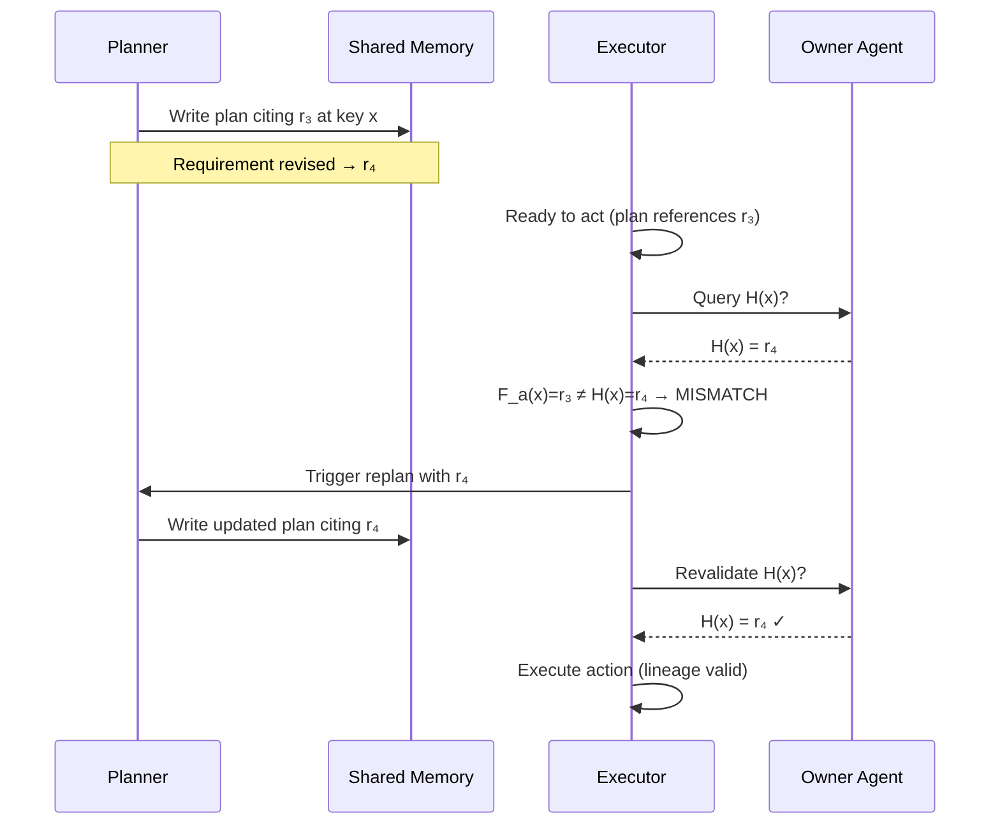
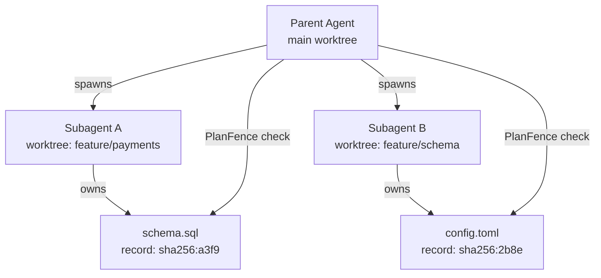

# Fresh Memory, Stale Plans: Why PlanFence Matters for Distributed Codex CLI Agent Teams


---

There is a subtle class of failure in multi-agent LLM systems that feels paradoxical when you first encounter it. An agent reads the most current state available — memory is fresh, records are up to date — and still takes an action based on an obsolete plan. The agent did nothing wrong in isolation. It just never checked whether the *plan* that authorised the action was still valid.

Chen, Wang, and Brinton (Purdue University / University of Exeter, arXiv:2609.03340, September 2026)[^1] call this **stale-plan execution**, and their paper introduces **PlanFence** — a dependency-scoped action-validation protocol that eliminates it. The implications for anyone running distributed Codex CLI subagent workflows are direct and practical.

---

## The Problem: Freshness ≠ Validity

Consider a five-agent team working a deployment pipeline. The planner references requirement record `r₃`. Before the executor fires the deployment action, an upstream agent revises the requirement to `r₄`. The executor checks shared memory, reads the latest state, sees `r₄` — and proceeds with the plan authored against `r₃` anyway.

Nothing in the freshness check caught it. The plan was authorised by a record that no longer exists.

The formal statement is clean. Define the **lineage validity** predicate:

```
Valid(a) ⟺ F_a(x) = H(x), ∀x ∈ D(a)
```

Where `F_a(x)` is the dependency frontier — the exact record ID the plan cited — `H(x)` is the current authoritative head, and `D(a)` is the declared set of dependencies for action `a`.[^1]

Standard freshness checks confirm that `H(x)` is recent. They do not confirm that `F_a(x) = H(x)`. That gap is the attack surface.

The paper ran 30 controlled live workflows using five Qwen3.5 agents across reservation, fulfilment, and deployment task families. In every single run, a freshness-only executor acted on an obsolete plan after a post-plan revision was injected. 30/30 invalid primary actions.[^1]

---

## PlanFence: Three Steps at the Action Boundary

PlanFence requires plans to **declare their dependencies** — the exact semantic keys and record IDs used during planning — and executors to **validate those declarations** before any external action fires.

The protocol is three steps (Algorithm 1 in the paper)[^1]:

1. Traverse the plan's immutable parent-link chain from root through all declared semantic-key boundaries.
2. Concurrently query each **owner** (the authoritative agent for each key) for their current head record ID.
3. On mismatch: fetch verified records, trigger exactly one replan, and revalidate. On second change, unavailable owner, or incomplete declaration: **block the action**.

The block-on-incomplete clause is important. If an owner is unreachable, or a dependency declaration is missing, PlanFence treats validation as inconclusive and halts. There is no optimistic fallthrough.



---

## Experimental Results

The controlled-replay study ran 30 workflow templates with 3–8 agents, 64–256 work units, 8–128 semantic keys, and update rates ρ ∈ {0.25, 1, 4, 16}. Network traces covered loopback, AT&T LTE, T-Mobile LTE, and Verizon LTE.[^1]

| Method | Invalid / Issued | Stall (ms/action) | Traffic (KiB/action) |
|---|---|---|---|
| Owner-head freshness only | 330 / 330 | 151.8 | 7.1 |
| Centralised lineage (baseline safe) | 0 / 330 | 508.6 | 15.6 |
| Metadata sync K=1 | 0 / 330 | 403.4 | 23.5 |
| **PlanFence** | **0 / 330** | **230.8** | **8.1** |

PlanFence matches the safety of centralised lineage (zero invalid actions) while halving the coordination stall (230.8 ms vs 508.6 ms) and nearly matching the traffic overhead of the unsafe freshness-only approach (8.1 vs 7.1 KiB/action).[^1]

The performance profile splits by update rate:

- At **low churn** (ρ ≤ 1): proactive synchronisation dominates — PlanFence is slightly more expensive because it resolves conflicts reactively.
- At **high churn** (ρ ≥ 4): PlanFence achieves **1.5×–7.1× lower stall** than proactive sync because it validates only the records that actually affect the pending action, not all keys.
- As **keyspace grows** (128 keys): batched all-key validation inflates to 428.7 ms / 81.7 KiB on AT&T LTE; PlanFence holds at 345.2 ms / 8.1 KiB — a 10× traffic reduction.[^1]

The scalability story is therefore: PlanFence gets *relatively better* as team size, keyspace, and churn increase. That is the regime Codex CLI multi-agent workflows operate in.

---

## The Broader Landscape

PlanFence sits in a growing body of work on multi-agent memory consistency. Margalit et al. (arXiv:2606.24535, June 2026)[^2] identified four failure modes in shared memory for multi-agent LLM systems — unauthorized leakage, stale propagation, contradiction persistence, and provenance collapse — and built MemClaw, a production memory service, to address them. Their work focuses on *retrieval governance*; PlanFence focuses on *plan-action coupling*. They are complementary.

Weng et al. (arXiv:2603.10062, March 2026)[^3] framed multi-agent memory as a computer architecture problem, proposing a three-layer hierarchy (I/O, cache, and memory) and identifying multi-agent consistency as "the most pressing open challenge." PlanFence is, in effect, a cache-coherence protocol for agent plans — borrowing directly from the classical distributed-systems concept that a cache hit on stale data is worse than a cache miss, because it is silent.

---

## Why This Matters for Codex CLI

Codex CLI subagents are not a toy pattern. From the OpenAI usage study published earlier this week (arXiv:2606.26959)[^4], 28.6% of OpenAI workers now manage five or more concurrent agents, and median daily agentic runtime has reached 2.5 hours. The shift to distributed, long-horizon agent teams is empirical fact, not speculation.

The stale-plan execution failure mode surfaces in Codex workflows in predictable ways:

**Git branch drift.** GitHub issue #31572[^5] documents Codex Desktop subagents observing a different active branch from the parent's confirmed branch — a state-freshness failure that did not prevent the subagent from using the parent's plan to write code against the wrong target.

**Parallel AGENTS.md mutation.** When two subagents concurrently update `AGENTS.md` or a shared `verified.md` state file, one agent's plan may reference a version of those files that the other has already superseded.

**Shared MCP tool state.** An MCP server exposing a database or API surface is a shared-memory owner in PlanFence terms. A plan authorised against a particular schema version may be executed after that schema has been migrated by a concurrent task.

---

## Mapping PlanFence to Codex CLI Primitives

Codex CLI has the building blocks to implement PlanFence-style validation today — they just are not wired into a coherent protocol. Here is a practical approximation:

### Dependency Declaration in AGENTS.md

Plans generated in plan mode can be structured to cite their authoritative inputs explicitly:

```markdown
## Task Plan — Deploy Payments Service v2.4
**Record dependencies:**
- schema.sql @ sha256:a3f9c1d (owner: db-migration-agent)
- config/payments.toml @ sha256:2b8e7f0 (owner: infra-agent)
- AGENTS.md @ sha256:9d4a0e3 (owner: root)

**Actions:**
1. Run migration with above schema version
2. Deploy with above config version
3. Verify with PostToolUse hook
```

This is the semantic equivalent of `D(a)` — the declared dependency set.

### PostToolUse Hook as Lineage Gate

A `PostToolUse` hook on high-consequence tools (file writes, shell commands, MCP calls) can implement the validation step:

```toml
# ~/.codex/config.toml
[hooks]
[[hooks.PostToolUse]]
name = "planfence-validate"
command = "~/.codex/hooks/planfence-validate.sh"
match_tools = ["shell", "apply_patch", "mcp_*"]
```

```bash
#!/usr/bin/env bash
# planfence-validate.sh
# Read declared dependencies from AGENTS.md plan section
# Compare recorded SHA against current git object SHA
# Exit 2 to block if mismatch detected

PLAN_DEPS=$(grep -A20 "Record dependencies:" "${CODEX_WORKSPACE}/AGENTS.md")
SCHEMA_RECORDED=$(echo "$PLAN_DEPS" | grep "schema.sql" | grep -o 'sha256:[a-f0-9]*')
SCHEMA_CURRENT="sha256:$(git hash-object schema.sql)"

if [[ "$SCHEMA_RECORDED" != "$SCHEMA_CURRENT" ]]; then
  echo "PlanFence: schema.sql has changed since plan was authorised" >&2
  echo "Recorded: $SCHEMA_RECORDED" >&2
  echo "Current:  $SCHEMA_CURRENT" >&2
  exit 2  # Blocks tool execution, forces replan
fi
```

Exit code 2 from a `PostToolUse` hook aborts the current tool execution and surfaces the error to the model, triggering the equivalent of PlanFence's single-replan cycle.[^1]

### Owner-Per-Key via Git Worktrees

PlanFence's owner model maps onto git worktrees. Each subagent working in its own worktree is, effectively, an owner of the state in that worktree. The semantic key is the file path; the record ID is the git object hash:



When the parent agent or a third subagent needs to act on the output of both, it queries the worktree object hashes, compares them to its plan's declared dependency frontier, and only proceeds if they match.

### Escalation to Replan

If the validation hook returns exit 2, AGENTS.md should instruct the model on what to do next:

```markdown
## Recovery Policy
If a PlanFence validation hook exits with code 2:
1. Do NOT retry the blocked action.
2. Fetch the current state of all declared dependencies.
3. Re-enter plan mode with the updated records.
4. Revalidate once before executing. If a second mismatch occurs, halt and report.
```

This mirrors the protocol exactly: one replan attempt, then block on second conflict.

---

## Limitations and Caveats

The paper is explicit about what PlanFence does not solve[^1]:

- **No Byzantine resilience.** An owner agent that lies about its head record ID is not handled.
- **Non-atomic validation.** Querying multiple owners is not atomic with the external action. A revision between the last query and the action is theoretically possible.
- **Scale limits.** The experiments used 3–8 agents and constructed keyspaces. Large production teams are unvalidated.
- **Dependency completeness.** The protocol is only as good as the declared dependency set. An undeclared dependency is invisible to PlanFence.

The last point is the most practically significant for Codex CLI. Prompting discipline — consistently declaring plan dependencies in AGENTS.md — is load-bearing. It is not optional hygiene.

---

## Summary

PlanFence (arXiv:2609.03340) cleanly separates two concepts that are easy to conflate: *state freshness* (the data I'm reading is current) and *plan validity* (the plan authorising my action was derived from the data I'm reading). These are independent conditions. Freshness is necessary but not sufficient for valid action.

The experimental result — 330/330 invalid actions with freshness-only, 0/330 with PlanFence — is stark. The performance overhead is acceptable: 230.8 ms/action versus 151.8 ms for the unsafe approach, with better scaling at high churn and large keyspace.

For Codex CLI specifically: PostToolUse hooks at exit code 2, SHA-annotated dependency declarations in AGENTS.md plan sections, and git worktrees as owner boundaries give you the three components of a working PlanFence approximation today. Wiring them together requires prompting discipline, but the primitives are all present in v0.153.x.

---

## Citations

[^1]: Chen, E., Wang, S., & Brinton, C. G. (2026). *Fresh Memory, Stale Plans: Dependency-Scoped Validation for Distributed LLM-Agent Memory*. arXiv:2609.03340. <https://arxiv.org/abs/2609.03340>

[^2]: Margalit, Y., Cohen-Inger, N., Avram, E., Taig, R., & Margalit, O. (2026). *Governed Shared Memory for Multi-Agent LLM Systems*. arXiv:2606.24535. <https://arxiv.org/abs/2606.24535>

[^3]: Weng, L. et al. (2026). *Multi-Agent Memory from a Computer Architecture Perspective: Visions and Challenges Ahead*. arXiv:2603.10062. <https://arxiv.org/abs/2603.10062>

[^4]: Johnston, N., Holtz, D., Richmond, J., Ong, D., Tambe, M., & Chatterji, S. (2026). *The Shift to Agentic AI: Evidence from Codex*. arXiv:2606.26959. <https://arxiv.org/abs/2606.26959>

[^5]: OpenAI Codex. (2026). *Codex Desktop subagents can drift across Git branches in a shared workspace*. GitHub Issue #31572. <https://github.com/openai/codex/issues/31572>
