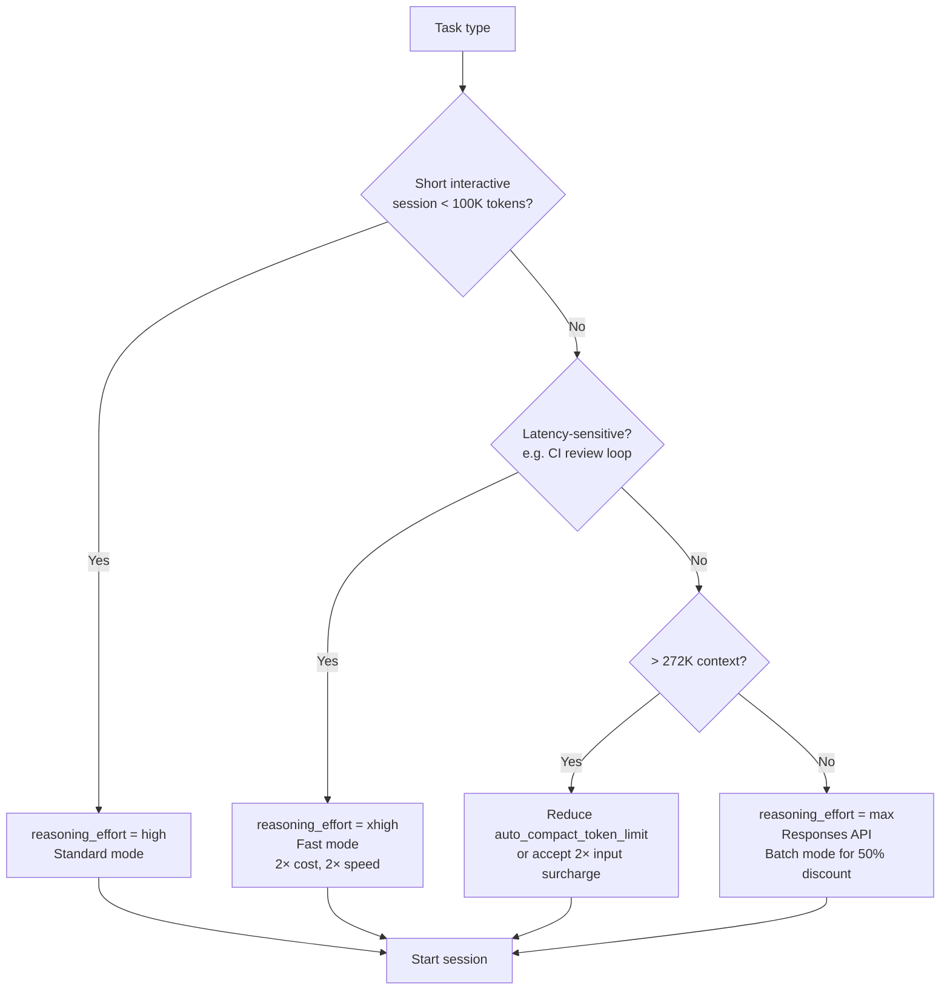

# GPT-6 Astra in Codex CLI: 1.05M Context, Critical Cyber Threshold, and What the New Model Actually Costs


OpenAI shipped GPT-6 Astra on 3 September 2026 — its first model to breach the Critical cybersecurity capability level under the Preparedness Framework.[^1] Within hours, Codex CLI v0.153.1 landed with API support for configuring the new model, and v0.153.2 followed the same evening to correct the Fast-tier description copy.[^2] For Codex CLI operators, Astra introduces a new context-management architecture, a significantly different pricing structure, and a handful of configuration constraints you will hit immediately if you reach for the familiar `reasoning_effort = "none"` knob.

## What the Critical Threshold Means in Practice

OpenAI's Preparedness Framework grades models across four ascending capability tiers — Low, Medium, High, and Critical — for domains including cybersecurity, CBRN, and persuasion. GPT-6 Astra is the first model OpenAI has assessed at Critical for cybersecurity: with appropriate tools and access, the model can locate previously unknown vulnerabilities and develop working exploits across hardened systems without per-step human guidance.[^3]

The practical consequence for enterprise Codex CLI deployments is that Astra is **disabled by default for Enterprise accounts**. Workspace administrators must explicitly enable it through the OpenAI admin console before the model becomes available to team members. The rationale is the same as for other dual-use capabilities: opt-out is insufficient for capabilities that cross the Critical threshold.[^3]

For Plus and Pro subscribers, Astra rolls out on the standard allowance cadence. The Daybreak programme — OpenAI's application-gated cybersecurity research track — provides early, expanded access to Astra's full defensive capabilities for qualifying organisations.[^1]

The safeguards added to Astra are worth noting for operators building security-tooling workflows: the model is substantially more robust to jailbreaks than GPT-5.6 Sol across longer trajectories, and all deployment includes monitoring of full reasoning chains including chain-of-thought. Restricted variants will decline advanced offensive cybersecurity tasks for standard users.[^3]

## Technical Specifications

| Parameter | Value |
|---|---|
| API model ID | `gpt-6-astra` |
| Context window | 1,050,000 tokens |
| Maximum input | 922,000 tokens |
| Maximum output | 128,000 tokens |
| Knowledge cutoff | 30 April 2026 |
| Input modalities | Text, images |
| Output modalities | Text only |
| Supported endpoints | Chat Completions, Responses, Batch |
| Unsupported endpoints | Realtime, Assistants, fine-tuning, embeddings |

Reasoning effort accepts `low`, `medium`, `high`, `xhigh` on Chat Completions, with `max` additionally available on the Responses API.[^4] The `none` effort level — which suppresses the reasoning token budget entirely — is not supported. Temperature, `top_p`, and log-probabilities (`logprobs`) are also unsupported, consistent with OpenAI's trajectory of removing those knobs from reasoning models.[^4]

## Pricing Architecture

The pricing structure is layered and has three tiers that interact:

```
Standard ($10 input / $50 output per 1M tokens)
  └── Cached input: $1/M
  └── Cache writes: $12.50/M
  └── Long-context premium (> 272K input tokens): 2× input, 1.5× output, full request
  └── Fast mode: 2× all applicable rates
  └── Batch/Flex: 50% discount
```

The long-context threshold at 272K tokens is a meaningful number for Codex CLI sessions. The `auto_compact_token_limit` default is below that ceiling, but sessions with large codebases, multi-file context injections, or extensive tool histories can cross it before auto-compaction triggers. Operators running against large monorepos should set an explicit `auto_compact_token_limit` well below 272K or accept the 2× input surcharge.[^4]

Fast mode delivers 2× processing speed at 2× the applicable rate. On a standard session that stays under the long-context threshold, Fast mode shifts the effective cost to $20 input / $100 output per 1M tokens. For latency-sensitive CI pipelines or interactive review loops where the cost-per-run is secondary to turnaround, Fast mode is compelling; for background batch jobs, it is not.[^4]

## Benchmark Performance

The benchmark numbers tell a bifurcated story: Astra makes very large gains on tasks requiring multi-step autonomous operation, while showing more modest improvements on static intelligence indices.

| Benchmark | GPT-6 Astra | GPT-5.6 Sol | Claude Fable 5.1 / Opus 5 |
|---|---|---|---|
| ARC-AGI-3 | 99.9% | 7.8% | 30% (Opus 5) |
| Terminal-Bench Science 0.1 | 64.6% | 22.4% | 52.6% |
| Terminal-Bench 4.0 | 57.7% | 37.3% | 55.8% |
| Agents' Last Exam | 59.3% | 53.6% | 55.5% (Opus 5) |
| ExploitBench | 100% | 78.5% | — |
| OSWorld (computer use) | 72.6% | — | — |
| FrontierMath Tier 4 | 98% | — | — |

Sources: OpenAI, Artificial Analysis, MarkTechPost.[^1][^4][^5]

The ARC-AGI-3 gap is stark — from 7.8% to 99.9% — but ARC-AGI-3 is specifically designed to measure out-of-distribution generalisation rather than engineering productivity. More operationally relevant for Codex CLI users is the Terminal-Bench 4.0 result: Astra at 57.7% versus Sol at 37.3%, a 20.4 percentage-point improvement on realistic CLI task execution.[^5]

Artificial Analysis observed approximately 70% better token efficiency than GPT-5.6 Sol within the Codex harness, and a roughly 80 Elo-point gain on long-horizon analytical tasks (AA-Briefcase).[^6] Hallucination rates on their AA-Omniscience benchmark dropped from 92% to 51% while accuracy improved simultaneously — a notable gain for workflows that generate specification text, commit messages, or documentation alongside code.[^6]

The counter-signal: at standard pricing, Astra costs 2.5× more per token than Sol ($4→$10 input, $20→$50 output), and the efficiency gains do not fully offset that for workloads that are not token-bound. For most Codex sessions that complete within a few hundred thousand tokens, operators should benchmark actual cost-per-task rather than relying on headline token-efficiency figures.[^6]

## Codex CLI Configuration

Astra is not shown in the in-session model picker by default (v0.153.1 explicitly adds API access without model-picker exposure).[^2] To switch to it, set your `~/.codex/config.toml`:

```toml
model = "gpt-6-astra"
model_provider = "openai"
reasoning_effort = "high"   # or "xhigh" / "max" (Responses API only)
```

For Fast-mode sessions, add the `model_suffix` key once Codex CLI exposes it, or route through the Responses API with `service_tier = "fast"`. As of v0.153.2, the in-app Fast-tier label correctly reads "2× speed, increased usage" — the earlier "1.5×" copy was wrong and has been corrected.[^2]

### Reasoning Effort Decision Tree



### What NOT to set

- `reasoning_effort = "none"` — not supported; will be rejected at the API layer.[^4]
- `temperature` or `top_p` — silently ignored or rejected depending on SDK version; remove them from any hook scripts that pass these parameters.
- Do not pin Astra for Realtime or Assistants API sessions — it is not available on those endpoints.[^4]

## The New Context Management Architecture

One of the most operationally significant changes Astra brings to Codex is a shift in how context overflow is handled. Rather than compressing prior turns into a lossy summary, Astra maintains **searchable notes across context windows**: earlier turns are indexed and retrievable, so the model can surface requirements, test results, or API contracts from messages that occurred before the current context window.[^1]

This is architecturally different from the existing `auto_compact_token_limit` compaction path, which discards tokens and replaces them with a prose summary. The notes-based approach preserves the original content in a retrievable form — closer conceptually to the trace-model approach described in Pakhomov & Nijkamp's live-trace work than to compaction.

The practical implication: for very long Codex sessions on Astra, you may be able to raise `auto_compact_token_limit` significantly without losing critical earlier context, since the model's native retrieval partially compensates. That said, this behaviour is currently limited to the Codex backend and is part of the experimental context management feature (`features.context_management.experimental_mode`) introduced in v0.153.0.[^2] It is not yet available for direct API sessions using Chat Completions.

## Operational Checklist for Codex CLI Operators

1. **Enterprise accounts**: confirm Astra is enabled in the admin console before setting `model = "gpt-6-astra"` — an unrecognised model error will surface otherwise.
2. **Remove `reasoning_effort = "none"`** from any config profiles or hook scripts written for earlier models.
3. **Audit per-session token budgets**: sessions regularly exceeding 272K input tokens will trigger the long-context surcharge. Set `auto_compact_token_limit` to ~200K to stay below it.
4. **Fast mode for CI**: if your pipeline has a wall-clock budget, Fast mode at 2× price may be cheaper overall than the opportunity cost of slower turnaround.
5. **Hook script hygiene**: remove `temperature` and `top_p` from any shell scripts that inject parameters into completions requests — they will cause errors or be silently dropped depending on SDK version.
6. **Security workflows**: Astra refuses certain offensive security tasks for standard users. Legitimate red-team or vulnerability-research workflows should apply to the Daybreak programme for elevated access.

## Citations

[^1]: OpenAI, "GPT-6 Astra: A New Generation of Intelligence," 3 September 2026. https://openai.com/index/gpt-6-astra/ ; also CNBC, "OpenAI announces rollout of GPT-6 Astra model," 3 September 2026. https://www.cnbc.com/2026/09/03/open-ai-astra-gpt-6-cyber.html

[^2]: OpenAI, Codex CLI Releases, v0.153.1 and v0.153.2, 3 September 2026. https://github.com/openai/codex/releases

[^3]: OpenAI, "Safety Overview: GPT-6 Astra," 3 September 2026. https://openai.com/index/safety-overview-gpt-6-astra/ ; OpenAI, "Path to Astra: Critical Capabilities and Frontier Safeguards." https://openai.com/index/path-to-astra/ ; Bloomberg, "OpenAI Launches GPT-6 Astra With Enhanced Cybersecurity Safeguards," 3 September 2026.

[^4]: OpenAI, "GPT-6 Astra Model," OpenAI API documentation. https://developers.openai.com/api/docs/models/gpt-6-astra ; ChatAI, "GPT-6 Astra Is OpenAI's New Flagship AI Model for ChatGPT, Codex and the API." https://www.chatai.com/posts/gpt-6-astra-is-openai-s-new-flagship-ai-model-for-chatgpt-codex-and-the-api

[^5]: ChatAI benchmark table, sourced from OpenAI model card; MarkTechPost, "OpenAI Releases GPT-6 Astra: A 1.05M-Context Computer-Use Model Gated Behind a 'Critical' Cyber Threshold," 3 September 2026. https://www.marktechpost.com/2026/09/03/openai-releases-gpt-6-astra-a-1-05m-context-computer-use-model-gated-behind-a-critical-cyber-threshold/

[^6]: Artificial Analysis, "Benchmarking GPT-6 Astra," September 2026. https://artificialanalysis.ai/articles/benchmarking-gpt-6-astra ; Felo AI, "GPT-6 Astra on OpenAPI: 1.05M Context, One Model ID." https://felo.ai/blog/gpt-6-astra-api/
