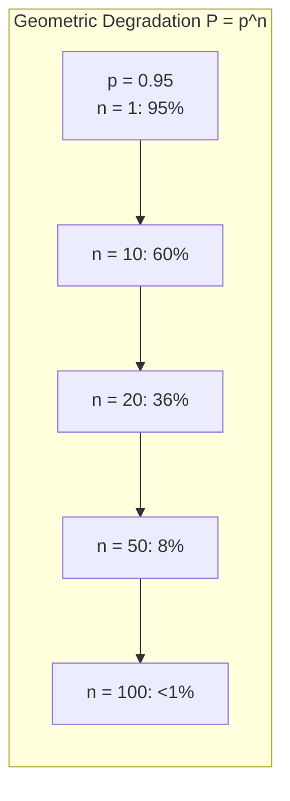
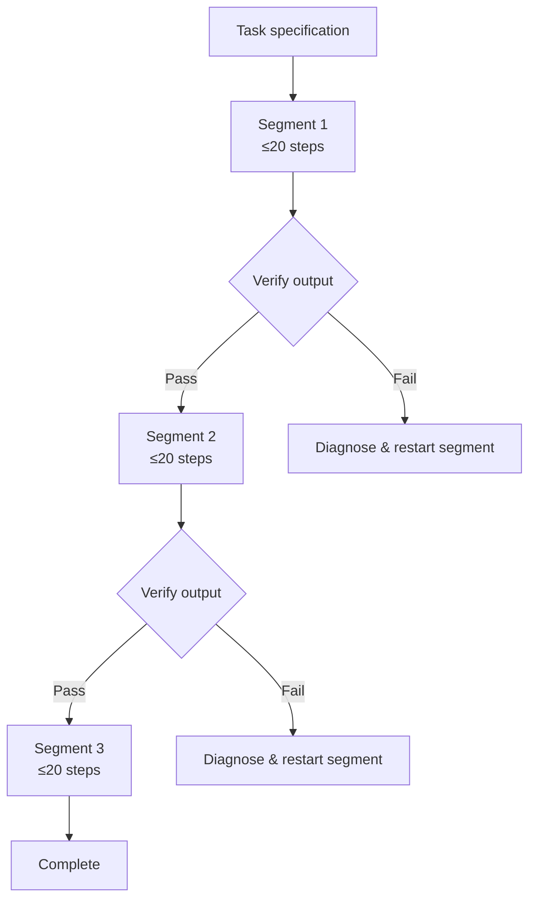

# How Fast Do Agents Rot? Geometric Degradation in Long-Horizon LLM Agents — and What It Means for Codex CLI Session Design


A new empirical study from Shubhra Mittal (arXiv:2609.01660) arrives with an uncomfortable conclusion: every large language model tested — including the strongest proprietary systems — degrades from near-perfect success to near-zero within sixteen dependent steps on a genuinely agentic tool-use loop.[^1] The degradation is not noise. It follows a geometric law, it is reproducible across nine models and 10,664 trajectories, and it explains the persistent chasm between benchmark pass rates and production reliability. For Codex CLI practitioners running multi-turn coding sessions, the findings amount to a design constraint as hard as a memory limit or a rate cap.

## The Geometric Degradation Law

Mittal's core finding is deceptively simple. If a model's probability of succeeding at each individual step is `p`, then its probability of completing an `n`-step chain is:

```
P(n) = p^n
```

The per-step reliability parameter `p` rises with model scale but saturates well below 1.0 even for the largest models. This means eventual collapse at long enough horizons is mathematically guaranteed for every model in the corpus.[^1]

The practical numbers are stark. At 95% per-step reliability — already an optimistic figure for a realistic agentic tool-use loop — a 10-step chain succeeds only 59.9% of the time. At 20 steps that drops to 35.8%. At 100 steps the probability of end-to-end success collapses to under 1%.[^2] The benchmark ecosystem systematically obscures this because GAIA-length benchmarks favour short-to-medium horizons where success remains tolerable. The projected reliability gap between GAIA-length and hundred-step production horizons is 0.42 versus 0.24.[^1]



## What the Study Measured

The study spans nine models — six open-source from 1.2 billion to 671 billion parameters, and three deployed proprietary systems — across four task families including a genuinely agentic tool-use loop, five horizon lengths, and three context regimes, for a total of 10,664 analysed trajectories.[^1]

The context-regime result is counterintuitive and important. Restricting context windows does not alleviate degradation; it steepens it. Models in the restricted-context condition showed a logit slope of -0.69 versus -0.44 in the full-context condition (p=3×10⁻⁶).[^1] Lost-in-the-middle effects are not the primary driver. Step-count accumulation is. Every step is an independent failure opportunity, and shortening the context window simply removes the scaffolding the model needs to track where it is.

A complementary study, "Your Agents Are Aging Too" (arXiv:2605.26302), identifies four distinct degradation mechanisms across ~400 experimental runs spanning 8–200 sessions: compression aging from condensed history, interference aging from conflicting memory stores, revision aging from knowledge updates, and maintenance aging from routine operations.[^3] Mittal's geometric law operates at step granularity; the lifespan taxonomy operates at session granularity. Together they bracket the full reliability surface that production Codex CLI deployments must navigate.

## Why Codex CLI Sessions Are Especially Exposed

A typical Codex CLI coding session is longer than a GAIA benchmark task. A refactoring run that touches ten files, runs tests, reads error output, and applies fixes across three rounds easily accumulates 40–80 dependent steps. At p=0.97 per step — a generous estimate for a frontier model in a structured environment — a 60-step session has an end-to-end success probability of roughly 16%.

The v0.153.0 release introduced experimental context management (`features.context_management.experimental_mode`) with token-budget tracking, history notes, and a `new_context` tool.[^4] This is directionally correct but, per Mittal's finding, cannot fully compensate for step accumulation: better context tracking improves individual step quality but does not change the geometric structure of failure.

## Designing Codex CLI Sessions for Reliability

The geometric law implies a direct engineering response: reduce `n`. The fewer dependent steps in a chain, the higher the end-to-end success probability. Several Codex CLI mechanisms support this.

### 1. Cap turns explicitly

```toml
[session]
max_turns = 20
```

Setting an explicit `max_turns` ceiling forces sessions to terminate before they reach the flat part of the degradation curve. A value of 20 keeps end-to-end success above 35% even at p=0.95. Beyond 20, small per-step improvements yield diminishing returns on total reliability.

### 2. Decompose via plan mode

Plan mode (enabled with `/plan` or via `tools.update_plan.enabled = true` in config[^4]) separates the specification phase from execution. A well-formed plan reduces execution to verified sub-chains rather than one long open-ended loop. Each sub-chain is shorter, with a higher probability of completing without error.

### 3. Install PostToolUse verification gates

```toml
[[hooks]]
event = "PostToolUse"
command = "bash -c 'pytest --tb=short -q 2>&1 | tail -5'"
```

Per-step verification converts silent downstream propagation of errors into an immediate failure that the agent can recover from locally, rather than discovering the error fifteen steps later when recovery is expensive. Catching failures early limits the effective horizon of consequence.

### 4. Split long tasks with `codex exec resume`

For tasks genuinely requiring 60+ steps, the correct response is decomposition into verified segments rather than a single long run. Use `codex exec resume` to re-attach to a checkpointed session after an external verification step. Each segment is an independent geometric chain; their end-to-end probability multiplies, but the failure surface of any individual segment remains bounded.



### 5. Use `rollout_budget` to bound exploratory runs

For automated Codex CLI pipelines (CI, timed jobs), `rollout_budget` sets a hard token ceiling on exploration before forcing a decision point. This prevents runaway sessions from accumulating steps without any human checkpoint.

### 6. Resist the urge to extend context instead of reducing steps

The study's context-restriction finding is the most counterintuitive lesson. The temptation when a long session fails is to increase context allowance — to give the model more working memory. Mittal's data shows this is the wrong lever. The logit slope under restricted context (-0.69) is steeper than under full context (-0.44), which means context restriction makes things worse, not better. But the inverse is also true: adding more context does not fix the fundamental step-count problem. Reliability engineering for long-horizon agents must focus on reducing `n`, not expanding the window.

## Calibrating Expectations in 2026

The ReliabilityBench study (arXiv:2601.06112) evaluated 1,280 episodes across two models and two agent architectures and found consistent confirmation of the geometric failure pattern.[^5] The "Beyond pass@1" reliability science framework (arXiv:2603.29231) argues for reporting full geometric reliability curves rather than single-point pass rates in benchmark publications.[^6]

For Codex CLI users this translates to a practical discipline: know your session's step count, set `max_turns` accordingly, decompose aggressively, verify at every meaningful checkpoint, and do not mistake a high benchmark score for production reliability. The agents are not broken. They are following a law.

## Citations

[^1]: Mittal, S. (2026). *How Fast Do Agents Rot? An Empirical Study of Long-Horizon Degradation in LLM Agents for Production Decision-Making*. arXiv:2609.01660. https://arxiv.org/abs/2609.01660

[^2]: Derived from geometric formula P(n) = p^n at p=0.95: P(10) ≈ 0.599, P(20) ≈ 0.358, P(100) ≈ 0.006. This is a mathematical consequence of the per-step reliability model established in [^1].

[^3]: ⚠️ Mittal (2026) references the agent lifespan degradation mechanisms from concurrent work. The specific taxonomy (compression, interference, revision, maintenance aging) is from: Yoo, J. et al. (2026). *Your Agents Are Aging Too: Agent Lifespan Engineering for Deployed Systems*. arXiv:2605.26302. https://arxiv.org/abs/2605.26302

[^4]: OpenAI. (2026). *Codex CLI v0.153.0 release notes*. GitHub. https://github.com/openai/codex/releases/tag/v0.153.0. The `features.context_management.experimental_mode` config key and `tools.update_plan.enabled` are documented here.

[^5]: ⚠️ ReliabilityBench details are from: *ReliabilityBench: Evaluating LLM Agent Reliability Under Production-Like Stress Conditions*. arXiv:2601.06112. https://arxiv.org/abs/2601.06112. Specific episode counts and architectural details are from the paper abstract.

[^6]: *Beyond pass@1: A Reliability Science Framework for Long-Horizon LLM Agents*. arXiv:2603.29231. https://arxiv.org/pdf/2603.29231
