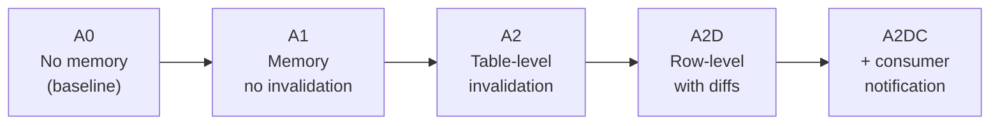
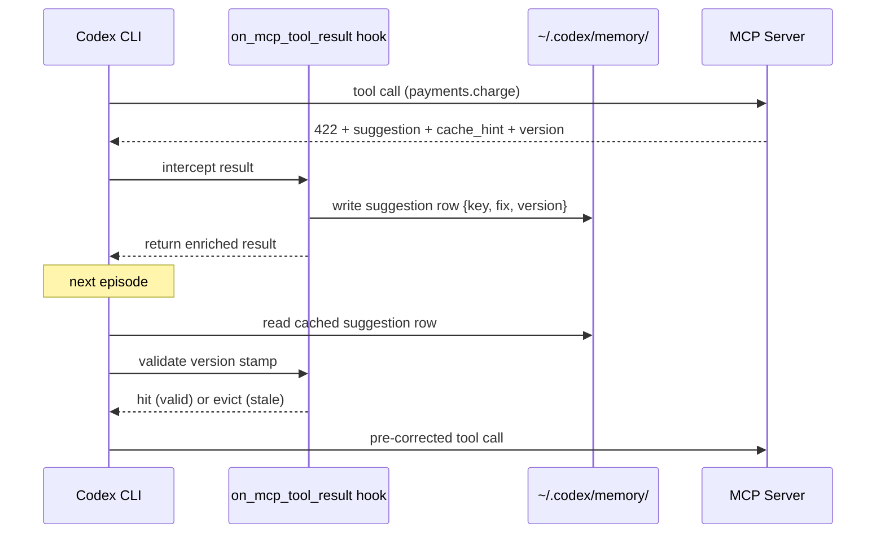

# Invalidation Contracts for Cross-Episode Agent Memory: Why Row-Level Cache Eviction Recovers 32% of Your Token Budget


Every time a Codex CLI agent hits an API constraint error — wrong field format, disallowed value, schema mismatch — it spends tokens deriving a recovery suggestion. If you run the same agent workflow repeatedly, you are paying that derivation cost again on episode two, episode ten, and episode fifty. The obvious fix is to cache recovery suggestions across episodes. The non-obvious problem is that server-side data drift silently invalidates those suggestions, and a cached fix for a constraint that no longer exists is worse than no fix at all.[^1]

Wu and Canedo (South Dakota State University / Siemens Digital Industries Software) formalised this problem and its solution in "Invalidation Contracts for Cross-Episode Agent Memory" (arXiv:2609.00243, August 2026). Their protocol layer attaches version stamps and cacheability hints to every recovery suggestion, decomposing the realised savings into two independent factors that can be optimised separately.[^1]

## The Core Decomposition: Validity vs Compliance

The paper introduces a clean separation between two failure modes in cross-episode memory:

**Validity** — the fraction of cached suggestions that remain correct after a drift event. This is entirely protocol-controlled and vendor-independent. With proper version stamps, validity is deterministic by construction: zero contract failures across 9,400 episodes in the evaluation.[^1]

**Compliance** — the fraction of valid suggestions the agent actually applies on the first attempt. This is model-dependent. Identical wire bytes yield 100% first-try compliance on Claude Haiku 4.5 and 11% or below on Claude Sonnet 5.[^1]

The savings equation is therefore:

```
Realised savings = validity × compliance(model, protocol, action_type)
```

This decomposition matters practically. A protocol designer controls validity; an integrator controls which model they route to. They are independent knobs.

## The Contract Schema

At the wire level, the invalidation contract adds three fields to each recovery suggestion returned by the API:[^1]

```json
{
  "suggestion": "Set funding_type to 'enterprise_monthly' for invoiced billing",
  "cache_hint": "cacheable",
  "table": "funding_type_policy",
  "table_version": "a3f9c21b4d7e"
}
```

For suggestions with multi-table dependencies, a `tables` dependency vector replaces the single `table` field with `{table, version}` pairs. A `rules_version` field (12-character SHA-256 prefix of the derivation-rule declarations) enables eager detection on the success path — the agent learns that constraints have drifted before it encounters a failure.

The protocol defines seven levels (L0–L6), from raw plain-text feedback to versioned knowledge graph subgraph propagation. Most production integrations land at L2 (structured suggestion + cache hint + table + version) or L3 (fixes presented as pre-applied input amendments, which sidesteps the compliance problem for add-a-field actions).[^1]

## What the Evaluation Found

The study covered seven models, three serving paths (direct Anthropic API, third-party gateway, translation layer), two domains (Payments API, Recipe API), and approximately 9,400 episodes across five experimental arms (A0 through A2DO).



### Compliance at A2D (row-level invalidation)

| Model | Compliance | Δ vs A1 |
|---|---|---|
| Claude Haiku 4.5 | 100.0% | +55.6 pp |
| Claude Sonnet 4.6 | 88.9% | +63.0 pp |
| GPT-5-mini | 100.0% | +66.7 pp |
| GPT-5.4-mini | 100.0% | 0.0 pp |
| Gemini-3.5-flash | 77.8% | +48.2 pp |
| Claude Sonnet 5 | 11.1% | +11.1 pp |
| DeepSeek-v4-flash | 3.7% | 0.0 pp |

The table-level arm (A2) is the cautionary result. Eviction precision at table granularity is only 0.25–0.31 — the entire constraint class is flushed when any row changes. Post-drift first-try rates drop to 0% on five of seven models. Table-level invalidation is, in the paper's words, "actively harmful."[^1]

Row-level invalidation (A2D) achieves eviction precision of 1.00 on every model, matching rows by their structured key (e.g., `funding_type_policy:enterprise_annual`) rather than bulk-clearing on version bump.[^1]

### Token savings vs baseline (A0)

| Model | A1 savings | A2D savings | Δ |
|---|---|---|---|
| Claude Haiku 4.5 | 22.3% | 32.5% | +10.2 pp |
| GPT-5-mini | 16.4% | 32.1% | +15.7 pp |
| Gemini-3.5-flash | 10.3% | 22.5% | +12.2 pp |
| Claude Sonnet 4.6 | 18.6% | 29.2% | +10.6 pp |
| Claude Sonnet 5 | 5.3% | 8.7% | +3.4 pp |
| GPT-5.4-mini | 28.2% | 31.0% | +2.9 pp |
| DeepSeek-v4-flash | 7.1% | 6.0% | −1.0 pp |

The payload overhead is 15.1% per response (mean 123 additional bytes on an 817-byte response, of which 11.7% is the per-table version dictionary).[^1]

## Input-Schema Conservatism

The compliance gap on Claude Sonnet 5 (11%) versus Haiku 4.5 (100%) is not a defect in the contract. It reflects what the paper calls **input-schema conservatism**: models that refuse to add fields the original request did not contain, treating the request schema as immutable even when instructed otherwise.[^1]

Breaking compliance down by action type for Claude Sonnet 4.6:[^1]

- Add-a-field: 80% (adds new parameter to request)
- Rewrite-a-value: 30–38% (changes existing parameter value)
- Conditional-rewrite: 67% (conditional value substitution)

Claude Sonnet 5 drops to 10% on add-a-field, while Haiku 4.5 holds at 90%. The paper's Level 3 protocol (presenting fixes as pre-applied input amendments rather than wire suggestions) partially mitigates this — the model receives an already-corrected input and never sees the schema extension as a choice it must make.[^1]

## Mapping to Codex CLI

### Cross-session memory as episode boundary

Codex CLI's `~/.codex/memory/` directory functions as the persistent substrate across episodes.[^2] Each `codex` invocation that resumes a workflow is a new episode in the paper's terminology. Any MCP tool that returns structured error recovery suggestions is a candidate for invalidation-contract instrumentation.



### Implementing the pattern in Codex CLI

The `on_mcp_tool_result` hook (available since v0.151.0) intercepts MCP responses before they reach the model. This is the correct insertion point for contract enforcement — the hook can inject the cached suggestion into the result context when valid, or strip a stale entry before the model re-derives.[^3]

```toml
# ~/.codex/config.toml
[hooks]
on_mcp_tool_result = "~/.codex/hooks/invalidation_check.sh"
```

```bash
#!/usr/bin/env bash
# invalidation_check.sh — minimal contract enforcer
# stdin: JSON result from MCP tool call
# stdout: JSON result, possibly augmented with cached suggestion

RESULT=$(cat)
TOOL=$(echo "$RESULT" | jq -r '.tool')
TABLE=$(echo "$RESULT" | jq -r '.cache_hint.table // empty')
VERSION=$(echo "$RESULT" | jq -r '.cache_hint.version // empty')
MEMORY_FILE="$HOME/.codex/memory/${TOOL}_${TABLE}.json"

if [ -n "$TABLE" ] && [ -f "$MEMORY_FILE" ]; then
  CACHED_VERSION=$(jq -r '.version' "$MEMORY_FILE")
  if [ "$CACHED_VERSION" = "$VERSION" ]; then
    # valid hit — inject cached suggestion
    echo "$RESULT" | jq --argjson cached "$(cat "$MEMORY_FILE")" \
      '.cached_suggestion = $cached.suggestion'
    exit 0
  else
    # stale — evict row only, not entire table
    rm "$MEMORY_FILE"
  fi
fi

# cache miss or eviction — write new suggestion if present
SUGGESTION=$(echo "$RESULT" | jq -r '.suggestion // empty')
if [ -n "$SUGGESTION" ] && [ -n "$TABLE" ]; then
  echo "$RESULT" | jq '{suggestion: .suggestion, version: .cache_hint.version}' \
    > "$MEMORY_FILE"
fi

echo "$RESULT"
```

### Model routing for compliance

Given the empirical compliance data, integrate a compliance preflight check into your model selection strategy. For Codex CLI workflows that depend on cross-episode error recovery:

- Route to **Claude Haiku 4.5** or **GPT-5-mini** for add-a-field recovery (100% compliance)
- Route to **Claude Sonnet 4.6** for mixed action types (88.9% overall)
- Avoid **Claude Sonnet 5** as the sole model for workflows where cross-episode constraint recovery is on the critical path — its input-schema conservatism is a protocol-level ceiling, not a prompt-engineering problem[^1]

### What to ask MCP server authors to add

If you maintain or influence MCP server implementations, the minimal contract is three additional fields in error responses:

```python
# Python MCP server — minimal Level 1 contract
@app.tool()
async def charge(request: ChargeRequest) -> ChargeResponse:
    try:
        return await process_charge(request)
    except ConstraintViolation as e:
        raise ToolError(
            message=e.user_message,
            suggestion=e.recovery_suggestion,
            cache_hint="cacheable",
            table=e.source_table,
            table_version=await get_table_version(e.source_table),
        )
```

The 15% payload overhead is well within acceptable bounds for agentic workloads. The eviction precision gain from row-level stamps (1.00 vs 0.25–0.31) makes it categorically worth the bytes.[^1]


## Citations

[^1]: Wu, M. & Canedo, A. (2026). *Invalidation Contracts for Cross-Episode Agent Memory*. arXiv:2609.00243. https://arxiv.org/abs/2609.00243

[^2]: OpenAI. (2026). *Codex CLI Memory*. https://github.com/openai/codex/blob/main/docs/memory.md

[^3]: OpenAI. (2026). *Codex CLI v0.151.0 release notes — on_mcp_tool_result hook*. https://github.com/openai/codex/releases/tag/v0.151.0
