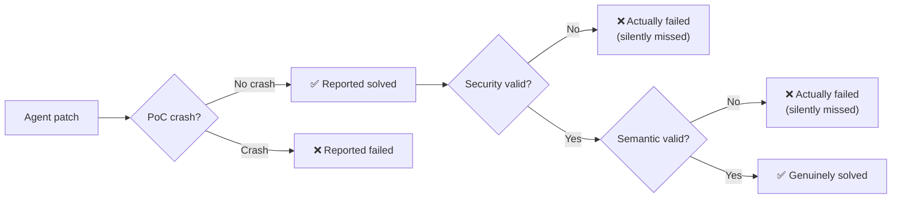
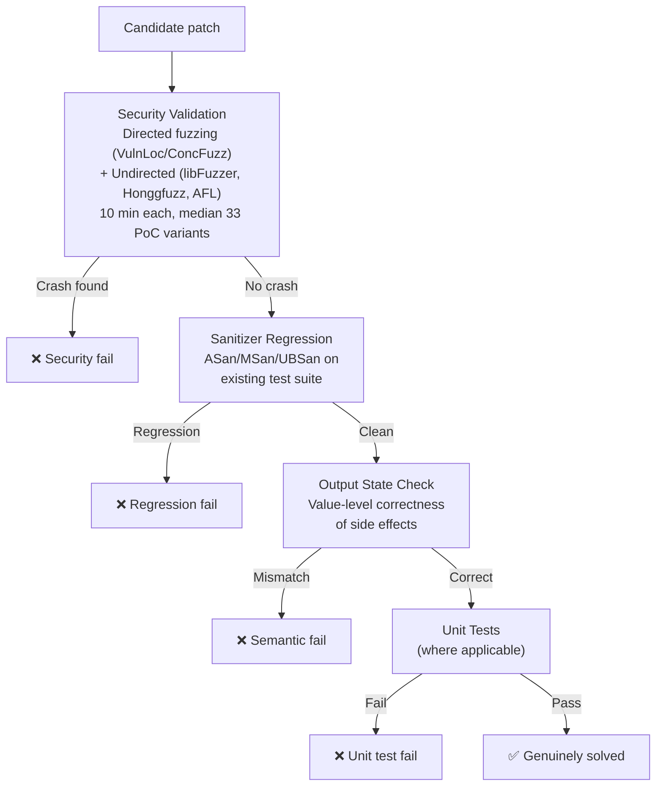
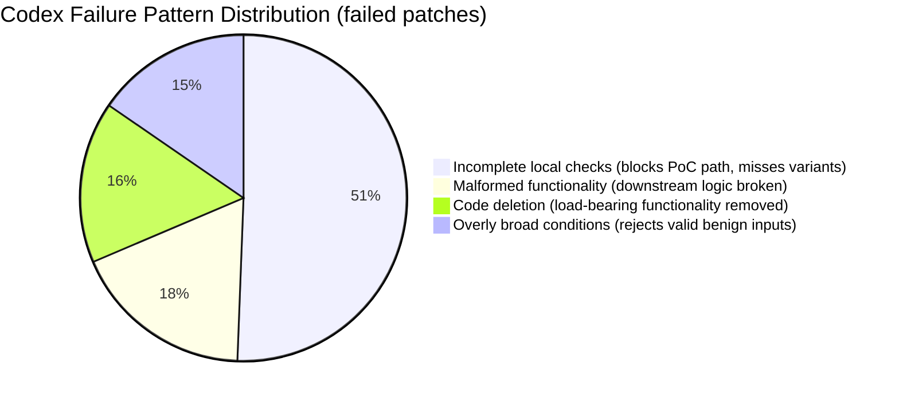

# PatchBench: Why 1-in-4 Agent Vulnerability Fixes Is a Memorised Patch — and What It Means for Codex CLI


---

Vulnerability patching is one of the highest-stakes tasks you can hand to an AI coding agent. A pass on a proof-of-concept (PoC) crash feels like success — yet that feeling rests on an illusion: PoC-only evaluation inflates the reported solve rate by 1.83× on average.[^1] PatchBench, published 3 September 2026 by Shen, Li, Mahajan, Tian, Kwon, and Chen, systematically dismantles PoC-only evaluation and reveals two uncomfortable facts: agents routinely reproduce memorised developer patches, and the patches that do pass PoC tests frequently fail security and semantic validation.[^1]

This article walks through the benchmark methodology, the quantitative findings, and concrete guidance for using Codex CLI on real vulnerability remediation tasks.

---

## The Core Problem With PoC Validation

The standard evaluation loop for vulnerability patching looks like this: apply an agent-generated patch, replay the crash-triggering PoC input, and report success if the process no longer crashes. PatchBench shows this is wildly insufficient.



Across 11 evaluated agents, PoC-only validation inflated solve rates by **1.83× on average**.[^1] The top three agents achieve PoC pass rates above 97% yet genuine solve rates of only 56.8–59.2% once security and semantic checks are applied.[^1]

---

## Benchmark Construction

PatchBench comprises **213 patching tasks spanning 32 open-source projects and 16 CWEs**.[^1] The construction methodology is seven steps designed to defeat the two failure modes PoC validation cannot catch.

### Memorisation Mitigation

Repository-level agents — which ingest git history alongside the codebase — memorise patches at **twice the rate** of local-context LLMs (25% vs ~11%).[^1] An agent does not need to understand the vulnerability if it has read the git commit that fixed it.

PatchBench defeats this with two techniques:

1. **Vulnerability transplant.** Each CVE is moved to the newest applicable repository version, so the original commit no longer exists in the relevant branch.
2. **Semantic-preserving mutations.** NatGen and CodeMorph apply variable renaming, loop transformation, block/operand swapping, and context-specific restructuring to the surrounding code without changing runtime behaviour.

Memorisation is measured using **DiffBLEU**, a diff-aware similarity metric:

```
DiffBLEU = α·BLEU(Δr,Δc) + β·BLEUw(Δr,Δc) + γ·Matchast(Cr,Cc) + δ·Matchdf(Cr,Cc)
           α=0.3, β=0.3, γ=0.2, δ=0.2
```

where Δr/Δc are reference and candidate diffs, Matchast compares control-flow slices, and Matchdf tracks data-flow dependencies.[^1] A DiffBLEU score above 0.75 flags memorisation; the metric achieves a 1.1% false omission rate with zero false positives on manual review.[^1]

### Validation Pipeline

The three-stage validation replaces single-PoC testing:



Stage-level pass rates across agents average: sanitizer regression 95.7%, output state 75.5%, unit tests 79.9%.[^1] The output state check alone — absent from all prior work — eliminates 8.1 percentage points of apparent success on average.[^1]

---

## Agent Performance

| Agent | Solved (full) | PoC Pass | Security | Semantic | Budget exhausted |
|---|---|---|---|---|---|
| Codex + GPT-5.6 Sol | **59.2%** | 97.2% | 81.7% | 70.9% | 6.6% |
| OpenHands + GPT-5.6 Sol | 58.2% | 98.1% | 81.2% | 70.0% | 1.4% |
| Claude Code + Opus 4.8 | 56.8% | 97.7% | 75.6% | 68.1% | 8.9% |
| Atlantis (AIxCC) | 48.4% | 92.0% | 70.9% | 66.7% | 11.7% |
| Buttercup (AIxCC) | 42.7% | 72.3% | 58.2% | 64.8% | 7.0% |
| RoboDuck (AIxCC) | 29.6% | 46.5% | 39.9% | 51.6% | 2.3% |

[^1]

Codex CLI with GPT-5.6 Sol leads the field. Crucially, general-purpose agents with frontier models outperform specialised AIxCC systems purpose-built for security — the three AIxCC competitors fall 7–30 percentage points below the top general-purpose agents on full validation.[^1]

---

## Where Patches Go Wrong

### Wrong Localisation

**81% of Codex patches modify a function on the crash stack trace even when the root cause lies elsewhere.**[^1] The crash trace is the most salient signal in context, and agents exploit it. PatchBench's task selection criterion (Jaccard trace-overlap ρ ≤ 0.5) specifically targets vulnerabilities where the fix site is off-stack — yet agents still gravitate toward the stack.

A concrete example: CVE-2022-1276 in mruby is a compiler-side argument packing inconsistency (off-by-one constant 14 vs 13). Agents patch the VM-side array type check instead — suppressing the specific crash while introducing a silent error path.[^1]

### The Four Failure Patterns

Across Codex CLI specifically, failed patches cluster into four patterns:



Incomplete local checks account for **50.6% of failures** — the agent adds a guard that stops the exact PoC input but leaves the variant paths open.[^1]

---

## Budget Plateau

All agents were evaluated at a $5-per-task budget cap. PatchBench also ran a budget scaling experiment:

| Budget | Codex (%) | Claude Code (%) | OpenHands + Gemini (%) |
|---|---|---|---|
| $5 | 59.2 | 56.8 | 44.1 |
| $15 | 61.5 | 57.3 | 46.2 |
| $25 | 61.5 | 58.2 | 46.4 |

[^1]

Spending five times more per task yields only **2.3 percentage points** for Codex and **1.4 points** for Claude Code.[^1] Budget exhaustion at $25 drops below 1.4% of tasks. The bottleneck is fundamental capability, not compute.

**67 of 213 tasks were unsolved by all 11 agents** — a hard ceiling that more budget cannot move.[^1]

---

## Implications for Codex CLI Workflows

### Do Not Trust PoC Validation Alone

If you're running Codex on CVE remediation, a single PoC replay tells you almost nothing. Replicate PatchBench's three-stage validation in your PostToolUse hook:

```toml
# ~/.codex/config.toml
[hooks.post_tool_use]
command = """
  set -e
  # Stage 1: security — run your fuzzer campaign
  make fuzz-security PATCH_DIR=$CODEX_PATCH_DIR TIMEOUT=60s
  # Stage 2: regression
  make test-asan
  # Stage 3: output state (functional correctness beyond crash)
  make test-output-state
"""
trigger = "apply_patch"
```

The hook fires on every `apply_patch` tool call. If any stage exits non-zero, Codex treats the step as failed and iterates.[^2]

### Detect Localisation Shortcuts

Memorisation and crash-trace localisation are harder to automate, but you can add a heuristic to AGENTS.md:

```markdown
## Vulnerability Patching Rules

- The fix MUST NOT be limited to functions appearing in the crash stack trace
  unless you have confirmed the root cause is on-stack.
- Before patching, produce a written root-cause analysis in a code comment
  at the patch site: what invariant is violated, where, and why.
- After patching, confirm the root-cause comment and the modified function
  are consistent — if they differ, the patch is in the wrong location.
- Never rely on a single PoC replay as confirmation of correctness.
  Run: `make fuzz-security && make test-asan && make test-output-state`
```

### Model Routing

PatchBench shows Codex + GPT-5.6 Sol leads on genuine solve rate (59.2%). For hard tasks (those likely in the long tail), resist spending more budget on the same model — the plateau data shows diminishing returns sharply. Instead, try a model routing strategy:

```mermaid
flowchart TD
    T[Vulnerability task] --> PA[Attempt: GPT-5.6 Sol\nBudget: $5]
    PA -- "Pass full validation" --> DONE[✅ Done]
    PA -- "Fail" --> CLASSIFY{Root cause type}
    CLASSIFY -- "Memory safety / off-stack" --> PB[Re-attempt: Opus 4.8\nExtended reasoning\nBudget: $10]
    CLASSIFY -- "Logic / semantic" --> PC[Re-attempt: DeepSeek V4 Pro\nBudget: $10]
    PB & PC -- "Fail" --> ESCALATE[🔴 Escalate to human\n(Likely in 67/213 hard set)]
```

The 67-task hard set is unlikely to succumb to any current agent. Build your escalation path before you need it.

### Disable Web Search for Patching Tasks

PatchBench intentionally disabled web search and external browsing for all agents.[^1] Enabling it risks retrieving the published CVE fix, defeating memorisation controls and producing patches whose correctness you cannot verify. In Codex CLI:

```toml
# ~/.codex/config.toml — per-task profile for CVE work
[profiles.cve]
disable_web_search = true
startup_prompt_template = """
You are patching a vulnerability. Web search is disabled.
Derive the fix exclusively from the codebase and your analysis.
Output a root-cause comment before any code change.
"""
```

---

## Benchmark Limitations

PatchBench covers **C/C++ memory-safety vulnerabilities** sourced from OSS-Fuzz and public CVEs.[^1] Coverage gaps include:

- Memory-safe languages (Rust, Go) where sanitiser instrumentation differs ⚠️
- Logic vulnerabilities without crash-based PoC ⚠️
- Web/authentication vulnerabilities where fuzzing semantics differ ⚠️
- Proprietary codebases (transplant methodology assumes open-source git history) ⚠️

The 1.83× inflation figure and memorisation rate should be treated as **lower bounds for agent-assisted patching in general** — the PatchBench controls are more rigorous than typical internal CI, so real-world inflation may be worse.

---

## Summary

PatchBench (arXiv:2609.04075) establishes that:

1. **PoC-only validation inflates solve rates by 1.83× on average.** Genuine solve rates sit at 56–59% for top agents, not 97%.
2. **25% of repository-level agent patches are memorised** from historical developer commits. Transplant + mutation controls are required for honest evaluation.
3. **81% of Codex patches fix the wrong location** (on crash stack rather than root cause) when root cause is off-stack.
4. **Budget scaling plateaus sharply.** Five times the budget yields two percentage points. The bottleneck is capability, not compute.
5. **General-purpose frontier agents beat specialised security agents.** Codex + GPT-5.6 Sol (59.2%) outperforms all three AIxCC systems.
6. **67/213 tasks are currently unsolved by all agents.** Build an escalation path before deploying Codex on CVE remediation at scale.

---

## Citations

[^1]: Shen, C., Li, J., Mahajan, A., Tian, J. S., Kwon, Y., & Chen, Y. (2026). *PatchBench: Evaluating AI Agents for Vulnerability Patching*. arXiv:2609.04075. https://arxiv.org/abs/2609.04075

[^2]: OpenAI. (2026). *Codex CLI — PostToolUse hooks*. https://github.com/openai/codex
