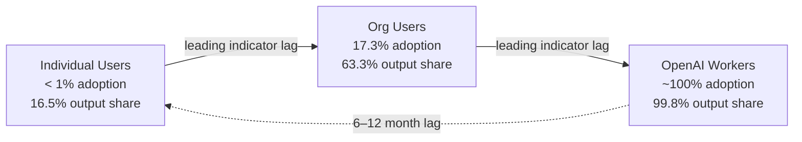
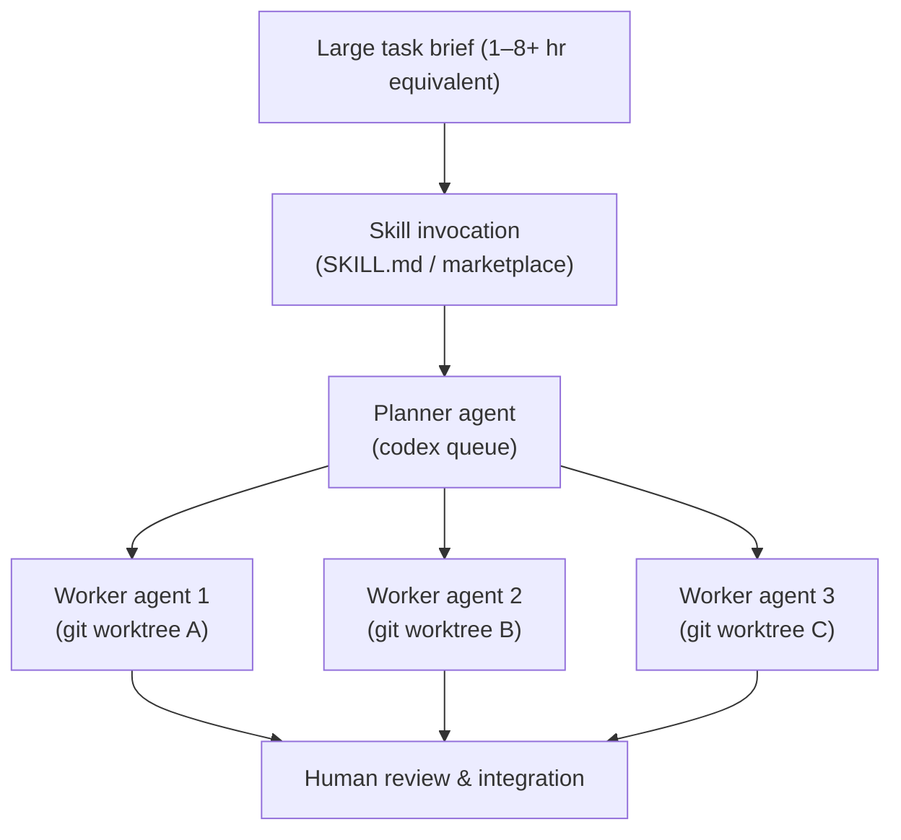

# The Shift to Agentic AI: What OpenAI's Own Usage Data Reveals About Codex Workflows in 2026

A joint team from OpenAI, Columbia Business School, the Wharton School, and Duke's Fuqua School released a study in June 2026 that is, depending on your vantage point, either unsurprising or startling: within six months of general availability, OpenAI's internal workers are running Codex for 99.8% of the output tokens they previously split between Codex and ChatGPT.[^1] Legal staff are generating thirteen times more output per month than in November 2025; researchers have crossed fifty times their prior baseline.[^2]

These are not benchmark figures. They are anonymised production logs — from the organisation that built the tool. The study by Drew Johnston, David Holtz, Alex Martin Richmond, Christopher Ong, Prasanna Tambe, and Aaron Chatterji (arXiv:2606.26959) provides the largest published dataset of real agentic AI adoption to date, and its findings contain concrete lessons for Codex CLI practitioners designing their own workflows.

## What the Data Actually Covers

The researchers analysed samples of 0.1%–4% of active users across three cohorts between January and June 2026: individual (personal-account) users, organisational (enterprise) users, and OpenAI's internal workforce.[^3] Automated classifiers extracted task type, complexity, and usage patterns without reading message content — a privacy-protecting constraint that also makes the methodology reproducible.

The three-cohort design matters because it creates a natural progression: OpenAI workers as a leading indicator, enterprise users in the middle, and individual users at the tail. Patterns that emerged in the internal cohort in Q1 2026 were visible in enterprise accounts by Q2, and are now beginning to appear among individual users. If you want to know where your own Codex workflow is headed, look at what the internal cohort is doing today.

## Adoption Is Not Uniform — And the Gap Is Accelerating

Active-user growth was more than fivefold across all cohorts between January 1 and June 1, 2026.[^4] But the headline number obscures a pronounced stratification:

- **Individual users:** fewer than 1% used Codex in any given 28-day window as of June 11, 2026
- **Organisational users:** 17.3% adoption in the same window
- **OpenAI workers:** near-universal weekly usage

The output-token share is even more revealing. Among OpenAI employees, Codex accounts for 99.8% of the output tokens generated across both Codex and ChatGPT. For enterprise users it is 63.3%. For individuals it is 16.5%.[^5]

The implication: most individual Codex CLI users are still operating in a primarily interactive mode — sending short requests and waiting for responses — while power users inside organisations have fully switched to an ambient, delegation-first model. The gap in outcomes follows directly.

## The Task Complexity Explosion

Perhaps the single most actionable finding in the paper is the shift in task size. Among individual users:

- **December 2025:** 2.1% submitted at least one request estimated to require 8 or more hours of human work
- **May 2026:** 25.6% had submitted such a request — nearly a tenfold increase in five months[^6]
- The share submitting at least one 1+ hour task rose from 35.4% to 70.2% over the same period

There is also a structural observation about conversation position: the first turn in a Codex conversation is more than twice as likely as the fourth turn to contain a task requiring more than one hour of equivalent human work.[^7] Users are frontloading large tasks rather than progressively refining — a pattern consistent with agent-native workflows where the initial prompt is a project brief, not a question.

For Codex CLI practitioners, this is a configuration signal. If you are still structuring sessions as iterative back-and-forth exchanges, you are leaving the majority of the tool's capability unused.

## Concurrent Agents: The Internal Cohort as a Reference Point

The contrast between cohorts on concurrent-agent usage is striking:

| Cohort | No concurrent turns | 3+ concurrent agents (weekly) | 5+ concurrent agents |
|---|---|---|---|
| Individual | 63.9% | minority | — |
| Organisational | 67.4% | minority | — |
| OpenAI workers | 10.7% single workflows only | >10% weekly | 28.6% |

OpenAI workers have essentially inverted the modal usage pattern. Only 10.7% operate a single workflow at any one time; 28.6% regularly oversee five or more concurrent agents.[^8] The authors describe this as "a workflow in which humans oversee a team of agents" — consistent with what Codex CLI exposes through the agents dashboard and `codex queue`.

Median daily Codex runtime for OpenAI workers as of June 11 was 2.5 hours; the 99th percentile was 71 hours of agent turns per day — a figure only possible if many agents are running in parallel.[^9] This cohort grew 99th-percentile runtime by 88% between April and June 2026 alone.

## Skills: The Highest-Leverage Habit Separator

The skills-adoption numbers are among the sharpest dividing lines in the dataset:

- Individual users: 25.7% invoked at least one skill in the 7-day window ending June 11
- Organisational users: 30.4%
- OpenAI workers: **96.2%**[^10]

Skills (shared instruction sets exposed via SKILL.md or the marketplace) grew from 5.4% penetration among active users in March to 26.6% by June — quadrupling in three months.[^11] Among the internal cohort, near-universal adoption suggests that skills have become the primary mechanism for workflow systematisation — the equivalent of shared shell functions for agentic operations.

From a Codex CLI configuration standpoint, this maps directly to the `~/.codex/skills/` directory and SKILL.md conventions. The data suggests that practitioners who are not actively curating a skill library are operating at a significant disadvantage relative to power users, regardless of the model or session length they choose.

## Beyond Software Engineering

One finding that deserves attention beyond the coding community: Codex is no longer primarily a software engineering tool, at least within the internal cohort. Among OpenAI workers, task categories include research, planning, communication, recruiting, sales, product work, and data analysis.[^12] Organisational users remain more concentrated in engineering tasks, but the internal cohort shows where the tool's capability envelope is heading.

Among engineers in enterprise accounts, Codex's share of output tokens quintupled over the first half of 2026 to 26.8%. Data and analytics practitioners followed at 15.2%; legal teams, historically the last adopters of technical tooling, reached 1.9%.[^13] The 13x productivity multiplier for legal staff is not code-generation output — it is document drafting, clause analysis, and communication coordination running through Codex.

## Practical Implications for CLI Configuration

Taken together, the data suggests four configuration priorities for practitioners who want to operate closer to the internal-cohort pattern:

1. **Systematise with skills early.** 96.2% adoption among power users is not a coincidence. Build SKILL.md files for every repeatable workflow before reaching for bespoke prompts.

2. **Front-load task complexity.** The data confirms that large project briefs in the first turn outperform iterative small requests. Use `startup_prompt_template` to inject context and constraints before the first user turn.

3. **Design for parallelism.** The concurrent-agent pattern (`codex agents` dashboard, `codex queue`) is not an advanced feature — it is the default for high-output users. Isolated git worktrees per agent eliminate merge conflicts at the cost of modest disk overhead.

4. **Track output tokens, not conversation turns.** The paper's productivity metric is monthly output tokens, not sessions completed. A low session count with high per-session output (long-horizon tasks) outperforms the inverse.

The study's closing observation is worth quoting: intensive users "organise Codex use around large, repeatable, and parallel workflows," shifting their role toward "delegation, supervision, and integration rather than direct execution."[^14] That is a workflow design principle, not a model capability — and it is available to any Codex CLI user today.

## Citations

[^1]: Johnston, D., Holtz, D., Richmond, A. M., Ong, C., Tambe, P., & Chatterji, A. (2026). *The Shift to Agentic AI: Evidence from Codex*. arXiv:2606.26959. https://arxiv.org/abs/2606.26959
[^2]: Ibid. Output token growth for OpenAI legal (13×) and researchers (50×), November 2025 – June 2026.
[^3]: Ibid. Methodology section: automated, privacy-protecting pipeline; samples of 0.1%–4% of active users per cohort.
[^4]: Ibid. "Active users of agentic AI has grown more than fivefold in the first half of 2026."
[^5]: Ibid. Output-token share as of June 11, 2026: OpenAI 99.8%, organisational 63.3%, individual 16.5%.
[^6]: Ibid. Task complexity by share of users submitting 8+ hour requests: 2.1% (Dec 2025) → 25.6% (May 2026).
[^7]: Ibid. First conversational turn is more than twice as likely as the fourth to contain a 1+ hour task.
[^8]: Ibid. Concurrent-agent usage: OpenAI workers — 28.6% manage five or more concurrent agents weekly; 10.7% single-workflow only.
[^9]: Ibid. OpenAI workers: median daily runtime 2.5 hours; 99th percentile 71 hours; 88% increase in 99th-percentile runtime April–June 2026.
[^10]: Ibid. Skills adoption (7-day window ending June 11): individual 25.7%, organisational 30.4%, OpenAI workers 96.2%.
[^11]: Ibid. Skills growth: 5.4% (March 1) → 26.6% (June 11) of active users.
[^12]: Ibid. Task-domain distribution among OpenAI workers includes research, planning, communication, recruiting, sales, product, and data analysis.
[^13]: Ibid. Engineer Codex output-token share quintupled to 26.8%; data/analytics 15.2%; legal 1.9%.
[^14]: Ibid. Conclusion: intensive users organise around large, repeatable, parallel workflows; role shifts to delegation, supervision, and integration.
